# Compuerta AND

[[_TOC_]]

## 1. Descripción

Este va a ser nuestro primer ejemplo el cual servirá para comprobar el correcto funcionamiento de todas las [herramientas instaladas](https://gitlab.com/RamadrianG/wiki---fpga-para-todos/-/wikis/Entorno-de-desarrollo) y para mostrar el correcto flujo de trabajo. En el mismo se va a hacer especial énfasis en el [modo de uso](https://gitlab.com/RamadrianG/wiki---fpga-para-todos/-/wikis/Uso-del-entorno) de las herramientas del entorno. En los ejemplos posteriores sólo nos enfocaremos en cuestiones propias de los diseños, verificaciones e implementaciones de cada uno.

El diseño consiste en una simple compuerta AND con dos entradas la cual, como ya sabemos, cumple la siguiente tabla de verdad:

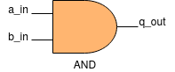
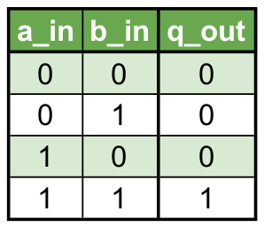

## 2. Código

### 2.1 VHDL

Lo que haremos a continuación será *describir* el diseño de nuestro circuito en un archivo con extensión ".vhdl". En este caso el circuito será una compuerta AND de dos entradas.

Para ello, lo primero que debemos hacer es incluir los paquetes que vamos a necesitar, en nuestro caso sólo vamos a necesitar el *std_logic_1164* para poder usar el tipo de datos [std_logic](https://gitlab.com/RamadrianG/wiki---fpga-para-todos/-/wikis/Sintaxis-VHDL#entradas-y-salidas).
```vhdl
library ieee;
use ieee.std_logic_1164.all;
```
A continuación vamos a declarar la **entidad**, en la cual se determinan las *entradas* y *salidas* que tendrá nuestro diseño.
```vhdl
--Entidad
entity compuerta_and is

    port(
        a_in, b_in: in std_logic;
        q_out: out std_logic
    );
    
end compuerta_and;
```
Por último, declaramos la **arquitectura**. En ella se debe determinar el funcionamiento interno de nuestro diseño. Como el nuestro es una compuerta AND, definimos que la salida
*q_out* es el resultado del **producto lógico** entre las entradas *a_in* y *b_in*.

```vhdl
--Arquitectura
architecture compuerta_and_arch of compuerta_and is
begin

    q_out <= a_in and b_in;

end compuerta_and_arch;
```
[Aquí](VHDL/compuertaAND.vhdl) podrá encontrar el código completo.

    
## 3. Simulación
### 3.1 *Testbench* en VHDL
Debido a que la compuerta AND es un circuito combinacional, ya que que el estado de su salida depende solo del estado de sus entradas, vamos a verificar el diseño de **forma exhaustiva**, es decir, probando todas las posibles combinaciones en sus entradas y comprobar que la salida se corresponda con su tabla de verdad.

Para ello vamos a crear un testbench en vhdl que se ocupe de generar los *estímulos* en las entradas de la compuerta AND.

Al igual que en la descripción del circuito, lo primero que debemos hacer es declarar la **entidad** del testbench.

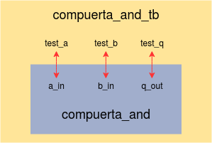

Como vemos el testbench es un bloque que contiene al diseño que no contiene ninguna entrada ni salida para comunicarse con el exterior. Entonces su entidad tendrá la siguiente forma:
```vhdl
--Entidad del Testbench (vacío)
entity compuerta_and_tb is
end entity compuerta_and_tb;
```
Ahora, ya dentro de la **arquitectura**, declaramos las siguientes señales con las que podremos cargar los estímulos en las entradas de la compuerta:
```vhdl
--Entradas a la compuerta
signal test_a : std_logic;
signal test_b : std_logic;
signal test_q : std_logic;

```
Y declaramos una constante que determina el periodo de las señales que vamos a generar.
```vhdl
constant PERIODO : time := 100 ns;
```
También debemos declarar el "componente" compuerta_and el cual luego vamos a *instanciar*. Debemos apreciar que tiene la misma forma que la entidad del diseño, sólo se sustituye la palabra reservada **entity** por **component**.
```vhdl
component compuerta_and is
  port(
      a_in, b_in: in std_logic;
      q_out: out std_logic
  );
end component compuerta_and;
```
Una vez que ya tenemos declarado todo lo necesario para nuestro testbench procedemos a instanciar nuestro **DUT** (*Device Under Test* o Dispositivo Bajo Testeo) mapeando las señales del *componente* con las del *testbench* (¡Siempre de adentro hacia afuera!). Además, al comienzo de esta línea debemos poner una etiqueta que identifique al DUT, en este caso será "and0".

```vhdl
begin
--INSTANCIAR E INTERCONECTAR DUT
and0 : compuerta_and port map(a_in=>test_a,b_in=>test_b,q_out=>test_q);
```
Por último debemos definir un bloque [process](https://gitlab.com/RamadrianG/wiki---fpga-para-todos/-/wikis/Descripci%C3%B3n-secuencial-en-VHDL#procesos-secuenciales) con el cual generaremos las señales para probar nuestro diseño. El mismo debe finalizar con la sentencia "wait;" sino quedaría en *loop* infinito.
```vhdl
process begin
    test_a <= '0';
    test_b <= '0';
    wait for 2*PERIODO;
    test_a <= '1';
    test_b <= '0';
    wait for PERIODO;
    test_a <= '0';
    test_b <= '1';
    wait for PERIODO;
    test_a <= '1';
    test_b <= '1';
    wait for PERIODO;
    test_a <= '0';
    test_b <= '0';
    wait for PERIODO;
    wait;
end process;
```

[Aquí](VHDL/compuertaAND_tb.vhdl) podrán encontrar el testbench completo utilizado para simular el diseño.

### 3.2 Resultados

Para poder simular nuestro ejemplo con las herramientas del entorno que hemos [instalado](https://gitlab.com/RamadrianG/wiki---fpga-para-todos/-/wikis/Entorno-de-desarrollo) previamente, debemos abrir la carpeta que contiene ambos archivos con Atom.

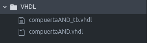

Luego debemos ir a la barra de herramientas superior, seleccionar EDU-FPGA Tools -> GHDL y ahí podremos elegir entre las dos opciones que nos da el menú.

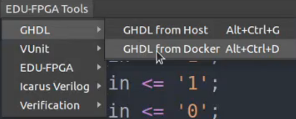

Nos pedirá el nombre de la entidad del testbench en nuestro caso es "compuerta_and_tb".

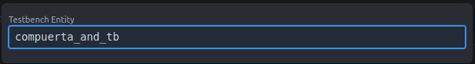

Al presionar *enter*, si todo salió bien, nos deberá mostrar un mensaje como el siguiente:

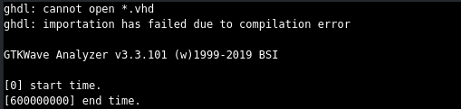

Además, nos habrá generado dos nuevos archivos y se abrirá automáticamente el GTKWave.

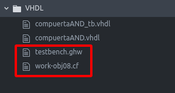

En el GTKWave debemos seleccionar las señales que queremos visualizar, haciendo doble click sobre cada una de ellas o con la opcion "Append".

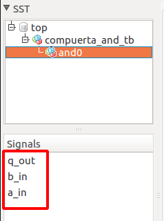

Y por último tenemos que presionar el botón "Zoom fit" para que las formas de onda se ajusten a nuestra pantalla.


A continuación el resultado de la simulación.

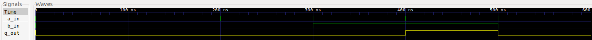
<br>Simulación en GTKWave.

Como se pueda apreciar, la salida *q_out* cumple con la tabla de verdad correspondiente con la combinación presente en sus entradas. El comportamiento se ajuste a lo esperado, quedando así, verificado nuestro diseño.

## 4. Implementación y ensayo

### 4.1 Síntesis

Antes implementar el diseño en la EDU-FPGA vamos a sintetizarlo utilizando la suite de diseño de Lattice [iCEcube2](https://gitlab.com/RamadrianG/wiki---fpga-para-todos/-/wikis/Software-Lattice) para asegurarnos de que el diseño que hemos descripto se corresponde con el circuito deseado.

Lo primero que debemos hacer es crear un nuevo proyecto en iCEcube2, haciendo doble click en *New Proyect*.

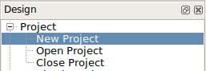

Y nos saldrá un pantalla como la siguiente en donde podremos elegir el nombre del proyecto y su ubicación. Además debemos elegir la familia y el modelo de FPGA en la que estamos trabajando, para nuestro caso serán iCE40 y HX4K respectivamente.

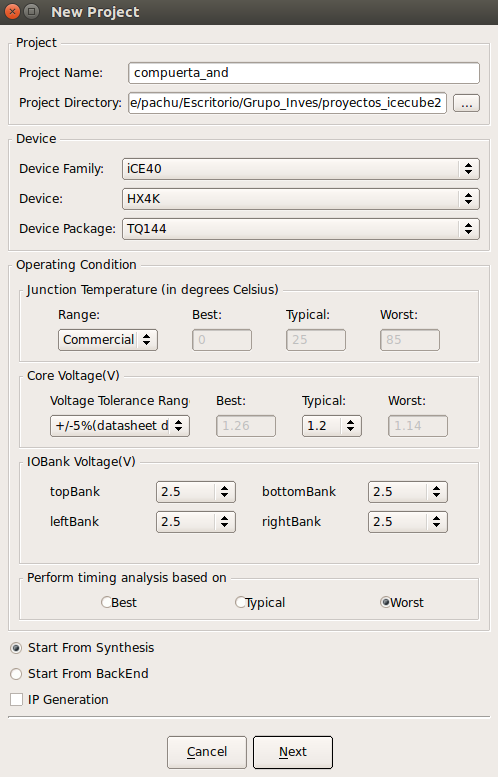

Nos aparecerá otra ventana y presionamos *Finish*.

A continuación debemos elegir los archivos de diseño haciendo click derecho sobre la opción *Design Files* y elegir *Add files...*

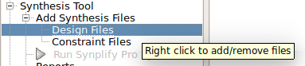

Y elegimos el archivo RTL deseado.

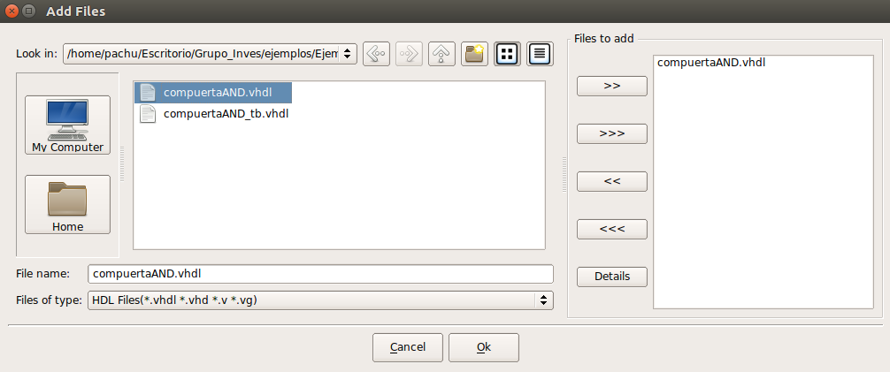

Una vez cargados los archivos de diseño ejecutamos la síntesis haciendo doble click sobre la opción *Run Synplify Pro Synthesis*:

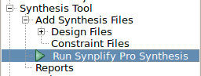

Si presionamos click secundario sobre la misma opción, llegamos a la siguiente ventana:

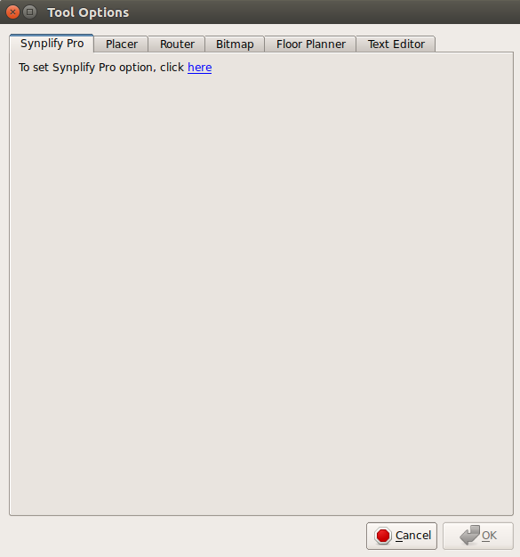

Y al hacer click sobre *here* abriremos la ventana del sintetizador **Synopsys Synplify Pro**.  En el centro de la barra de herramientas encontramos dos íconos que nos permiten acceder a los diagramas en bloque del sistema sintetizado.

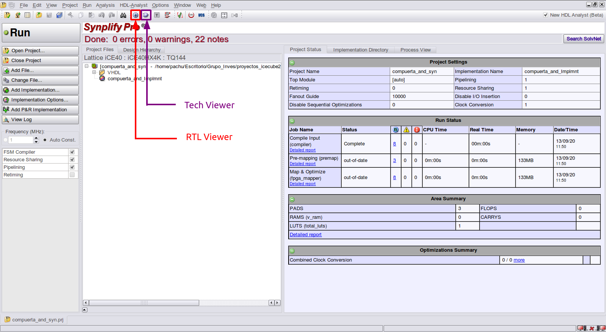

### 4.1.1 RTL View
Muestra el diagrama de las estructuras reconocidas por el sintetizador (memorias, contadores, FSM, sumadores, multiplicadores, registros, etc.). Es una síntesis de **alto nivel**, independiente del modelo de FPGA.

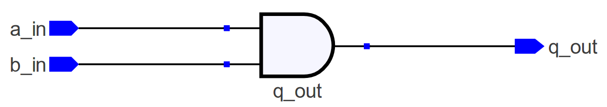

### 4.1.2 Tech View
Muestra el diagrama de las primitivas instanciadas por el sintetizador para implementar el diseño (LUTs, buffers de E/S, bloques de memoria, bloques DSP, etc.). Es una síntesis de **bajo nivel**, dependiente del modelo de FPGA.

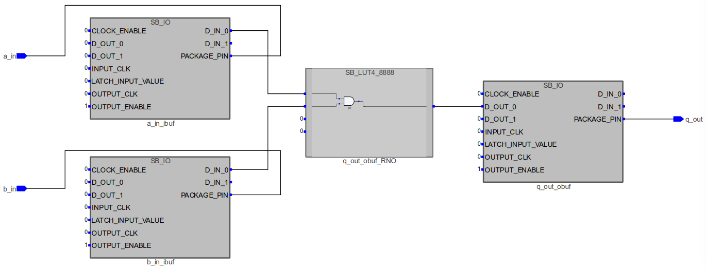

### 4.2 Place and Route

Para ejecutar esta etapa volvemos a la pantalla del **iCEcube2** y hacemos doble click sobre la opción "Run P&R". Una vez ejecutada, se habilitan en la barra de herramientas superior las siguientes herramientas:

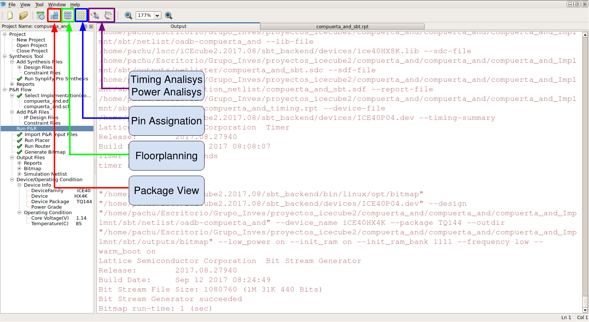

- **Pin Assignation :** Modificar los pines asignados a cada E/S del módulo Top Level
- **Floorplanning :** Ver un mapa de los recursos utilizados en la FPGA
- **Package View :** Ver un mapa de los pines utilizados en el encapsulado de la FPGA
- **Power Analysis :** Análisis de consumo de potencia
- **Timing Analysis:** Análisis de frecuencias de trabajo óptimas y máximas

Podemos usar el *pin assignation* que nos genera el iCEcube2, pero lo recomendable es **hacerlo a mano**. Para ello debemos crear un archivo *.pcf* que vincule los [pines de la EDU-FPGA](https://github.com/ciaa/Hardware/blob/master/PCB/EDU-FPGA/Pinout/Pinout%20EDU%20FPGA.pdf) con las entradas y salidas de nuestro diseño.


[Aquí](VHDL/compuertaAND_pcf_sbt.pcf) podrá encontrar el archivo *.pcf*.

Ahora debemos incluir este archivo en el iCEcube2. Haciendo clic derecho sobre *Constraint Files* y seleccionando *Add files...*

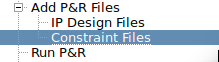<br>
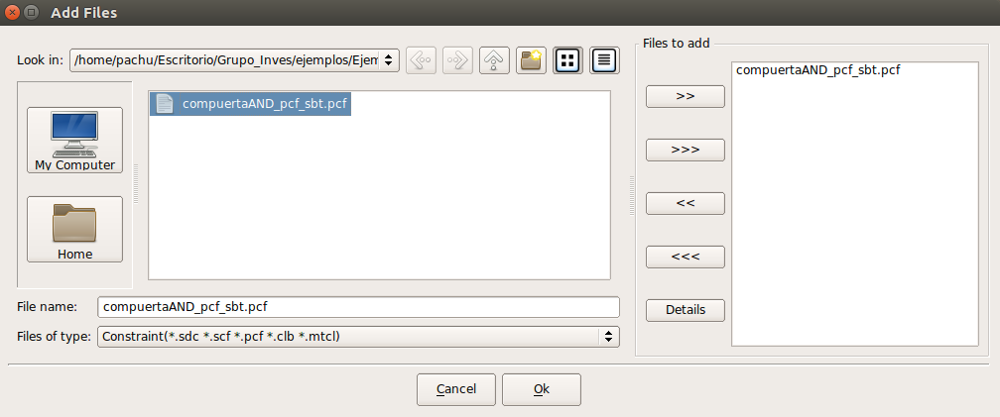

Y hacemos doble click sobre *Run P&R*.

### 4.2.1 Floor Planer
El mapa de recursos muestra los bloques lógicos, bloques de memoria, bloques E/S y bloques DSP en la FPGA:

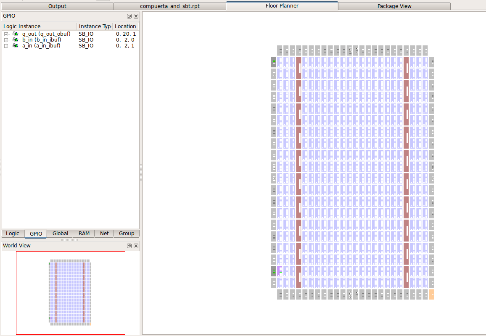

Haciendo doble click sobre una celda se pueden ver los recursos internos de la misma que se utilizan:

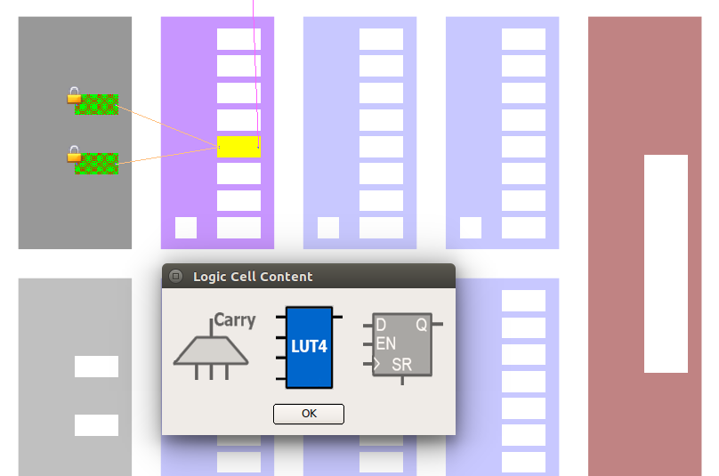

Podemos apreciar que aparece el dibujo de un candado sobre las *IO Cells* utilizadas porque estas fueron designadas a través del archivo *constraint* .pcf que hicimos. Cuando utilizamos los pines generados por iCEcube2 estos símbolos no aparecen.

### 4.2.2 Package View
Muestra la asignación y ubicación de pines del encapsulado para este diseño:

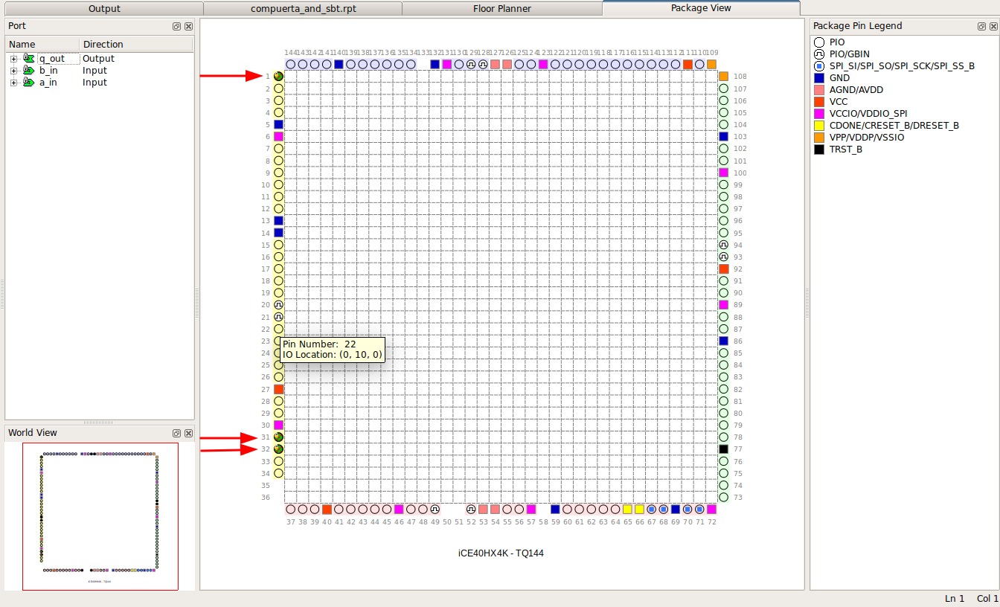

### 4.3 Ensayo

Finalmente vamos a proceder a implementar el diseño de la compuerta AND que verificamos en la EDU-CIAA-FPGA.

Para ello vamos a abrir la carpeta que contiene el diseño en vhdl y el archivo *.pcf* con Atom.

En la barra de tarea seleccionaremos *EDU-FPGA Tools* -> *EDU-FPGA* -> *VHDL toolchain*

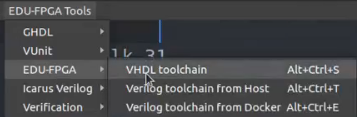

Ahora nos pedirá que ingresemos el nombre de la entidad y el nombre del archivo .pcf que queremos cargar en la placa.

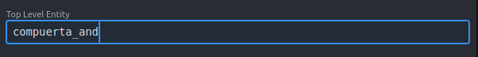<br>
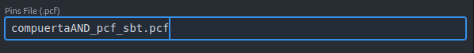

Presionamos *enter*, si todo salio correctamente nos aparecerá un mensaje como el siguiente y el diseño habrá sido cargado con éxito.

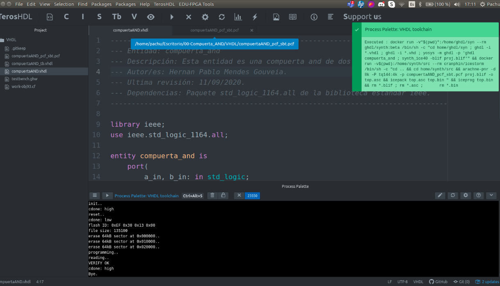

A continuación se muestra un video en el que se muestra el ejemplo implementado en la EDU-FPGA. Vale aclarar que los pulsadores de la EDU-CIAA-FPGA son **activos en bajo**, es decir, al pulsarlos ingresan un "0" a la entrada de la compuerta AND. Siempre que alguno o ambos de los pulsadores estén pulsados la salida estará a "0".


En el video anterior podemos apreciar que la salida *q_out*, reflejada en el LED1, cumple con la tabla de verdad. 

Para mayor prolijidad en el video anterior se agregaron 3 salidas "dummys", que se fuerzan a cero y se linkean con los 3 leds que no se usaron para que no queden en un estado de "1 débil".

## 5. Véase también

### 5.1 Sintaxis relacionada

* [Sintaxis de VHDL](https://gitlab.com/RamadrianG/wiki---fpga-para-todos/-/wikis/Sintaxis-VHDL)
* [Descripción combinacional en VHDL](https://gitlab.com/RamadrianG/wiki---fpga-para-todos/-/wikis/Descripcion-combinacional-en-VHDL)
* [Testbenches en VHDL](https://gitlab.com/RamadrianG/wiki---fpga-para-todos/-/wikis/Testbenches-en-VHDL)

### 5.2 Ejemplos relacionados

* [Comparador de un bit](../01-Comparador_1bit)
* [Multiplexor 8 canales de N bits](../02-MUX_8CH_nbits)
* [Comparador de N bits](../03-Comparador_nbits)
* [Decodificador BCD a 7 segmentos](../04-BCD_a_7seg)
---
## 6. Información adicional: uso de herramientas

Para más información sobre cómo usar el *toolchain* para compilar y simular o 
descargar a la placa según el lenguaje utilizado, referirse a los siguientes 
vínculos:

 - VHDL y Verilog (recomendado): [Entorno basado en Atom][Entorno_Link].
 - Solo VHDL : [GHDL y GTKWave](https://gitlab.com/RamadrianG/wiki---fpga-para-todos/-/wikis/Herramientas-libres-para-VHDL) + [iCEcube2](https://gitlab.com/RamadrianG/wiki---fpga-para-todos/-/wikis/Software-Lattice) + [IceStorm][IceStorm_link]
 - Solo Verilog : [icarusVerilog y GTKWave](https://gitlab.com/RamadrianG/wiki---fpga-para-todos/-/wikis/Herramientas-libres-para-Verilog) + [IceStorm][IceStorm_link]

[Entorno_Link]: https://gitlab.com/RamadrianG/wiki---fpga-para-todos/-/wikis/Uso-del-entorno
[IceStorm_link]: https://gitlab.com/RamadrianG/wiki---fpga-para-todos/-/wikis/Proyecto-iCEstorm

---

