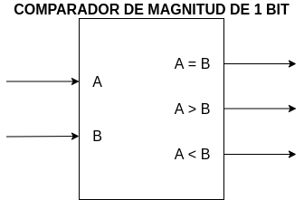
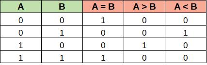
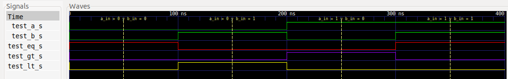
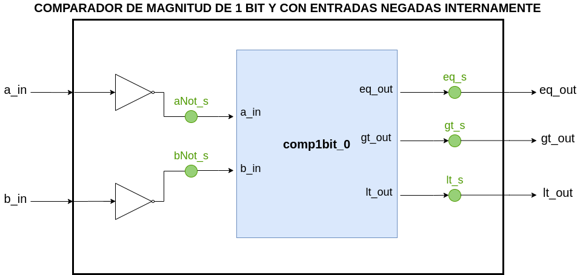

# COMPARADOR DE MAGNITUD DE 1 BIT

[[_TOC_]]

## 1. Descripción

En este ejemplo se diseña un comparador lógico de 1 bit. Este caso sencillo 
permite poner en práctica el diseño de circuitos digitales a "nivel de 
compuertas" (*gate-level*), por lo que se usan operaciones lógicas sencillas del
HDL.

Un comparador de magnitud es un dispositivo digital **combinacional** que tiene dos 
entradas (en este caso de 1 bit) y tres salidas de 1 bit cada una, y cuya 
función es analizar si sus entradas son iguales o diferentes. Esto se puede ver 
en las siguientes imágenes:




Se observa como cada salida se pone en alto cuando se cumple su condición:

*  A = B
*  A > B
*  A < B 

## 2. Código

### 2.1. VHDL

Primero que nada, se incluyen los paquetes necesarios, que por el momento es
solo el *std_logic_1164* para usar los tipos de datos **std_logic** y 
**std_logic_vector**.

```vhdl
--Inclusión de paquetes.
library ieee;                 --Biblioteca estándar ieee.
use ieee.std_logic_1164.all;  --Paquete para std_logic y std_logic_vector.
```

Luego, se declara la **entidad** del comparador. Esta solo tendrá los pines de I/O
del dispositivo.

```vhdl
--Declaración de la entidad.
entity comp1bit is
    port(
        a_in   : in  std_logic;
        b_in   : in  std_logic;
        eq_out : out std_logic;
        gt_out : out std_logic;
        lt_out : out std_logic
    );
end entity comp1bit;
```
Los nombres de las salidas se eligieron con el siguiente criterio:
* eq : equal (igual).
* gt : greater than (mayor que).
* lt : less than (menor que).

Finalmente, se declara la **arquitectura** del comparador. Basándose en la tabla 
de verdad antes vista, se asignan las salidas según su primer forma canónica, es 
decir, según la suma lógica de los "minitérminos" que les correspondan. 

Para que el código quede más legible, se usan señales auxiliares para el caso
de la salida por igualdad (A = B).

```vhdl
--Declaración de la arquitectura.
architecture comp1bit_arch of comp1bit is
    --Declaración de señales auxiliares que representan minitérminos.
    signal minterm0_s : std_logic;
    signal minterm1_s : std_logic;
begin
    --Obtención de cada minitérmino.
    minterm0_s <= (not a_in) and (not b_in);
    minterm1_s <= a_in and b_in;

    --Cada salida se asigna según la primer forma canónica.
    eq_out <= minterm0_s or minterm1_s;
    lt_out <= (not a_in) and b_in;
    gt_out <= a_in and (not b_in);
end architecture comp1bit_arch;
```

Para ver el archivo **.vhdl** completo del comparador, ir [aquí](VHDL/comp1bit.vhdl).

## 3. Simulación

Como se trata de un **circuito combinacional**, se diseña un *testbench* para probar
de **forma exhaustiva** al comparador. En otras palabras, se le van a inyectar todas
las combinaciones posibles de las entradas y se verificarán los valores de las 
salidas, tal cual aparece en la tabla de verdad.

### 3.1. *Testbench* en VHDL

Para este *testbench* primero se incluyen los paquetes necesarios, que en este caso 
es solo el *std_logic_1164* para usar los tipos de datos **std_logic** y 
**std_logic_vector**. Luego se declara la entidad que, por ser un *testbench*, 
está vacía. La razón de esto es que en el *testbench* no se necesitan puertos de 
entrada y salida, sino que se instancia internamente un comparador de 1 bit 
(DUT: *Device Under Test*) de entidad **comp1bit** y también se declaran señales 
internas que se interconectan con este y sirven para aplicarle estímulos a sus 
entradas y monitorear el estado de sus salidas

```vhdl
--Inclusión de paquetes.
library ieee;                 --Biblioteca estándar ieee.
use ieee.std_logic_1164.all;  --Paquete para std_logic y std_logic_vector.

--Entidad del testbench (vacía).
entity comp1bit_tb is
end entity comp1bit_tb;
```

Luego se declara la **arquitectura** del *testbench*. Para esto, primero se 
declara el bloque a instanciar y las señales de estímulo y monitoreo.

```vhdl
--Arquitectura del testbench.
architecture comp1bit_tb_arch of comp1bit_tb is
    --Declaración del comparador de magnitud a probar.
    component comp1bit is
        port (
            a_in   : in  std_logic;
            b_in   : in  std_logic;
            eq_out : out std_logic;
            gt_out : out std_logic;
            lt_out : out std_logic
        );
    end component;

    --Declaración de estímulos y señal de monitoreo.
    --Entradas al comparador.
    signal test_a_s : std_logic;
    signal test_b_s : std_logic;

    --Salidas del comparador.
    signal test_eq_s : std_logic;
    signal test_gt_s : std_logic;
    signal test_lt_s : std_logic;
```

Finalmente, en la arquitectura se instancia el comparador a simular llamándolo
**comp1bit_0** y se desarolla el *process* **generateStimulus**, el cual permite 
aplicar todas las combinaciones posibles de las señales de estímulo según la 
tabla de verdad antes vista. 

```vhdl
--Arquitectura del testbench.
architecture comp1bit_tb_arch of comp1bit_tb is
    --Declaración del comparador de magnitud a probar.
    component comp1bit is
        port (
            a_in   : in  std_logic;
            b_in   : in  std_logic;
            eq_out : out std_logic;
            gt_out : out std_logic;
            lt_out : out std_logic
        );
    end component;

    --Declaración de estímulos y señal de monitoreo.
    --Entradas al comparador.
    signal test_a_s : std_logic;
    signal test_b_s : std_logic;

    --Salidas del comparador.
    signal test_eq_s : std_logic;
    signal test_gt_s : std_logic;
    signal test_lt_s : std_logic;
begin
    --Instanciación del DUT (Device Under Test).
    comp1bit_0 : comp1bit
        port map ( a_in   => test_a_s,
                   b_in   => test_b_s,
                   eq_out => test_eq_s,
                   gt_out => test_gt_s,
                   lt_out => test_lt_s);

    --Proceso de generación de entradas.
    generateStimulus : process
    begin
        test_a_s <= '0';
        test_b_s <= '0';
        wait for 100 ns;

        test_a_s <= '0';
        test_b_s <= '1';
        wait for 100 ns;

        test_a_s <= '1';
        test_b_s <= '0';
        wait for 100 ns;

        test_a_s <= '1';
        test_b_s <= '1';
        wait for 100 ns;
        wait;
    end process  generateStimulus;
end architecture comp1bit_tb_arch;
```

Para ver el archivo **.vhdl** completo del *testbench*, ir [aquí](VHDL/comp1bit_tb.vhdl).

Una vez hecho el *testbench*, se realiza la simulación utilizando el *toolchain*
correspondiente. Para más información, ver sección 6 del presente documento.

### 3.2. Resultados

En la siguiente imagen se aprecian las formas de onda visualizadas con gtkWave,
donde se usaron marcadores para identificar las partes principales.



Analizando los marcadores de izquierda a derecha se aprecia que:
- Cuando **test_a_s = 0** y **test_b_s = 0**, la única salida que se 
pone en 1 es **test_eq_s**. 
- Cuando **test_a_s = 0** y **test_b_s = 1**, la única salida que se 
pone en 1 es **test_lt_s**. 
- Cuando **test_a_s = 1** y **test_b_s = 0**, la única salida que se 
pone en 1 es **test_gt_s**. 
- Cuando **test_a_s = 1** y **test_b_s = 1**, la única salida que se 
pone en 1 es **test_eq_s**. 

Se observa como las salidas del comparador cumplen con el comportamiento 
deseado, quedando así verificado el diseño.

## 4. Implementación y ensayo

Para implementar el diseño en la [EDU-FPGA](https://gitlab.com/RamadrianG/wiki---fpga-para-todos/-/wikis/EDU-FPGA) 
se debe tener en cuenta lo siguiente:
* ¿Cómo voy a estimular al comparador?
* ¿Cómo voy a ver el estado de las salidas? 

Como en muchos ejemplos simples, para responder estas cuestiones se hace uso de los 
**pulsadores** y los **LED** embebidos en la placa: los primeros se conectan a
las entradas del comparador y los últimos a sus salidas. No obstante, debido a 
que cada uno de esos pulsadores está conectado a un **resistor pull-up**, cuando 
no estén presionados transferirán un 1 a los pines de entrada, mientras que 
transferirán un 0 si se los pulsa. Para no trabajar con esta **lógica negativa**, 
se desarrolla una entidad de nivel superior (*top-level*) llamada **top_comp1bit**.
Esta entidad es de tipo ***wrapper*** ya que instancia un bloque **comp1bit** en su 
interior y lo interconecta con sus propios puertos de entrada y salida, teniendo 
en cuenta que dichas entradas son negadas internamente para contrarrestar el 
efecto de los resistores pull-up de la placa. Este tipo de metodología es usual en el 
diseño digital (y analógico) porque así se reutilizan al máximo los bloques ya 
diseñados y verificados.

El diagrama esquemático final es:



Se observa como los nombres de los puertos de entrada y salida del ***top-level*** son iguales
a los del comparador interno "comp1bit" (**comp1bit_0**), y como se usan las señales internas
**aNot_s**, **bNot_s**, **eq_s**, **gt_s** y **lt_s** para hacer las interconexiones internas.

### 4.1. Código de la implementación

#### 4.1.1. VHDL

Para el ***top-level***, la inclusión de paquetes y declaración de la entidad son iguales 
a las de **comp1bit**.

```vhdl
--Inclusión de paquetes.
library ieee;                 --Biblioteca estándar ieee.
use ieee.std_logic_1164.all;  --Paquete para std_logic y std_logic_vector.

--Declaración de la entidad.
entity top_comp1bit is
    port(
        a_in   : in  std_logic;
        b_in   : in  std_logic;
        eq_out : out std_logic;
        gt_out : out std_logic;
        lt_out : out std_logic
    );
end entity top_comp1bit;
```

Luego se declara la **arquitectura** del ***top-level***. La primer parte,
que es la sección declarativa, es similar a la de **comp1bit_tb**, ya que se 
declara el comparador interno a instanciar y las señales internas que se 
utilizan para interconexiones.

```vhdl
--Declaración de la arquitectura.
architecture top_comp1bit_arch of top_comp1bit is
    --Declaración del comparador de magnitud interno a instanciar.
    component comp1bit is
        port (
            a_in   : in  std_logic;
            b_in   : in  std_logic;
            eq_out : out std_logic;
            gt_out : out std_logic;
            lt_out : out std_logic
        );
    end component;

    --Declaración de señales auxiliares para hacer interconexiones.
    signal eq_s : std_logic;
    signal gt_s : std_logic;
    signal lt_s : std_logic;

    --Declaración de señales auxiliares para negar las entradas y hacer
    --interconexiones.
    signal aNot_s : std_logic;
    signal bNot_s : std_logic;
```

Finalmente, en la arquitectura se instancia el comparador interno llamándolo
**comp1bit_0**, y se desarrollan todas las interconexiones internas necesarias,
teniendo en cuenta que las entradas se niegan aplicándoles el operador **not**.

```vhdl
--Declaración de la arquitectura.
architecture top_comp1bit_arch of top_comp1bit is
    --Declaración del comparador de magnitud interno a instanciar.
    component comp1bit is
        port (
            a_in   : in  std_logic;
            b_in   : in  std_logic;
            eq_out : out std_logic;
            gt_out : out std_logic;
            lt_out : out std_logic
        );
    end component;

    --Declaración de señales auxiliares para hacer interconexiones.
    signal eq_s : std_logic;
    signal gt_s : std_logic;
    signal lt_s : std_logic;

    --Declaración de señales auxiliares para negar las entradas y hacer
    --interconexiones.
    signal aNot_s : std_logic;
    signal bNot_s : std_logic;

begin
    --Instanciación del comparador de magnitud interno e interconexión con
    --señales internas.
    comp1bit_0 : comp1bit
        port map ( a_in   => aNot_s,
                   b_in   => bNot_s,
                   eq_out => eq_s,
                   gt_out => gt_s,
                   lt_out => lt_s);

    --Negación de las entradas a_in y b_in.
    aNot_s <= not a_in;
    bNot_s <= not b_in;

    --Conexión de los puertos de salida con señales internas.
    eq_out <= eq_s;
    gt_out <= gt_s;
    lt_out <= lt_s;
end architecture top_comp1bit_arch;
```

Para ver el archivo **.vhdl** completo ***top-level***, ir [aquí](VHDL/top_comp1bit.vhdl)

### 4.2. Asignación de pines

Para este caso, la asignación de pines es:

|  **Componente embebido**  |  **Pin FPGA**     |   **Pin comparador**  |
|:-------------------------:|:----------------: |:---------------------:|
|  Pulsador 1               |       31          |   a_in                |
|  Pulsador 2               |       32          |   b_in                |
|  LED 1                    |       1           |   eq_out              |
|  LED 2      		        |       2           |   gt_out              |
|  LED 3                    |       3           |   lt_out              |

Para ver el archivo **.pcf** ir [aquí](top_comp1bit.pcf), y para el pinout de la EDU-FPGA ir [aquí](https://github.com/ciaa/Hardware/blob/master/PCB/EDU-FPGA/Pinout/Pinout%20EDU%20FPGA.pdf).

### 4.3. Ensayo

Entonces se sintetiza e implementa el diseño en la placa, apreciándose su 
funcionamiento en el siguiente GIF:


Se observa en orden:
1. **Con ningúno de los pulsadores presionados**, ambas entradas quedan internamente en 
0, por lo tanto el LED 1 (eq_out) se enciende.
2. **Con solo el pulsador 1 presionado**, únicamente la entrada a_in queda internante en 1, 
por consiguiente se enciende el LED 2 (gt_out).
3. **Con solo el pulsador 2 presionado**, únicamente la entrada b_in queda internante en 1, 
por lo tanto se enciende el LED 3 (lt_out).
4. **Con los dos pulsadores presionados**, ambas entradas quedan internamente en 1, por 
consiguiente el LED 1 (eq_out) se enciende.

---

Se motiva al lector/a a que diseñe, simule e implemente un comparador de magnitud 
de 2 bits utilizando como base el módulo creado del comparador de 1 bit.

## 5. Véase también

### 5.1. Sintaxis relacionada

* [Sintaxis básica VHDL](https://gitlab.com/RamadrianG/wiki---fpga-para-todos/-/wikis/Sintaxis-VHDL)
* [Testbenches en VHDL](https://gitlab.com/RamadrianG/wiki---fpga-para-todos/-/wikis/Testbenches-en-VHDL)

- [Sintaxis básica en Verilog](https://gitlab.com/RamadrianG/wiki---fpga-para-todos/-/wikis/Sintaxis-Verilog)
- [Testbenches en Verilog](https://gitlab.com/RamadrianG/wiki---fpga-para-todos/-/wikis/Testbenches-en-Verilog)

### 5.2. Ejemplos relacionados

1. [Compuerta AND](../00-Compuerta_AND)

## 6. Información adicional: uso de herramientas

Para más información sobre cómo usar el *toolchain* para compilar y simular o 
descargar a la placa según el lenguaje utilizado, referirse a los siguientes 
vínculos:

 - VHDL y Verilog (recomendado): [Entorno basado en Atom][Entorno_Link].
 - Solo VHDL : [GHDL y GTKWave o EDA Playground](https://gitlab.com/RamadrianG/wiki---fpga-para-todos/-/wikis/Herramientas-libres-para-VHDL) + [iCEcube2](https://gitlab.com/RamadrianG/wiki---fpga-para-todos/-/wikis/Software-Lattice) + [IceStorm][IceStorm_link]
 - Solo Verilog : [icarusVerilog y GTKWave o EDA Playground](https://gitlab.com/RamadrianG/wiki---fpga-para-todos/-/wikis/Herramientas-libres-para-Verilog) + [iCEcube2](https://gitlab.com/RamadrianG/wiki---fpga-para-todos/-/wikis/Software-Lattice) + [IceStorm][IceStorm_link]

[Entorno_Link]: https://gitlab.com/RamadrianG/wiki---fpga-para-todos/-/wikis/Uso-del-entorno
[IceStorm_link]: https://gitlab.com/RamadrianG/wiki---fpga-para-todos/-/wikis/Proyecto-iCEstorm
