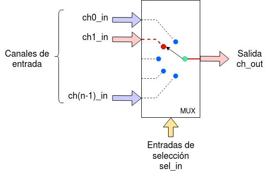
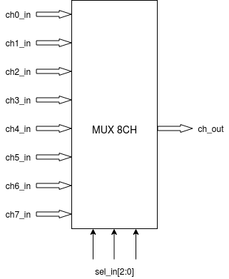
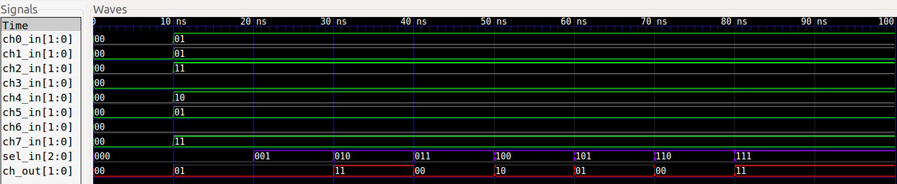
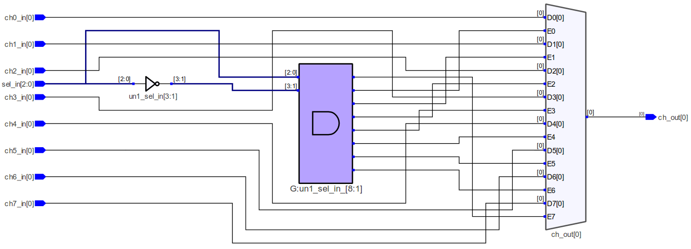
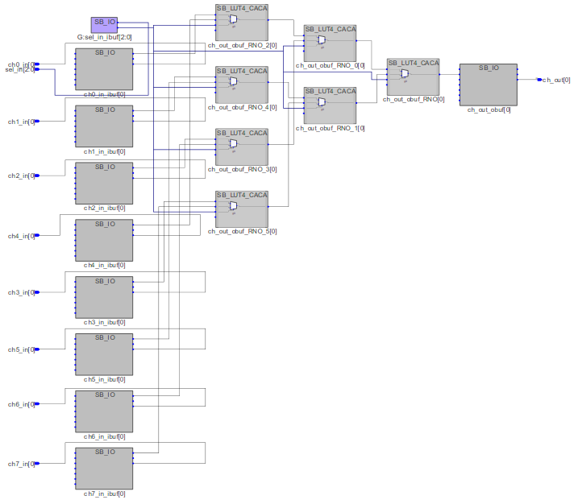
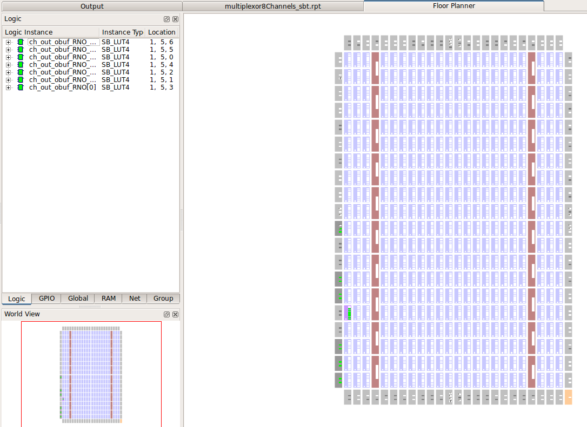
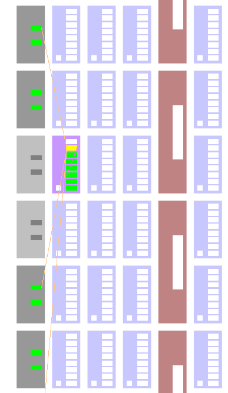

# Multiplexor de 8 canales de n bits

[[_TOC_]]

## 1. Descripción

En este ejemplo se diseña un **multiplexor** (o *mux*) de 8 canales cuyo número de bits por cada canal es configurable. Un multiplexor es un circuito combinacional el cual funciona como una "llave selectora" ya que el código de las entradas de selección determina cual de los ocho canales se transmite a la salida. 



Para el caso de 8 canales el diagrama sería el siguiente:



El cual cumple la siguiente tabla de verdad:


## 2. Código

### 2.1 VHDL

Lo primero que debemos hacer es incluir los paquetes que vamos a necesitar, en nuestro caso sólo vamos a necesitar el *std_logic_1164* para poder usar el tipo de datos **std_logic**.

```vhdl
library ieee;
use ieee.std_logic_1164.all;
```
A continuación vamos a declarar la **entidad**, en la cual se determinan las *entradas* y *salidas* que tendrá nuestro diseño y un genérico *bitsChannel* que permitirá configurar la cantidad de bits por canal que tendrá nuestro mux.

```vhdl
--Entidad
entity multiplexor8Channels is
    --Bits por canal
    generic(bitsChannel : integer := 1);

    --Puertos de E/S
    port(
          ch0_in : in  std_logic_vector(bitsChannel-1 downto 0);
          ch1_in : in  std_logic_vector(bitsChannel-1 downto 0);
          ch2_in : in  std_logic_vector(bitsChannel-1 downto 0);
          ch3_in : in  std_logic_vector(bitsChannel-1 downto 0);
          ch4_in : in  std_logic_vector(bitsChannel-1 downto 0);
          ch5_in : in  std_logic_vector(bitsChannel-1 downto 0);
          ch6_in : in  std_logic_vector(bitsChannel-1 downto 0);
          ch7_in : in  std_logic_vector(bitsChannel-1 downto 0);
          sel_in : in  std_logic_vector(2 downto 0);
          ch_out : out std_logic_vector(bitsChannel-1 downto 0)
    );
end entity multiplexor8Channels ;
```
Por último, dentro de la **arquitectura** se debe determinar el funcionamiento interno de nuestro diseño. Para ello utilizaremos una estructura del tipo **with-select** (también puede realizarse con otras estructuras) la cual según el valor de la entrada de selección, le asignará a la salida el estado de uno de los ocho canales.

```vhdl
--Arquitectura
architecture multiplexor8Channels_arch of multiplexor8Channels is

signal zeros : std_logic_vector(bitsChannel-1 downto 0);

begin
    --Si la linea de seleccion va a un estado no definido, la salida va a cero
    zeros<=(others=>'0');

    with sel_in select
        ch_out <=  ch0_in  when "000",
                   ch1_in  when "001",
                   ch2_in  when "010",
                   ch3_in  when "011",
                   ch4_in  when "100",
                   ch5_in  when "101",
                   ch6_in  when "110",
                   ch7_in  when "111",
                   zeros   when others;

end architecture multiplexor8Channels_arch ;
```
Cabe aclarar que es muy importante definir el caso por **default** (en caso de que no se cumpla ninguna de las condiciones planteadas) para asegurar que el comportamiento del módulo esta bien definido para todos los casos posibles. Por eso declaramos la señal *zeros* la cual es un std_logic_vector formado sólo por ceros.


[Aquí](VHDL/MUX_8ch_nbits.vhdl) podrá encontrar el código completo.

    
## 3. Simulación
### 3.1 *Testbench* en VHDL
Como el multiplexor es un **circuito combinacional** ya que el estado de su salida depende solo del estado de sus entradas, vamos a verificar el diseño de **forma funcional**, es decir probando algunas de las posibles combinaciones de sus entradas y comprobar que las salidas correspondientes cumplan la tabla de verdad. 
<br><br>En este testbench en particular, hemos elegido que cada canal cuente con *2* bits a través de la constante **bits**.
```vhdl
constant bits : integer := 2;
```
Para hacer esta verificación, en el testbench se ha realizado el siguiente **process** el cual primero coloca un valor inicial en la señal *input* la cual inicializará los valores de los ocho canales y luego va colocando los diferentes valores de las entradas en la señal *selector* dejando pasar un intervalo de tiempo igual a *PERIOD* entre estado y estado. 
```vhdl
--Proceso de simulación
    simulate: process
    begin
          --Inicializacion de estados
          test_ch0 <= (others=>'0');
          test_ch1 <= (others=>'0');
          test_ch2 <= (others=>'0');
          test_ch3 <= (others=>'0');
          test_ch4 <= (others=>'0');
          test_ch5 <= (others=>'0');
          test_ch6 <= (others=>'0');
          test_ch7 <= (others=>'0');
          test_sel <= (others=>'0');
          wait for period;

          --Valores iniciales de los 8 canales
          test_ch0 <= "01";
          test_ch1 <= "01";
          test_ch2 <= "11";
          test_ch3 <= "00";
          test_ch4 <= "10";
          test_ch5 <= "01";
          test_ch6 <= "00";
          test_ch7 <= "11";
          --Probamos todas las posibles combinaciones de las entradas de seleccion
          wait for period;
          test_sel <= "001";
          wait for period;
          test_sel <= "010";
          wait for period;
          test_sel <= "011";
          wait for period;
          test_sel <= "100";
          wait for period;
          test_sel <= "101";
          wait for period;
          test_sel <= "110";
          wait for period;
          test_sel <= "111";
          wait for period;
          wait for period;
          wait;
      end process simulate;
```

[Aquí](VHDL/MUX_8ch_nbits_tb.vhdl) podrán encontrar el testbench utilizado
para simular el diseño.

### 3.2 Resultados


<br>Simulación en GTKWave.

Se observa que la salida del multiplexor cumple con el
comportamiento deseado, quedando así verificado el diseño.

## 4. Implementación y ensayo

### 4.1 Síntesis

Para sintetizar el MUX de 8 canales se utiliza el programa Synplify Pro a través de iCEcube2.

#### 4.1.1  RTL View (alto nivel)

Este diseño es independiente de la tecnología utilizada y se compone de estructuras genéricas como registros, multiplexores, etc. A continuación, se aprecia su diagrama esquemático:



Como podemos apreciar en la figura al sintetizar el diseño a nivel de bloques, el sintetizador reconoce que la secuencia adoptada corresponde a un multiplexor.

#### 4.1.2 Tech View (alto nivel)
Este diseño depende de la tecnología en FPGA utilizada y está formado por primitivas de Lattice1 para el caso de la EDU-FPGA. Estas primitivas son los bloques esenciales utilizados para describir un sistema digital en este bajo nivel, siendo por ejemplo: LUTs, multiplexores, buffers E/S, etc.
A continuación, se aprecia su diagrama esquemático:



### 4.2 Place & Route
#### 4.2.1  Floor Planner
El mapa de recursos muestra los bloques lógicos, bloques de memoria, bloques E/S y bloques DSP en la FPGA:





#### 4.2.2  Package View
Muestra la asignación y ubicación de pines del encapsulado para este diseño:


## 5. Véase también

### 5.1 Sintaxis relacionada

* [Sintaxis de VHDL](https://gitlab.com/RamadrianG/wiki---fpga-para-todos/-/wikis/Sintaxis-VHDL)
* [Descripción combinacional en VHDL](https://gitlab.com/RamadrianG/wiki---fpga-para-todos/-/wikis/Descripcion-combinacional-en-VHDL)
* [Testbenches en VHDL](https://gitlab.com/RamadrianG/wiki---fpga-para-todos/-/wikis/Testbenches-en-VHDL)

### 5.2 Ejemplos relacionados

* [Compuerta AND](../00-Compuerta_AND)
* [Comparador de un bit](../01-Comparador_1bit)
* [Comparador de N bits](../03-Comparador_nbits)
* [Decodificador BCD a 7 segmentos](../04-BCD_a_7seg)

---
## 6. Información adicional: uso de herramientas

Para más información sobre cómo usar el *toolchain* para compilar y simular o 
descargar a la placa según el lenguaje utilizado, referirse a los siguientes 
vínculos:
 - VHDL : [GHDL y gtkWave](https://gitlab.com/RamadrianG/wiki---fpga-para-todos/-/wikis/Herramientas-libres-para-VHDL) + [iCEcube2](https://gitlab.com/RamadrianG/wiki---fpga-para-todos/-/wikis/Software-Lattice) + [IceStorm][IceStorm_link]
 - Verilog : [icarusVerilog y gtkWave](https://gitlab.com/RamadrianG/wiki---fpga-para-todos/-/wikis/Herramientas-libres-para-Verilog) + [IceStorm][IceStorm_link]

[IceStorm_link]: https://gitlab.com/RamadrianG/wiki---fpga-para-todos/-/wikis/Proyecto-iCEstorm
