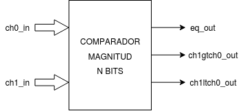
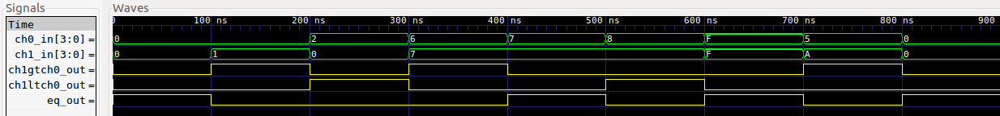
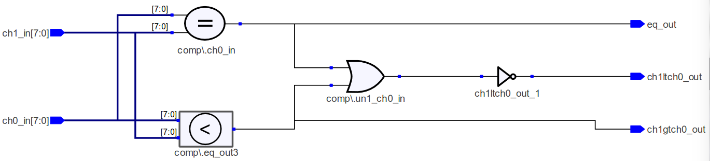
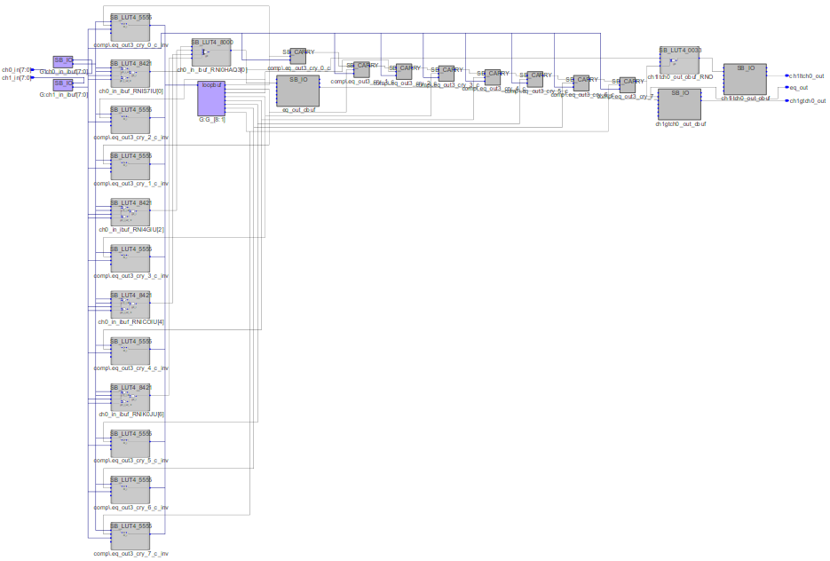
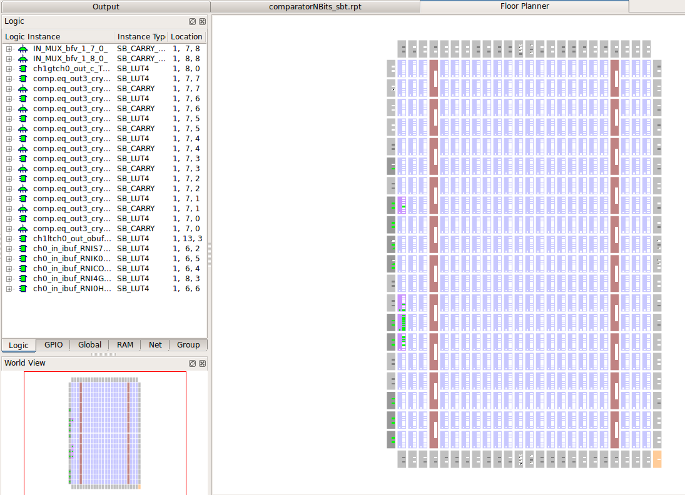
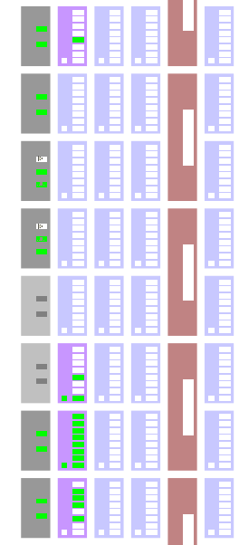
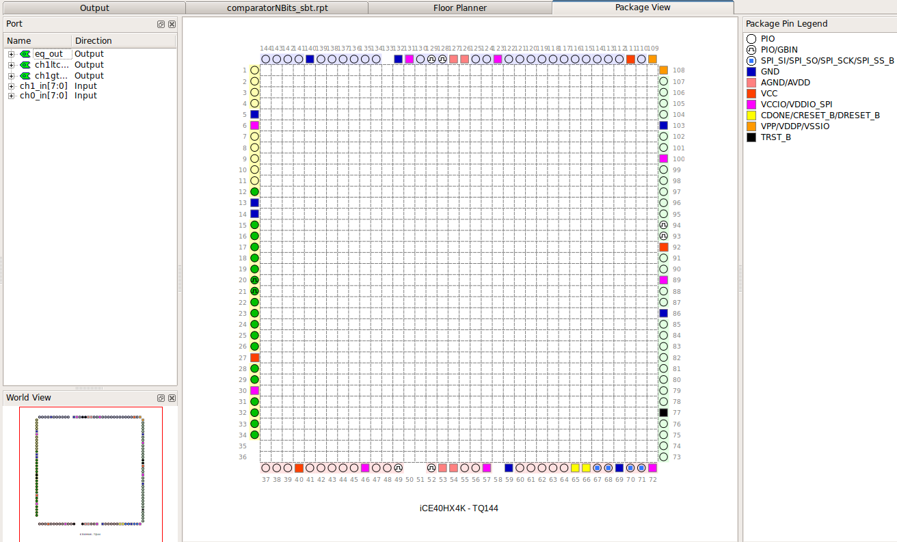

# Comparador n bits

[[_TOC_]]

## 1. Descripción

En este ejemplo se diseña un **comparador de magnitud** cuyo número de bits en ambos canales es configurable. Un comparador de magnitud es un circuito lógico combinacional que compara dos cantidades binarias de entrada
y genera salidas para indicar cuál tiene la mayor magnitud.



El funcionamiento es el mismo que se ha explicado en el [comparador de un bit](../01-Comparador_1bit) y se cumple la misma tabla de verdad, pero con la salvedad de que en este ejemplo podemos modificar la cantidad de bits de los canales a gusto. Esto conlleva algunas consideraciones que deberemos tener en cuenta e iremos explicando a lo largo del ejemplo.

## 2. Código

### 2.1 VHDL

Lo primero que debemos hacer es incluir los paquetes que vamos a necesitar, en nuestro caso vamos a necesitar el *std_logic_1164* para poder usar el tipo de datos **std_logic** y la libreria *numeric_std* para poder usar el tipo de datos **unsigned**.

```vhdl
library ieee;
use ieee.std_logic_1164.all;
use ieee.numeric_std.all;
```
A continuación vamos a declarar la **entidad**, en la cual se determinan las *entradas* y *salidas* que tendrá nuestro diseño y un genérico *bitsChannel* que permitirá configurar la cantidad de bits por canal que tendrá nuestro comparador.

```vhdl
--Entidad
entity comparatorNBits is
    --Bits por canal
    generic( bitsChannel : integer := 8);
    --Puertos de E/S
    port(
    	ch0_in       : in std_logic_vector(bitsChannel-1 downto 0);
    	ch1_in       : in std_logic_vector(bitsChannel-1 downto 0);
    	eq_out       : out std_logic;
    	ch1gtch0_out : out std_logic;
    	ch1ltch0_out : out std_logic
    );
end entity comparatorNBits;
```

Por último, dentro de la **arquitectura** se debe determinar el funcionamiento interno de nuestro diseño.
<br>Utilizando una estructura del tipo [if-elsif-else](https://gitlab.com/RamadrianG/wiki---fpga-para-todos/-/wikis/Descripcion-combinacional-en-VHDL#estructura-if-elsif-else) dentro de un [process](https://gitlab.com/RamadrianG/wiki---fpga-para-todos/-/wikis/Descripci%C3%B3n-secuencial-en-VHDL#procesos-secuenciales), que se activará cuando se modifique algunos de los valores de las entradas, comparamos ambas entradas y determinar, en consecuencia, el valor de las salidas.
<br>Como no es correcto utilizar los operadores "**<**" y "**>**" con señales del tipo *std_logic_vector*, se castean a unsigned dichas entradas con la funcion **unsigned()** de la librería *numeric_std*.

```vhdl
--Arquitectura
architecture comparatorNBits_arch of comparatorNBits is

begin

    comp: process(ch0_in,ch1_in)
    begin

        if(ch0_in = ch1_in) then
        	eq_out <= '1';
        	ch1gtch0_out <= '0';
        	ch1ltch0_out <= '0';
        elsif(unsigned(ch0_in) < unsigned(ch1_in)) then
        	eq_out <= '0';
        	ch1gtch0_out <= '1';
        	ch1ltch0_out <= '0';
        else
        	eq_out <= '0';
        	ch1gtch0_out <= '0';
        	ch1ltch0_out <= '1';
        end if;
    end process comp;
end architecture comparatorNBits_arch;
```

[Aquí](VHDL/comparator_nbits.vhdl) podrá encontrar el código completo.

    
## 3. Simulación
### 3.1 *Testbench* en VHDL

Teniendo en cuenta que el comparador es un **circuito combinacional**, es decir que el estado de sus salidas depende solo del estado actual de sus entradas, vamos verificar el diseño colocando algunos posibles valores en sus entradas que contemplen los diferentes casos que se pueden tener (ch0 = ch1; ch0 > ch1; ch0 < ch1).
<br/>
Para este ejemplo se han diseñado 3 testbenches distintos los cuales llevan a cabo la *misma prueba*, pero estan realizados de formas diferentes.
<br/>
Los 3 testbenches prueban un comparados de 4 bits por canal, longitud que se determina a través de una constante del tipo **integer** llamada *bits*.
```vhdl
constant bits : integer := 4;
```

#### 3.1.1 Testbench con cadena de bits

En este testbench, primero se declaran dos señales de 36 bits las cuales guardan 9 valores de 4 bits cada uno, con los cuales probaremos el funcionamiento de nuestro comparador.
```vhdl
signal dataTestCh0_s : std_logic_vector(35 downto 0) := "000001011111100001110110001000000000";
signal dataTestCh1_s : std_logic_vector(35 downto 0) := "000010101111011101110111000000010000";
```
Utilizamos un **process** el cual irá colocando diferentes valores en los canales de entrada dejando pasar un intervalo de tiempo igual a *period* entre estado y estado, y finaliza con la sentencia *wait*.

Mediante una estructura [for](https://gitlab.com/RamadrianG/wiki---fpga-para-todos/-/wikis/Testbenches-en-VHDL#for-loop) probamos las 9 combinaciones elegidas donde la variable *i* va tomando los valores desde **0** hasta **(dataTestCh0_s'length - bits) / bits** (en este caso, (36 - 4)/4 = 8 ).
<br>En la primera iteración, las señales **test_ch0** y **test_ch1** toman los 4 bits menos significativos de las señales **dataTestCh0_s** y **dataTestCh0_s** correspondientemente. En la próxima iteración tomarán los 4 bits siguientes y así hasta finalizar las 9 iteraciones.
```vhdl
--Proceso de simulación
simulate: process begin
    for i in 0 to ((dataTestCh0_s'length - bits) / bits) loop
        test_ch0 <= dataTestCh0_s((i*4)+3 downto i*4);
		test_ch1 <= dataTestCh1_s((i*4)+3 downto i*4);
        wait for period;
    end loop;
    wait;
end process simulate;
```

[Aquí](VHDL/comparator_nbits_tb_cadena.vhdl) podrán encontrar el testbench utilizado
para simular el diseño.

#### 3.1.2 Testbench con dos vectores apareados

Para mejorar la legibilidad del testbench, que sea más facil de modificar a gusto y reutilizar, se sustituye la **cadena de 36 bits** utilizada en el testbench anterior por un **array de 9 valores de 4 bits** cada uno.

```vhdl
-- Declarar el tipo de dato que representa un conjunto de estimulos
-- como un array de vectores de 4 bits
type stimulus_vec is array (8 downto 0) of std_logic_vector(bits-1 downto 0);

-- Crear los vectores de estimulos
constant dataTestCh0_s : stimulus_vec := (
  "0000",
  "0101",
  "1111",
  "1000",
  "0111",
  "0110",
  "0010",
  "0000",
  "0000"
);

-- Repetir para dataTestCh1_s
constant dataTestCh1_s : stimulus_vec := (
  "0000",
  "1010",
  "1111",
  "0111",
  "0111",
  "0111",
  "0000",
  "0001",
  "0000"
);
```

Y modificamos el **process** para que se ajuste a estos nuevos tipos de datos.

```vhdl
-- Bombardear al DUT con estimulos
simulate: process begin
  for i in 0 to ((dataTestCh0_s'length - 1)) loop
    test_ch0 <= dataTestCh0_s(i);
    test_ch1 <= dataTestCh1_s(i);
    wait for period;
  end loop;
  wait;
end process simulate;
```

[Aquí](VHDL/comparator_nbits_tb_vectoresApareados.vhdl) podrán encontrar el testbench utilizado
para simular el diseño.
#### 3.1.3 Testbench con un vector único

Se puede mejorar aún más el testbench usando un **unico vector** cuyos elementos sean los **pares de estimulos**:

```vhdl
-- Declarar un estimulo como un par de valores, uno por canal
type stimulus is record
  ch0 : std_logic_vector(bits-1 downto 0);
  ch1 : std_logic_vector(bits-1 downto 0);
end record stimulus;

-- Declarar un vector de estimulos
type stimulus_vec is array (8 downto 0) of stimulus;

-- Instanciar un vector de estimulos
constant dataTest_s : stimulus_vec := (
  ("0000","0000"),
  ("0101","1010"),
  ("1111","1111"),
  ("1000","0111"),
  ("0111","0111"),
  ("0110","0111"),
  ("0010","0000"),
  ("0000","0001"),
  ("0000","0000")
);
```

Y modificamos el **process** de la siguiente manera:

```vhdl
-- Bombardear al DUT con estimulos
simulate: process begin
    for i in 0 to ((dataTest_s'length - 1)) loop
        test_ch0 <= dataTest_s(i).ch0;
	      test_ch1 <= dataTest_s(i).ch1;
        wait for period;
    end loop;
    wait;
end process simulate;
```
[Aquí](VHDL/comparator_nbits_tb_vectorUnico.vhdl) podrán encontrar el testbench utilizado
para simular el diseño.

### 3.2 Resultados

Se muestra a continuación el resultado de la simulación, el cuál es el mismo para los tres testbenches.


<br>Simulación en GTKWave.

Se observa que las salidas del comparador de magnitud cumplen con el
comportamiento esperado, quedando así verificado el diseño.

## 4. Implementación y ensayo

### 4.1 Síntesis

Para sintetizar el Comparador de Magnitud se utiliza el programa Synplify Pro a través de iCEcube2.

#### 4.1.1  RTL View (alto nivel)

Este diseño es independiente de la tecnología utilizada y se compone de estructuras genéricas como registros, multiplexores, etc. A continuación, se aprecia su diagrama esquemático:



Como podemos apreciar en la figura al sintetizar el diseño a nivel de bloques funcionaría como un comparador.

#### 4.1.2 Tech View (alto nivel)
Este diseño depende de la tecnología en FPGA utilizada y está formado por primitivas de Lattice1 para el caso de la EDU-FPGA. Estas primitivas son los bloques esenciales utilizados para describir un sistema digital en este bajo nivel, siendo por ejemplo: LUTs, multiplexores, buffers E/S, etc.
A continuación, se aprecia su diagrama esquemático:



### 4.2 Place & Route
#### 4.2.1  Floor Planner
El mapa de recursos muestra los bloques lógicos, bloques de memoria, bloques E/S y bloques DSP en la FPGA:





#### 4.2.2  Package View
Muestra la asignación y ubicación de pines del encapsulado para este diseño:



## 5. Véase también

### 5.1 Sintaxis relacionada

* [Sintaxis de VHDL](https://gitlab.com/RamadrianG/wiki---fpga-para-todos/-/wikis/Sintaxis-VHDL)
* [Descripción combinacional en VHDL](https://gitlab.com/RamadrianG/wiki---fpga-para-todos/-/wikis/Descripcion-combinacional-en-VHDL)
* [Testbenches en VHDL](https://gitlab.com/RamadrianG/wiki---fpga-para-todos/-/wikis/Testbenches-en-VHDL)

### 5.2 Ejemplos relacionados

* [Comparador de N bits](../00-Compuerta_AND)
* [Comparador de un bit](../01-Comparador_1bit)
* [Multiplexor 8 canales de N bits](../02-MUX_8CH_nbits)
* [Decodificador BCD a 7 segmentos](../04-BCD_a_7seg)
* [Flip-Flop D](../05-FlipFlop_D)

---
## 6. Información adicional: uso de herramientas

Para más información sobre cómo usar el *toolchain* para compilar y simular o 
descargar a la placa según el lenguaje utilizado, referirse a los siguientes 
vínculos:
 - VHDL y Verilog (recomendado): [Entorno basado en Atom][Entorno_Link].
 - Solo VHDL : [GHDL y GTKWave](https://gitlab.com/RamadrianG/wiki---fpga-para-todos/-/wikis/Herramientas-libres-para-VHDL) + [iCEcube2](https://gitlab.com/RamadrianG/wiki---fpga-para-todos/-/wikis/Software-Lattice) + [IceStorm][IceStorm_link]
 - Solo Verilog : [icarusVerilog y GTKWave](https://gitlab.com/RamadrianG/wiki---fpga-para-todos/-/wikis/Herramientas-libres-para-Verilog) + [IceStorm][IceStorm_link]

[Entorno_Link]: https://gitlab.com/RamadrianG/wiki---fpga-para-todos/-/wikis/Uso-del-entorno
[IceStorm_link]: https://gitlab.com/RamadrianG/wiki---fpga-para-todos/-/wikis/Proyecto-iCEstorm
