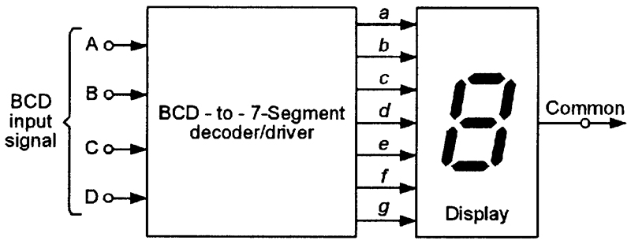
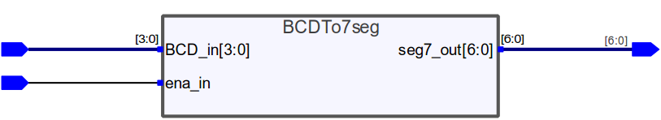
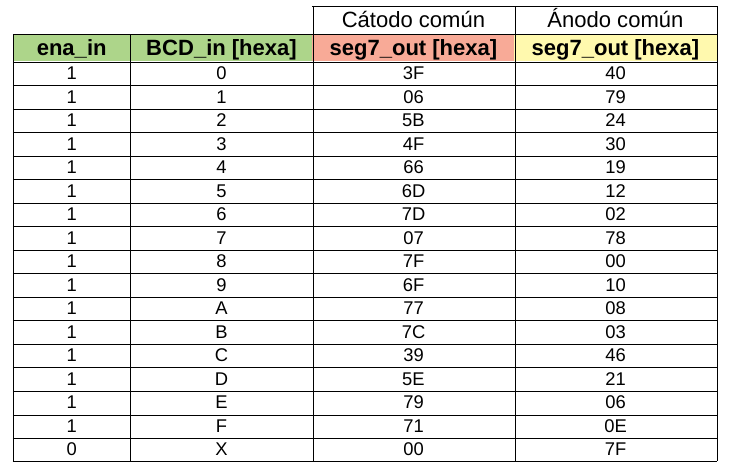
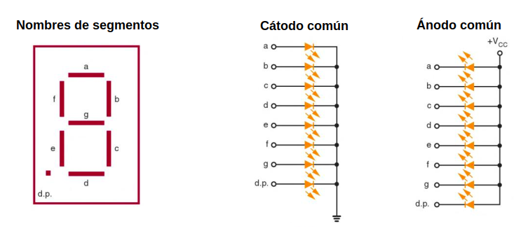
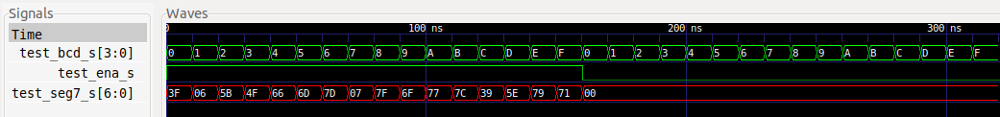
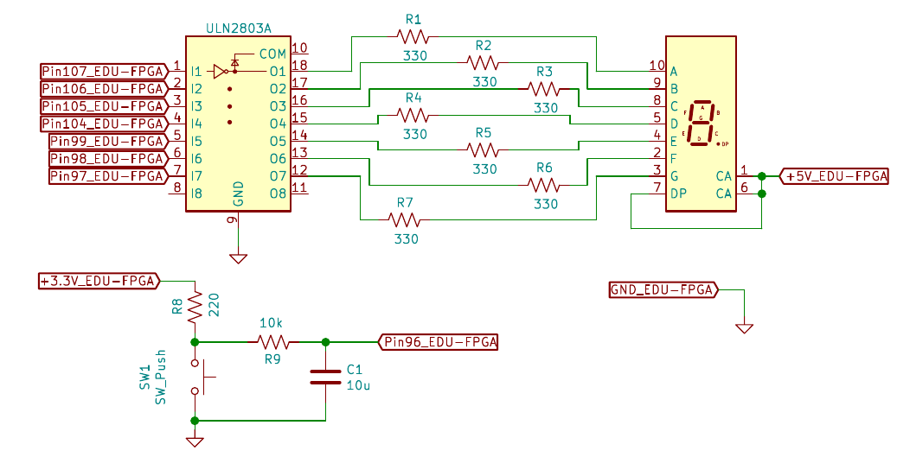

# DECODIFICADOR BCD A 7 SEGMENTOS

[[_TOC_]]

## 1. Descripción

En este ejemplo se diseña un decodificador BCD (Binary-Coded Decimal) a 7 
segmentos. Este caso permite poner en práctica el diseño de circuitos digitales 
a **"nivel de modulos"** (*module-level*) o **"nivel de transferencia entre registros"**
(*register transfer-level*), lo que implica el uso de bloques de tamaño 
intermedio (sumadores, comparadores, multiplexores, etc.) dentro de la FPGA, 
en vez de simplemente compuertas lógicas. Este tipo de diseño permite 
ejercitarse en el uso de operaciones lógicas y relacionales, y de sentencias 
tipo "if" y "case".

Un decodificador BCD a 7 segmentos es un dispositivo digital **combinacional**
que, como su nombre lo indica, permite transformar un dato binario BCD a otro
que permite mostrar el valor decimal correspondiente en un display de 7 
segmentos. Esto se aprecia en la siguiente imagen [^1]. 



El decodificador que se diseña tiene 5 líneas de entrada y 7 de salida. De las entradas, 4 son
de datos BCD de entrada y 1 es de **habilitación por nivel alto**. Las 7 salidas 
corresponden ya a los datos para comandar un display de 7 segmentos, una salida
por cada segmento. 



Para este decodificador, se pretende que se pueda mostrar en un display todos los 
valores hexadecimales (0 a F), no solo los valores del 0 al 9. Se podría decir
que es un decodificador **"BCH (Binary-Coded Hexadecimal) a 7 segmentos"**. Además, 
se desea poder configurar si el decodificador actúa sobre un dispay de tipo ánodo
común o cátodo común. Seguidamente, se observa la tabla de verdad:



La correspondencia entre cada línea de salida y los segmentos de un display es:
* seg7_out(0) --> segmento a
* seg7_out(1) --> segmento b
* seg7_out(2) --> segmento c
* seg7_out(3) --> segmento d
* seg7_out(4) --> segmento e
* seg7_out(5) --> segmento f
* seg7_out(6) --> segmento g

Se observa en la siguiente imagen [^2] el nombre de cada segmento de un display 
y la conexión interna de este según si es cátodo o ánodo común:



Además de los segmentos ya mencionados, se aprecia un LED "dp" (*Decimal Point*)
que se utiliza para poner el punto decimal. Para este ejemplo, no se usa dicho 
LED.

## 2. Código

### 2.1. VHDL

Primero que nada, se incluyen los paquetes necesarios, que por el momento es
solo el *std_logic_1164* para usar los tipos de datos **std_logic** y 
**std_logic_vector**.

```vhdl
--Inclusión de paquetes.
library ieee;                 --Biblioteca estándar ieee.
use ieee.std_logic_1164.all;  --Paquete para std_logic y std_logic_vector.
```

Luego, se declara la **entidad** del decodificador. Esta solo tiene los pines 
de I/O del dispositivo y un genérico (*generic*) que permitirá configurar la 
salida del decoficador para el modo ánodo o cátodo común.

```vhdl
--Declaración de la entidad.
entity BCDTo7seg is
    generic(commonAnode : BOOLEAN := TRUE);
    port(
        BCD_in   : in  std_logic_vector(3 downto 0);
        ena_in 	 : in  std_logic;
        seg7_out : out std_logic_vector(6 downto 0)
    );
end entity BCDTo7seg;
```
Finalmente, se declara la **arquitectura** del decodificador. Basándose en la 
tabla de verdad antes vista, se asigna a la salida los valores correspondientes 
según la entrada y el modo elegido: cátodo o ánodo común.

Primero, se declara la constante **ONES** que se utiliza para invertir todos los
bits de la señal de salida. También, se declara la señal **seg7comCath_s** que será 
la salida para el modo cátodo común. En caso de configurar al decodificador en 
modo ánodo común, la salida final será la señal **seg7comCath_s** invertida en 
todos sus bits. 

```vhdl
--Declaración de la arquitectura.
architecture BCDTo7seg_arch of BCDTo7seg is
    --Declaración de constante que sirve para invertir bits.
    constant ONES : std_logic_vector(6 downto 0) := "1111111";

    --Declaración de señal que es la salida para cátodo común.
    signal seg7comCath_s : std_logic_vector(6 downto 0);
begin
    --Proceso para convertir de BCD a 7 segmentos.
    makeConversion: process(BCD_in, ena_in)
    begin
        if ena_in = '1' then
            case BCD_in is
                when "0000" =>
                    seg7comCath_s <= "0111111";-- Display: 0.
                when "0001" =>
                    seg7comCath_s <= "0000110";-- Display: 1.
                when "0010" =>
                    seg7comCath_s <= "1011011";-- Display: 2.
                when "0011" =>
                    seg7comCath_s <= "1001111";-- Display: 3.
                when "0100" =>
                    seg7comCath_s <= "1100110";-- Display: 4.
                when "0101" =>
                    seg7comCath_s <= "1101101";-- Display: 5.
                when "0110" =>
                    seg7comCath_s <= "1111101";-- Display: 6.
                when "0111" =>
                    seg7comCath_s <= "0000111";-- Display: 7.
                when "1000" =>
                    seg7comCath_s <= "1111111";-- Display: 8.
                when "1001" =>
                    seg7comCath_s <= "1101111";-- Display: 9.
                when "1010" =>
                    seg7comCath_s <= "1110111";-- Display: A.
                when "1011" =>
                    seg7comCath_s <= "1111100";-- Display: b.
                when "1100" =>
                    seg7comCath_s <= "0111001";-- Display: C.
                when "1101" =>
                    seg7comCath_s <= "1011110";-- Display: d.
                when "1110" =>
                    seg7comCath_s <= "1111001";-- Display: E.
                when others =>
                    seg7comCath_s <= "1110001";-- Display: F.
            end case;
        else
            seg7comCath_s <= "0000000";--Cuando el conversor no está habilitado.
        end if;
    end process makeConversion;

    --Inversión de bits de salida si el decodificador es ánodo común.
    seg7_out <= (seg7comCath_s xor ONES) when (commonAnode = TRUE) else
                 seg7comCath_s; --commonAnode = FALSE.
end architecture BCDTo7seg_arch;
```
Se observa como se utilizan las sentencias **if-elsif-else** y **case-when**, 
las cuales están dentro del proceso **makeConversion** ya que son 
"secuenciales". Recordar que en realidad estas sentencias solo describen un 
proceso **como si fuese secuencial**, aunque en realidad en la FPGA 
**se termina sintentizando todo como un circuito**, que es concurrente.

Para ver el archivo **.vhdl** completo del decodificador, 
ir [aquí](VHDL/BCDTo7seg.vhdl).

## 3. Simulación

Como se trata de un **circuito combinacional**, se diseñan dos *testbenches* para 
probar de **forma exhaustiva** al decodificador. Son dos porque cada uno prueba 
al decodificador en un modo de operación: ánodo o cátodo común. 

Ambos *testbench* son prácticamente idénticos, solo cambia el valor del genérico
**commonAnode** mapeado. Se destaca el uso de un **record** y un **array** para 
crear un vector con un tipo de dato *stimulus* que aglomere los datos de 
entrada. De esta manera, es más sencillo modificar los datos de estímulo y el 
código queda más legible y prolijo.

```vhdl
--Declaración de tipo de dato stimulus y de tipo vector de stimulus para
--agrupar en este los valores de entrada.
type stimulus is record
    ena : std_logic;
    bcd : std_logic_vector(3 downto 0);
end record stimulus;

type stimulus_vec is array (integer range <>) of stimulus;

--Declaración de un vector de stimulus con los datos de entrada.
constant IN_BCD : stimulus_vec := (
    ('1', "0000"), ('1', "0001"), ('1', "0010"), ('1', "0011"),
    ('1', "0100"), ('1', "0101"), ('1', "0110"), ('1', "0111"),
    ('1', "1000"), ('1', "1001"), ('1', "1010"), ('1', "1011"),
    ('1', "1100"), ('1', "1101"), ('1', "1110"), ('1', "1111"),

    ('0', "0000"), ('0', "0001"), ('0', "0010"), ('0', "0011"),
    ('0', "0100"), ('0', "0101"), ('0', "0110"), ('0', "0111"),
    ('0', "1000"), ('0', "1001"), ('0', "1010"), ('0', "1011"),
    ('0', "1100"), ('0', "1101"), ('0', "1110"), ('0', "1111")
);
```
También, se destaca que lo anterior permite aplicar secuencialmente los 
estímulos de entrada con la sentencia **for**.

```vhdl
--Proceso de aplicación de estímulos.
applyStimulus : process
begin
    for i in IN_BCD'range loop
        test_ena_s <= IN_BCD(i).ena;
        test_BCD_s <= IN_BCD(i).bcd;
        wait for 10 ns;
    end loop;
    wait;
end process applyStimulus;
```

[Aquí](VHDL/BCDTo7seg_tb_commonAnode.vhdl) podrá ver todo el código del *testbench* 
en VHDL donde el decodificador opera en ánodo común, y [aquí](VHDL/BCDTo7seg_tb_commonCathode.vhdl) 
cuando lo hace en cátodo común.

Una vez hechos los *testbenches*, se realizan las simulaciones utilizando el 
*toolchain* correspondiente. Para más información, ver sección 6 del presente 
documento.

### 3.1. Resultados

En la siguiente imagen se aprecian las formas de onda visualizadas con gtkWave.

**Cátodo común**



**Ánodo común**


Se observa en ambos casos como las salidas del decodificador cumplen con el 
comportamiento deseado, quedando así verificado el diseño.

## 4. Implementación y ensayo

Para implementar el diseño en la 
[EDU-FPGA](https://gitlab.com/RamadrianG/wiki---fpga-para-todos/-/wikis/EDU-FPGA) 
se decide utilizar los 4 **pulsadores** embebidos en la placa más un pin GPIO embebido 
como entradas, y 7 pines GPIO embebidos como salidas. Para implementar el circuito 
total, se hace uso de **un display de 7 segmentos y ánodo común**[^3] y un 
**IC driver ULN2803A**[^4]. El display se usa para mostrar graficamente el dato
hexadecimal de entrada, y el driver para poder energizar cada segmento del 
display. Sin este driver, se quemarían los pines GPIO de salida ya que solo 
pueden proveer como máximo 6 mA y cada segmento consume entre 10 mA y 30 mA, 
según el fabricante y la tensión aplicada.

El circuito final es:


Se observa como se utilizan **7 resistores (R1 a R7)** para limitar la corriente
de cada segmento del display. Además, se usa un **pulsador SW1** con un **resistor R8** 
*pull-up* como entrada a la EDU-FPGA, a lo que se le añade 
**el resistor R9 y el capacitor C1** para tener un circuito antirrebote 
(*debounce*). 

Como cada uno de los pulsadores embebidos está conectado a un **resistor pull-up**, 
cuando no estén presionados transferirán un 1 a los pines de entrada, mientras que 
transferirán un 0 si se los pulsa. Esto es conveniente para la entrada **ena_in**
ya que no se debe mantener presionado su pulsador constantemente para encender el 
display. Sin embargo, no es adecuado para la entrada **BCD_in** porque implica trabajar 
con **lógica negativa**, por lo que se desarrolla una entidad de nivel superior 
(*top-level*) llamada **top_BCDTo7seg**. Esta entidad es de tipo ***wrapper*** 
ya que instancia un bloque **BCDTo7seg** en su interior y lo interconecta con sus 
propios puertos de entrada y salida, teniendo en cuenta que la entrada **BCD_in** 
es negada internamente para contrarrestar el efecto de los resistores pull-up de 
la placa.

### 4.1. Código de la implementación

#### 4.1.1. VHDL

Para el ***top-level***, la inclusión de paquetes y declaración de la entidad son 
iguales a las de **BCDTo7seg**, con la diferencia de que el valor por defecto del
*generic* **commonAnode** es **FALSE**. Esto es porque el sintetizador usa dicho
valor por defecto para realizar la síntesis del circuito. Es **IMPORTANTE** 
destacar que, si bien el display usado es ánodo común, se configura al decodificador 
como cátodo común ya que el driver ULN2803A realiza la inversión de los niveles 
de tensión: un 1 digital en una de sus entradas provoca tener aproximadamente una 
tensión de 0 V en la salida correspondiente.

```vhdl
--Inclusión de paquetes.
library ieee;                --Biblioteca estándar ieee.
use ieee.std_logic_1164.all; --Paquete para std_logic y std_logic_vector.

--Declaración de la entidad.
entity top_BCDTo7seg is
    generic(commonAnode : BOOLEAN := FALSE);
    port(
        BCD_in   : in  std_logic_vector(3 downto 0);
        ena_in 	 : in  std_logic;
        seg7_out : out std_logic_vector(6 downto 0)
    );
end entity top_BCDTo7seg;
```

Luego se declara la **arquitectura** del ***top-level***. Entonces, primeramente 
se declara el decodificador interno a instanciar, las señales internas que se 
utilizan para interconexiones y una constante para guardar el valor del *generic* 
**commonAnode** del top-level.

```vhdl
--Declaración de la arquitectura.
architecture top_BCDTo7seg_arch of top_BCDTo7seg is
    --Declaración del decodificador interno a instanciar.
    component BCDTo7seg is
        generic (
            commonAnode : BOOLEAN := TRUE
        );
        port (
            BCD_in   : in  std_logic_vector(3 downto 0);
            ena_in   : in  std_logic;
            seg7_out : out std_logic_vector(6 downto 0)
        );
    end component;

    --Declaración de señales auxiliares para hacer interconexiones.
    signal ena_s  : std_logic;
    signal seg7_s : std_logic_vector(6 downto 0);

    --Declaración de señal auxiliar para negar la entrada BCD_in y hacer
    --interconexiones.
    signal BCDNot_s : std_logic_vector(3 downto 0);

    --Declaración de constante para guardar el valor de commonAnode del
    --top-level.
    constant topCommonAnode : BOOLEAN := commonAnode;
```

Finalmente, en la arquitectura se instancia el decodificador interno llamándolo
**BCDTo7seg_0**, y se desarrollan todas las interconexiones internas necesarias,
teniendo en cuenta que la entrada **BCD_in** se niega aplicándole el operador 
**not**.

```vhdl
--Declaración de la arquitectura.
architecture top_BCDTo7seg_arch of top_BCDTo7seg is
    --Declaración del decodificador interno a instanciar.
    component BCDTo7seg is
        generic (
            commonAnode : BOOLEAN := TRUE
        );
        port (
            BCD_in   : in  std_logic_vector(3 downto 0);
            ena_in   : in  std_logic;
            seg7_out : out std_logic_vector(6 downto 0)
        );
    end component;

    --Declaración de señales auxiliares para hacer interconexiones.
    signal ena_s  : std_logic;
    signal seg7_s : std_logic_vector(6 downto 0);

    --Declaración de señal auxiliar para negar la entrada BCD_in y hacer
    --interconexiones.
    signal BCDNot_s : std_logic_vector(3 downto 0);

    --Declaración de constante para guardar el valor de commonAnode del
    --top-level.
    constant topCommonAnode : BOOLEAN := commonAnode;

begin
    --Instanciación del decodificador interno e interconexión con señales
    --internas.
    BCDTo7seg_0: BCDTo7seg
        generic map (commonAnode => topCommonAnode)
        port map ( BCD_in   => BCDNot_s,
                   ena_in   => ena_s,
                   seg7_out => seg7_s );

    --Negación de la entrada BCD_in.
    BCDNot_s <= not BCD_in;

    --Interconexiones restantes.
    ena_s    <= ena_in;
    seg7_out <= seg7_s;
end architecture top_BCDTo7seg_arch;
```

Para ver el archivo **.vhdl** completo ***top-level***, ir [aquí](VHDL/top_BCDTo7seg.vhdl)

### 4.2. Asignación de pines

Para este caso, la asignación de pines es:

|       **Componente**      |  **Pin FPGA**     | **Pin decodificador** |
|:-------------------------:|:----------------: |:---------------------:|
|  Pulsador embebido 1      |       31          |   BCD_in(3)           |
|  Pulsador embebido 2      |       32          |   BCD_in(2)           |
|  Pulsador embebido 3      |       33          |   BCD_in(1)           |
|  Pulsador embebido 4      |       34          |   BCD_in(0)           |
|  Pulsador externo         |       96          |   ena_in              |
|  Pin GPIO 1               |       107         |   seg7_out(0)         |
|  Pin GPIO 2               |       106         |   seg7_out(1)         |
|  Pin GPIO 3               |       105         |   seg7_out(2)         |
|  Pin GPIO 4               |       104         |   seg7_out(3)         |
|  Pin GPIO 5               |       99          |   seg7_out(4)         |
|  Pin GPIO 6               |       98          |   seg7_out(5)         |
|  Pin GPIO 7               |       97          |   seg7_out(6)         |

Para ver el archivo **.pcf** ir [aquí](top_BCDTo7seg.pcf), y para el pinout de la EDU-FPGA ir [aquí](https://github.com/ciaa/Hardware/blob/master/PCB/EDU-FPGA/Pinout/Pinout%20EDU%20FPGA.pdf).

### 4.3. Ensayo

Entonces se sintetiza e implementa el diseño en la placa. A continuación, se 
puede apreciar su funcionamiento en un GIF, donde se ve el ensayo en el que 
se usa un "protoboard" para conectar los componentes externos:


Se observa como en forma ascendente **se consiguen todos los dígitos posibles 
en el display (del 0 a la F)**, presionando las distintas combinaciones de los 
pulsadores embebidos. Además, se puede ver como en el final **se deshabilita y
habilita el decodificador**, apagándolo y encendiéndolo por medio del pulsador
externo. 

## 5. Véase también

### 5.1. Sintaxis relacionada

* [Sintaxis básica VHDL](https://gitlab.com/RamadrianG/wiki---fpga-para-todos/-/wikis/Sintaxis-VHDL)
* [Descripción combinacional en VHDL](https://gitlab.com/RamadrianG/wiki---fpga-para-todos/-/wikis/Descripcion-combinacional-en-VHDL)
* [Testbenches en VHDL](https://gitlab.com/RamadrianG/wiki---fpga-para-todos/-/wikis/Testbenches-en-VHDL)

- [Sintaxis básica en Verilog](https://gitlab.com/RamadrianG/wiki---fpga-para-todos/-/wikis/Sintaxis-Verilog)
- [Descripción combinacional en Verilog](https://gitlab.com/RamadrianG/wiki---fpga-para-todos/-/wikis/Descripcion-combinacional-en-Verilog)
- [Testbenches en Verilog](https://gitlab.com/RamadrianG/wiki---fpga-para-todos/-/wikis/Testbenches-en-Verilog)

### 5.2. Ejemplos relacionados

1. [Multiplexor de 8 canales y n bits](../02-MUX_8CH_nbits)
2. [Comparador de n bits](../03-Comparador_nbits)

## 6. Información adicional: uso de herramientas

Para más información sobre cómo usar el *toolchain* para compilar y simular o 
descargar a la placa según el lenguaje utilizado, referirse a los siguientes 
vínculos:

 - VHDL y Verilog (recomendado): [Entorno basado en Atom][Entorno_Link].
 - Solo VHDL : [GHDL y GTKWave o EDA Playground](https://gitlab.com/RamadrianG/wiki---fpga-para-todos/-/wikis/Herramientas-libres-para-VHDL) + [iCEcube2](https://gitlab.com/RamadrianG/wiki---fpga-para-todos/-/wikis/Software-Lattice) + [IceStorm][IceStorm_link]
 - Solo Verilog : [icarusVerilog y GTKWave o EDA Playground](https://gitlab.com/RamadrianG/wiki---fpga-para-todos/-/wikis/Herramientas-libres-para-Verilog) + [iCEcube2](https://gitlab.com/RamadrianG/wiki---fpga-para-todos/-/wikis/Software-Lattice) + [IceStorm][IceStorm_link]

[Entorno_Link]: https://gitlab.com/RamadrianG/wiki---fpga-para-todos/-/wikis/Uso-del-entorno
[IceStorm_link]: https://gitlab.com/RamadrianG/wiki---fpga-para-todos/-/wikis/Proyecto-iCEstorm

## 7. Referencias
[^1]: R. Marston. USING SEVEN-SEGMENT DISPLAYS — PART 1 [online]. Available: https://www.nutsvolts.com/magazine/article/using-seven-segment-displays-part-1
[^2]: E. Gates and L. Chartrand, *Introduction to Electronics*, 5th Edition, Cengage Learning, 2006.
[^3]: "TDSL3150, TDSL3160", Vishay Semiconductors, Document Number: 83122, 17-Apr-13, Rev. 1.6. 
[^4]: "ULN2803A Darlington Transistor Arrays", Texas Instruments, datasheet SLRS049H, february 1997–revised february 2017
