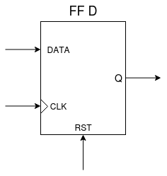
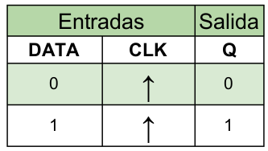
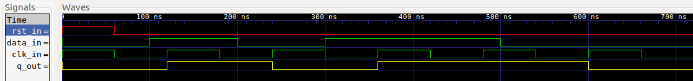
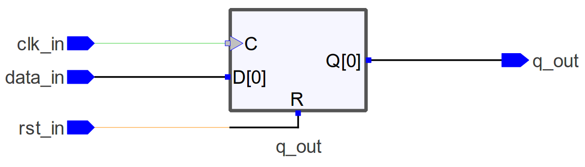
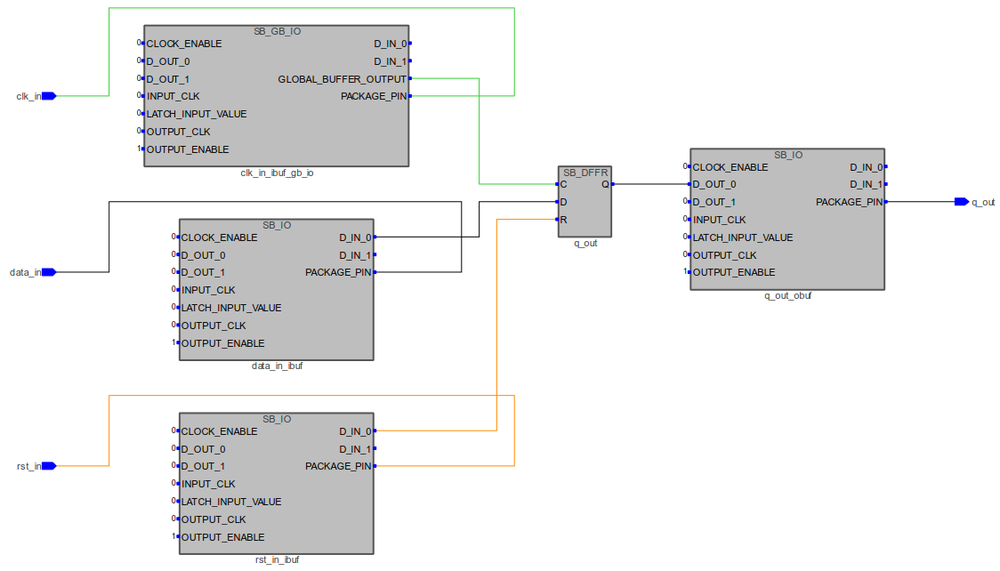
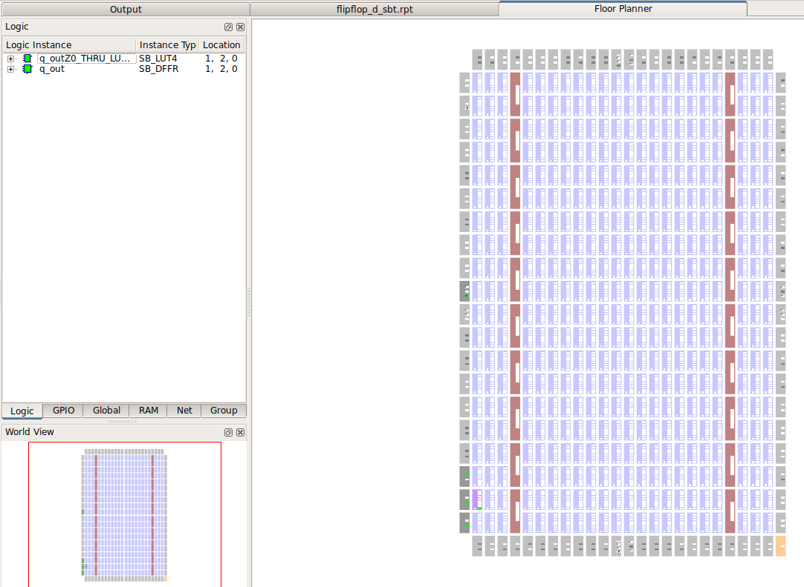
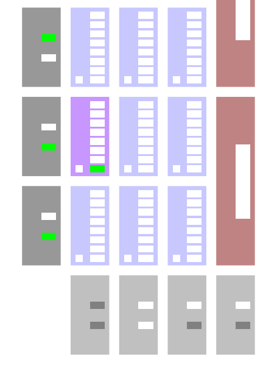
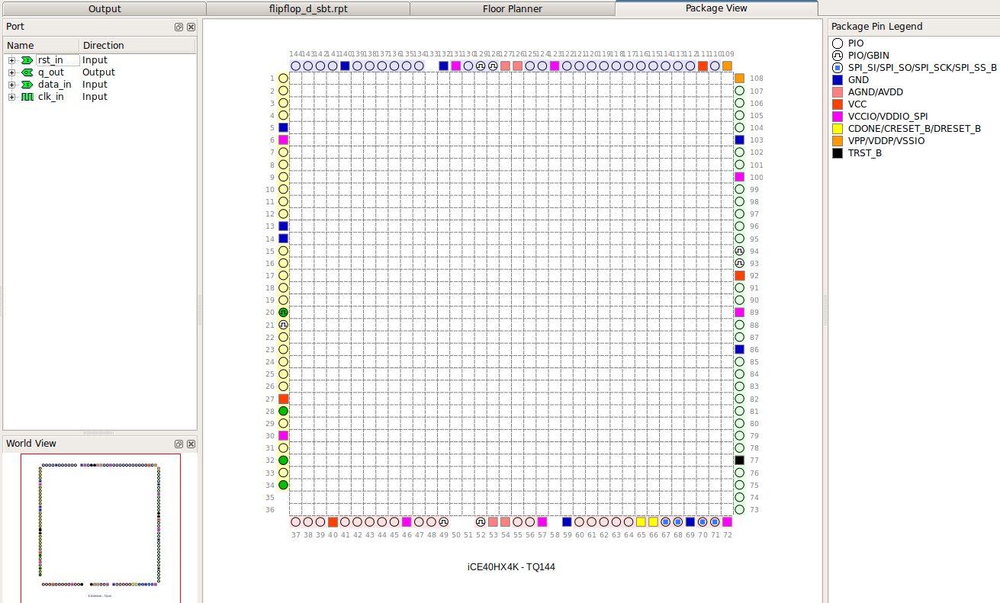

# FlipFlop D

[[_TOC_]]

## 1. Descripción

En este ejemplo se diseña un **flip-flop sincrónico tipo D** disparado por flanco positivo. A diferencia de los ejemplos anteriores, un flip-flop es un **circuito secuencial**. Esto quiere decir que su salida depende, no solo de la combinación presente en sus entradas en un determinado momento, sino también de la historia de las entradas anteriores.

Un flip-flop es un circuito que puede permanecer en uno de **dos estados estables** posibles y se utiliza para "memorizar" información.

Decimos que es *sincrónico disparado por flanco positivo* porque el circuito sólo se activará al tener en la señal de reloj **CLK** un flanco, en este caso, *ascendente*.

En el caso del FF tipo D tenemos una sola entrada de informacion llamada **DATA** además de las entradas de reloj *CLK* y de reset *RST*. Su funcionamiento es muy simple: la salida **Q** cambiará al mismo estado que esté presente en la entrada **DATA** cuando ocurra una transición de pendiente positiva en el **CLK**.





## 2. Código

### 2.1 VHDL

Lo primero que debemos hacer es incluir los paquetes que vamos a necesitar, en nuestro caso vamos a necesitar el *std_logic_1164* para poder usar el tipo de datos **std_logic**.

```vhdl
library ieee;
use ieee.std_logic_1164.all;
use ieee.numeric_std.all;
```
A continuación vamos a declarar la **entidad**, en la cual se determinan las *entradas* y *salidas* que tendrá nuestro diseño.

```vhdl
--Entidad
entity flipflop_d is
    port (
        clk_in : in  std_logic;
        data_in  : in  std_logic;
        rst_in : in  std_logic;
        q_out   : out std_logic
    );
end entity flipflop_d;
```
Por último, dentro de la **arquitectura** se debe determinar el funcionamiento interno de nuestro diseño.

Para ejecutar lógica secuencial, VHDL nos ofrece las estructuras del tipo [process](https://gitlab.com/RamadrianG/wiki---fpga-para-todos/-/wikis/Descripci%C3%B3n-secuencial-en-VHDL#procesos-secuenciales). El process se activa cuando se produce un cambio en el valor de una o más de las señales presentes en la **lista de sensibilidad**, en nuestro caso son: *clk_in* y *rst_in*.

La lógica del **flip-flop tipo D** es muy sencilla. Si al producirse un cambio en dichos valores la entrada de reset *rst_in* está en alto, la salida *q_out* se pone a bajo. Y si al producirse un cambio, se produce un **flanco ascendente** en la entrada de clock *clk_in* se copia el estado presente en ese momento en la entrada *data_in* a la salida *q_out*.

```vhdl
--Arquitectura
architecture flipflop_d_arch of flipflop_d is
begin

    process (clk_in,rst_in) begin
        if(rst_in='1')then
            q_out <= '0';
        elsif(rising_edge(clk_in))then
            q_out <= data_in;
        end if;
    end process;

end architecture flipflop_d_arch;
```

[Aquí](VHDL/flipflop_d.vhdl) podrá encontrar el código completo.


## 3. Simulación
### 3.1 *Testbench* en VHDL

Teniendo en cuenta que el FF tipo D es un **circuito secuencial**, es decir que el estado de sus salidas depende no solo del estado actual de sus entradas sino también de la historia anterior de las mismas, vamos verificar el diseño colocando algunos posibles valores en sus entradas que contemplen los diferentes casos que se pueden tener.


En este testbench, se declara un array de 7 elementos llamado *dataTest_s* el cual guardará los valores que probaremos a la entrada de flip-flop.
```vhdl
type stimulus_vec is array (0 to 6) of std_logic;

constant dataTest_s : stimulus_vec := ('0','1','0','1','1','0','0');
```

También se declara una señal *test_stop* que la utilizaremos para detener la simulación.
```vhdl
signal test_stop : std_logic;
```

Y dos constantes que serán el periodo del clock y de la señal de entrada, respectivamente.
```vhdl
constant periodClk  : time := 60 ns;
constant periodData : time := 100 ns;
```

Utilizaremos 3 **process**. El primero pondrá en alto la entrada de *reset* por un periodo de clock y luego la mantendrá en bajo.
```vhdl
process begin
    test_rst <= '1';
    wait for periodClk; --El reset dura dos periods de clock
    test_rst <= '0';
    wait for periodClk;
    wait; --Bloquear al proceso
end process;
```

El segundo, lo utilizaremos para generar una señal de clock:
```vhdl
--Proceso de generación de clock
process begin
    test_clk <= '1';
    wait for periodClk;
    test_clk <= '0';
    wait for periodClk;
    if (test_stop='1') then
        wait;
    end if;
end process;
```

Con el último process, a través de una estructura del tipo [for](https://gitlab.com/RamadrianG/wiki---fpga-para-todos/-/wikis/Testbenches-en-VHDL#for-loop) se probarán todos los valores almacenados en el vector a la entrada del flip-flop.
```vhdl
--Proceso de generación de entradas
process begin
    test_stop <= '0';
    for i in 0 to ((dataTest_s'length - 1)) loop
      test_data <= dataTest_s(i);
      wait for periodData;
    end loop;
    test_stop <= '1';
    wait;
end process;
```

[Aquí](VHDL/flipflop_d_tb.vhdl) podrán encontrar el testbench utilizado para simular el diseño.

### 3.2 Resultados

Se muestra a continuación el resultado de la simulación.


<br>Simulación en GTKWave.

Se observa que la salida del FF tipo D cumple con el
comportamiento esperado, quedando así verificado el diseño.

## 4. Implementación y ensayo

### 4.1 Síntesis

Para sintetizar el FF D se utiliza el programa Synplify Pro a través de iCEcube2.

#### 4.1.1  RTL View (alto nivel)

Este diseño es independiente de la tecnología utilizada y se compone de estructuras genéricas como registros, multiplexores, etc. A continuación, se aprecia su diagrama esquemático:



Como podemos apreciar en la figura al sintetizar el diseño a nivel de bloques, el sintetizador reconoce que la secuencia adoptada corresponde a un flip-flop tipo D.

#### 4.1.2 Tech View (alto nivel)
Este diseño depende de la tecnología en FPGA utilizada y está formado por primitivas de Lattice1 para el caso de la EDU-FPGA. Estas primitivas son los bloques esenciales utilizados para describir un sistema digital en este bajo nivel, siendo por ejemplo: LUTs, multiplexores, buffers E/S, etc.
A continuación, se aprecia su diagrama esquemático:



### 4.2 Place & Route
#### 4.2.1  Floor Planner
El mapa de recursos muestra los bloques lógicos, bloques de memoria, bloques E/S y bloques DSP en la FPGA:





#### 4.2.2  Package View
Muestra la asignación y ubicación de pines del encapsulado para este diseño:



## 5. Véase también

### 5.1 Sintaxis relacionada

* [Sintaxis de VHDL](https://gitlab.com/RamadrianG/wiki---fpga-para-todos/-/wikis/Sintaxis-VHDL)
* [Descripción secuencial en VHDL](https://gitlab.com/RamadrianG/wiki---fpga-para-todos/-/wikis/Descripcion-combinacional-en-VHDL)
* [Testbenches en VHDL](https://gitlab.com/RamadrianG/wiki---fpga-para-todos/-/wikis/Testbenches-en-VHDL#for-loop)

### 5.2 Ejemplos relacionados

* [Decodificador BCD a 7 segmentos](../04-BCD_a_7seg)
* [Contador Universal](../06-Contador_universal)
* [Registro Paralelo-Paralelo](../07-Registro_pp)
* [Registro Serie-Serie](../08-Registro_ss)
* [Registro Paralelo-Serie](../09-Registro_ps)
* [Registro Serie-Paralelo](../10-Registro_sp)

---
## 6. Información adicional: uso de herramientas

Para más información sobre cómo usar el *toolchain* para compilar y simular o
descargar a la placa según el lenguaje utilizado, referirse a los siguientes
vínculos:
 - VHDL y Verilog (recomendado): [Entorno basado en Atom][Entorno_Link].
 - Solo VHDL : [GHDL y GTKWave](https://gitlab.com/RamadrianG/wiki---fpga-para-todos/-/wikis/Herramientas-libres-para-VHDL) + [iCEcube2](https://gitlab.com/RamadrianG/wiki---fpga-para-todos/-/wikis/Software-Lattice) + [IceStorm][IceStorm_link]
 - Solo Verilog : [icarusVerilog y GTKWave](https://gitlab.com/RamadrianG/wiki---fpga-para-todos/-/wikis/Herramientas-libres-para-Verilog) + [IceStorm][IceStorm_link]

[Entorno_Link]: https://gitlab.com/RamadrianG/wiki---fpga-para-todos/-/wikis/Uso-del-entorno
[IceStorm_link]: https://gitlab.com/RamadrianG/wiki---fpga-para-todos/-/wikis/Proyecto-iCEstorm
