# CONTADOR UNIVERSAL

[[_TOC_]]

## 1. Descripción

En este ejemplo se desarrolla un contador que se llama "universal" por la gran cantidad de características que posee, tales como: cantidad de bits y módulo configurables, elección del sentido de conteo, autocorrección de la cuenta, posibilidad de preconfiguración, etc. Un contador es un dispositivo elemental y ampliamente utilizado en desarrollos digitales, y permitirá practicar el diseño y prueba de circuitos secuenciales con HDL.

En forma general, un contador es un **circuito digital y secuencial** que cuenta pulsos de una señal eléctrica. Los principales usos de este circuito son:

1. Contar pulsos de una señal digital, sea de *clock* u otra.
2. Como *prescaler* o divisor de frecuencias de señales digitales.

Veamos un ejemplo simple. Si se parte de un contador que permite contar hasta 3 pulsos de su señal de entrada de ***clock***, se activa por flanco ascendente de reloj y tiene también una entrada de **reset**, su símbolo y diagrama de estado son los siguientes: 


La salida ***Q*** es donde se presenta la cuenta actual del contador y como en este caso tiene dos bits puede valer 00, 01, 10 o 11 en binario; o lo que es lo mismo en decimal: 0, 1, 2 o 3. La entrada ***RESET*** permite reiniciar al contador y poner su cuenta en 00.

El **diagrama de estados** es una representación gráfica del comportamiento del contador, en el cual se tienen estados (rectángulos con borde rojo y redondeado), transiciones (flechas azules) y un punto de entrada (círculo negro con borde rojo). Los **estados** son situaciones en las que se encuentra el contador y están caracterizados por un valor definido de la salida *Q* ; el **punto de entrada** define que estado va a ser el primero una vez que comience a funcionar el contador; las **transiciones** indican cambios de estado que se dan cuando una o más señales de entrada se modifican. Esta herramienta gráfica es muy utilizada para modelar [máquinas de estados finitos](https://gitlab.com/RamadrianG/wiki---fpga-para-todos/-/wikis/FSM) (o FSM por su sigla en inglés), las cuales comprenden un área de conocimiento importante para el diseño digital, siendo un contador un caso particular de una FSM.

Analizando el **diagrama de estados** del contador se puede ver como este tiene **4 estados**, cada uno diferenciado por un valor específico de la salida *Q* :
1. **Estado 0**: salida *Q* en 00.
2. **Estado 1**: salida *Q* en 01.
3. **Estado 2**: salida *Q* en 10.
4. **Estado 3**: salida *Q* en 11.

Se puede ver como el valor binario de la salida *Q* equivale al número decimal del estado: 00 con 0, 01 con 1 y así sucesivamente. Por lo tanto, afirmar que el contador está en el estado 0 o que la cuenta vale 0 es lo mismo.

El diagrama comienza en el **estado 0**, por lo que la salida *Q* es 00. Este inicio del contador en 0 se debe a un reset inicial, ya que sino el contador puede arrancar en cualquiera de los estados. Cuando sucede un flanco ascendente de *clock*, el contador **transiciona** al **estado 1**, donde su salida *Q* es 01. Con el próximo flanco ascendente el contador pasa al **estado 2**. Así, el contador va transicionando con los flancos ascendentes de *clock* por todos los estados hasta llegar al **estado 3**, luego del cual pasa al **estado 0**, reiniciándo su cuenta. 

El diagrama también se puede entender como que el contador va contando los pulsos del *clock*, cambiando su salida con cada uno de sus flancos ascendentes. Arranca desde 0 y cuenta hasta 3 pulsos. Si se presenta otro pulso más en vez de contarlo como el cuarto la cuenta se reinicia en 0, ya que la salida *Q* solo tiene 2 bits.

Otra forma de ver el comportamiento del contador es por medio de una **tabla de verdad**. Seguidamente, se presenta su **tabla de verdad reducida**:

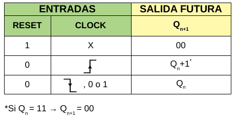

Es importante destacar los dos tipos de salidas *Q* que aparecen en la tabla:
- **Q<sub>n</sub>**: salida actual.
- **Q<sub>n+1</sub>**: salida futura o siguiente.

Viendo la tabla se aprecian 3 situaciones principales:
1. **Reinicio**: correspondiente a la 1<sup>er</sup> fila de la tabla, se da cuando la entrada *RESET* está en nivel alto (estado lógico 1), provocando que la salida *Q* se ponga en 00 independientemente de la entrada de *CLOCK*. Esto se debe a que la entrada de reinicio es asincrónica y la de mayor jerarquía.

   La entrada ***RESET*** permite llevar al contador a un estado conocido, lo que usualmente se usa al momento de encender el dispositivo ya que ahí puede presentar cualquier estado posible.

2. **Conteo**: correspondiente a la 2<sup>da</sup> fila de la tabla, es cuando la cuenta se incrementa en 1. En esta situación, el *RESET* está desactivado (estado lógico 0) y, al suceder un flanco de *CLOCK* ascendente, la salida *Q* se incremente en 1. Esto es lo mismo que decir que la cuenta siguiente *Q<sub>n+1</sub>* pasa a valer la cuenta actual más uno (*Q<sub>n</sub>*+1). 

   Véase la aclaración debajo de la tabla, donde se expecifica que la cuenta siguiente al 11 es 00. Su justificación se dió antes al analizar el **diagrama de estados**.

3. **No conteo**: correspondiente a la 3<sup>er</sup>  fila de la tabla, se refiere al momento en que si en la entrada de reloj hay un flanco descendente o un nivel constante de 0 o 1, la cuenta no cambia. Dicho de otra manera, la salida futura *Q<sub>n+1</sub>* sigue valiendo igual a la salida actual *Q<sub>n</sub>* . 

Este comportamiento se puede apreciar de igual forma pero con un poco más de detalle en la **tabla de verdad expandida**:

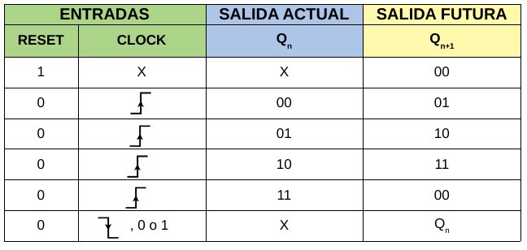

En esta se incorpora la columna de la **salida actual *Q<sub>n</sub>*** y la 2<sup>da</sup> fila de la tabla se expande en 4 filas donde se analizan todos los valores posibles de *Q<sub>n</sub>*. Las tres situaciones antes mencionadas se pueden apreciar nuevamente en esta tabla.

### 1.1. Tipos de contadores

Existen dos clases de contadores: **asincrónicos** y **sincrónicos**[^1]. Aunque ambos internamente tienen ***flip-flops*** para almacenar la cuenta, se puede decir que la diferencia entre ellos radica en que los sincrónicos **tienen a todos sus *flip-flops* conectados con la misma señal de *clock***, mientras que los asincrónicos **no**.

A continuación se hará una breve explicación de cada uno, se mencionarán sus ventajas y desventajas y se indicará cual se usa para este ejemplo y por qué.

#### 1.1.1. Contadores asincrónicos 

Para seguir con el mismo ejemplo del contador anterior, si este fuera asincrónico su circuito podría ser el siguiente:

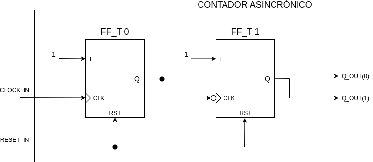

Se aprecia como este contador se compone de **2 *flip-flops* tipo T**. La entrada *RESET_IN* es solidaria a ambos y la salida de cada uno es un bit específico de la salida *Q_OUT* del contador: *Q_OUT(0)* y *Q_OUT(1)*. La entrada *CLOCK_IN* **NO ES SOLIDARIA A AMBOS *flip-flops*** sino que se aplica al primero (*FF_T 0*), y luego la salida de este se conecta con la entrada de *clock* del segundo (*FF_T 1*). Es por esto que el contador es **asincrónico**.

Los dos *flip-flops* tiene su entrada *T* en 1, lo que implica que sus salidas *Q* cambiarán de estado cada vez que suceda un flanco de *clock* que los active, siempre y cuando la entrada *RESET_IN* esté en 0. El *FF_T 0* se activa con flanco ascendente de reloj y el *FF_T 1* con flanco descendente. 

Por lo tanto, suponiendo un comportamiento ideal, se pueden plantear las siguientes formas de onda para analizar el comportamiento del contador:

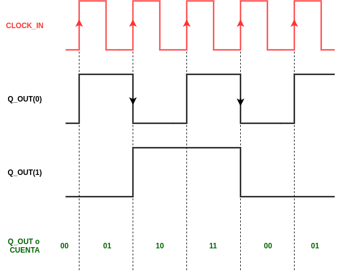

Se puede ver como con cada flanco ascendente de *CLOCK_IN*, la salida *Q_OUT(0)* cambia de estado; mientras que por cada flanco descendente de *Q_OUT(0)*, la salida *Q_OUT(1)* conmuta. Esto provoca que la cuenta o salida *Q_OUT* se vaya incrementando desde 00 hasta 11, luego de lo cual se reinicia. Efectivamente, se cuentan hasta 3 pulsos.  

Ahora analicemos un caso más realista donde se tengan en cuenta los tiempos de propagación (t<sub>pd</sub>) de los *flip-flops*. Estos tiempos son los que existen entre el flanco de *clock* que activa al dispositivo y el cambio en su salida. Para ver en forma clara los efectos de esto se toma un valor exageradamente grande: el t<sub>pd</sub> es igual a la mitad del período del *clock*.

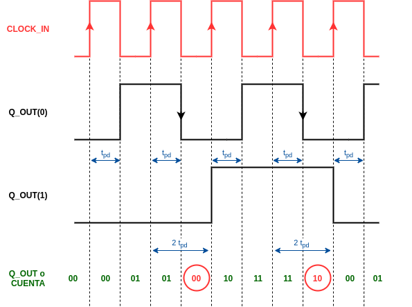

Se observa como ahora la salida *Q_OUT(0)* cambia cuando se da un flanco de ascendente de *CLOCK_IN* y luego transcurre un tiempo t<sub>pd</sub>. De igual forma la salida *Q_OUT(1)* se modifica cuando se sucede un flanco de descendente de *Q_OUT(0)* y después transcurre un tiempo t<sub>pd</sub>. Este último retardo provoca la aparación de **estados indeseados** en la cuenta, los cuales aparecen con un círculo rojo en la imagen. Por ejemplo: en vez de pasar directamente del 01 al 10, la cuenta pasa por el estado indeseado 00. 

Otra forma de ver los estados indeseados es analizando como cambia el **diagrama de estados**. A continuación se muestra el primer diagrama visto, que corresponde al contador ideal, y el diagrama del contador en el que existen los estados indeseados:


Se puede ver como los diagramas **son distintos**. En el derecho la cuenta no pasa directamente de 1 a 2 o de 3 a 0, sino que atraviesa estados intermedios por medio de transiciones naranjas. Estas tienen los siguientes significados:

- **Flanco ascendente de clock / Tiempo = 0**: la transición sucede con un flanco ascendente de *clock*, luego de la cual se pone a Tiempo en 0. Este va registrando el tiempo que transcurre, por lo que se puede interpretar que ponerlo en 0 es igual a "reiniciar un cronómetro".

- **[Tiempo=t<sub>pd</sub>]**: la transición sucede solo si transcurrió un tiempo igual a t<sub>pd</sub>.

Los estados indeseados son una gran **desventaja** de los contadores asincrónicos. Su duración en relación a cada período de *clock* se puede minimizar si dicho período aumenta. Esto implica otra desventaja de estos contadores: **no pueden operar a altas frecuencias**. En contrapartida, la gran **ventaja** de estos dispositivos es que sus **circuitos son más simples y consumen menos energía** que los sincrónicos.

#### 1.1.2. Contadores sincrónicos 

Si el contador de 2 bits fuese sincrónico, su circuito podría ser el siguiente:

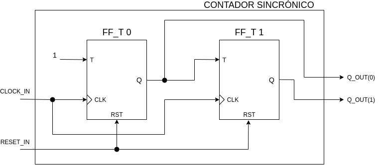

El circuito es prácticamente igual al del contador asincrónico, aunque tiene dos importantes diferencias:

1. La entrada *CLOCK_IN* **ES SOLIDARIA A TODOS LOS *flip-flops***. 
2. La entrada *T* del *FF_T 1* ahora está conectada a la salida *Q* del *FF_T 0*.

Si se analizaran las formas de onda de este contador con características ideales, el resultado sería el mismo que para el contador asincrónico ideal visto anteriormente. Veamos directamente que sucede con las formas de onda del **contador sincrónico con propiedades no ideales**, donde se toma en cuenta el tiempo de propagación t<sub>pd</sub>  de los *flip-flops*. Se considera que estos tienen características muy similares, por lo que sus t<sub>pd</sub> son iguales. Además, nuevamente se toma un caso bastante desfavorable: el t<sub>pd</sub> es igual a la mitad del período del *clock*.

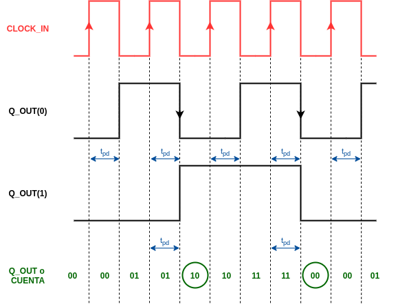

Las señales *CLOCK_IN* y *Q_OUT(0)* no cambian, pero si lo hace la señal *Q_OUT(1)*. Ahora no debe transcurir un t<sub>pd</sub> adicional para que el *FF_T 1* cambie su salida, lo cual provoca que **no existan estados indeseados**. Otra forma de ver esto es que todos los *flip-flops* tienen el mismo retardo frente a la señal *CLOCK_IN*; si el contador fuera asincrónico y tendría $`N`$ *flip-flops*, el n-ésimo *flip-flop* tendría un tiempo de propagación total de $`N*t_{pd}`$ respecto a *CLOCK_IN*.

Se puede afirmar por lo tanto que los contadores sincrónicos tienen la gran **ventaja** de no presentar estados indeseados. Además, como no se acumulan los tiempos de propagación, estos contadores son más rápidos de manera que pueden **operar a frecuencias mayores** que los asincrónicos. En contrapartida, la gran desventaja de los contadores sincrónicos es que en general **sus circuitos son más complejos y consumen más energía** que los asincrónicos.

---

¿Qué tipo de contador se va a sintetizar en este ejemplo? **Para este caso se elige un contador sincrónico** porque permite trabajar a frecuencias más altas y evita la existencia de estados indeseados, con la desventaja de que su circuito final sea más complejo y consuma más energía.

### 1.2. Parámetros principales de un contador

Todo contador, sea sincrónico o asincrónico, tiene la siguientes características:

1. **Cantidad de bits** (**N**): es la cantidad de bits del contador. Como cada bit se almacena en un *flip-flop*, la cantidad de estos también es igual a *N*.

2. **Secuencia de conteo** o **código**: es la secuencia de estados que normalmente sigue el contador.

3. **Módulo** (**MOD**): es la cantidad de estados diferentes que tiene la secuencia de conteo y siempre se cumple que: $`\fcolorbox{lightcoral}{lightgreen}{$MOD\le2^N$}`$. Como se ve en la anterior ecuación, pueden no utilizarse todos los estados posibles para construir un contador. Un ejemplo de esto es un contador de 4 bits (16 estados posibles) pero que cuenta décadas, es decir de 0 a 9; los estados 10 a 15 no se usan.

4. **Cuenta máxima** (**C<sub>max</sub>**): es el valor máximo de la secuencia de conteo y se expresa como: $`\fcolorbox{lightcoral}{lightgreen}{$C_{max}=MOD-1$}`$

También se puede mencionar el **sentido de conteo**, o sea si cuenta en forma ascendente o descendente; la capacidad de **preajustar el contador con un valor especifico**; y la posibilidad de **autocorregirse** si se presenta un estado que no pertenece al código. 

### 1.3. Contador universal propuesto

Para este ejemplo se desarrolla un contador versátil y más completo y genérico que los diseños básicos vistos hasta ahora. El contador tendrá:

- **Cantidad configurable de bits internos** con un *generic*.
- **Módulo MOD configurable** con un *generic*.
- Activación por **flanco de *clock* modificable** con un *generic*.
- Entrada de datos **D** donde se ingresa el valor binario con el que se preconfigura el contador. Esta carga se habilita por medio de otra entrada llamada **LOAD**.
- Entrada asincrónica de **habilitación de salida** que permita o no poner la salida en alta impedancia y que se llame **OUT_ENABLE**.
- Entrada asincrónica de reset.
- Entrada de *clock*.
- Entrada de **habilitación de *clock*** llamada **COUNTER_ENABLE**, que permita habilitar o no el funcionamiento del contador.
- Entrada **COUNT_UP** para configurar el sentido de conteo en ascendente o descendente.
- Salida de datos **Q** donde se presenta la cuenta actual.
- Salida **TERMINAL_COUNT** que se pone en alto para indicar que se alcanzó la **cuenta final**. Esta es 0 si el conteo es descendente o $`MOD-1`$ si es ascendente. Dicha salida permite poner en cascada dos o más contadores para crear un contador más grande, usar a un contador como *prescaler*, entre otras aplicaciones.
- Lógica interna que permite la **autocorrección** de la cuenta. Esto implica que si el contador presenta un estado indeseado, es decir que no pertenece a la secuencia de conteo, al avanzar con la cuenta el dispositivo se carga con un valor específico que SI pertenece al código. De esta forma se reincorpora a la secuencia de conteo.

El diagrama de este diseño y una tabla de verdad para el caso particular en que la cantidad de bits **N** es 2, el flanco de activación de *clock* es ascendente y el módulo **MOD** es 4 se muestran seguidamente. Con esta tabla solo se analiza la salida *Q*, en la siguiente tabla se examinará la salida *TERMINAL_COUNT*. Para ver la tabla más grande se puede hacer click sobre ella.

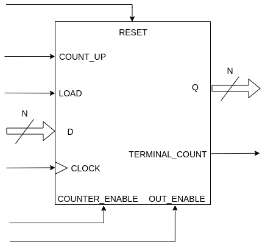


Analizando ordenadamente la **columna ACCIÓN** de la tabla, se aprecian 7 situaciones en las que se puede encontrar el contador:

1. **Deshabilitación de la salida**:  es cuando la salida *Q* se pone en alta impedancia (Z). Esto sucede mientras que la entrada *OUT_ENABLE* vale 0 independientemente del valor de las otras entradas, lo cual pone de manifiesto la asincronía y mayor jerarquía de dicha entrada. La salida del contador queda así "deshabilitada" aunque el dispositivo sigue trabajando internamente (contando, por ejemplo).

2. **Reinicio**: se da cuando la entrada *RESET* está en 1, lo que provoca que la salida *Q* se ponga en 0 siempre y cuando esté habilitada; de lo contrario la salida estará en alta impedancia. Se puede afirmar entonces que la entrada *RESET* es independiente de las otras entradas salvo de **OUT_ENABLE**, por lo que es asincrónica y la segunda de mayor jerarquía.  

3. **Preconfiguración**: es cuando se carga en forma paralela el dato de la entrada *D* en el contador. Esta condición se da cuando el contador está habilitado (*COUNTER_ENABLE* en 1), también lo está la carga paralela (*LOAD* en 1) y se tiene un flanco de *clock* ascendente. Se debe cumplir, además, que el contador tenga habilitada su salida y no se lo esté reiniciando.

4. **Conteo ascendente** y **conteo descendente**: como sus nombres bien lo indican, son las situaciones en que el contador cuenta en forma ascendente y descendente, respectivamente. Esto se da cuando el contador está habilitado (*COUNTER_ENABLE* en 1), la carga paralela está deshabilitada (*LOAD* en 0) y se tiene un flanco de *clock* ascendente. Se debe cumplir, además, que el contador tenga habilitada su salida y no se lo esté reiniciando. 
   
   Si la entrada *COUNT_UP* está en 0 la cuenta es descendente y si vale 1 es ascendente. Es importante ver las aclaraciones debajo de la tabla que indican como sigue la cuenta luego de alcanzar los valores límites. Si la cuenta es ascendente, la salida *Q* pasa de **MOD-1** (11 en este caso) a 00; si es descendente pasa de 00 a **MOD-1**.   

5. **No se cuenta ni preconfigura**: este comportamiento es cuando el contador y su salida están habilitados, el dispositivo no se está reseteando pero no se tiene un flanco ascendente de *CLOCK* que active el funcionamiento. En este caso la salida *Q* mantiene su valor actual *Q<sub>n</sub>* independientemente de las otras entradas.

6. **Deshabilitación del contador**: para este caso la salida del contador está habilitada y este no está siendo reseteado, pero el dispositivo no está habilitado (*COUNTER_ENABLE* en 0). Bajo esta condición no importa el valor de las otras entradas ya que el contador va a mantener su salida *Q* en el valor actual *Q<sub>n</sub>*. 

Aunque no esté expresado en la tabla debido al caso puntual que se tomó de ejemplo, es importante recordar que este contador universal incorpora la función de **autocorrección**. Esta se da solo en los casos en que $`MOD<2^N`$ y cuando el contador adquiere un estado $`E`$ indeseado que vale:

```math
\fcolorbox{lightcoral}{lightgreen}{$MOD<E\le2^N-1$}
```

El contador se autocorrige de la siguiente manera:

1. Si la cuenta es ascendente se corrige a 0.
2. Si la cuenta es descendente se corrige a $`MOD-1`$ (cuenta máxima C<sub>max</sub>).

Como se indicó antes, la salida *TERMINAL_COUNT* se pone en alto para indicar que se alcanzó la cuenta final. Para ver su comportamiento más en detalle se presenta la siguiente tabla de verdad:

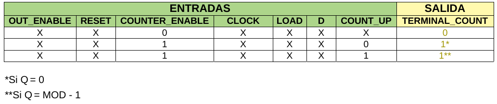

Se puede apreciar como esta salida depende solo de dos entradas: *COUNTER_ENABLE* y *COUNT_UP*. Si el contador está deshabilitado (*COUNTER_ENABLE* en 0), *TERMINAL_COUNT* permanece en 0. Si está habilitado, *TERMINAL_COUNT* se pone en 1 si:

1. La salida *Q* es **0** y el conteo es **descendente**.
2. La salida *Q* es **MOD-1** (11 en este caso) y el conteo es **ascendente**.

## 2. Código

### 2.1. VHDL

Para este contador primero se incluyen los paquetes necesarios:

1. ***std_logic_1164.all*** para usar los tipos de datos *std_logic* y *std_logic_vector*.
2. ***numeric_std.all*** para usar los tipos de datos *unsigned* y *signed*.

```vhdl
--Inclusión de paquetes.
library ieee;                 --Biblioteca estándar ieee.
use ieee.std_logic_1164.all;  --Paquete para std_logic y std_logic_vector.
use ieee.numeric_std.all;     --Paquete para unsigned y signed.
```

Luego se declara la **entidad** del contador. Esta tiene las entradas y salidas ya mencionadas, y los *generics* **nBits**, **modulus** y **risingEdgeClock** que permiten configurar la cantidad de bits **N** del contador, su módulo **MOD** y el flanco de *clock* que lo activa, respectivamente.

```vhdl
--Declaración de la entidad.
entity univCounter is
    generic(
            nBits           : integer := 8;
            modulus         : integer := 256;
            risingEdgeClock : BOOLEAN := TRUE);
    port(
        d_in              : in  std_logic_vector(nBits-1 downto 0);
        clock_in          : in  std_logic;
        outEnable_in      : in  std_logic;
        reset_in          : in  std_logic;
        counterEnable_in  : in  std_logic;
        load_in           : in  std_logic;
        countUp_in        : in  std_logic;
        q_out             : out std_logic_vector(nBits-1 downto 0);
        terminalCount_out : out std_logic);
end entity univCounter;
```
Seguidamente se declara la **arquitectura** del contador. Para almacenar la cuenta internamente se declara la señal **counterData_cnt**.

```vhdl
--Declaración de la arquitectura.
architecture univCounter_arch of univCounter is
    --Señal auxiliar que almacena la cuenta actual del contador.
    signal counterData_cnt : unsigned(nBits-1 downto 0);
begin
```
Entonces, si la salida **q_out** está habilitada va a copiar a la cuenta interna **counterData_cnt**, de lo contario se pone en alta impedancia (Z).

```vhdl
--Declaración de la arquitectura.
architecture univCounter_arch of univCounter is
    --Señal auxiliar que almacena la cuenta actual del contador.
    signal counterData_cnt : unsigned(nBits-1 downto 0);
begin
    --Asignación de la salida con la cuenta.
    q_out <= (others =>'Z') when outEnable_in = '0' else
             std_logic_vector(counterData_cnt);
```

Luego se incluye la asignación de la salida **terminalCount_out**. Esta se pone en alto si el contador está activado y la cuenta llega a su valor límite, el cual depende del sentido de conteo según lo explicado antes.

```vhdl
--Declaración de la arquitectura.
architecture univCounter_arch of univCounter is
    --Señal auxiliar que almacena la cuenta actual del contador.
    signal counterData_cnt : unsigned(nBits-1 downto 0);
begin
    --Asignación de la salida con la cuenta.
    q_out <= (others =>'Z') when outEnable_in = '0' else
             std_logic_vector(counterData_cnt);

    --Asignación de terminalCount_out.
    terminalCount_out <= '1' when (((counterData_cnt = (modulus-1)
                                    and countUp_in ='1')
                                  or (counterData_cnt = 0 and countUp_in = '0'))
                                and (counterEnable_in = '1')) else
                         '0';
```

Finalmente, como el flanco de *clock* que activa al contador es modificable, se utilizan estructuras de generación condicional con la sentencia *generate* y que se llaman **risingEdgeCounter** y **fallingEdgeCounter**. Estas permiten que solo se genere la lógica correspondiente al flanco ascendente o descendente, respectivamente, según el valor del *generic* **risingEdgeClock**. 

Dentro de cada estructura hay un proceso: **risingEdgeCounterData** para la de flanco ascendente y **fallingEdgeCounterData** para la de flanco descendente. Se usa un *process* para describir el comportamiento del contador porque este es un circuito secuencial. Su lista de sensibilidad solo tendrá la entrada de reloj **clock_in** y la entrada asincrónica de reinicio **reset_in**; y en su interior se hace el reinicio del contador, la carga paralela, el conteo y la autocorrección.

<details>
  <summary>
    <b> <mark>Hacer click aquí para mostrar u ocultar la arquitectura completa del contador usando dos estructuras <i>generate</i>.
    </b> </mark>
  </summary>

```vhdl
--Declaración de la arquitectura.
architecture univCounter_arch of univCounter is
    --Señal auxiliar que almacena la cuenta actual del contador.
    signal counterData_cnt : unsigned(nBits-1 downto 0);
begin
    --Generación de un contador activado por flanco ascendente.
    risingEdgeCounter : if (risingEdgeClock = TRUE) generate
        --Proceso para cambiar el dato interno del contador según sus entradas.
        risingEdgeCounterData : process(clock_in, reset_in)
        begin
            if(reset_in = '1') then
                counterData_cnt <= (others => '0');
            elsif((rising_edge(clock_in)) and (counterEnable_in = '1')) then
                if(load_in = '1') then
                    counterData_cnt <= unsigned(d_in);
                else
                    case countUp_in is
                        when '0'    =>
                            --Cuenta descendente. Se considera que si el
                            --contador termina teniendo estados indeseados
                            --(de modulus a [2^nBits]-1) se autocorrige a
                            --"modulus - 1".
                            if(counterData_cnt = 0 or
                               counterData_cnt > (modulus - 1)) then
                                counterData_cnt <= to_unsigned(modulus - 1,
                                                               nBits);
                            else
                                counterData_cnt <= counterData_cnt - 1;
                            end if;
                        when '1'    =>
                            --Cuenta ascendente. Se considera que si el contador
                            --termina teniendo estados indeseados (de modulus a
                            --[2^nBits]-1) se autocorrige a 0.
                            if(counterData_cnt >= (modulus - 1)) then
                                counterData_cnt <= (others => '0');
                            else
                                counterData_cnt <= counterData_cnt + 1;
                            end if;
                        when others =>
                            counterData_cnt <= counterData_cnt;
                    end case;
                end if;
            end if;
        end process risingEdgeCounterData;
    end generate risingEdgeCounter;

    --Generación de un contador activado por flanco descendente.
    fallingEdgeCounter : if (risingEdgeClock = FALSE) generate
        --Proceso para cambiar el dato interno del contador según sus entradas.
        fallingEdgeCounterData : process(clock_in, reset_in)
        begin
            if(reset_in = '1') then
                counterData_cnt <= (others => '0');
            elsif((falling_edge(clock_in)) and (counterEnable_in = '1')) then
                if(load_in = '1') then
                    counterData_cnt <= unsigned(d_in);
                else
                    case countUp_in is
                        when '0'    =>
                            --Cuenta descendente. Se considera que si el
                            --contador termina teniendo estados indeseados
                            --(de modulus a [2^nBits]-1) se autocorrige a
                            --"modulus - 1".
                            if(counterData_cnt = 0 or
                               counterData_cnt > (modulus - 1)) then
                                counterData_cnt <= to_unsigned(modulus - 1,
                                                               nBits);
                            else
                                counterData_cnt <= counterData_cnt - 1;
                            end if;
                        when '1'    =>
                            --Cuenta ascendente. Se considera que si el contador
                            --termina teniendo estados indeseados (de modulus a
                            --[2^nBits]-1) se autocorrige a 0.
                            if(counterData_cnt >= (modulus - 1)) then
                                counterData_cnt <= (others => '0');
                            else
                                counterData_cnt <= counterData_cnt + 1;
                            end if;
                        when others =>
                            counterData_cnt <= counterData_cnt;
                    end case;
                end if;
            end if;
        end process fallingEdgeCounterData;
    end generate fallingEdgeCounter;

    --Asignación de la salida con la cuenta.
    q_out <= (others =>'Z') when outEnable_in = '0' else
             std_logic_vector(counterData_cnt);

    --Asignación de terminalCount_out.
    terminalCount_out <= '1' when (((counterData_cnt = (modulus-1)
                                    and countUp_in ='1')
                                  or (counterData_cnt = 0 and countUp_in = '0'))
                                and (counterEnable_in = '1')) else
                         '0';
end architecture univCounter_arch;
```
</details>

Para ver todo el **código** del módulo en VHDL, ir [aquí](VHDL/univCounter.vhdl)

---

Es posible que se nos ocurra la siguiente pregunta: 

> ¿Por qué no usar un único *process* para describir el funcionamiento del contador, en vez de utilizar dos estructuras *generate* donde cada una tiene un *process* interno? 

En base a esta inquietud, podemos pensar en reescribir la arquitectura del contador reemplazando ambas estructuras *generate* por un único proceso llamado **changeCounterOutput** de la siguiente forma:

<details>
  <summary>
    <b> <mark>Hacer click aquí para mostrar u ocultar la arquitectura completa del contador usando un solo proceso.
    </b> </mark>
  </summary>

```vhdl
--Declaración de la arquitectura.
architecture univCounter_arch of univCounter is
    --Señal auxiliar que almacena la cuenta actual del contador.
    signal counterData_cnt : unsigned(nBits-1 downto 0);
begin
    --Proceso para cambiar la salida del contador según sus entradas.
    changeCounterOutput : process(clock_in, reset_in)
    begin
        if(reset_in = '1') then
            counterData_cnt <= (others => '0');
        elsif( (((risingEdgeClock = TRUE)  and (rising_edge(clock_in))) or
               ((risingEdgeClock = FALSE) and (falling_edge(clock_in)))   ) and
             (counterEnable_in = '1')) then
            if(load_in = '1') then
                counterData_cnt <= unsigned(d_in);
            else
                case countUp_in is
                    when '0'    =>
                        --Cuenta descendente. Se considera que si el contador
                        --termina teniendo estados indeseados (de modulus a
                        --[2^nBits]-1) se autocorrige a "modulus - 1".
                        if(counterData_cnt = 0 or
                           counterData_cnt > (modulus - 1)) then
                            counterData_cnt <= to_unsigned(modulus - 1, nBits);
                        else
                            counterData_cnt <= counterData_cnt - 1;
                        end if;
                    when '1'    =>
                        --Cuenta ascendente. Se considera que si el contador
                        --termina teniendo estados indeseados (de modulus a
                        --[2^nBits]-1) se autocorrige a 0.
                        if(counterData_cnt >= (modulus - 1)) then
                            counterData_cnt <= (others => '0');
                        else
                            counterData_cnt <= counterData_cnt + 1;
                        end if;
                    when others =>
                        counterData_cnt <= counterData_cnt;
                end case;
            end if;
        end if;
    end process changeCounterOutput;

    --Asignación de la salida con la cuenta.
    q_out <= (others =>'Z') when outEnable_in = '0' else
             std_logic_vector(counterData_cnt);

    --Asignación de terminalCount_out.
    terminalCount_out <= '1' when (((counterData_cnt = (modulus-1)
                                    and countUp_in ='1')
                                  or (counterData_cnt = 0 and countUp_in = '0'))
                                and (counterEnable_in = '1')) else
                         '0';
end architecture univCounter_arch;
```
</details>

Se puede ver como en este proceso está todo lo que antes vimos en los procesos de las estructuras *generate*: el reinicio, la carga paralela, el conteo ascendente o descendente y la autocorrección. Además, la arquitectura queda más corta. Sin embargo, esta forma tiene un **PROBLEMA** y es que **actualmente GHDL no lo puede sintetizar ya que por el diseño se infieren *latches***. En otras palabras, **la síntesis de *latches* no está soportada aún por GHDL**. Para conocer más sobre este inconveniente a continuación se proveen 3 enlaces a issues sobre el tema en el repositorio de GHDL:

+ [enlace 1](https://github.com/ghdl/ghdl/issues/938),
+ [enlace 2](https://github.com/ghdl/ghdl-yosys-plugin/issues/99),
+ [enlace 3](https://github.com/ghdl/ghdl/issues/1501).

La inferencia se debe al uso del *generic* **risingEdgeClock** para configurar que flanco de *clock* activa al contador. Esto [no se hace comunmente en desarrollos digitales](https://forums.xilinx.com/t5/Synthesis/use-generic-to-select-clock-edge/td-p/864698), sino que se define el flanco que se va a utilizar según la aplicación y sin usar un *generic*. En este ejemplo como en otros se decidió usar el susodicho *generic* para que los diseños sean más completos, genéricos y educativos.

De todas formas, la versión con un único *process* si puede ser sintetizada con Synplify Pro a través de iCEcube2.

## 3. Simulación

Debido a la cantidad de entradas del contador, desarrollar *testbenches* exhaustivos implicaría analizar todos los estados posibles de las entradas y las salidas, lo que complejizaría excesivamente las pruebas. Por lo tanto, en esta ocasión **se diseñan 5 *testbenches*** para examinar los estados más importantes del dispositivo y **probar así sus principales características**, definiéndo así el **plan de verificación**. Todos los *testbenches* prueban las siguientes características:

- Conteo ascendente y descendente.
- Reinicio.
- Correcto comportamiento de la salida *terminalCount_out*.
- Carga paralela o preconfiguración.
- Habilitación del contador.
- Habilitación de la salida.

A continuación se listan los *testbenches* y las particularidades específicas que se prueban con cada uno:

1. **Contador de 3 bits, módulo 8 y flanco ascendente**: 
   - Activación por flanco ascendente de *clock*.
2. **Contador de 3 bits, módulo 8 y flanco descendente**:
   - Activación por flanco descendente de *clock*.
3. **Contador de 3 bits, módulo 7 y flanco ascendente**:
   - Activación por flanco ascendente de *clock*.
   - Autocorrección de la cuenta.
4. **Contador de 3 bits, módulo 7 y flanco descendente**:
   - Activación por flanco descendente de *clock*.
   - Autocorrección de la cuenta. 
5. **Contador de 2 bits, módulo 4, flanco ascendente y hecho por conexión en cascada**: 
   - Activación por flanco ascendente de *clock*.
   - Conexión en cascada de dos contadores de 1 bit y módulo 2.

Los *testbenches* 1 y 2 de la lista anterior son prácticamente iguales, con la salvedad que los contadores probados se activan por flancos del *clock* diferentes. Lo mismo sucede con los *testbenches* 3 y 4.

Como la síntesis e implementación de un contador se hará en base a lo ensayado en los *testbenches* 1 y 2, **solo se explicarán estos a continuación**. La descripción de los *testbenches* 3, 4 y 5 se puede encontrar como anexo en la [sección 7](#7-anexo-simulaciones-adicionales).

### 3.1. Contadores de 3 bits y módulo 8

#### 3.1.1. VHDL

En esta sección **solo se analiza el código en VHDL del *testbench* que prueba a un contador activado por flanco ascendente**. Esto es porque la diferencia esencial entre este y el que ensaya un contador activado por el flanco contrario es el valor mapeado en el *generic* **risingEdgeClock**.

En primer lugar se incluyen los paquetes necesarios. Estos son los mismos que para la entidad del contador universal ya que se requieren los mismos tipos de datos.

```vhdl
--Inclusión de paquetes.
library ieee;                 --Biblioteca estándar ieee.
use ieee.std_logic_1164.all;  --Paquete para std_logic y std_logic_vector.
use ieee.numeric_std.all;     --Paquete para unsigned y signed.
```

Luego se declara la **entidad**, que por ser de un *testbench* está vacía.

```vhdl
--Entidad del testbench.
entity univCounter_tb_risEdge3b8Mod is
end entity univCounter_tb_risEdge3b8Mod;
```

Posteriormente se comienza con la **arquitectura**. En su parte declarativa primero se declara el contador a ensayar. 

```vhdl
--Declaración del contador a probar.
component univCounter is
    generic (
        nBits           : integer := 8;
        modulus         : integer := 256;
        risingEdgeClock : BOOLEAN := TRUE
    );
    port (
        d_in              : in  std_logic_vector(nBits-1 downto 0);
        clock_in          : in  std_logic;
        outEnable_in      : in  std_logic;
        reset_in          : in  std_logic;
        counterEnable_in  : in  std_logic;
        load_in           : in  std_logic;
        countUp_in        : in  std_logic;
        q_out             : out std_logic_vector(nBits-1 downto 0);
        terminalCount_out : out std_logic
    );
end component;
```

Luego se declaran las constantes **TESTED_NBITS**, **TESTED_MODULUS** y **PERIOD**, las cuales se utilizan para configurar la cantidad de bits del contador, su módulo y el período de *clock* utilizado para probar el diseño, respectivamente. En este caso, el dispositivo tendrá **3 bits** para buscar un punto de equilibrio entre la complejidad de los ensayos y la del dispositivo implementado.

Se declaran también distintas señales de estímulo y monitoreo del contador, y una última para detener la simulación llamada **stopSimulation_s**. Finalmente, se declara la constante **DATA_IN_COUNTER** para cargar al contador con el valor decimal 5, que en binario es 101. 

```vhdl
--Declaración de constantes.
constant TESTED_NBITS   : integer := 3;
constant TESTED_MODULUS : integer := 8;
constant PERIOD         : time    := 100 ns;

--Declaración de estímulos y señales de monitoreo.
--Entradas al contador.
signal test_d_cnt_s         : std_logic_vector(TESTED_NBITS-1 downto 0);
signal test_clock_s         : std_logic;
signal test_outEnable_s     : std_logic;
signal test_reset_s         : std_logic;
signal test_counterEnable_s : std_logic;
signal test_load_s          : std_logic;
signal test_countUp_s       : std_logic;

--Salidas al contador.
signal test_q_cnt_s         : std_logic_vector(TESTED_NBITS-1 downto 0);
signal test_terminalCount_s : std_logic;

--Señal auxiliar para detener la simulación (por defecto es FALSE).
signal stopSimulation_s : BOOLEAN := FALSE;

--Declaración de una constante como estímulo de entrada para precargar el
--contador en cinco.
constant DATA_IN_COUNTER : std_logic_vector := "101";
```

Finalizada la parte declarativa de la arquitectura se continúa con su **descripción principal**. Para esta primero se instancia el contador a probar como **univCounter_0**, asignando los valores correspondientes a sus *generics* y conectando sus puertos con las señales adecuadas.

```vhdl
--Instanciación del DUT (Device Under Test).
univCounter_0 : univCounter
    generic map ( nBits           => TESTED_NBITS,
                  modulus         => TESTED_MODULUS,
                  risingEdgeClock => TRUE)
    port map ( d_in              => test_d_cnt_s,
               clock_in          => test_clock_s,
               outEnable_in      => test_outEnable_s,
               reset_in          => test_reset_s,
               counterEnable_in  => test_counterEnable_s,
               load_in           => test_load_s,
               countUp_in        => test_countUp_s,
               q_out             => test_q_cnt_s,
               terminalCount_out => test_terminalCount_s);
```

Por último se destacan los dos *process* utilizados. El primero, llamado **clockGeneration**, se utiliza para generar la señal de *clock* de período **PERIOD**.

```vhdl
--Proceso de generación de clock.
clockGeneration : process
begin
    test_clock_s <= '1';
    wait for PERIOD/2;
    test_clock_s <= '0';
    wait for PERIOD/2;
    if (stopSimulation_s = TRUE) then
        wait;
    end if;
end process clockGeneration;
```

El segundo *process*, llamado **applyStimulus**, se usa para aplicar distintas señales de estímulo para así poder probar las principales características del contador. Los datos de entrada se cambian en el flanco contrario al que usa el contador para activarse, con el fin de tener mayor claridad en la interpretación de las señales.

<details>
    <summary>
        <b><mark> Hacer click aquí para mostrar u ocultar el <i>process</i> applyStimulus.
        </b></mark>
    </summary>

```vhdl
--Proceso de aplicación de estímulos.
applyStimulus : process
begin
    --Estado inicial: dato de entrada en 5 ("101"), carga paralela
    --deshabilitada, conteo ascendente y contador y salida habilitados.
    test_load_s          <= '0';
    test_d_cnt_s         <= DATA_IN_COUNTER;
    test_countUp_s       <= '1';
    test_outEnable_s     <= '1';
    test_counterEnable_s <= '1';
    stopSimulation_s     <= FALSE;

    --Reset inicial que dura dos periodos y medio de clock. Se agrega el
    --medio período como desfasaje temporal inicial.
    test_reset_s <= '1';
    wait for (2.5)*PERIOD;
    test_reset_s <= '0';

    --Se cuenta ascendentemente un ciclo completo hasta reiniciarse en 0. Se
    --verifica que "test_terminalCount_s" se pone en alto.
    wait for PERIOD*(TESTED_MODULUS + 1);

    --Se carga el contador con el valor DATA_IN_COUNTER y luego se cuenta
    --regresivamente hasta que de 0 pasa al (módulo - 1). Cuanto está en 0
    --se deshabilita el contador por un período. Así se verifica que la
    --"test_terminalCount_s" se pone en alto y solo cuando el contador
    --está habilitado. Se verifica también la pausa de la cuenta.
    test_load_s    <= '1';
    test_countUp_s <= '0';
    wait for PERIOD;
    test_load_s    <= '0';

    wait for PERIOD * to_integer(unsigned(DATA_IN_COUNTER));

    test_counterEnable_s <= '0';
    wait for PERIOD;
    test_counterEnable_s <= '1';
    wait for PERIOD;

    --Se pretende cargar el contador cuando este está deshabilitado, lo cual
    --no se permite.
    test_counterEnable_s <= '0';
    test_load_s          <= '1';
    wait for PERIOD;
    test_load_s          <= '0';
    test_counterEnable_s <= '1';

    --Se continua contando algunos pulsos más en forma decreciente para ver
    --que cuente correctamente.
    wait for PERIOD*4;

    --Se hace un reset para poner la salida y la cuenta interna en cero.
    --Además, se habilita la carga paralela y se deshabilita el contador.
    --Esto permite verificar la asincrónía y mayor jerarquía de la entrada
    --de reset. Se deja pasar un período y luego se desactiva el reset y la
    --carga paralela y también se vuelve a habilitar el contador en conteo
    --descendente.
    test_reset_s         <= '1';
    test_load_s          <= '1';
    test_counterEnable_s <= '0';
    wait for PERIOD;
    test_reset_s         <= '0';
    test_load_s          <= '0';
    test_counterEnable_s <= '1';

    --Se cambia el conteo a ascendente y se cuentan algunos pulsos para ver
    --que funcione correctamente.
    test_countUp_s <= '1';
    wait for PERIOD*4;

    --Se deshabilita la salida del contador y se dejan pasar algunos pulsos
    --de clock. Aquí se prueba la asincronía y más alta jerarquía de la
    --entrada de habilitación de la salida, y que el contador sigue
    --trabajando internamente.
    test_outEnable_s <= '0';
    wait for PERIOD*5;

    --Se detiene la simulación.
    stopSimulation_s <= TRUE;
    wait;
end process applyStimulus;
```
</details>

[Aquí](VHDL/univCounter_tb_risEdge3b8Mod.vhdl) podrá ver todo el código del *testbench* en VHDL donde el contador se activa por flanco ascendente, y [aquí](VHDL/univCounter_tb_falEdge3b8Mod.vhdl) cuando lo hace por flanco descendente.

---

Una vez hechos los *testbenches* se realizan las simulaciones utilizando el *toolchain* correspondiente. Para más información ver la [sección 6](#6-información-adicional-uso-de-herramientas) del presente documento.

#### 3.1.2. Resultados

Al simular mediante el entorno recomendado aparece la siguiente información por la terminal:

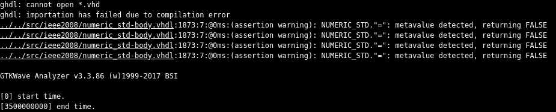

Se observan varios mensajes en pantalla:

1. Los primeros son porque GHDL no encontró archivos **.vhd** en la carpeta del proyecto, lo cual es correcto porque la extensión usada es **.vhdl**.

   ```
   ghdl: cannot open *.vhd
   ghdl: importation has failed due to compilation error
   ```

2. Los siguientes son ***warnings*** que se deben a que la señal interna **counterData_cnt** del contador **univCounter** no está inicializada:

   ```
   ../../src/ieee2008/numeric_std-body.vhdl:1873:7:@0ms:(assertion warning): NUMERIC_STD."=": metavalue detected, returning FALSE
   ../../src/ieee2008/numeric_std-body.vhdl:1873:7:@0ms:(assertion warning): NUMERIC_STD."=": metavalue detected, returning FALSE
   ../../src/ieee2008/numeric_std-body.vhdl:1873:7:@0ms:(assertion warning): NUMERIC_STD."=": metavalue detected, returning FALSE
   ../../src/ieee2008/numeric_std-body.vhdl:1873:7:@0ms:(assertion warning): NUMERIC_STD."=": metavalue detected, returning FALSE
    ```

   Esto se podría corregir inicializando *counterData_cnt* en el código del contador. Sin embargo, no sería realista dado que **cuando el contador se enciende tiene una cuenta interna desconocida y se lo lleva a un estado conocido con el *reset***. Es por esto que los *warnings* no deben interpretarse como que es necesario hacer modificaciones en el código.

3. Los últimos mensajes indican el funcionamiento de GTKWave:

   ```
   GTKWave Analyzer v3.3.86 (w)1999-2017 BSI

   [0] start time.
   [3500000000] end time.
   ```

A continuación se muestran las imágenes de las formas de onda visualizadas con GTKWave para cada uno de los *testbenches*.

##### 3.1.2.1. Flanco ascendente

Primeramente, se ve la imagen de toda la simulación, donde se usaron marcadores para identificar las partes principales ya mencionadas en los comentarios del *testbench*:

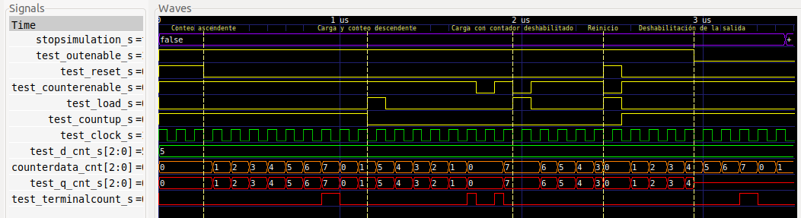

Haciendo zoom en cada una de dichas partes, se aprecia en primer medida el ***reset* inicial** que dura hasta el marcador **Conteo ascendente**. 


Esta etapa consiste en habilitar tanto la salida como el contador (*test_outEnable_s* y *test_counterEnable_s* en 1), no hacer una carga paralela (*test_load_s* en 0), configurar el conteo en ascendente (*test_countUp_s* en 1) y activar el reset (*test_reset_s* en 1) durante dos períodos y medio de *clock*. La entrada *test_d_cnt_s* permanece en todo momento con el valor decimal 5.

Se observa como la cuenta interna *counterData_cnt* y la salida *test_q_cnt_s* del contador se ponen en 0 mientras dura el reinicio. La salida *test_terminalCount_s* permanece en 0 porque el conteo es ascendente y no se alcanzó la cuenta máxima C<sub>max</sub>, que es 7 en este caso.

Continuando con la simulación se encuentra la parte de **cuenta ascendente**, que va desde la marca **Conteo ascendente** hasta **Carga y conteo descendente**. 


En esta parte la salida y el contador están habilitados, y el *reset* y la carga paralela están desactivados. Se dejan pasar 9 períodos de *clock* para verificar que se cuente correctamente en forma ascendente. Se puede ver que esto se verifica ya que la cuenta va de 0 a 7, incrementándose de a 1 con cada flanco ascendente de *clock*. 

Mientras está en 7 la salida *test_terminalCount_s* se pone en 1 dado que se está en la cuenta máxima. Con el próximo flanco ascendente de *clock* la cuenta se reinicia en 0 y la salida *test_terminalCount_s* se pone en 0, lo cual es correcto. Finalmente, el contador cuenta un último pulso y la cuenta pasa a valer 1.

La siguiente parte de la simulación va desde la marca **Carga y conteo descendente** a **Carga con contador deshabilitado**. 


En esta primero se hace una carga paralela del valor 5 presente en la entrada *test_d_cnt_s*. Para esto se pone la entrada *test_load_s* en alto durante un período de *clock* para efectivizar la carga con un flanco ascendente. Además, se configura el conteo como descendente (*test_countUp_s* en 0). Seguidamente, se dejan pasar 5 períodos de *clock* para verificar que se cuente correctamente en forma decreciente.

Como la cuenta pasa de 5 a 0, con decrementos de uno en uno, la cuenta decreciente funciona bien hasta aquí. Al llegar a 0, la salida *test_terminalCount_s* se pone en 1 ya que la cuenta es decreciente. Entonces luego se deshabilita el contador (*test_counterEnable_s* en 0) durante 1 período de *clock*, verificando que la salida *test_terminalCount_s* se pone en 0 y no se avanza con la cuenta durante esta condición. Luego se rehabilita el contador y la salida *test_terminalCount_s* vuelve a valer 1. Finalmente, con el próximo flanco ascendente de *clock* la cuenta se reinicia en 7 (C<sub>max</sub>).

La siguiente sección de la simulación va desde la marca **Carga con contador deshabilitado** a **Reinicio**. 


Aquí se intenta primero preconfigurar el contador (*test_load_s* en 1) cuando este está deshabilitado (*test_counterEnable_s* en 0). Se aprecia como esto no se logra e incluso la cuenta *counterData_cnt* no avanza, todo debido a la deshabilitación. Luego se dejan pasar 4 períodos de *clock* para verificar que se cuente bien en forma decreciente.

En la próxima parte de la simulación **se prueba el reset y su mayor jerarquía**, yendo desde la marca **Reinicio** a **Deshabilitación de la salida**.

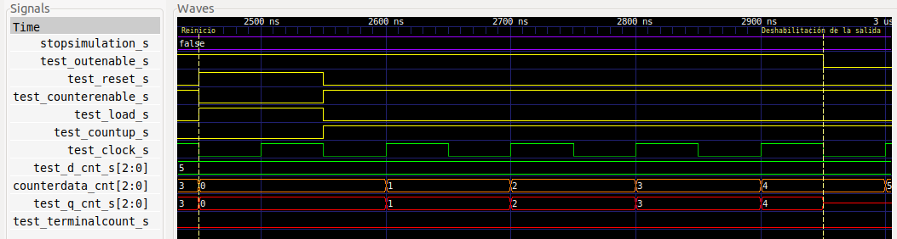

Se observa como se reinicia el contador (*test_reset_s* en 1) durante 1 período de *clock*. Como *test_reset_s* es una entrada asincrónica, la cuenta interna *counterData_cnt* y la salida *test_q_cnt_s* se ponen en 0 desde el momento en que dicha entrada se pone en alto. Además, como es la entrada con la segunda mayor jerarquía, tiene efecto independientemente de que se deshabilite el contador (*test_counterEnable_s* en 0) y/o se lo intente preconfigurar (*test_load_s* en 1). 

Luego las entradas *test_reset_s*, *test_counterEnable_s* y *test_load_s* vuelven a su estado anterior y se configura el conteo en ascendente (*test_countUp_s* en 1). Se dejan pasar 4 períodos de *clock* para verificar que se cuente correctamente, yendo el conteo desde 0 a 4. 

En la última sección de la simulación **se ensaya la habilitación de la salida y su mayor jerarquía**, abarcando desde la marca **Deshabilitación de la salida**.


Se aprecia que el reset y la carga paralela están desactivados, el contador está habilitado y el conteo está configurado en ascendente. Entonces, se pone la entrada *test_outEnable_s* en 0, de forma que se deshabilita la salida *test_q_cnt_s* poniéndola en alta impedancia. De todas formas, el contador continua funcionando internamente ya que se aprecia como la cuenta *counterData_cnt* se incrementa a medida que suceden flancos ascendentes de *clock*. La salida *test_terminalCount_s* también continua operando, pudiendo apreciar que se pone en 1 cuando la cuenta alcanza el valor 7. 

##### 3.1.2.2. Flanco descendente

Para este caso solo se muestra la imagen de toda la simulación, donde se usaron los mismos marcadores para identificar las partes principales:


La imagen prácticamente es igual a la del caso anterior, con la diferencia que **la señal de *clock* está desfasada 180° y el contador se activa por flanco descendente de *clock***. El lector podrá hacer zoom en cada una de las partes para verlas en detalle y constatar que se cumple con lo indicado.

---

Se observa en ambos *testbenches* como las salidas del contador cumplen con el comportamiento deseado, **quedando así verificado el diseño de un contador universal de 3 bits y módulo 8, sea cual sea el flanco de *clock* que lo active**.

## 4. Implementación y ensayo

Para implementar el diseño en la [EDU-FPGA](https://gitlab.com/RamadrianG/wiki---fpga-para-todos/-/wikis/EDU-FPGA) se decide sintetizar el contador universal de 3 bits y módulo 8 probado en la sección de simulación, para que el lector pueda pasar por todas las etapas del diseño digital con el mismo dispositivo.

Para poder apreciar el funcionamiento del contador, se necesita bajar la frecuencia de reloj de la EDU-CIAA-FPGA, que es de 12 MHz. Por lo tanto, en la entrada **counterEnable_in** del contador se conecta un *prescaler* (divisor de frecuencia) que permita activar al contador cada vez que pasen 12 millones de pulsos de *clock*. En otras palabras, el dispositivo permitirá reducir la frecuencia de trabajo del contador a 1 Hz. Se implementa este divisor de frecuencia con otro contador universal. 

Se utiliza también un ***flip-flop T*** para que el usuario sepa cuando el contador se habilita y recibe un flanco de *clock* que activa su funcionamiento. Además, se usa un [decodificador BCD a 7 segmentos](../04-BCD_a_7seg) desarrollado en un ejemplo anterior para poder **ver la cuenta directamente en un *display* de 7 segmentos**. Se podrían usar los LED embebidos en la EDU-FPGA para ver la cuenta y así no requerir del decodificador y más *hardware* externo, pero el uso de un *display* hace más didáctica y enriquecedora la experiencia. 

El diagrama esquemático final correspondiente al ***top-level*** es el siguiente:

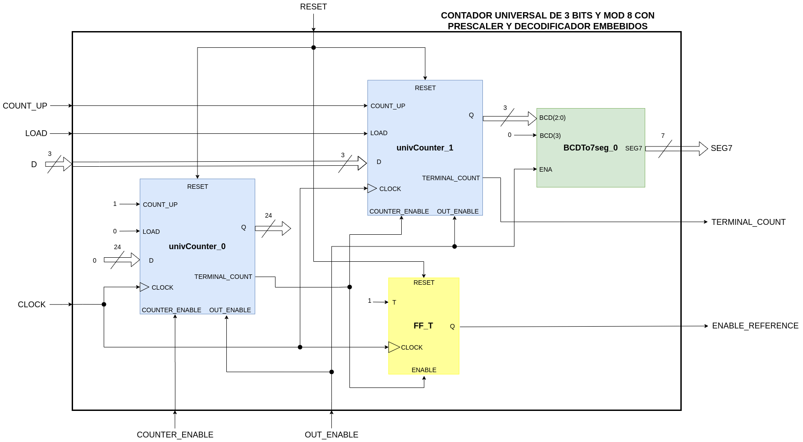

Se aprecia como el contador universal implementado se compone de un *prescaler* interno de 24 bits llamado **univCounter_0**, un contador interno de 3 bits y de nombre **univCounter_1**, un decodificador BCD a 7 segmentos llamado **BCDTo7seg_0** y un *flip-flop* T de nombre **FF_T**. 

Se observa como las entradas de **RESET**, **CLOCK** y **OUT_ENABLE** del *top-level* son solidarias a las entidades de bajo nivel. Las entradas **COUNT_UP**, **LOAD** y **D** se conectan directamente con las del contador interno. La salida **TERMINAL_COUNT** se conecta a la salida del contador interno que tiene el mismo nombre. La salida **SEG7** se conecta a la salida del decodificador, el cual a su vez decodifica la cuenta del contador interno **univCounter_1**. Es importante mencionar que la salida *Q* de este se conecta solo a los tres bits menos significativos de la entrada *BCD* del decodificador, los cuales están simbolizados como *BCD(2:0)*. Como el cuarto bit de dicha entrada (*BCD(3)*) no se usa, se lo pone en 0. Por otro lado, se conecta la entrada *ENA* del decodificador a la línea **OUT_ENABLE** del *top-level* para poder ver la cuenta en el *display* si contador se deshabilita pero se mantiene su salida habilitada. 

El *prescaler*, que es un contador universal a su vez, se configura en cuenta creciente (*COUNT_UP* en 1) y sin posibilidad de carga paralela (*LOAD* en 0). Su entrada de datos *D* y salida *Q* no se usan. La entrada **COUNTER_ENABLE** del *top-level* permite habilitar el *prescaler* y, en conjunto con la salida *TERMINAL_COUNT* de este, también habilita al contador **univCounter_1** y al *flip-flop* **FF_T**.

La salida **ENABLE_REFERENCE** se agrega al *top-level* para que al usuario le resulte más didáctico el ensayo. Esta salida se conecta al terminal *Q* del *flip-flop* T y, como este tiene su entrada *T* en 1, cambiará de estado cada vez que el contador interno se habilite y reciba un flanco de *clock* que lo active. 

El *prescaler* es de **24 bits** para permitir tener un módulo igual a **12x10<sup>6</sup>** y así hacer la división de frecuencia deseada. Tener en cuenta que con esa cantidad de bits el módulo máximo es de 2<sup>24</sup>=16777216.

### 4.1. Síntesis

Para este ejemplo **se explicará solo la síntesis del contador universal de 3 bits y módulo 8** ya que fue el ensayado en los *testbenches* y es, además, el "corazón" del contador implementado como *top-level*. La síntesis se hace con el programa *Synplify Pro* a través de *iCEcube2*.

#### 4.1.1. RTL View (alto nivel)

Este diseño es independiente de la tecnología utilizada y se compone de estructuras genéricas como registros, multiplexores, sumadores, entre otros. A continuación, se aprecia su diagrama esquemático completo:

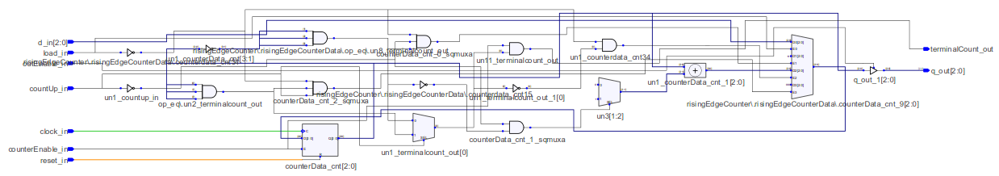

Como el diagrama es complejo, se lo analizará por partes. En primer lugar se hace foco en el registro interno **counterData_cnt[2:0]** como se puede observar en la siguiente imagen:

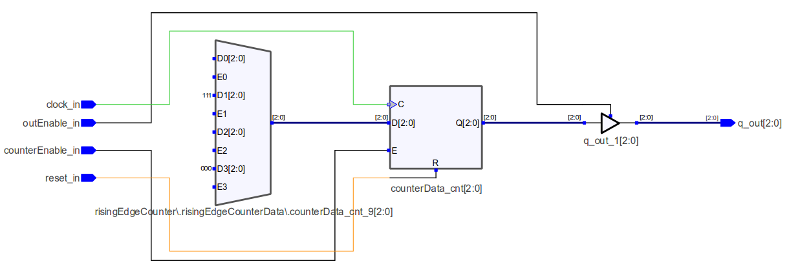

El registro es uno de tipo [PIPO](../07-Registro_pp) (Entrada Paralela y Salida Paralela, por su sigla en inglés) de **3 bits** y tiene una entrada de datos *D[2:0]*, de *clock* *C*, de reset *R* y de habilitación de funcionamiento *E*. Este dispositivo es el encargado de almacenar la cuenta del contador. Dentro de él hay **tres *flip-flops* tipo D** que comparten la misma entrada de *clock*, por lo que **el contador sintetizado es uno de tipo sincrónico**.

Se aprecia como las entradas **clock_in**, **counterEnable_in** y **reset_in** se conectan directamente al registro, lo cual es lógico ya que de esta forma el contador logra contar pulsos de reloj y se puede habilitar el conteo o reiniciarlo en 0. La entrada **outEnable_in** del *top-level* actúa sobre el *buffer tri-state* llamado **q_out_1[2:0]**. Este permite poner o no a la salida del registro PIPO *Q[2:0]* en alta impedancia.

Hasta aquí vimos ya varias características que se corresponden con el contador universal diseñado. Luego haremos enfoque en QUE dato es el que se pone en la entrada del registro para su almacenamiento. Como se ve en la imagen anterior, en la entrada *D[2:0]* del registro se presenta el valor de 3 bits que está en la salida del PMUX (Multiplexor Polimórfico, por su sigla en inglés) **risingEdgeCounter\\.risingEdgeCounterData\\.counterData_cnt_9[2:0]**. 

A modo breve, se recuerda que un PMUX es un multiplexor que posee una cantidad de entradas de habilitación igual a la de datos, donde si la entrada E<sub>n</sub> se pone en alto esto permite que la entrada D<sub>n</sub> se presente en la salida del MUX. El PMUX está diseñado para que solo una entrada de habilitación se active a la vez (*one-hot*).

En la siguiente imagen se aprecia como se obtiene la salida **terminalCount_out**:

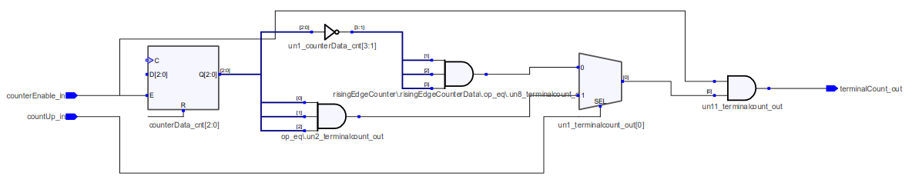

Debido a la compuerta AND **un11_terminalcount_out**, la salida **terminalCount_out** solo se pone en alto si suceden dos cosas. En primer lugar, la entrada **counterEnable_in** debe estar en 1 para habilitar al contador. En segundo lugar, se debe alcanzar el valor límite de la cuenta, lo cual se analiza con el MUX **un1_terminalcount_out[0]** y sus entradas. Según como esté configurado el conteo con **countUp_in**, se verifica si la cuenta en el registro llega al binario 000 o 111 según corresponda, y cuando esto sucede la salida del MUX se pone en alto.

Ahora se analiza el PMUX mencionado antes para ver que dato presenta en la entrada *D[2:0]* del registro interno. Primeramente, se evalúa la primera entrada de datos **D0[2:0]** y la primera de habilitación **E0** en la siguiente imagen: 

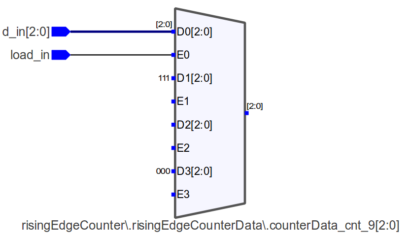

Como se puede observar, cuando se habilita la carga paralela en el contador poniendo su entrada **load_in** en 1, lo que se está haciendo internamente es enviar el dato de entrada **d_in[2:0]** de preconfiguración a la entrada de datos del registro. La carga paralela luego se efectiviza con un flanco ascendente de *clock* que termina por cargar el dato en el registro. 

Seguidamente, se analizan las entradas **D1[2:0]** y **E1** del PMUX:

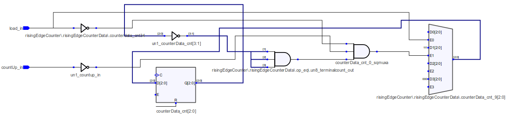

Aquí vemos como al habilitarse *D1[2:0]* lo que se envía a la entrada de datos del registro es el valor binario 111. Esto se utiliza cuando el conteo es descendente y la cuenta debe pasar del valor 000 al 111, siendo la compuerta AND **counterData_cnt_0_sqmuxa** quien se encarga de evaluar cuando se está en dicha situacion. Con sus tres entradas analiza que no se esté preconfigurando al contador (**load_in** en 0), que el conteo sea descendente (**countUp_in** en 0) y que la cuenta dentro del registro valga 0.

Este comportamiento es muy parecido al que se tiene con las entradas **D3[2:0]** y **E3** del PMUX:

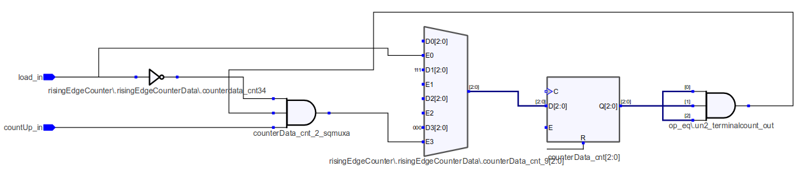

Para este caso se carga el valor binario 000 en la entrada de datos del registro cuando la cuenta es ascendente y pasa del valor 111 al 000 (sin reiniciar con **reset_in**). Para poder hacerlo, la compuerta AND **counterData_cnt_2_sqmuxa** evalúa que no se esté preconfigurando al contador (**load_in** en 0), que la carga sea ascendente (**countUp_in** en 1) y que la cuenta en el registro valga 111.

Por último, las entradas **D2[2:0]** y **E2** se usan para que el contador pueda avanzar con su cuenta siempre y cuando no esté en su valor límite. Lo conectado en la entada de datos **D2[2:0]** se puede ver en la siguiente imagen:

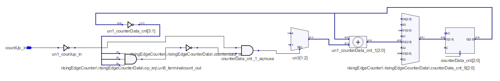

Se aprecia como el valor que se enviará a la entrada de datos del registró será la salida del sumador **un1_counterData_cnt_1[2:0]**. Este sumá el valor de la cuenta actual con un número que depende de como está configurada la cuenta. Por medio del MUX **un3[1:2]** y las compuertas restantes se opera de la siguiente forma: si la cuenta es ascendente se suma el binario signado 01 (+1 en decimal), mientras que si es descendente se suma el binario signado 11 (-1 en decimal). Así, se consigue el contador cuente en ambos sentidos.

A continuación se puede observar lo que se conecta en la entrada de habilitación **E2**:

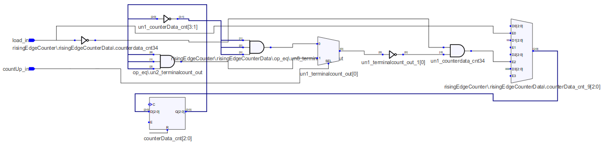

La compuerta AND **un1_counterdata_cnt34** analiza que no se esté preconfigurando al contador (**load_in** en 0) y, por medio del MUX **un1_terminalcount_out[0]** y las compuertas restantes, que no se haya alcanzado el valor límite de la cuenta según como esté configurado el conteo.

---

Habiendo visto en detalle todo el diagrama esquemático de alto nivel, se puede afirmar que este **concuerda con el del contador universal de 3 bits y módulo 8 diseñado**. Se invita al lector a que genere el diagrama esquemático en bajo nivel llamado ***Tech View*** y lo analice y coteje con el anterior.

### 4.2. Código de la implementación

#### 4.2.1. VHDL

Para el ***top-level***, la inclusión de paquetes y declaración de la entidad son muy similares a las de **univCounter**. Las diferencias son que el paquete **numeric_std.all** no se utiliza, la salida **q_out** se reemplaza por la nueva salida **seg7_out**, se agrega la salida **enableReference_out** y el valor por defecto de los *generics* **nBits** y **modulus** son **3** y **8**, respectivamente. Esto es porque el sintetizador usa dichos valores por defecto para realizar la síntesis del circuito.

```vhdl
--Inclusión de paquetes.
library ieee;                --Biblioteca estándar ieee.
use ieee.std_logic_1164.all; --Paquete para std_logic y std_logic_vector.

--Declaración de la entidad.
entity top_univCounter is
    generic(
        nBits           : integer := 3;
        modulus         : integer := 8;
        risingEdgeClock : BOOLEAN := TRUE);
    port(
        d_in                : in  std_logic_vector(nBits-1 downto 0);
        clock_in            : in  std_logic;
        outEnable_in        : in  std_logic;
        reset_in            : in  std_logic;
        counterEnable_in    : in  std_logic;
        load_in             : in  std_logic;
        countUp_in          : in  std_logic;
        seg7_out            : out std_logic_vector(6 downto 0);
        terminalCount_out   : out std_logic;
        enableReference_out : out std_logic);
end entity top_univCounter;
```

Luego se comienza a desarrollar la **arquitectura** del *top-level*. Primeramente, se declaran el *prescaler*, el contador y el decodificador a instanciar, constantes para guardar el valor de los *generics* **nBits**, **modulus** y **risingEdgeClock** del *top-level*, constantes para almacenar el valor de ciertos parámetros del *prescaler* y el decodificador y, por último, las señales internas que se utilizan para interconexiones.

Para el ***flip-flop* T** no se va a instanciar un módulo particular, sino que se va a hacer uso de la señal **counterEnableReference_s** y de lógica interna con un *process* para que el sintetizador termine generando dicho *flip-flop*.

<details>
  <summary> 
    <b> <mark>Hacer click aquí para mostrar u ocultar la parte declarativa de la arquitectura del top-level.
    </b> </mark>
  </summary>

```vhdl
--Declaración de la arquitectura.
architecture top_univCounter_arch of top_univCounter is
    --Declaración del contador interno que se usa como prescaler y contador.
    component univCounter is
        generic (
            nBits           : integer := 8;
            modulus         : integer := 256;
            risingEdgeClock : BOOLEAN := TRUE
        );
        port (
            d_in              : in  std_logic_vector(nBits-1 downto 0);
            clock_in          : in  std_logic;
            outEnable_in      : in  std_logic;
            reset_in          : in  std_logic;
            counterEnable_in  : in  std_logic;
            load_in           : in  std_logic;
            countUp_in        : in  std_logic;
            q_out             : out std_logic_vector(nBits-1 downto 0);
            terminalCount_out : out std_logic
        );
    end component;

    --Declaración del decodificador BCD a 7 segmentos interno.
    component BCDTo7seg is
        generic (
            commonAnode : BOOLEAN := TRUE
        );
        port (
            BCD_in   : in  std_logic_vector(3 downto 0);
            ena_in   : in  std_logic;
            seg7_out : out std_logic_vector(6 downto 0)
        );
    end component;

    --Declaración de constantes para guardar el valor de los generics nBits,
    --modulus y risingEdgeClock del top-level.
    constant TOP_NBITS             : integer := nBits;
    constant TOP_MODULUS           : integer := modulus;
    constant TOP_RISING_EDGE_CLOCK : BOOLEAN := risingEdgeClock;

    --Declaración de constantes para el prescaler interno.
    constant PRESCALER_NBITS   : integer := 24;
    constant PRESCALER_MODULUS : integer := 12000000;

    --Declaración de constante para el decodificador interno.
    constant DECODER_COMMON_ANODE : BOOLEAN := FALSE;

    --Declaración de señales internas para conexiones del prescaler interno.
    signal prescalerInputData_s     : std_logic_vector(PRESCALER_NBITS-1 downto 0)
                                      := (others => '0');
    signal prescalerLoad_ena        : std_logic := '0';
    signal prescalerUpCount_ena     : std_logic := '1';
    signal prescaler_clk            : std_logic;
    signal prescalerClock_ena       : std_logic;
    signal prescalerOut_ena         : std_logic;
    signal prescaler_rst            : std_logic;
    signal prescalerTerminalCount_s : std_logic;

    --Declaración de señales internas para conexiones del contador interno.
    signal counterInputData_s     : std_logic_vector(TOP_NBITS-1 downto 0)
                                    := (others => '0');
    signal counterLoad_ena        : std_logic;
    signal counterUpCount_ena     : std_logic;
    signal counterTerminalCount_s : std_logic;
    signal counterOutputData_s    : std_logic_vector(TOP_NBITS-1 downto 0);

    --Declaración de señales internas para conexiones del decodificador interno.
    signal decoderInputData	 : std_logic_vector(3 downto 0);
    signal decoderOutputData : std_logic_vector(6 downto 0);

    --Declaración de señal de 1 bit que cambia cada vez que el contador interno
    --está habilitado y recibe un flanco de clock que activa su funcionamiento.
    signal counterEnableReference_s : std_logic := '0';
```
</details>

Finalmente, en la arquitectura se instancia el *prescaler*, el contador y el decodificador. Además, se desarrollan todas las interconexiones internas necesarias, teniendo en cuenta que:
- Como la salida **q_out** del *prescaler* no se usa, se la deja abierta (*open*).
- Debido a que en el ensayo se van a usar pulsadores con resistores *pull-up* como entradas al *top-level*, las entradas **d_in**, **load_in** y **reset_in** de este se niegan internamente para contrarrestar el efecto de dichos resistores. Esto se verá con más detalle en la [sección 4.3. Circuito externo y asignación de pines](#43-circuito-externo-y-asignación-de-pines).

Para implementar la lógica que permite sintetizar un *flip-flop* T se hace uso de dos estructuras de generación condicional: **risingEdgeFlipFlopT** y **fallingEdgeFlipFlopT**. Estas generan la lógica del *flip-flop* según como esté configurada la activación por flanco del *clock*. Internamente cada una tiene un proceso: **getEnableReferenceRisingEdge** para la primera y **getEnableReferenceFallingEdge** para la segunda.

<details>
  <summary>
    <b> <mark>Hacer click aquí para mostrar u ocultar la descripción principal de la arquitectura del top-level.
    </b> </mark>
  </summary>

```vhdl
begin
    --Instanciación del contador interno que se usa como prescaler.
    univCounter_0 : univCounter
        generic map ( nBits           => PRESCALER_NBITS,
                      modulus         => PRESCALER_MODULUS,
                      risingEdgeClock => TOP_RISING_EDGE_CLOCK)
        port map ( d_in              => prescalerInputData_s,
                   clock_in          => prescaler_clk,
                   outEnable_in      => prescalerOut_ena,
                   reset_in          => prescaler_rst,
                   counterEnable_in  => prescalerClock_ena,
                   load_in           => prescalerLoad_ena,
                   countUp_in        => prescalerUpCount_ena,
                   q_out             => open,
                   terminalCount_out => prescalerTerminalCount_s);

    --Instanciación del contador interno que se usa como contador.
    univCounter_1 : univCounter
        generic map ( nBits           => TOP_NBITS,
                      modulus         => TOP_MODULUS,
                      risingEdgeClock => TOP_RISING_EDGE_CLOCK)
        port map ( d_in              => counterInputData_s,
                   clock_in          => prescaler_clk,
                   outEnable_in      => prescalerOut_ena,
                   reset_in          => prescaler_rst,
                   counterEnable_in  => prescalerTerminalCount_s,
                   load_in           => counterLoad_ena,
                   countUp_in        => counterUpCount_ena,
                   q_out             => counterOutputData_s,
                   terminalCount_out => counterTerminalCount_s);

    --Instanciación del decodificador BCD a 7 segmentos interno. Se conecta
    --ena_in con prescalerOut_ena para poder ver el dígito en el display si el
    --contador se deshabilita pero se mantiene su salida habilitada.
    BCDTo7seg_0 : BCDTo7seg
        generic map (commonAnode => DECODER_COMMON_ANODE)
        port map ( BCD_in   => decoderInputData,
                   ena_in   => prescalerOut_ena,
                   seg7_out => decoderOutputData);

    --Se hacen conexiones internas del contador interior.
    counterInputData_s  <= not d_in;
    counterLoad_ena     <= not load_in;
    counterUpCount_ena  <= countUp_in;
    enableReference_out <= counterEnableReference_s;
    terminalCount_out   <= counterTerminalCount_s;

    --Se hacen conexiones internas del prescaler.
    prescaler_clk      <= clock_in;
    prescaler_rst      <= not reset_in;
    prescalerOut_ena   <= outEnable_in;
    prescalerClock_ena <= counterEnable_in;

    --Se hacen conexiones internas del decodificador.
    decoderInputData <= '0' & counterOutputData_s;
    seg7_out         <= decoderOutputData;

    --Generación de Flip Flop T según el flanco de activación configurado. Tanto
    --el proceso getEnableReferenceRisingEdge como getEnableReferenceFallingEdge
    --permiten cambiar el estado de la señal counterEnableReference_s cuando
    --el contador interno está habilitado y recibe un flanco de clock que
    --activa su funcionamiento. La señal se comporta como la salida de un
    --Flip Flop T.
    risingEdgeFlipFlopT : if (risingEdgeClock = TRUE) generate
        getEnableReferenceRisingEdge : process (clock_in)
        begin
            if( (rising_edge(clock_in)) and
                (prescalerTerminalCount_s = '1')) then
                counterEnableReference_s <= not counterEnableReference_s;
            end if;
        end process getEnableReferenceRisingEdge;
    end generate risingEdgeFlipFlopT;

    fallingEdgeFlipFlopT : if (risingEdgeClock = FALSE) generate
        getEnableReferenceFallingEdge : process (clock_in)
        begin
            if( (falling_edge(clock_in)) and
                (prescalerTerminalCount_s = '1')) then
                counterEnableReference_s <= not counterEnableReference_s;
            end if;
        end process getEnableReferenceFallingEdge;
    end generate fallingEdgeFlipFlopT;
end architecture top_univCounter_arch;
```
</details>

Para ver el archivo **.vhdl** completo ***top-level***, ir [aquí](VHDL/top_univCounter.vhdl)

### 4.3. Circuito externo y asignación de pines

Para esta implementación se utilizan **3 pulsadores embebidos** en la placa más **4 pulsadores y un *jumper* externos conectados a pines GPIO** como entradas, y **2 LED embebidos más un display de 7 segmentos conectado a pines GPIO** como salidas. Para poder encender este display se utiliza un **IC driver ULN2803A**[^2] debido a que los pines GPIO como salidas solo pueden proveer como máximo 6 mA.

El circuito a conectar con la EDU-CIAA-FPGA es el siguiente:  

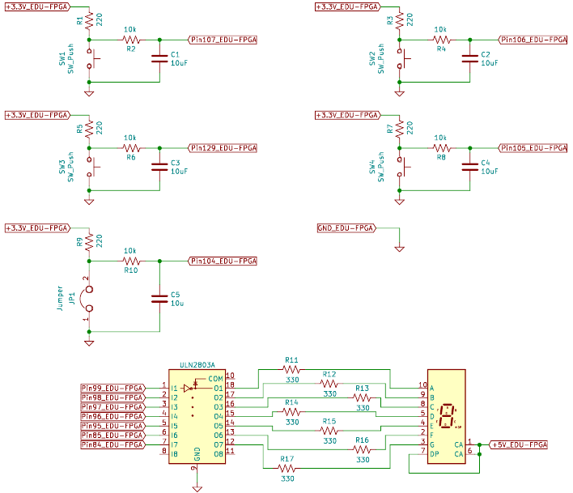

El *jumper* y cada pulsador externo están acompañados de un resistor *pull-up* y un circuito antirrebote (*debounce*) compuesto por un circuito serie RC (Resistor-Capacitor). A causa de los resistores *pull-up*, cuando el *jumper* no esté conectado o un pulsador no esté presionado transferirán un 1 a los pines de entrada, mientras que transferirán un 0 si se hace lo contrario. Esto es conveniente para las entradas **outEnable_in** y **counterEnable_in** ya que no se deben mantener presionados sus pulsadores constantemente para habilitar la salida y el conteo del contador. Sin embargo, no es adecuado para las entradas **d_in**, **load_in** y **reset_in** porque implica trabajar con **lógica negativa** para **d_in** y que el contador en todo momento está siendo preconfigurado y/o reiniciado a menos que se pulsen los interruptores apropiados. Por lo tanto, dentro del *top-level* se invierten estas tres entradas para contrarrestar el efecto de los resistores *pull-up*.

En cuanto a la entrada **countUp_in**, el contador contará en forma ascendente a menos que se conecte el *jumper*.

La asignación de pines en la EDU-CIAA-FPGA es:

|      **Componente**           |   **Pin FPGA**    | **Pin contador top-level** |
|:-----------------------------:|:-----------------:|:--------------------------:|
| Pulsador embebido 1           |       31          |   d_in(0)                  |
| Pulsador embebido 2           |       32          |   d_in(1)                  |
| Pulsador embebido 3           |       33          |   d_in(2)                  |
| Pulsador externo 1 (GPIO)     |       107         |   outEnable_in             |
| Pulsador externo 2 (GPIO)     |       106         |   reset_in                 |
| Pulsador externo 3 (GPIO)     |       129         |   counterEnable_in         |
| Pulsador externo 4 (GPIO)     |       105         |   load_in                  |
| Jumper externo 1 (GPIO)       |       104         |   countUp_in               |
| Oscilador 12 MHz a cristal    |       94          |   clock_in                 |
| LED embebido 1                |       1           |   terminalCount_out        |
| LED embebido 4	            |       4           |   enableReference_out      |
| Segmento a del display (GPIO) |       99          |   seg7_out(0)              |
| Segmento b del display (GPIO) |       98          |   seg7_out(1)              |
| Segmento c del display (GPIO) |       97          |   seg7_out(2)              |
| Segmento d del display (GPIO) |       96          |   seg7_out(3)              |
| Segmento e del display (GPIO) |       95          |   seg7_out(4)              |
| Segmento f del display (GPIO) |       85          |   seg7_out(5)              |
| Segmento g del display (GPIO) |       84          |   seg7_out(6)              |

Para ver el archivo **.pcf** ir [aquí](top_univCounter.pcf) y para el pinout de la EDU-FPGA ir [aquí](https://github.com/ciaa/Hardware/blob/master/PCB/EDU-FPGA/Pinout/Pinout%20EDU%20FPGA.pdf).

### 4.4. Ensayo

Como último paso, se sintetiza e implementa el diseño en la placa. En la siguiente imagen se puede apreciar como queda todo el circuito utilizando tres "protoboards" para conectar los componentes externos, y también se indica a que entrada corresponde el *jumper* y cada pulsador y a que salida corresponde el *display* y cada LED:

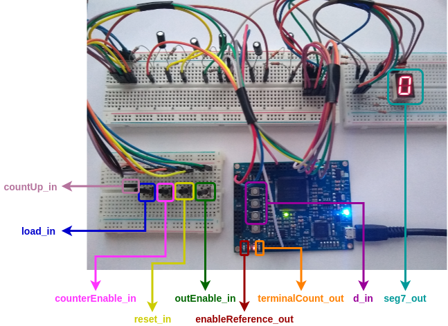

A continuación se presentan las distintas pruebas que se realizaron en el ensayo, las cuales se basaron en los *testbenches* desarrollados.

**Prueba 1: conteo ascendente completo con deshabilitación**

En esta prueba se valida que el contador pueda realizar una cuenta completa en forma ascendente y que también se pueda deshabilitar el conteo. Para que el conteo sea incremental el *jumper* de **countUp_in** debe estar previamente desconectado.

La prueba inicia reiniciando el contador al pulsar brevemente el botón de **reset_in**. Luego se deja que el contador cuente hasta 5 y se lo deshabilita pulsando por un corto instante el interruptor de **counterEnable_in**. Seguidamente, se libera el pulsador y se continúa con la cuenta, dejando que llegue a reiniciarse automáticamente al pasar de 7 a 0. Esta prueba puede apreciarse en el siguiente GIF:


Es importante observar como la cuenta **SOLO CAMBIA CUANDO EL LED EMBEBIDO CORRESPONDIENTE A enableReference_out CONMUTA DE ESTADO**, lo que quiere decir que el contador interno cambia de estado cuando está habilitado y recibe un flanco de clock que lo active. Esto coincide con el comportamiento esperado. 

Por otro lado, el LED embebido correspondiente a **terminalCount_out** no se enciende cuando la cuenta alcanza su valor límite de 7. Esto es correcto ya que el *prescaler* mantiene habilitado al contador interno durante un período muy corto de tiempo mientras su cuenta vale 7. Específicamente, ese tiempo $`t`$ vale aproximadamente:

```math
t \cong \frac{1}{f_{clock}} = \frac{1}{12 \kern{1 mm}MHz} \\[3mm]
\fcolorbox{lightcoral}{lightgreen}{$t \cong 83,3333 \kern{1 mm} ns$}
```

Es imposible que el usuario aprecie al LED encendido durante tan poco tiempo. Sin embargo, si se puede afirmar que la salida **terminalCount_out** funciona ya que efectivamente el *prescaler*, que intrínsecamente es un contador universal, habilita al contador interno cada un segundo. Esto se evidencia en que la cuenta en el *display* cambia cada un segundo cuando está habilitada.

**Prueba 2: conteo descendente completo con deshabilitación**

Esta prueba es igual a la anterior con la diferencia que se conecta el *jumper* de **countUp_in** para que el conteo sea descendente. Como se ve en el siguiente GIF, el conteo se deshabilita brevemente cuando la cuenta llega a 3, pudiendo luego observar como sigue el conteo y se reinicia automáticamente pasando de 0 a 7.


**Prueba 3: preconfiguración del contador con el valor 5**

Esta prueba consiste en intentar preconfigurar al contador con el valor decimal 5. Con el *jumper* de **countUp_in** conectado para que el conteo sea descendente, la cuenta comienza en 7. Al llegar a 3, se pulsa el botón de carga paralela **load_in** y los pulsadores de **d_in** para cargar el valor 5. La carga se efectiviza cuando el LED embebido correspondiente a **enableReference_out** conmuta de estado.

Después se liberan los pulsadores y el contador continúa contando a partir del valor 5. Al llegar a 3 nuevamente se intenta preconfigurarlo pero pulsando antes el botón de **counterEnable_in** para deshabilitarlo. Debido a esto, la carga paralela no se realiza y la cuenta se mantiene en 3. Luego se liberan los pulsadores y el conteo continúa.


**Prueba 4: reinicio del contador con otras entradas activadas**

Para esta prueba se valida que la entrada de reinicio **reset_in** sea asincrónica y la segunda de mayor jerarquía. Como configuración previa, el *jumper* de **countUp_in** se conecta para que el conteo sea descendente. 

La cuenta comienza en 6. Al llegar a 3, se deshabilita el contador pulsando el botón de **counterEnable_in** y se intenta preconfigurarlo con 5 pulsando el botón de carga paralela **load_in** y los pulsadores de **d_in** correspondientes. La carga paralela no se puede realizar por la deshabilitación y la cuenta se mantiene en 3, como ya sucedió en la **Prueba 3**. Sin liberar ningúno de los botones se pulsa el de reinicio y se ve como la cuenta cambia a 0 instantáneamente. Finalmente, se liberan los pulsadores y el contador continúa contando.


**Prueba 5: deshabilitación de la salida**

En esta prueba se valida el funcionamiento de la habilitación de la salida. En primer lugar y con el *jumper* desconectado para tener conteo ascendente, se hace un reinicio pulsando brevemente el botón de **reset_in**. Después, a medida que el contador cuenta, se pulsa repetidas veces el interruptor de **outEnable_in** y se aprecia como el *display* se apaga cuando se lo presiona y se enciende al liberarlo. 

Al llegar la cuenta a 4, se deshabilita momentáneamente el contador pulsando el botón de **counterEnable_in**, apreciando como se mantiene el valor de la cuenta. Seguidamente, cuando llega la cuenta a  5, se reinicia el contador presionando el interruptor de **reset_in** y se lo deja contar a partir de allí. El contador hace todo esto mientras se habilita y deshabilita su salida (se enciende y apaga el *display*), lo que evidencia que sigue trabajando internamente.


Con los ensayos realizados se puede decir finalmente que el diseño *top-level* de un contador universal de 3 bits y módulo 8 **funciona según lo esperado**.

## 5. Véase también

### 5.1. Sintaxis relacionada

* [Descripción secuencial en VHDL](https://gitlab.com/RamadrianG/wiki---fpga-para-todos/-/wikis/Descripci%C3%B3n-secuencial-en-VHDL)
* [Descripción estructural en VHDL](https://gitlab.com/RamadrianG/wiki---fpga-para-todos/-/wikis/Descripci%C3%B3n-estructural-en-VHDL)
* [Testbenches en VHDL](https://gitlab.com/RamadrianG/wiki---fpga-para-todos/-/wikis/Testbenches-en-VHDL)
* [Automatización de testbenches en VHDL](https://gitlab.com/RamadrianG/wiki---fpga-para-todos/-/wikis/Testbench-automatizado-en-VHDL)

- [Descripción secuencial en Verilog](https://gitlab.com/RamadrianG/wiki---fpga-para-todos/-/wikis/Descripci%C3%B3n-secuencial-en-Verilog)
- [Descripción estructural en Verilog](https://gitlab.com/RamadrianG/wiki---fpga-para-todos/-/wikis/Descripci%C3%B3n-estructural-en-Verilog)
- [Testbenches en Verilog](https://gitlab.com/RamadrianG/wiki---fpga-para-todos/-/wikis/Testbenches-en-Verilog)
- [Automatización de testbenches en Verilog](https://gitlab.com/RamadrianG/wiki---fpga-para-todos/-/wikis/Testbench-automatizado-en-Verilog)

### 5.2. Ejemplos relacionados

1. [Decodificador BCD a 7 segmentos](../04-BCD_a_7seg)
2. [Flip Flop D](../05-FlipFlop_D)
3. [Registro de entrada paralela y salida paralela](../07-Registro_pp)
4. [Registro de entrada serie y salida serie](../08-Registro_ss)
5. [Registro de entrada paralela y salida serie](../09-Registro_ps)
6. [Registro de entrada serie y salida paralela](../10-Registro_sp)
7. [NCO](../11-NCO)

## 6. Información adicional: uso de herramientas

Para más información sobre cómo usar el *toolchain* para compilar y simular o 
descargar a la placa según el lenguaje utilizado, referirse a los siguientes 
vínculos:

 - VHDL y Verilog (recomendado): [Entorno basado en Atom][Entorno_Link].
 - Solo VHDL : [GHDL y GTKWave](https://gitlab.com/RamadrianG/wiki---fpga-para-todos/-/wikis/Herramientas-libres-para-VHDL) + [iCEcube2](https://gitlab.com/RamadrianG/wiki---fpga-para-todos/-/wikis/Software-Lattice) + [IceStorm][IceStorm_link]
 - Solo Verilog : [icarusVerilog y GTKWave](https://gitlab.com/RamadrianG/wiki---fpga-para-todos/-/wikis/Herramientas-libres-para-Verilog) + [IceStorm][IceStorm_link]

[Entorno_Link]: https://gitlab.com/RamadrianG/wiki---fpga-para-todos/-/wikis/Uso-del-entorno
[IceStorm_link]: https://gitlab.com/RamadrianG/wiki---fpga-para-todos/-/wikis/Proyecto-iCEstorm

## 7. Anexo: Simulaciones adicionales

### 7.1. Contadores de 3 bits y módulo 7

#### 7.1.1. VHDL

En esta sección **solo se analiza el código en VHDL del *testbench* que prueba a un contador activado por flanco ascendente**. Esto es porque la diferencia esencial entre este y el que ensaya un contador activado por el flanco contrario es el valor mapeado en el *generic* **risingEdgeClock**.

Como la inclusión de paquetes y la declaración de la **entidad** son prácticamente iguales que las de los dos *testbenches* antes vistos, se analiza directamente la **arquitectura**. La parte declarativa de esta también es muy similar a la de los *testbenches* previos, aunque existen dos grandes diferencias. Primero, la constante **TESTED_MODULUS** ahora vale 7 y no 8, según lo deseado para estas pruebas. Segundo, se declara una nueva constante llamada **FORBIDDEN_COUNT** que almacena un estado indeseado o prohibido de la cuenta.

Recordar que un estado indeseado $`E`$ es aquel que vale: 

```math
MOD-1<E\le2^{N}-1 
```

Como en este caso MOD = 7 y N = 3, los estados indeseados son:

```math
7-1<E\le2^{3}-1 \\[3mm]

6<E\le8-1 \\[3mm]
 
\fcolorbox{lightcoral}{lightgreen}{$6<E\le7$}
```

Por lo que **el único estado indeseado en este caso es 7**, que es igual a **TESTED_MODULUS**.

```vhdl
...
constant TESTED_MODULUS : integer := 7;
...
constant FORBIDDEN_COUNT : std_logic_vector :=
    std_logic_vector(to_unsigned(TESTED_MODULUS, TESTED_NBITS));

```

Finalizada la parte declarativa de la arquitectura, se continúa con su **descripción principal**. Esta de nuevo es muy parecida a la vista en los dos *testbenches* anteriores: se instancia el contador a probar como **univCounter_0** y se declaran los procesos **clockGeneration** y **applyStimulus** para la generación de la señal de *clock* y la aplicación de estímulos al contador, respectivamente. La diferencia importante está en este último *process*, donde ahora se agregan estímulos para **preconfigurar al contador con un estado indeseado** y ver luego de algunos pulsos de *clock* **como el dispositivo se autocorrige y sige correctamente con el conteo**.

```vhdl
...
--Se pone en cuenta decreciente, se carga el valor "modulus" y se
--verifica que se autocorrige a "modulus-1".
test_countUp_s <= '0';
test_d_cnt_s   <= FORBIDDEN_COUNT;
test_load_s    <= '1';
wait for PERIOD;
test_load_s    <= '0';
wait for 2*PERIOD;

--Se pone en cuenta ascendente, se carga el valor "modulus" y se
--verifica que se autocorrige a 0.
test_countUp_s <= '1';
test_load_s	   <= '1';
wait for PERIOD;
test_load_s	   <= '0';
wait for 2*PERIOD;
...
```

[Aquí](VHDL/univCounter_tb_risEdge3b7Mod.vhdl) podrá ver todo el código del *testbench* en VHDL donde el contador se activa por flanco ascendente, y [aquí](VHDL/univCounter_tb_falEdge3b7Mod.vhdl) cuando lo hace por flanco descendente.

Una vez hechos los *testbenches* se realizan las simulaciones utilizando el *toolchain* correspondiente.

#### 7.1.2. Resultados

Al simular mediante el entorno recomendado **aparecen nuevamente *warnings*** por la misma razón que en los *testbenches* anteriores. Recordar que no hace falta modificar el código para quitar dichas advertencias.

A continuación se muestran las imágenes de las formas de onda visualizadas con GTKWave para cada uno de los *testbenches*.

##### 7.1.2.1. Flanco ascendente

Primero se ve la imagen de toda la simulación, donde se usaron marcadores para identificar las partes principales ya mencionadas en los comentarios del *testbench*:


Haciendo zoom en cada una de dichas partes, se aprecia en primer medida el ***reset* inicial** que dura hasta el marcador **Conteo ascendente**. 


Esta etapa consiste en habilitar tanto la salida como el contador (*test_outEnable_s* y *test_counterEnable_s* en 1), no hacer una carga paralela (*test_load_s* en 0), configurar el conteo en ascendente (*test_countUp_s* en 1) y activar el reset (*test_reset_s* en 1) durante dos períodos y medio de *clock*. A la entrada *test_d_cnt_s* se le asigna el valor decimal 5.

Se observa como la cuenta interna *counterData_cnt* y la salida *test_q_cnt_s* del contador se ponen en 0 mientras dura el reinicio. La salida *test_terminalCount_s* permanece en 0 porque el conteo es ascendente y no se alcanzó la cuenta máxima C<sub>max</sub>, **que es 6 en este caso**.

Continuando con la simulación se encuentra la parte de **cuenta ascendente**, que va desde la marca **Conteo ascendente** hasta **Carga y conteo descendente**. 


En esta parte la salida y el contador están habilitados, y el *reset* y la carga paralela están desactivados. Se dejan pasar 8 períodos de *clock* para verificar que se cuente correctamente en forma ascendente. Se puede ver que esto se verifica ya que la cuenta va de 0 a 6, incrementándose de a 1 con cada flanco ascendente de *clock*. 

Mientras está en 6, la salida *test_terminalCount_s* se pone en 1 dado que se está en la cuenta máxima. Con el próximo flanco ascendente de *clock* la cuenta se reinicia en 0 y la salida *test_terminalCount_s* se pone en 0, lo cual es correcto. Finalmente, el contador cuenta un último pulso y la cuenta pasa a valer 1.

La siguiente parte de la simulación va desde la marca **Carga y conteo descendente** a **Deshabilitación contador**. 


En esta primero se hace una carga paralela del valor 5 presente en la entrada *test_d_cnt_s*. Para esto se pone la entrada *test_load_s* en alto durante un período de *clock* para efectivizar la carga con un flanco ascendente. Además, se configura el conteo como descendente (*test_countUp_s* en 0). Seguidamente, se dejan pasar 5 períodos de *clock* para verificar que se cuente correctamente en forma decreciente.

Como la cuenta pasa de 5 a 0, con decrementos de uno en uno, la cuenta decreciente funciona bien hasta aquí. Al llegar a 0, la salida *test_terminalCount_s* se pone en 1 ya que la cuenta es decreciente. Entonces luego se deshabilita el contador (*test_counterEnable_s* en 0) durante 1 período de *clock*, verificando que la salida *test_terminalCount_s* se pone en 0 y no se avanza con la cuenta durante esta condición. Luego se rehabilita el contador y la salida *test_terminalCount_s* vuelve a valer 1. Finalmente, con el próximo flanco ascendente de *clock* la cuenta se reinicia en 6 (C<sub>max</sub>).

La siguiente sección de la simulación va desde la marca **Deshabilitación contador** a **Reinicio**. 


Aquí se intenta primero preconfigurar el contador (*test_load_s* en 1) cuando este está deshabilitado (*test_counterEnable_s* en 0). Se aprecia como esto no se logra e incluso la cuenta *counterData_cnt* no avanza, todo debido a la deshabilitación. Luego se dejan pasar 4 períodos de *clock* para verificar que se cuente bien en forma decreciente.

En la próxima parte de la simulación **se prueba el reset y su mayor jerarquía**, yendo desde la marca **Reinicio** a **Corr. 1**.


Se observa como se reinicia el contador (*test_reset_s* en 1) durante 1 período de *clock*. Como *test_reset_s* es una entrada asincrónica, la cuenta interna *counterData_cnt* y la salida *test_q_cnt_s* se ponen en 0 desde el momento en que dicha entrada se pone en alto. Además, como es la entrada con la segunda mayor jerarquía, tiene efecto independientemente de que se deshabilite el contador (*test_counterEnable_s* en 0) y/o se lo intente preconfigurar (*test_load_s* en 1). 

Luego las entradas *test_reset_s*, *test_counterEnable_s* y *test_load_s* vuelven a su estado anterior y se configura el conteo en ascendente (*test_countUp_s* en 1). Se dejan pasar 4 períodos de *clock* para verificar que se cuente correctamente, yendo el conteo desde 0 a 4. 

La siguiente sección prueba la **autocorrección del contador en cuenta descendente** y abarca desde la marca **Corr. 1** a **Corr. 2**.


En esta primero se preconfigura el contador con el valor 7. Para esto se carga dicho valor en la entrada *test_d_cnt_s*, para luego efectivizar la carga habilitándola (*test_load_s* en 1) y dejando pasar un período de *clock*. Con el estado indeseado cargado se dejan pasar 2 períodos de *clock* para ver primero como el contador se autocorrige a MOD - 1, que en este caso vale 6; y para verificar en segundo lugar que el conteo sigue correctamente en forma descendente ya que de 6 pasa a 5.

La siguiente sección prueba la **autocorrección del contador en cuenta ascendente** y abarca desde la marca **Corr. 2** a **Des. Sal.**


Es igual a la anterior parte con la diferencia que el conteo se hace en forma ascendente. Se puede ver como una vez cargado el estado indeseado (7), el contador se autocorrige a 0 para luego seguir la cuenta en forma creciente.

En la última sección de la simulación **se ensaya la habilitación de la salida y su mayor jerarquía**, abarcando desde la marca **Des. Sal.**


Se aprecia que el reset y la carga paralela están desactivados, el contador está habilitado y el conteo está configurado en ascendente. Entonces, se pone la entrada *test_outEnable_s* en 0, de forma que se deshabilita la salida *test_q_cnt_s* poniéndola en alta impedancia. De todas formas, el contador continua funcionando internamente ya que se aprecia como la cuenta *counterData_cnt* se incrementa a medida que suceden flancos ascendentes de *clock*. La salida *test_terminalCount_s* también continua operando, pudiendo apreciar que se pone en 1 cuando la cuenta alcanza el valor 6. 

##### 7.1.2.2. Flanco descendente

Para este caso solo se muestra la imagen de toda la simulación, donde se usaron los mismos marcadores para identificar las partes principales:


La imagen prácticamente es igual a la del caso anterior, con la diferencia que **la señal de *clock* está desfasada 180° y el contador se activa por flanco descendente de *clock***. El lector podrá hacer zoom en cada una de las partes para verlas en detalle y constatar que se cumple con lo indicado.

---

Se observa en ambos *testbenches* como las salidas del contador cumplen con el comportamiento deseado, **quedando así verificado el diseño de un contador universal de 3 bits y módulo 7, sea cual sea el flanco de *clock* que lo active**.

### 7.2. Contadores en cascada (2 bits, módulo 4 y flanco ascendente)

En este *testbench* se conectan en cascada dos contadores universales de 1 bit y módulo 2 llamados **univCounter_0** y **univCounter_1**. Se utilizan, además, tres compuertas lógicas y se realizan interconexiones tal y como se muestra en la siguiente imagen:

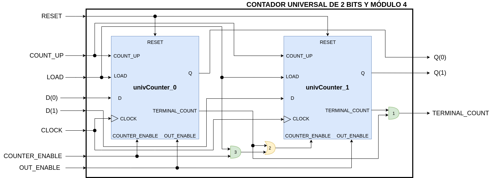

Se puede apreciar como las entradas *RESET*, *COUNT_UP*, *LOAD*, *CLOCK* y *OUT_ENABLE* del contador implementado (*top-level*) son solidarias a los contadores internos. La entrada *D(0)* y la salida *Q(0)* se conectan a *univCounter_0* porque este almacena el bit 0 (menos significativo) de la cuenta. El mismo razonamiento aplica a *D(1)*, *Q(1)* y *univCounter_1*, siendo este el que almacena el bit 1 de la cuenta.

La compuerta AND 1 se conecta para que la salida *TERMINAL_COUNT* del *top-level* se ponga en alto cuando se alcance el valor binario 00 o 11 en la cuenta, según si es descendente o ascendente. En otras palabras, dicha salida se pone en alto solo cuando la salida *TERMINAL_COUNT* de cada contador está en alto.

La compuerta OR 2 se usa para ampliar la cuenta del *univCounter_0* con la del *univCounter_1* ya que permite que suceda aritméticamente un *carry* o *borrow*. Esto se da cuando *univCounter_0* llega a su cuenta límite y pone su salida *TERMINAL_COUNT* en alto, habilitando así al contador *univCounter_1* a que avance con su cuenta. 

La compuerta OR 2 también permite habilitar a *univCounter_1* por medio de la salida de la compuerta AND 3. Esto se usa para que al querer preconfigurar el *top-level* todos los contadores internos estén habilitados.

Como se puede apreciar, la conexión en cascada no es tan directa ya que implica la utilización de ciertas compuertas, lo cual se debe a que la entrada *LOAD* de la entidad *univCounter* depende de la entrada de habilitación *counterEnable_in*. Si esto no fuese así se podría prescindir de las compuertas OR 2 y AND 3, aunque la AND 1 seguiría siendo necesaria.  

#### 7.2.1. VHDL

Como la inclusión de paquetes y la declaración de la **entidad** son prácticamente iguales que las de los dos primeros *testbenches* antes vistos, se analiza directamente la **arquitectura**. Su parte declarativa también es muy similar a la de dichos *testbenches*, aunque existen algunas diferencias. En primer lugar, las constantes **TESTED_MODULUS** y **TESTED_NBITS** ahora valen 4 y 2, respectivamente. Además, se declaran las constantes **TESTED_MODULUS_EACH_COUNTER** y **TESTED_NBITS_EACH_COUNTER** que se inicializan con el módulo y cantidad de bits de cada contador interno, respectivamente.

```vhdl
...
--Declaración de constantes.
constant TESTED_NBITS_EACH_COUNTER   : integer := 1;
constant TESTED_MODULUS_EACH_COUNTER : integer := 2;
constant TESTED_NBITS                : integer := 2;
constant TESTED_MODULUS              : integer := 4;
...
```

En segundo y último lugar, como en el *testbench* se conectarán los contadores internos, se declaran las señales internas **test_interTerminalCount0_s**, **test_interTerminalCount1_s** y **test_interCounterEnable1_s** para realizar las interconexiones entre dichos contadores e implementar las compuertas lógicas necesarias. Por otro lado, la constante **DATA_IN_COUNTER** ahora se inicializa con el valor decimal 3, que en binario es 11.

```vhdl
...
--Declaración de señales para interconexiones entre contadores internos.
signal test_interTerminalCount0_s : std_logic;
signal test_interTerminalCount1_s : std_logic;
signal test_interCounterEnable1_s : std_logic;
...
--Declaración de una constante como estímulo de entrada para precargar el
--contador completo en tres.
constant DATA_IN_COUNTER : std_logic_vector := "11";
...
```

Finalizada la parte declarativa de la arquitectura, se continúa con su **descripción principal**. Esta de nuevo es muy parecida a la de los dos primeros *testbenches*, aunque tiene ciertas particularidades. Primero, en vez de un contador se instancian dos llamados **univCounter_0** y **univCounter_1**, donde se les conectan las señales y se les asignan valores a sus *generics* según corresponda. 

```vhdl
...
--Instanciación de los contadores internos.
univCounter_0 : univCounter
    generic map ( nBits           => TESTED_NBITS_EACH_COUNTER,
                  modulus         => TESTED_MODULUS_EACH_COUNTER,
                  risingEdgeClock => TRUE)
    port map ( d_in              => test_d_cnt_s(TESTED_NBITS-2 downto TESTED_NBITS-2),
               clock_in          => test_clock_s,
               outEnable_in      => test_outEnable_s,
               reset_in          => test_reset_s,
               counterEnable_in  => test_counterEnable_s,
               load_in           => test_load_s,
               countUp_in        => test_countUp_s,
               q_out             => test_q_cnt_s(TESTED_NBITS-2 downto TESTED_NBITS-2),
               terminalCount_out => test_interTerminalCount0_s);

univCounter_1 : univCounter
    generic map ( nBits           => TESTED_NBITS_EACH_COUNTER,
                  modulus         => TESTED_MODULUS_EACH_COUNTER,
                  risingEdgeClock => TRUE)
    port map ( d_in              => test_d_cnt_s(TESTED_NBITS-1 downto TESTED_NBITS-1),
               clock_in          => test_clock_s,
               outEnable_in      => test_outEnable_s,
               reset_in          => test_reset_s,
               counterEnable_in  => test_interCounterEnable1_s,
               load_in           => test_load_s,
               countUp_in        => test_countUp_s,
               q_out             => test_q_cnt_s(TESTED_NBITS-1 downto TESTED_NBITS-1),
               terminalCount_out => test_interTerminalCount1_s);
...
```

En segundo y último lugar, se realizan las interconexiones internas restantes donde es requerido implementar las compuertas lógicas vistas en el diagrama esquemático.

```vhdl
...
--Interconexiones entre contadores internos.
test_interCounterEnable1_s <= test_interTerminalCount0_s or
                              (test_load_s and test_counterEnable_s);

test_terminalCount_s <= test_interTerminalCount0_s and
                        test_interTerminalCount1_s;
...
```

[Aquí](VHDL/univCounter_tb_cascade.vhdl) podrá ver todo el código del *testbench* en VHDL.

Una vez hecho el *testbench* se realiza la simulación utilizando el *toolchain* correspondiente.

#### 7.2.2. Resultados

Al simular mediante el entorno recomendado **aparecen nuevamente *warnings*** por la misma razón que en los *testbenches* anteriores. Recordar que no hace falta modificar el código para quitar dichas advertencias.

A continuación se muestran las imágenes de las formas de onda visualizadas con GTKWave para el *testbench*. Primeramente, se ve la imagen de toda la simulación, donde se usaron marcadores para identificar las partes principales ya mencionadas en los comentarios del *testbench*:


Haciendo zoom en cada una de dichas partes, se aprecia en primer medida el ***reset* inicial** que dura hasta el marcador **Conteo ascendente**. 

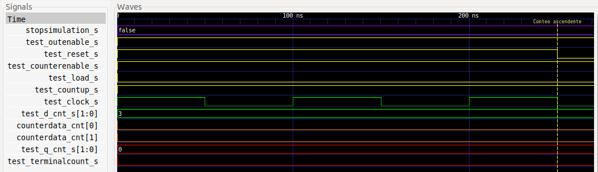

Esta etapa consiste en habilitar tanto la salida como el contador (*test_outEnable_s* y *test_counterEnable_s* en 1), no hacer una carga paralela (*test_load_s* en 0), configurar el conteo en ascendente (*test_countUp_s* en 1) y activar el reset (*test_reset_s* en 1) durante dos períodos y medio de *clock*. La entrada *test_d_cnt_s* permanece en todo momento con el valor decimal 3.

Se observa como la salida *test_q_cnt_s* y los bit 0 y 1 de la cuenta interna *counterData_cnt* se ponen en 0 mientras dura el reinicio. La salida *test_terminalCount_s* permanece en 0 porque el conteo es ascendente y no se alcanzó la cuenta máxima C<sub>max</sub>, que es 3 en este caso.

Continuando con la simulación se encuentra la parte de **cuenta ascendente**, que va desde la marca **Conteo ascendente** hasta **Carga y conteo descendente**. 


En esta parte la salida y el contador están habilitados, y el *reset* y la carga paralela están desactivados. Se dejan pasar 5 períodos de *clock* para verificar que se cuente correctamente en forma ascendente. Se puede ver que esto se verifica ya que la cuenta va de 0 a 3, incrementándose de a 1 con cada flanco ascendente de *clock*. 

Mientras está en 3 la salida *test_terminalCount_s* se pone en 1 dado que se está en la cuenta máxima. Con el próximo flanco ascendente de *clock* la cuenta se reinicia en 0 y la salida *test_terminalCount_s* se pone en 0, lo cual es correcto. Finalmente, el contador cuenta un último pulso y la cuenta pasa a valer 1.

La siguiente parte de la simulación va desde la marca **Carga y conteo descendente** a **Deshabilitación y reinicio**. 


En esta primero se hace una carga paralela del valor 3 presente en la entrada *test_d_cnt_s*. Para esto se pone la entrada *test_load_s* en alto durante un período de *clock* para efectivizar la carga con un flanco ascendente. Además, se configura el conteo como descendente (*test_countUp_s* en 0). Seguidamente, se dejan pasar 3 períodos de *clock* para verificar que se cuente correctamente en forma decreciente.

Como la cuenta pasa de 3 a 0, con decrementos de uno en uno, la cuenta decreciente funciona bien hasta aquí. Al llegar a 0, la salida *test_terminalCount_s* se pone en 1 ya que la cuenta es decreciente. Entonces luego se deshabilita el contador (*test_counterEnable_s* en 0) durante 1 período de *clock*, verificando que la salida *test_terminalCount_s* se pone en 0 y no se avanza con la cuenta durante esta condición. Luego se rehabilita el contador y la salida *test_terminalCount_s* vuelve a valer 1. Finalmente, con el próximo flanco ascendente de *clock* la cuenta se reinicia en 3 (C<sub>max</sub>).

La siguiente sección de la simulación va desde la marca **Deshabilitación y reinicio** a **Deshabilitación de la salida**. 

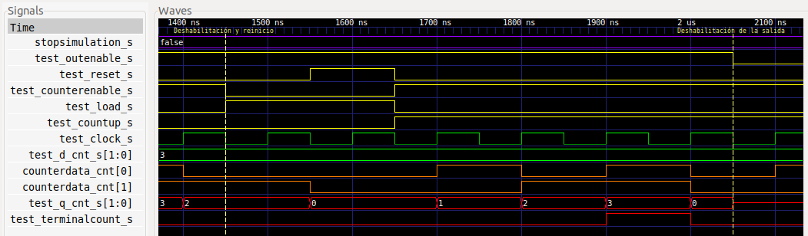

Aquí se intenta primero preconfigurar el contador (*test_load_s* en 1) cuando este está deshabilitado (*test_counterEnable_s* en 0). Se aprecia como esto no se logra e incluso la cuenta *test_q_cnt_s* no avanza, todo debido a la deshabilitación. Luego se reinicia el contador (*test_reset_s* en 1) durante 1 período de *clock*. Como *test_reset_s* es una entrada asincrónica, la cuenta interna *counterData_cnt* y la salida *test_q_cnt_s* se ponen en 0 desde el momento en que dicha entrada se pone en alto. Además, como es la entrada con la segunda mayor jerarquía, tiene efecto independientemente de que se deshabilite el contador (*test_counterEnable_s* en 0) y/o se lo intente preconfigurar (*test_load_s* en 1). 

Seguidamente, las entradas *test_reset_s*, *test_counterEnable_s* y *test_load_s* vuelven a su estado anterior y se configura el conteo en ascendente (*test_countUp_s* en 1). Se dejan pasar 4 períodos de *clock* para verificar que se cuente correctamente, yendo el conteo desde 0 a 3 y reiniciándose luego en 0 con el último flanco ascendente de *clock*. 

En la última sección de la simulación **se ensaya la habilitación de la salida y su mayor jerarquía**, abarcando desde la marca **Deshabilitación de la salida**.

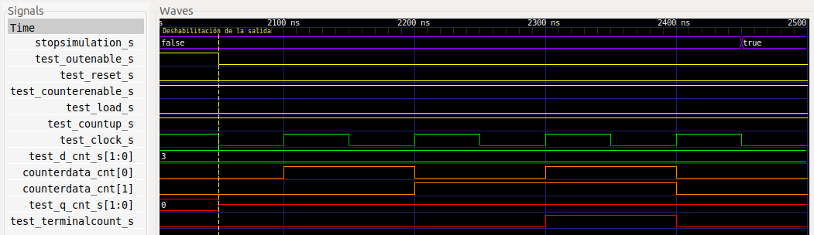

Se aprecia que el reset y la carga paralela están desactivados, el contador está habilitado y el conteo está configurado en ascendente. Entonces, se pone la entrada *test_outEnable_s* en 0, de forma que se deshabilita la salida *test_q_cnt_s* poniéndola en alta impedancia. De todas formas, el contador continua funcionando internamente ya que se aprecia como la cuenta *counterData_cnt* se incrementa a medida que suceden flancos ascendentes de *clock*. La salida *test_terminalCount_s* también continua operando, pudiendo apreciar que se pone en 1 cuando la cuenta alcanza el valor 3. 

---

Se observa en el *testbench* como las salidas del contador cumplen con el comportamiento deseado, **quedando así verificado el diseño de un contador universal de 2 bits y módulo 4 construido por la conexión en cascada de dos contadores universales más pequeños**.

## 8. Referencias

[^1]: R. J. Tocci, N. S. Widmer y G. L. Moss, "Sistemas Digitales: Principios y Aplicaciones". 10.<sup>a</sup> edición. México: Pearson Educación de México, 2007.
[^2]: "ULN2803A Darlington Transistor Arrays", Texas Instruments, datasheet SLRS049H, february 1997–revised february 2017.
