# REGISTRO DE ENTRADA PARALELA Y SALIDA PARALELA

[[_TOC_]]

## 1. Descripción

En el presente ejemplo se desarrolla un registro de entrada paralela y salida paralela o PIPO (***P**arallel **I**nput, **P**arallel **O**utput*) por su sigla en inglés. Este es un dispositivo elemental y ampliamente utilizado en desarrollos digitales, y permitirá practicar en el diseño y prueba de circuitos secuenciales con HDL.

Un registro PIPO es un **dispositivo secuencial sincrónico que permite almacenar una cierta cantidad de bits en forma paralela**. Para hacer esto, el registro copia en su salida el valor de la entrada cuando sucede un cierto flanco de reloj (o *clock* en inglés), diferenciándose así de otros registros como el SISO, PISO y SIPO donde se necesitan más de un pulso de reloj para tener el dato de entrada en la salida. Para entender su funcionamiento, a continuación se presenta el diagrama de un registro PIPO básico, con **n** bits de entrada y salida, una entrada de clock y otra entrada asincrónica de reinicio (o *reset* en inglés). También se muestra la tabla de verdad para el caso puntual en que **n** es igual a 2.

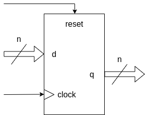


Se aprecian 2 estados principales:
1. Cuando la entrada **reset** está en nivel alto (estado lógico 1), la salida **q** se pone toda en 0 independientemente de las entradas de datos **d** y de **clock**. Esto se debe a que la entrada de reinicio es asincrónica y la de mayor jerarquía.
2. Cuando el **reset** está desactivado (estado lógico 0), "la salida **q** copia a la entrada **d**" solo cuando se presenta un flanco ascendente de **clock**. Si en la entrada de reloj hay un flanco descendente o un nivel constante de 0 o 1, la salida **q** no cambia y se mantiene en el estado en el que está (**q<sub>0</sub>**).

La entrada de **reset** permite llevar al registro a un estado conocido, lo que usualmente se usa al momento de encender el dispositivo ya que ahí puede presentar cualquier estado posible.

Internamente, el registro se construye con varios ***Flip-Flops*** (FF), donde las entradas de clock y reset del PIPO se conectan a todas las entradas de reloj y reinicio de los FF, y la entrada y salida de datos del PIPO se componen de la entrada y salida de cada FF, respectivamente. Por ejemplo, para el caso visto de un registro de 2 bits, este se puede construir con 2 *Flip-Flop* D como se observa a continuación: 


---

Para este ejemplo, se desarrolla un registro PIPO versátil, y más completo y genérico que el de diseño básico visto hasta ahora. El registro tendrá:

- Entrada y salida de datos con **cantidad de bits configurable** con un *generic*.
- Activación por **flanco de clock modificable** por medio de un *generic*.
- Entrada asincrónica de **habilitación de salida** que permita o no poner la salida en alta impedancia. La línea encargada de esto se llamará **outEnable**.
- Entrada asincrónica de reset.
- Entrada de clock.
- Entrada de **habilitación de clock**, llamada **clockEnable**, que permita habilitar o no el funcionamiento del registro.

El diagrama de este diseño y una tabla de verdad para el caso particular en que la cantidad de bits **n** es 2 se muestran seguidamente:

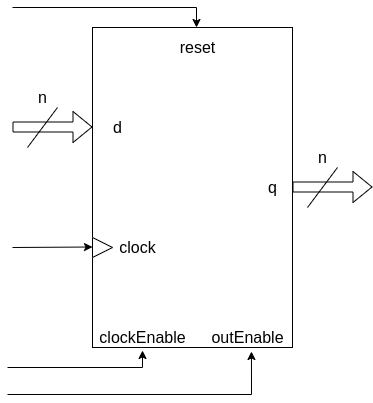


Se aprecian 4 estados principales:
1. Cuando la entrada de **outEnable** está en nivel bajo (estado lógico 0), la salida **q** se pone en alta impedancia (Z) independientemente de las otras entradas, por lo que se puede decir que "está deshabilitada". Esto se debe a que **outEnable** es una entrada asincrónica y tiene la mayor jerarquía.
2. Con la salida habilitada y el **reset** activado, la salida **q** se pone en 0 independientemente de las otras entradas. Se aprecia así como la entrada de reinicio es asincrónica y la segunda en jerarquía. 
3. Con la salida habilitada, el registro activado (**clockEnable** en 1) y el **reset** desactivado, "la salida **q** copia a la entrada **d**" solo cuando se presenta un flanco ascendente de reloj. Si se presenta un flanco descendente o un nivel constante de 0 o 1, la salida se mantiene en su estado **q<sub>0</sub>**.
4. Con la salida habilitada y el **reset** desactivado, la salida **q** se mantiene en su estado **q<sub>0</sub>** si el registro está deshabilitado (**clockEnable** en 0).

## 2. Código

### 2.1. VHDL

Primero se incluyen los paquetes necesarios, que en este caso es solo el *std_logic_1164* para usar los tipos de datos **std_logic** y **std_logic_vector**.

```vhdl
--Inclusión de paquetes.
library ieee;                --Biblioteca estándar IEEE.
use ieee.std_logic_1164.all; --Paquete para std_logic y std_logic_vector.
```

Luego, se declara la **entidad** del registro. Esta tiene las entradas y salidas ya mencionadas, y los *generics* **nBits** y **risingEdgeClock** permiten configurar la cantidad de bits de entrada y salida y el flanco de clock por el que se activa el registro, respectivamente.

```vhdl
--Declaración de la entidad.
entity regPIPO is
    generic(
            nBits           : integer := 8;
            risingEdgeClock : BOOLEAN := TRUE);
    port(
        d_in           : in  std_logic_vector(nBits-1 downto 0);
        reset_in       : in  std_logic;
        outEnable_in   : in  std_logic;
        clock_in       : in  std_logic;
        clockEnable_in : in  std_logic;
        q_out          : out std_logic_vector(nBits-1 downto 0));
end entity regPIPO;
```
Finalmente, se declara la **arquitectura** del registro. Como se desea que el registro siga funcionando internamente aunque su salida **q_out** esté deshabilitada, se declara la señal **parallelData_reg** que guarda la entrada **d_in** cuando sucede cierto flanco de clock.

```vhdl
--Declaración de la arquitectura.
architecture regPIPO_arch of regPIPO is
    --Señal auxiliar que almacena la información de salida del registro
    --suponiendo la salida habilitada.
    signal parallelData_reg : std_logic_vector(nBits-1 downto 0);
begin
```
Entonces, si la salida **q_out** está habilitada va a copiar a la señal **parallelData_reg**, de lo contario se pone en alta impedancia (Z).

```vhdl
--Declaración de la arquitectura.
architecture regPIPO_arch of regPIPO is
    --Señal auxiliar que almacena la información de salida del registro
    --suponiendo la salida habilitada.
    signal parallelData_reg : std_logic_vector(nBits-1 downto 0);
begin
    --Asignación de la salida. El control de salida es asincrónico.
    q_out <= (others =>'Z') when outEnable_in = '0' else
             parallelData_reg;
```
Finalmente, como el flanco de clock que activa al registro es modificable, se utilizan estructuras de generación condicional con la sentencia *generate* y que se llaman **risingEdgeRegister** y **fallingEdgeRegister**. Estas permiten que solo se genere la lógica correspondiente al flanco ascendente o descendente, respectivamente, según el valor del *generic* **risingEdgeClock**. 

Dentro de cada estructura hay un proceso: **risingEdgeRegisterData** para la de flanco ascendente y **fallingEdgeRegisterData** para la de flanco descendente. Se usa un *process* para describir el comportamiento del registro porque este es un circuito secuencial. Su lista de sensibilidad solo tendrá la entrada de reloj **clock_in** y la entrada asincrónica de reinicio **reset_in**; y en su interior se hace el reinicio del registro y el copiado de **d_in** en **parallelData_reg** cuando suceda cierto flanco de clock y el dispositivo esté habilitado.

```vhdl
--Declaración de la arquitectura.
architecture regPIPO_arch of regPIPO is
    --Señal auxiliar que almacena la información de salida del registro
    --suponiendo la salida habilitada.
    signal parallelData_reg : std_logic_vector(nBits-1 downto 0);
begin
    --Generación de un registro PIPO activado por flanco ascendente.
    risingEdgeRegister : if (risingEdgeClock = TRUE) generate
        --Proceso para cambiar el dato interno del registro según sus entradas.
        risingEdgeRegisterData : process(clock_in, reset_in)
        begin
            if(reset_in = '1') then  --El reset es asincrónico.
                parallelData_reg <= (others => '0');
            elsif((rising_edge(clock_in)) and (clockEnable_in = '1')) then
                parallelData_reg <= d_in;
            end if;
        end process risingEdgeRegisterData;
    end generate risingEdgeRegister;

    --Generación de un registro PIPO activado por flanco descendente.
    fallingEdgeRegister : if (risingEdgeClock = FALSE) generate
        --Proceso para cambiar el dato interno del registro según sus entradas.
        fallingEdgeRegisterData : process(clock_in, reset_in)
        begin
            if(reset_in = '1') then  --El reset es asincrónico.
                parallelData_reg <= (others => '0');
            elsif((falling_edge(clock_in)) and (clockEnable_in = '1')) then
                parallelData_reg <= d_in;
            end if;
        end process fallingEdgeRegisterData;
    end generate fallingEdgeRegister;

    --Asignación de la salida. El control de salida es asincrónico.
    q_out <= (others =>'Z') when outEnable_in = '0' else
             parallelData_reg;
end architecture regPIPO_arch;
```
Para ver todo el **código** del módulo en VHDL, ir [aquí](VHDL/regPIPO.vhdl)

## 3. Simulación

### 3.1. *Testbenches* en VHDL

Debido a la cantidad de entradas del registro, desarrollar *testbenches* exhaustivos implicaría analizar todos los estados posibles de las entradas y salidas, lo que complejizaría excesivamente las pruebas. Por lo tanto, en esta ocasión se diseñan dos *testbenches* para examinar los estados más importantes del dispositivo y **probar así sus principales características**: 

1. Almacenamiento de datos.
2. Reinicio.
3. Habilitación de salida. 
4. Habilitación del registro.

Ambos *testbenches* son prácticamente iguales, diferenciándose en cual flanco de clock activa al registro por medio del valor del genérico **risingEdgeClock** mapeado. 

Respecto al código de los *testbenches*, se menciona primero la declaración de las constantes **TESTED_NBITS** y **PERIOD**, las cuales se utilizan para configurar la cantidad de bits del registro y el período de clock utilizado para probar el diseño, respectivamente. En este caso, el dispositivo tendrá **4 bits** para buscar un punto de equilibrio entre la complejidad de los ensayos y la del dispositivo implementado, y también para poder probar todos los valores posibles de **d_in** (que son **16** por **2<sup>nBits</sup> = 2<sup>4</sup>**) sin que esto implique una simulación tan extensa.

Además, se declaran distintas señales de estímulo y monitoreo del registro y una última para detener la simulación. 

```vhdl
--Declaración de constantes.
constant TESTED_NBITS : integer := 4;
constant PERIOD       : time    := 100 ns;

--Declaración de estímulos y señal de monitoreo.
--Entradas al registro.
signal test_d_reg_s       : std_logic_vector(TESTED_NBITS-1 downto 0);
signal test_reset_s       : std_logic;
signal test_outEnable_s   : std_logic;
signal test_clock_s       : std_logic;
signal test_clockEnable_s : std_logic;

--Salidas al registro.
signal test_q_reg_s	: std_logic_vector(TESTED_NBITS-1 downto 0);

--Señal auxiliar para detener la simulación (por defecto es FALSE).
signal stopSimulation_s : BOOLEAN := FALSE;
```
En segundo lugar, se menciona que se declara un *procedure* llamado **LoadRegisterData_proc** que permite aplicar datos de entrada en el registro. Según sus argumentos, el procedimiento aplica secuencialmente en la entrada **test_d_reg_proc_s** del registro desde el valor 0 hasta el 2<sup>**NBITS_PROC**</sup> -1, con un clock de período **PERIOD_PROC**. Esto hace que el código sea más legible, modular y reutilizable. 

```vhdl
--Procedimiento para cargar en la entrada del registro los estímulos.
procedure LoadRegisterData_proc(
    signal   test_d_reg_proc_s : out std_logic_vector;
    constant NBITS_PROC        : in  integer;
    constant PERIOD_PROC       : in  time
) is
begin
    applyInputData: for i in 0 to ((2**NBITS_PROC) - 1) loop
        test_d_reg_proc_s <= std_logic_vector(to_unsigned(i, NBITS_PROC));
        wait for PERIOD_PROC;
    end loop applyInputData;
end procedure LoadRegisterData_proc;
```

Finalmente, se destacan los dos *process* utilizados. El primero, llamado **clockGeneration**, se utiliza para generar la señal de clock de período **PERIOD**.

```vhdl
--Proceso de generación de clock.
clockGeneration : process
begin
    test_clock_s <= '1';
    wait for PERIOD/2;
    test_clock_s <= '0';
    wait for PERIOD/2;
    if (stopSimulation_s = TRUE) then
        wait;
    end if;
end process clockGeneration;
```
El segundo *process*, llamado **applyStimulus**, se usa para aplicar secuencialmente los estímulos de entrada, para lo cual se llama en varias ocasiones a **LoadRegisterData_proc**. Los datos de entrada se cambian en el flanco contrario al que usa el registro para activarse, con el fin de tener mayor claridad en la interpretación de las señales.

```vhdl
--Proceso de aplicación de estímulos.
applyStimulus : process
begin
    --Estado inicial: dato de entrada todo en 0 y salida y clock
    --habilitados.
    test_d_reg_s       <= (others => '0');
    test_outEnable_s   <= '1';
    test_clockEnable_s <= '1';
    stopSimulation_s   <= FALSE;

    --Reset inicial.
    test_reset_s <= '1';
    wait for 2*PERIOD; --El reset dura dos periodos de clock.
    test_reset_s <= '0';

    --Se agrega un desfasaje temporal inicial.
    wait for PERIOD/2;

    --Se aplican los estímulos en la entrada de datos del registro. Luego
    --se espera un período para poder apreciar facilmente en la simulación
    --el último dato de salida.
    LoadRegisterData_proc(test_d_reg_s, TESTED_NBITS, PERIOD);
    wait for PERIOD;

    --Se hace un reset para poner la salida en cero y luego se reaplican los
    --estímulos en la entrada de datos. Aquí se prueba el funcionamiento,
    --asincronía y mayor jerarquía de la entrada de reset.
    test_reset_s <= '1';
    LoadRegisterData_proc(test_d_reg_s, TESTED_NBITS, PERIOD);
    test_reset_s <= '0';

    --Se deshabilita la salida del registro y luego se reaplican los
    --estímulos en la entrada de datos. Aquí se prueba el funcionamiento, la
    --asincronía y más alta jerarquía de la entrada de habilitación de la
    --salida.
    test_outEnable_s <= '0';
    LoadRegisterData_proc(test_d_reg_s, TESTED_NBITS, PERIOD);
    test_outEnable_s <= '1';

    --Se deshabilita el clock del registro y luego se reaplican los
    --estímulos en la entrada de datos. Aquí se prueba el funcionamiento de
    --dicha entrada de control.
    test_clockEnable_s <= '0';
    LoadRegisterData_proc(test_d_reg_s, TESTED_NBITS, PERIOD);

    --Se detiene la simulación.
    stopSimulation_s <= TRUE;
    wait;
end process applyStimulus;
```

[Aquí](VHDL/regPIPO_tb_risingEdge.vhdl) podrá ver todo el código del *testbench* en VHDL donde el registro se activa por flanco ascendente, y [aquí](VHDL/regPIPO_tb_fallingEdge.vhdl) cuando lo hace por flanco descendente.

Una vez hechos los *testbenches*, se realizan las simulaciones utilizando el *toolchain* correspondiente. Para más información, ver la [sección 6](#6-información-adicional-uso-de-herramientas) del presente documento.

### 3.2. Resultados

A continuación, se muestran las imágenes de las formas de onda visualizadas con GTKWave para cada uno de los *testbenches*.

#### 3.2.1. Activación por flanco ascendente

Primero se ve la imagen de toda la simulación, donde se usaron marcadores para identificar las partes principales ya mencionadas en los comentarios del *testbench*:

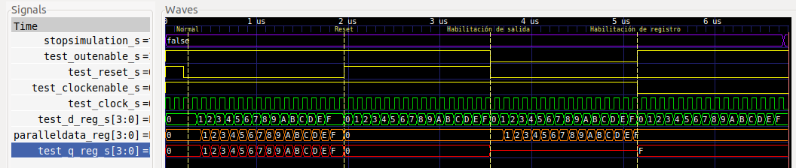

Haciendo zoom en cada una de dichas partes, se aprecia en primer medida el **reset inicial** que dura hasta el marcador **Normal**. Esta etapa consiste en habilitar tanto la salida como el registro, y activar el reset durante dos períodos de clock para luego dejar medio período de desfasaje temporal. Se observa como la salida *test_q_reg_s* y los datos paralelos internos *parallelData_reg* del registro se ponen en 0 mientras dura el reset:

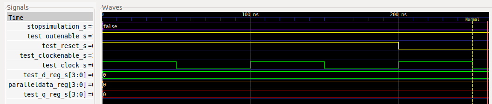

Luego está la sección de **funcionamiento normal**, que va desde la marca **Normal** hasta **Reset**. En esta parte la salida y el registro están habilitados, el reset está desactivado y se aplican todos los estímulos en la entrada. Se aprecia como la entrada *test_d_reg_s* se almacena en *parallelData_reg* en cada flanco ascendente de clock, y como este valor es copiado por la salida *test_q_reg_s* en todo momento:

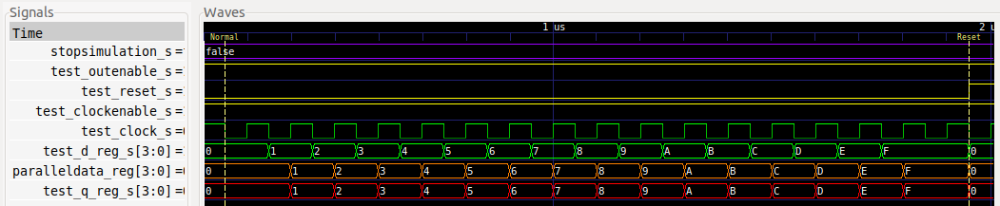

Después se encuentra la parte donde **se prueba el reset y su mayor jerarquía**, yendo desde la marca **Reset** hasta **Habilitación de salida**. En esta sección se observa como la salida *test_q_reg_s* y los datos internos *parallelData_reg* se ponen en 0 independientemente de la entrada de datos *test_d_reg_s* y la habilitación del registro *test_clockEnable_s*, debido a que el reset está activado :

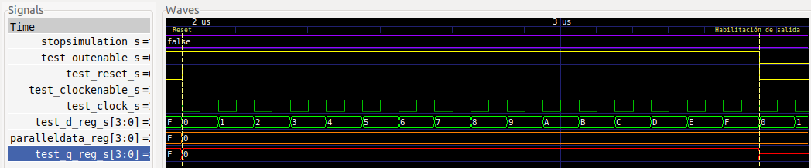

Luego, se muestra la sección donde **se ensaya la habilitación de la salida y su mayor jerarquía**, abarcando desde la marca **Habilitación de salida** hasta **Habilitación de registro**. Se aprecia que, con el reset desactivado y el registro habilitado, la salida *test_q_reg_s* se pone en alta impedancia, aunque internamente el registro continua funcionando porque en cada flanco ascendente de clock copia en *parallelData_reg* la entrada *test_d_reg_s* : 

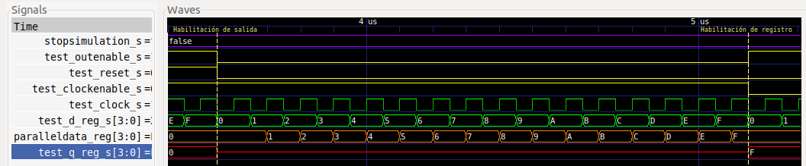

Finalmente, está la parte donde **se prueba la habilitación del registro**, que va desde la marca **Habilitación del registro**. Se observa que teniendo la salida habilitada y el reset desactivado, el registro no cambia su valor en la salida *test_q_reg_s* con los flancos ascendentes de clock ya que está deshabilitado:

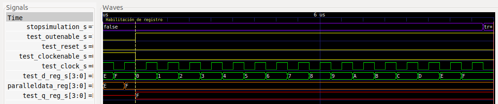

#### 3.2.2. Activación por flanco descendente

Para este caso solo se muestra la imagen de toda la simulación, donde también se usaron marcadores para identificar las partes principales:

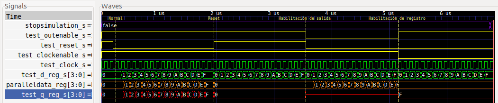

El/La lector/a podrá hacer zoom nuevamente en cada una de las partes para verlas en detalle y constatar que se cumple con lo pedido.

---

Se observa en ambos casos como la salida del registro cumple con el comportamiento deseado, quedando así verificado el diseño.

## 4. Implementación y ensayo

Para implementar el diseño en la [EDU-FPGA](https://gitlab.com/RamadrianG/wiki---fpga-para-todos/-/wikis/EDU-FPGA) se decide sintetizar el registro de 4 bits probado en la sección de simulación, para que el lector pueda pasar por todas las etapas del diseño digital con el mismo dispositivo. 

Para poder apreciar el funcionamiento del registro, se necesita bajar la frecuencia de reloj de la EDU-CIAA-FPGA, que es de 12 MHz. Por lo tanto, a la entrada **clockEnable_in** del PIPO se añade un *prescaler* (divisor de frecuencia) que permita activar el registro cada vez que pasen 12 millones de pulsos de clock. En otras palabras, el dispositivo permitirá reducir la frecuencia de trabajo del registro a 1 Hz. Se implementa este divisor de frecuencia con el [contador universal](../06-Contador_universal) desarrollado en un ejemplo anterior. Además, se utiliza un **Flip-Flop T** para que el usuario sepa cuando el registro se habilita y recibe un flanco de clock que activa su funcionamiento.

El diagrama esquemático final correspondiente al ***top-level*** es:

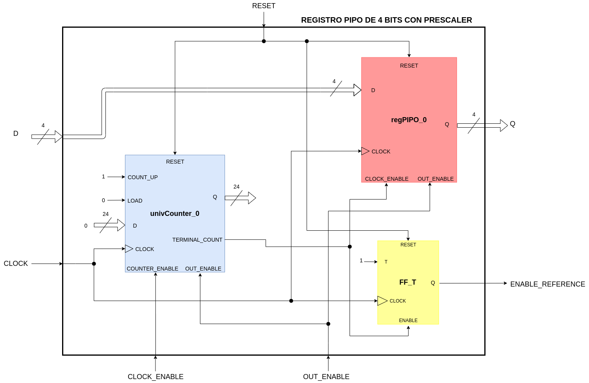

Se aprecia como el registro implementado se compone de un contador interno de 24 bits llamado **univCounter_0**, un registro PIPO de 4 bits de nombre **regPIPO_0** y un Flip-Flop T llamado **FF_T**.

Se observa como las entradas de **RESET**, **CLOCK** y **OUT_ENABLE** del top-level son solidarias a las entidades de bajo nivel. La entrada **D** y la salida **Q** se conectan directamente con las del registro interno. El contador interno se configura en cuenta creciente (*COUNT_UP* en 1) y sin posibilidad de carga paralela (*LOAD* en 0), además de que su entrada de datos *D* y salida *Q* no se usan. La entrada **CLOCK_ENABLE** del registro implementado permite habilitar el contador interno y, en conjunto con la salida *TERMINAL_COUNT* del contador, también habilita al registro **regPIPO_0** y al Flip-Flop **FF_T**.

La salida **ENABLE_REFERENCE** se agrega al top-level para que al usuario le resulte más didáctico el ensayo. Esta salida se conecta al terminal *Q* del Flip-Flop T y, como este tiene su entrada *T* en 1, cambiará de estado cada vez que el registro interno se habilite y reciba un flanco de clock que lo active. 

El contador es de **24 bits** para permitir tener un módulo igual a **12x10<sup>6</sup>** y así hacer la división de frecuencia deseada. Tener en cuenta que con esa cantidad de bits el módulo máximo es de 2<sup>24</sup>=16777216

### 4.1. Síntesis

Dado que ya se vió como se sintetiza un contador universal en un ejemplo anterior y que el Flip-Flop T es un dispositivo elemental, se explicará solo la síntesis del registro PIPO interno de 4 bits. Esta se hace con el programa *Synplify Pro* a través de *iCEcube2*.

#### 4.1.1. RTL View (alto nivel)

Este diseño es independiente de la tecnología utilizada y se compone de estructuras genéricas como registros, multiplexores, etc. A continuación, se aprecia su diagrama esquemático:


Se ve como el módulo sintetizado se compone de:
1. Un registro PIPO interno llamado **parallelData[3:0]**, el cual tiene entrada de datos **D[3:0]**, de clock **C**, de reset **R** y de habilitación de funcionamiento **E**.
2. Un *buffer tri-state* llamado **q_out_1[3:0]** que permite poner o no a la salida del registro en alta impedancia.

Se ve que este diseño concuerda con el del registro PIPO propuesto.

#### 4.1.2. Tech View (bajo nivel)

Este diseño depende de la tecnología en FPGA utilizada y está formado por **primitivas de Lattice**[^1] para el caso de la EDU-FPGA. Estas primitivas son los bloques esenciales utilizados para describir un sistema digital en este bajo nivel, siendo por ejemplo: LUTs, multiplexores, buffers E/S, etc. 

A continuación, se aprecia su diagrama esquemático:


Se ve como aparecen las siguientes primitivas:

1. **SB_IO (gris)**: Es un buffer de entrada y/o salida que se conecta a un pin de entrada y/o salida para víncular este con el interior de la FPGA y definir el comportamiento de dicho pin (si es de entrada y/o salida, si está "latcheado", etc.). Para este diseño, se tiene a *outEnable_in_ibuf*, *clockEnable_in_ibuf* y *reset_in_ibuf* como buffers para leer pines de entrada.
2. **SB_IO (violeta)**: Es un conjunto de SB_IO. En este caso se tiene a *G:d_in_ibuf[3:0]* para leer los 4 pines de datos (*d_in[3:0]*) y a *G:q_out_obuft[3:0]* para controlar los pines de salida (*q_out[3:0]*) y así poder ponerlos o no en alta impedancia (*buffer Tri-State*).
3. **SB_GB_IO**: Estos son buffers globales de alto *fanout* que se utilizan para distribuir por toda la FPGA señales de clock, reset y habilitación[^2]. En este caso, se tiene a *clock_in_ibuf_gb_io* que se usa para leer la señal de entrada de reloj.
4. **SB_DFFER**: Es un registro PIPO de 4 bits con entrada de datos, de clock, de reset y de habilitación de funcionamiento. Está compuesto internamente por 4 FF D y en el diagrama se llama *G:parallelData_reg_er[3:0]*

Entendiendo a las anteriores primitivas, se puede ver que en definitiva se trata del mismo diseño que el que se vió en alto nivel, con la diferencia del agregado de *buffers*.

### 4.2. Código de la implementación

#### 4.2.1. VHDL

Para el ***top-level***, la inclusión de paquetes y declaración de la entidad son muy similares a las de **regPIPO**. Las diferencias son que se agrega la salida **enableReference_out** y el valor por defecto del *generic* **nBits** es **4**. Esto es porque el sintetizador usa dicho valor por defecto para realizar la síntesis del circuito.

```vhdl
--Inclusión de paquetes.
library ieee;                --Biblioteca estándar ieee.
use ieee.std_logic_1164.all; --Paquete para std_logic y std_logic_vector.

--Declaración de la entidad.
entity top_regPIPO is
    generic(
            nBits           : integer := 4;
            risingEdgeClock : BOOLEAN := TRUE);
    port(
        d_in                : in  std_logic_vector(nBits-1 downto 0);
        reset_in            : in  std_logic;
        outEnable_in        : in  std_logic;
        clock_in            : in  std_logic;
        clockEnable_in      : in  std_logic;
        q_out               : out std_logic_vector(nBits-1 downto 0);
        enableReference_out : out std_logic);
end entity top_regPIPO;
```

Luego se declara la **arquitectura** del ***top-level***. Entonces, primeramente se declaran el registro y el contador internos a instanciar, constantes para guardar el valor de los *generics* **nBits** y **risingEdgeClock** del top-level, constantes para almacenar el valor de ciertos parámetros del contador interno y, por último, las señales internas que se utilizan para interconexiones.

Para el **Flip-Flop T** no se va a instanciar un módulo particular, sino que se va a hacer uso de la señal **registerEnableReference_s** y de lógica interna con un *process* para que el sintetizador termine generando dicho Flip-Flop.

<details>
  <summary> 
    <b> <mark>Hacer click aquí para mostrar u ocultar la parte declarativa de la arquitectura del top-level.
    </b> </mark>
  </summary>

```vhdl
--Declaración de la arquitectura.
architecture top_regPIPO_arch of top_regPIPO is
    --Declaración del registro PIPO interno.
    component regPIPO is
        generic (
            nBits           : integer := 8;
            risingEdgeClock : BOOLEAN := TRUE
        );
        port (
            d_in           : in  std_logic_vector(nBits-1 downto 0);
            reset_in       : in  std_logic;
            outEnable_in   : in  std_logic;
            clock_in       : in  std_logic;
            clockEnable_in : in  std_logic;
            q_out          : out std_logic_vector(nBits-1 downto 0)
        );
    end component;

    --Declaración del contador interno que se usa como prescaler.
    component univCounter is
        generic (
            nBits           : integer := 8;
            modulus         : integer := 256;
            risingEdgeClock : BOOLEAN := TRUE
        );
        port (
            d_in              : in  std_logic_vector(nBits-1 downto 0);
            clock_in          : in  std_logic;
            outEnable_in      : in  std_logic;
            reset_in          : in  std_logic;
            counterEnable_in  : in  std_logic;
            load_in           : in  std_logic;
            countUp_in        : in  std_logic;
            q_out             : out std_logic_vector(nBits-1 downto 0);
            terminalCount_out : out std_logic
        );
    end component;

    --Declaración de constantes para guardar el valor de los generics nBits y
    --risingEdgeClock del top-level.
    constant TOP_NBITS             : integer := nBits;
    constant TOP_RISING_EDGE_CLOCK : BOOLEAN := risingEdgeClock;

    --Declaración de constantes para el contador interno.
    constant COUNTER_NBITS   : integer := 24;
    constant COUNTER_MODULUS : integer := 12000000;

    --Declaración de señales internas para conexiones del registro PIPO interno.
    signal register_rst         : std_logic;
    signal register_clk         : std_logic;
    signal registerInputData_s  : std_logic_vector(nBits-1 downto 0);
    signal registerOutputData_s : std_logic_vector(nBits-1 downto 0);
    signal registerOut_ena      : std_logic;

    --Declaración de señales internas para conexiones del contador interno.
    signal counterInputData_s     : std_logic_vector(COUNTER_NBITS-1 downto 0)
                                    := (others => '0');
    signal counterLoad_ena        : std_logic := '0';
    signal counterUpCount_ena     : std_logic := '1';
    signal counterClock_ena       : std_logic;
    signal counterTerminalCount_s : std_logic;

    --Declaración de señal de 1 bit que cambia cada vez que el registro PIPO
    --interno está habilitado y recibe un flanco de clock que activa su
    --funcionamiento.
    signal registerEnableReference_s : std_logic := '0';
```
</details>

Finalmente, en la arquitectura se instancian el registro y contador internos, llamándolos **regPIPO_0** y **univCounter_0** respectivamente. Además, se desarrollan todas las interconexiones internas necesarias, teniendo en cuenta que:
- Como la salida **q_out** del contador interno no se usa, se la deja abierta (*open*).
- Debido a que en el ensayo se van a usar pulsadores con resistores pull-up como entradas al top-level, las entradas **d_in** y **reset_in** de éste se niegan internamente para contrarrestar el efecto de dichos resistores. Esto se verá con más detalle en la [sección 4.3. Circuito externo y asignación de pines](#43-circuito-externo-y-asignación-de-pines).

Para implementar la lógica que permite sintetizar un Flip-Flop T se hace uso de dos estructuras de generación condicional: **risingEdgeFlipFlopT** y **fallingEdgeFlipFlopT**. Estas generan la lógica del Flip-Flop según como esté configurada la activación por flanco del clock. Internamente cada una tiene un proceso: **getEnableReferenceRisingEdge** para la primera y **getEnableReferenceFallingEdge** para la segunda.

<details>
  <summary>
    <b> <mark>Hacer click aquí para mostrar u ocultar la arquitectura completa del top-level.
    </b> </mark>
  </summary>

```vhdl
--Declaración de la arquitectura.
architecture top_regPIPO_arch of top_regPIPO is
    --Declaración del registro PIPO interno.
    component regPIPO is
        generic (
            nBits           : integer := 8;
            risingEdgeClock : BOOLEAN := TRUE
        );
        port (
            d_in           : in  std_logic_vector(nBits-1 downto 0);
            reset_in       : in  std_logic;
            outEnable_in   : in  std_logic;
            clock_in       : in  std_logic;
            clockEnable_in : in  std_logic;
            q_out          : out std_logic_vector(nBits-1 downto 0)
        );
    end component;

    --Declaración del contador interno que se usa como prescaler.
    component univCounter is
        generic (
            nBits           : integer := 8;
            modulus         : integer := 256;
            risingEdgeClock : BOOLEAN := TRUE
        );
        port (
            d_in              : in  std_logic_vector(nBits-1 downto 0);
            clock_in          : in  std_logic;
            outEnable_in      : in  std_logic;
            reset_in          : in  std_logic;
            counterEnable_in  : in  std_logic;
            load_in           : in  std_logic;
            countUp_in        : in  std_logic;
            q_out             : out std_logic_vector(nBits-1 downto 0);
            terminalCount_out : out std_logic
        );
    end component;

    --Declaración de constantes para guardar el valor de los generics nBits y
    --risingEdgeClock del top-level.
    constant TOP_NBITS             : integer := nBits;
    constant TOP_RISING_EDGE_CLOCK : BOOLEAN := risingEdgeClock;

    --Declaración de constantes para el contador interno.
    constant COUNTER_NBITS   : integer := 24;
    constant COUNTER_MODULUS : integer := 12000000;

    --Declaración de señales internas para conexiones del registro PIPO interno.
    signal register_rst         : std_logic;
    signal register_clk         : std_logic;
    signal registerInputData_s  : std_logic_vector(nBits-1 downto 0);
    signal registerOutputData_s : std_logic_vector(nBits-1 downto 0);
    signal registerOut_ena      : std_logic;

    --Declaración de señales internas para conexiones del contador interno.
    signal counterInputData_s     : std_logic_vector(COUNTER_NBITS-1 downto 0)
                                    := (others => '0');
    signal counterLoad_ena        : std_logic := '0';
    signal counterUpCount_ena     : std_logic := '1';
    signal counterClock_ena       : std_logic;
    signal counterTerminalCount_s : std_logic;

    --Declaración de señal de 1 bit que cambia cada vez que el registro PIPO
    --interno está habilitado y recibe un flanco de clock que activa su
    --funcionamiento.
    signal registerEnableReference_s : std_logic := '0';

begin
    --Instanciación del registro PIPO interno.
    regPIPO_0 : regPIPO
        generic map ( nBits           => TOP_NBITS,
                      risingEdgeClock => TOP_RISING_EDGE_CLOCK)
        port map ( d_in           => registerInputData_s,
                   reset_in       => register_rst,
                   outEnable_in   => registerOut_ena,
                   clock_in       => register_clk,
                   clockEnable_in => counterTerminalCount_s,
                   q_out          => registerOutputData_s);

    --Instanciación del contador interno que se usa como prescaler. La entrada
    --d_in se conecta a 0 por medio de la señal counterInputData_s ya que no
    --la usa. La salida q_out se deja abierta porque no se la utilza tampoco.
    univCounter_0 : univCounter
        generic map ( nBits           => COUNTER_NBITS,
                      modulus         => COUNTER_MODULUS,
                      risingEdgeClock => TOP_RISING_EDGE_CLOCK)
        port map ( d_in              => counterInputData_s,
                   clock_in          => register_clk,
                   outEnable_in      => registerOut_ena,
                   reset_in          => register_rst,
                   counterEnable_in  => counterClock_ena,
                   load_in           => counterLoad_ena,
                   countUp_in        => counterUpCount_ena,
                   q_out             => open,
                   terminalCount_out => counterTerminalCount_s);

    --Se hacen las conexiones internas.
    registerInputData_s <= not d_in;
    register_clk        <= clock_in;
    register_rst        <= not reset_in;
    registerOut_ena     <= outEnable_in;
    counterClock_ena    <= clockEnable_in;
    q_out               <= registerOutputData_s;
    enableReference_out <= registerEnableReference_s;

    --Generación de Flip Flop T según el flanco de activación configurado. Tanto
    --el proceso getEnableReferenceRisingEdge como getEnableReferenceFallingEdge
    --permiten cambiar el estado de la señal registerEnableReference_s cuando
    --el registro PIPO interno está habilitado y recibe un flanco de clock que
    --activa su funcionamiento. La señal se comporta como la salida de un
    --Flip Flop T.
    risingEdgeFlipFlopT : if (risingEdgeClock = TRUE) generate
        getEnableReferenceRisingEdge : process (clock_in)
        begin
            if( (rising_edge(clock_in)) and
                (counterTerminalCount_s = '1')) then
                registerEnableReference_s <= not registerEnableReference_s;
            end if;
        end process getEnableReferenceRisingEdge;
    end generate risingEdgeFlipFlopT;

    fallingEdgeFlipFlopT : if (risingEdgeClock = FALSE) generate
        getEnableReferenceFallingEdge : process (clock_in)
        begin
            if( (falling_edge(clock_in)) and
                (counterTerminalCount_s = '1')) then
                registerEnableReference_s <= not registerEnableReference_s;
            end if;
        end process getEnableReferenceFallingEdge;
    end generate fallingEdgeFlipFlopT;
end architecture top_regPIPO_arch;
```
</details>

Para ver el archivo **.vhdl** completo ***top-level***, ir [aquí](VHDL/top_regPIPO.vhdl)

### 4.3. Circuito externo y asignación de pines

Para esta implementación, se utilizan los **4 pulsadores embebidos** en la placa más **3 pulsadores externos conectados a pines GPIO** como entradas, y los **4 LED embebidos** más **1 LED externo conectado a un pin GPIO** como salidas. Para poder encender este LED externo se utiliza un **IC driver ULN2803A**[^3], debido a que los pines GPIO como salidas solo pueden proveer como máximo 6 mA.

El circuito a conectar con la EDU-CIAA-FPGA es: 

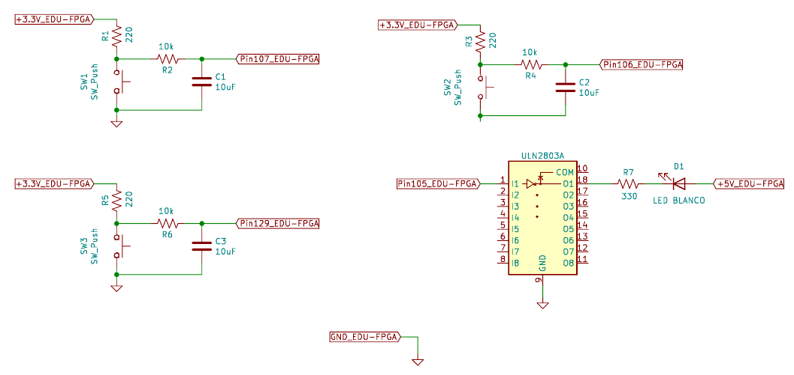

Cada pulsador está acompañado de un resistor *pull-up* y un circuito antirrebote (*debounce*) compuesto por un circuito serie RC (Resistor-Capacitor). A causa de los resistores pull-up, cuando los pulsadores no estén presionados transferirán un 1 a los pines de entrada, mientras que transferirán un 0 si se los pulsa. Esto es conveniente para las entradas **outEnable_in** y **clockEnable_in** ya que no se deben mantener presionados sus pulsadores constantemente para habilitar la salida y el clock del registro. Sin embargo, no es adecuado para las entradas **d_in** y **reset_in** porque implica trabajar con **lógica negativa** para **d_in** y que el registro esté reseteado en todo momento a menos que se pulse un interruptor. Por lo tanto, dentro del top-level se invierten estas dos entradas para contrarrestar el efecto de los resistores pull-up.

La asignación de pines de la EDU-CIAA-FPGA es:

|      **Componente**        |   **Pin FPGA**    | **Pin registro top-level** |
|:--------------------------:|:-----------------:|:--------------------------:|
| Pulsador embebido 1        |       31          |   d_in(3)                  |
| Pulsador embebido 2        |       32          |   d_in(2)                  |
| Pulsador embebido 3        |       33          |   d_in(1)                  |
| Pulsador embebido 4        |       34          |   d_in(0)                  |
| Pulsador externo 1 (GPIO)  |       107         |   outEnable_in             |
| Pulsador externo 2 (GPIO)  |       106         |   reset_in                 |
| Pulsador externo 3 (GPIO)  |       129         |   clockEnable_in           |
| Oscilador 12 MHz a cristal |       94          |   clock_in                 |
| LED embebido 1             |       1           |   q_out(0)                 |
| LED embebido 2             |       2           |   q_out(1)                 |
| LED embebido 3             |       3           |   q_out(2)                 |
| LED embebido 4	         |       4           |   q_out(3)                 |
| LED externo 1              |       105         |   enableReference_out      |

Para ver el archivo **.pcf** ir [aquí](top_regPIPO.pcf), y para el pinout de la EDU-FPGA ir [aquí](https://github.com/ciaa/Hardware/blob/master/PCB/EDU-FPGA/Pinout/Pinout%20EDU%20FPGA.pdf).

### 4.4. Ensayo

Como último paso, se sintetiza e implementa el diseño en la placa. En la siguiente imagen se puede apreciar como queda todo el circuito utilizando dos "protoboards" para conectar los componentes externos y también se indica a que entrada o salida corresponde cada pulsador y LED:

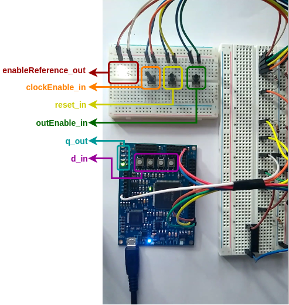

#### 4.4.1. Parte 1 del ensayo: Prueba de d_in

En el ensayo primero se valida que el registro almacene cualquiera de los 16 datos posibles (recordar que es de 4 bits). Para esto, los pulsadores correspondientes a **clockEnable_in**, **reset_in** y **outEnable_in** no se presionan, quedando el registro habilitado completamente y sin resetear. Entonces, se presionan los pulsadores asociados de **d_in** de forma de generar los 16 posibles datos. Esto se aprecia en el siguiente GIF, donde en **d_in** se ingresa desde el binario 0000 al 1111:


Se puede ver como se encienden correctamente los LED de **q_out** según la secuencia ascendente planteada. Además, es importante observar como el dato almacenado del registro **SOLO CAMBIA CUANDO EL LED EXTERNO BLANCO CONMUTA DE ESTADO**, lo que quiere decir que el registro interno cambia de estado cuando está habilitado y recibe un flanco de clock que lo active. Esto coincide con el comportamiento esperado.

---

La segunda parte del ensayo es acerca de validar que las entradas de control **clockEnable_in**, **reset_in** y **outEnable_in** funcionen correctamente. Para esto se realizan en orden los siguientes pasos:

#### 4.4.2. Parte 2, paso 1 del ensayo: Prueba de outEnable_in

Se presionan los pulsadores de **d_in** para que el registro guarde el **valor binario 0110**. Seguidamente, se presiona varias veces el pulsador de **outEnable_in**, viéndose que al estar presionado los LED de **q_out** se apagan porque esta queda en alta impedancia. Cuando se lo libera sigue quedando el valor **0110** guardado en el registro.


#### 4.4.3. Parte 2, paso 2 del ensayo: Prueba de reset_in

Se presiona el pulsador de **reset_in**, viéndose que al estar presionado los LED de **q_out** se apagan porque el registro se reinicia. Cuando se lo libera la salida del registro mantiene el valor **0000** por el reset, guardándose luego el dato **0110** con la siguiente conmutación del LED externo.


#### 4.4.4. Parte 2, paso 3 del ensayo: Prueba de clockEnable_in

Se presiona el pulsador de **clockEnable_in**, deteniéndose la conmutación del LED externo y quedando guardado el valor **0110** en el registro. Luego se cambia el valor de **d_in** a **0001** y, al liberar el pulsador y así rehabilitar el clock, se guarda dicho valor en el registro.


Se puede decir finalmente que el diseño top-level basado en un registro PIPO de 4 bits **funciona según lo esperado**.

---

**Propuesta de investigación**

Se motiva al lector/a a que diseñe, simule e implemente un registro SISO y un registro SIPO, ambos de 4 bits, utilizando como base el módulo creado del registro PIPO. Para las simulaciones, puede reutilizar los *testbenches* de los ejemplos de los registros SISO y SIPO, los cuales son accessibles en la [sección 5.2 Ejemplos relacionados](#52-ejemplos-relacionados).

## 5. Véase también

### 5.1. Sintaxis relacionada

* [Descripción secuencial en VHDL](https://gitlab.com/RamadrianG/wiki---fpga-para-todos/-/wikis/Descripci%C3%B3n-secuencial-en-VHDL)
* [Descripción estructural en VHDL](https://gitlab.com/RamadrianG/wiki---fpga-para-todos/-/wikis/Descripci%C3%B3n-estructural-en-VHDL)
* [Testbenches en VHDL](https://gitlab.com/RamadrianG/wiki---fpga-para-todos/-/wikis/Testbenches-en-VHDL)
* [Automatización de testbenches en VHDL](https://gitlab.com/RamadrianG/wiki---fpga-para-todos/-/wikis/Testbench-automatizado-en-VHDL)

- [Descripción secuencial en Verilog](https://gitlab.com/RamadrianG/wiki---fpga-para-todos/-/wikis/Descripci%C3%B3n-secuencial-en-Verilog)
- [Descripción estructural en Verilog](https://gitlab.com/RamadrianG/wiki---fpga-para-todos/-/wikis/Descripci%C3%B3n-estructural-en-Verilog)
- [Testbenches en Verilog](https://gitlab.com/RamadrianG/wiki---fpga-para-todos/-/wikis/Testbenches-en-Verilog)
- [Automatización de testbenches en Verilog](https://gitlab.com/RamadrianG/wiki---fpga-para-todos/-/wikis/Testbench-automatizado-en-Verilog)

### 5.2. Ejemplos relacionados

1. [Flip Flop D](../05-FlipFlop_D)
2. [Registro de entrada serie y salida serie](../08-Registro_ss)
3. [Registro de entrada paralela y salida serie](../09-Registro_ps)
4. [Registro de entrada serie y salida paralela](../10-Registro_sp)
5. [Contador universal](../06-Contador_universal)
6. [NCO](../11-NCO)

## 6. Información adicional: uso de herramientas

Para más información sobre cómo usar el *toolchain* para compilar y simular o 
descargar a la placa según el lenguaje utilizado, referirse a los siguientes 
vínculos:

 - VHDL y Verilog (recomendado): [Entorno basado en Atom][Entorno_Link].
 - Solo VHDL : [GHDL y GTKWave o EDA Playground](https://gitlab.com/RamadrianG/wiki---fpga-para-todos/-/wikis/Herramientas-libres-para-VHDL) + [iCEcube2](https://gitlab.com/RamadrianG/wiki---fpga-para-todos/-/wikis/Software-Lattice) + [IceStorm][IceStorm_link]
 - Solo Verilog : [icarusVerilog y GTKWave o EDA Playground](https://gitlab.com/RamadrianG/wiki---fpga-para-todos/-/wikis/Herramientas-libres-para-Verilog) + [iCEcube2](https://gitlab.com/RamadrianG/wiki---fpga-para-todos/-/wikis/Software-Lattice) + [IceStorm][IceStorm_link]

[Entorno_Link]: https://gitlab.com/RamadrianG/wiki---fpga-para-todos/-/wikis/Uso-del-entorno
[IceStorm_link]: https://gitlab.com/RamadrianG/wiki---fpga-para-todos/-/wikis/Proyecto-iCEstorm

## 7. Referencias

[^1]: "Lattice ICE<sup>TM</sup> Technology Library", Lattice Semiconductor, Hillsboro, Oregon, USA, Version 3.0, August 2016.
[^2]: "iCE40 LP/HX Family", Lattice Semiconductor, Hillsboro, Oregon, USA, Data Sheet, FPGA-DS-02029-3.5, September 2018.
[^3]: "ULN2803A Darlington Transistor Arrays", Texas Instruments, datasheet SLRS049H, february 1997–revised february 2017.
