# Registro Serie-Serie

[[_TOC_]]

## 1. Descripción

En este ejemplo se diseña un **registro de desplazamiento entrada en serie/salida en serie**. Es un **circuito secuencial**, esto quiere decir que su salida depende, no solo de la combinación presente en sus entradas en un determinado momento, sino también de la historia de las entradas anteriores.

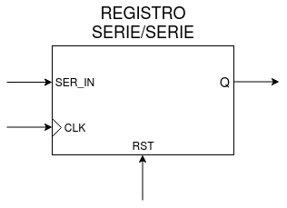

Los datos ingresados al registro se cargan de un bit a la vez en la entrada *SER_IN*. Estos datos se desplazarán **bit por bit** con cada *flanco positivo* en la entrada de clock *CLK*, a través de un conjunto de flip-flops hacia la salida del registro *Q*. 

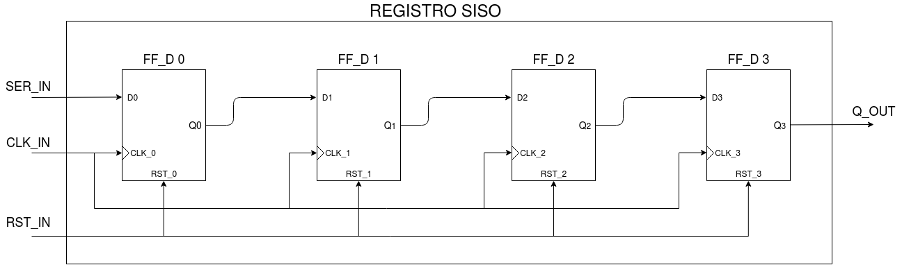

Con los pulsos de reloj continuos, los datos saldrán del registro uno por uno en el **mismo orden** que se cargaron, con un retardo de **Nbits** periodos de clock, donde **Nbits** es la cantidad de flip-flops que conforman al registro. En la figura anterior se muestra un registro SISO de Nbits = 4.


## 2. Código

### 2.1 VHDL

Lo primero que debemos hacer es incluir los paquetes que vamos a necesitar, en nuestro caso vamos a necesitar el *std_logic_1164* para poder usar el tipo de datos **std_logic**.

```vhdl
library ieee;
use ieee.std_logic_1164.all;
```
A continuación vamos a declarar la **entidad**, en la cual se determinan las *entradas* y *salidas* que tendrá nuestro diseño y un genérico *Nbits* que determinará el tamaño del registro, es decir la cantidad de flip-flops que lo componen o, en otras palabras, la cantidad de veces que se desplazará un bit entrante dentro del registro.

```vhdl
--Entidad
entity regSISO is
	--Cantidad de bits del registro
	generic (Nbits : integer range 8 to 64 := 8);

	--Puertos E/S
	port(
		clk_in : in std_logic;
		rst_in : in std_logic;
		ser_in : in std_logic;
		q_out : out std_logic);

end entity regSISO;
```
Por último, dentro de la **arquitectura** se debe determinar el funcionamiento interno de nuestro diseño.

Para ejecutar lógica secuencial, VHDL nos ofrece las estructuras del tipo [process](https://gitlab.com/RamadrianG/wiki---fpga-para-todos/-/wikis/Descripci%C3%B3n-secuencial-en-VHDL#procesos-secuenciales). El process se activa cuando se produce un cambio en el valor de una o más de las señales presentes en la **lista de sensibilidad**, en nuestro caso será: *clk_in*.

```vhdl
--Arquitectura
architecture regSISO_arch of regSISO is
	signal serialReg_s : std_logic_vector(Nbits-1 downto 0);

begin
	do_shift: process(clk_in)
	begin
			if rising_edge(clk_in) then
			if rst_in = '1' then
				serialReg_s <= (others => '0');
			else
				serialReg_s <= ser_in & serialReg_s(Nbits-1 downto 1);
			end if;
		end if;
	end process do_shift;

	q_out <= serialReg_s(0);
end architecture regSISO_arch;
```
<br/>

Vemos que el *process* detecta si hay un flaco positivo de *clk_in*. Si la entrada de reset está en alto, se resetea el vector *serialReg_s* dejando todos sus bits en bajo y el *bit menos significativo* saldrá por la salida **q_out**.
```vhdl
q_out <= serialReg_s(0);
```
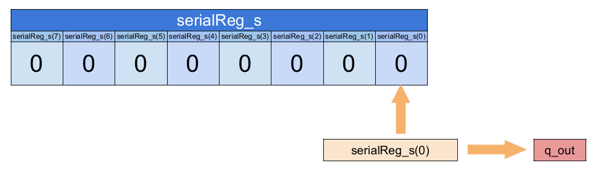

Ahora bien, si la entrada **rst_in** no esta en alto, tenemos la siguiente línea, la cual se encarga de hacer el *desplazamiento de los bits*:
```vhdl
serialReg_s <= ser_in & serialReg_s(Nbits-1 downto 1);
```
Para entender lo que hace debemos conocer el operator ['&'](https://www.csee.umbc.edu/portal/help/VHDL/operator.html) que nos provee VHDL, el cual nos permite concatenar arrays y/o elementos y nos devuelve un array.

Entonces lo que hará esta instrucción será concatenar el bit que llega desde la entrada **ser_in** con los 7 bits más significativos del vector *serialReg_s*.

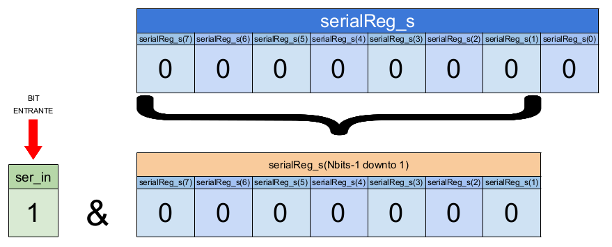

Al vector *serialReg_s* se le asigna como valor el resultado de esta concatenación y luego el bit menos significativo saldrá por **q_out**.

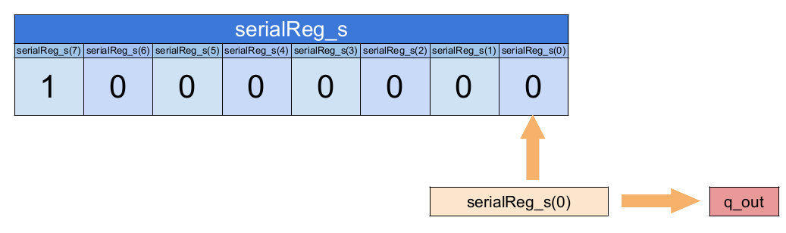

Como podemos observar, al repetir este proceso se descarta el bit menos significativo del vector y se concatena como bit más significativo al bit entrante dando por resultado el desplazamiento de los bits.


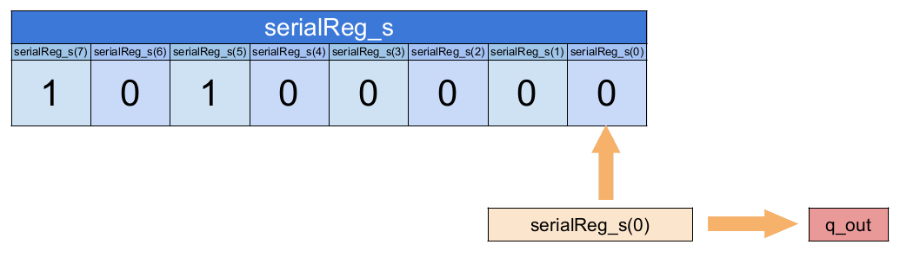


[Aquí](VHDL/regSISO.vhdl) podrá encontrar el código completo.


## 3. Simulación
### 3.1 *Testbench* en VHDL

Teniendo en cuenta que el registro de desplazamiento SISO (Serial Input/Serial Output) es un **circuito secuencial**, es decir que el estado de sus salidas depende no solo del estado actual de sus entradas sino también de la historia anterior de las mismas, vamos verificar el diseño colocando algunos posibles valores en sus entradas que contemplen los diferentes casos que se pueden tener.

Realizaremos dos testbenches. En el primero tanto la entrada *ser_in* como la entrada de clock *clk_in* estarán a la **misma frecuencia**. En el segundo, en cambio, estarán a **diferentes frecuencias**.  

Estas frecuencias se determinan a través de dos constantes que serán el periodo del clock y de la señal de entrada, respectivamente.

En el caso sincrónico será:
```vhdl
constant periodClk  : time := 60 ns;
constant periodData : time := 60 ns;
```

Y en el asincrónico:
```vhdl
constant periodClk  : time := 60 ns;
constant periodData : time := 100 ns;
```

En los dos probaremos un registro de 8 bits que se determina a través de la constante **bits**.

```vhdl
  constant bits   : integer := 8;

```

En ambos testbenches, se declara un array de 7 elementos llamado *dataTest_s* el cual guardará los valores que probaremos a la entrada de flip-flop.
```vhdl
  signal dataTest_s : std_logic_vector(31 downto 0) := "01010110111000011101100010000100";
```

También se declara una señal *test_stop* que la utilizaremos para detener la simulación.
```vhdl
signal test_stop : std_logic;
```

Utilizaremos 3 **process**. El primero pondrá en alto la entrada de *reset* por dos periodos de clock y luego la mantendrá en bajo.
```vhdl
--Proceso de reset inicial:
    process begin
        test_rst <= '1';
        wait for 2*periodClk; --El reset dura dos periods de clock
        test_rst <= '0';
        wait for periodClk;
        wait; --Bloquear al proceso
    end process;
```

El segundo, lo utilizaremos para generar una señal de clock:
```vhdl
--Proceso de generación de clock
    process begin
        test_clk <= '1';
        wait for periodClk/2;
        test_clk <= '0';
        wait for periodClk/2;
        if (test_stop='1') then
            wait;
        end if;
    end process;
```

Con el último process, a través de una estructura del tipo [for](https://gitlab.com/RamadrianG/wiki---fpga-para-todos/-/wikis/Testbenches-en-VHDL#for-loop) se probarán todos los valores almacenados en el vector a la entrada del registro los cuales se ingresan en serie, uno después del otro.
```vhdl
--Proceso de generación de entradas
    process begin
        test_stop <= '0';
        for i in 0 to ((dataTest_s'length - 1)) loop
          test_ser <= dataTest_s(i);
          wait for periodData;
        end loop;
        test_stop <= '1';
        wait;
    end process;
```

[Aquí](VHDL/regSISO_tb_entradaSinc.vhdl) podrán encontrar el testbench sincrónico completo y [aquí](VHDL/regSISO_tb_entradaAsinc.vhdl) el asincrónico que fueron utilizados para simular el diseño.

### 3.2 Resultados

Se muestra a continuación el resultado de las simulaciones.

#### 3.2.1 Simulación con entrada sincrónica
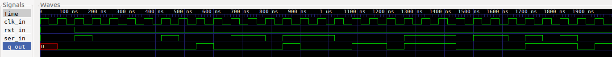
<br>Simulación en GTKWave.
<br><br>


Cómo se puede apreciar en las figuras, luego de 8 períodos de clock se repite en la salida *q_out*, la señal que se ingresó en la entrada *ser_in*.

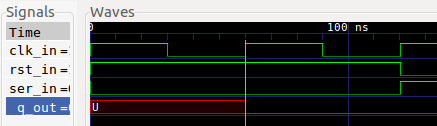

Vemos tambiém, que el estado de la salida es **undefined** hasta que tenemos un flanco positivo de *clk_in* y la entrada *rst_in* en "alto". Cuando esto sucede, se resetea el registro y la salida *q_out* pasa a "bajo".

Se concluye que el funcionamiento del registro cumple con el
comportamiento esperado para esta prueba.

#### 3.2.2 Simulación con entrada asincrónica

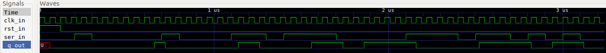
<br>Simulación en GTKWave.
<br><br>
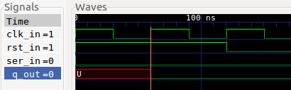

Como vemos en la figura anterior, al igual que en la prueba sincrónica, cuando tenemos un flanco positivo de *clk_in* y la entrada *rst_in* en "alto", la salida *q_out* se resetea pasando del estado "undefined" a 0.

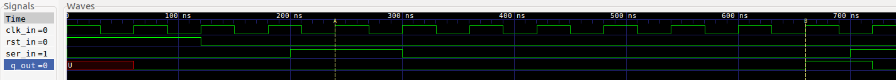

Se observa que la salida *q_out* se mantiene en "bajo" hasta 8 ciclos de clock (marcador B) después de que se presente un flaco positivo de *clk_in* y un 1 en la entrada *ser_in* (marcador A).

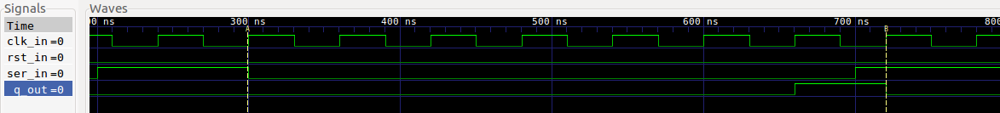
 
En el flanco positivo de *clk_in* siguiente vemos que el estado de la entrada está en "bajo" (marcador A) y 8 períodos de reloj después se pone en bajo la salida (marcador B).

Se aprecia que este comportamiento se repite a lo largo de toda la simulación
cumpliendo la conducta esperada, quedando así verificado el diseño.

## 4. Implementación y ensayo

### 4.1 Síntesis

Para sintetizar el Registro SISO se utiliza el programa Synplify Pro a través de iCEcube2.

#### 4.1.1  RTL View (alto nivel)

Este diseño es independiente de la tecnología utilizada y se compone de estructuras genéricas como registros, multiplexores, etc. A continuación, se aprecia su diagrama esquemático:

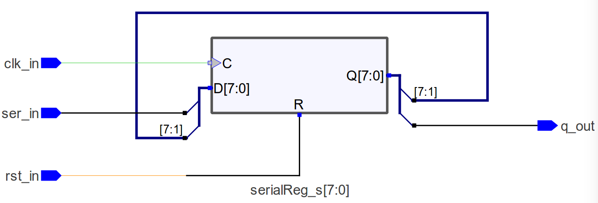

Como podemos apreciar en la figura al sintetizar el diseño a nivel de bloques, el sintetizador reconoce que la secuencia adoptada corresponde a un registro serie-serie.

#### 4.1.2 Tech View (alto nivel)
Este diseño depende de la tecnología en FPGA utilizada y está formado por primitivas de Lattice1 para el caso de la EDU-FPGA. Estas primitivas son los bloques esenciales utilizados para describir un sistema digital en este bajo nivel, siendo por ejemplo: LUTs, multiplexores, buffers E/S, etc.
A continuación, se aprecia su diagrama esquemático:

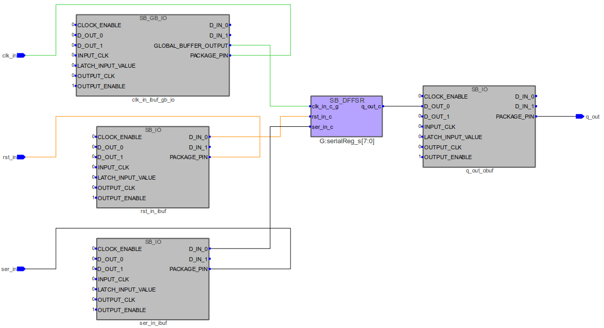

### 4.2 Place & Route
#### 4.2.1  Floor Planner
El mapa de recursos muestra los bloques lógicos, bloques de memoria, bloques E/S y bloques DSP en la FPGA:

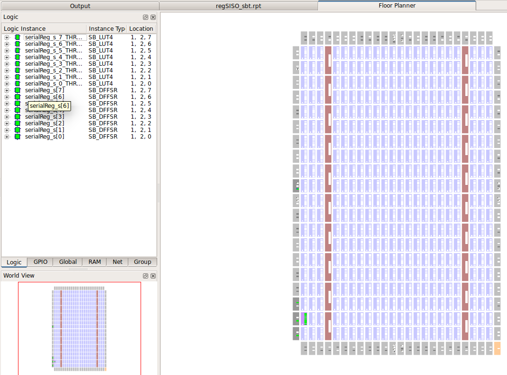

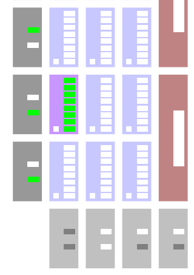

#### 4.2.2  Package View
Muestra la asignación y ubicación de pines del encapsulado para este diseño:

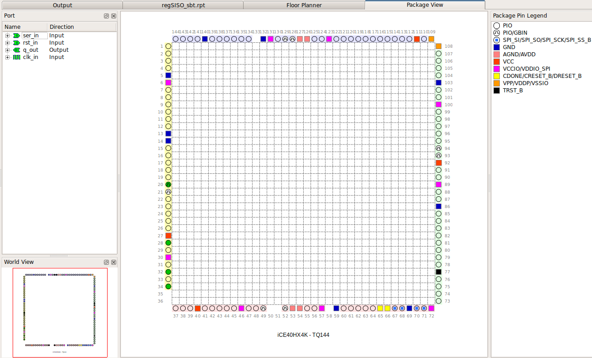

## 5. Véase también

### 5.1 Sintaxis relacionada

* [Sintaxis de VHDL](https://gitlab.com/RamadrianG/wiki---fpga-para-todos/-/wikis/Sintaxis-VHDL)
* [Descripción secuencial en VHDL](https://gitlab.com/RamadrianG/wiki---fpga-para-todos/-/wikis/Descripcion-combinacional-en-VHDL)
* [Testbenches en VHDL](https://gitlab.com/RamadrianG/wiki---fpga-para-todos/-/wikis/Testbenches-en-VHDL#for-loop)

### 5.2 Ejemplos relacionados

* [Flip-Flop D](../05-FlipFlop_D)
* [Contador Universal](../06-Contador_universal)
* [Registro Paralelo-Paralelo](../07-Registro_pp)
* [Registro Paralelo-Serie](../09-Registro_ps)
* [Registro Serie-Paralelo](../10-Registro_sp)

---
## 6. Información adicional: uso de herramientas

Para más información sobre cómo usar el *toolchain* para compilar y simular o
descargar a la placa según el lenguaje utilizado, referirse a los siguientes
vínculos:
 - VHDL y Verilog (recomendado): [Entorno basado en Atom][Entorno_Link].
 - Solo VHDL : [GHDL y GTKWave](https://gitlab.com/RamadrianG/wiki---fpga-para-todos/-/wikis/Herramientas-libres-para-VHDL) + [iCEcube2](https://gitlab.com/RamadrianG/wiki---fpga-para-todos/-/wikis/Software-Lattice) + [IceStorm][IceStorm_link]
 - Solo Verilog : [icarusVerilog y GTKWave](https://gitlab.com/RamadrianG/wiki---fpga-para-todos/-/wikis/Herramientas-libres-para-Verilog) + [IceStorm][IceStorm_link]

[Entorno_Link]: https://gitlab.com/RamadrianG/wiki---fpga-para-todos/-/wikis/Uso-del-entorno
[IceStorm_link]: https://gitlab.com/RamadrianG/wiki---fpga-para-todos/-/wikis/Proyecto-iCEstorm
