# REGISTRO DE ENTRADA PARALELA Y SALIDA SERIE

[[_TOC_]]

## 1. Descripción

En este ejemplo se desarrolla un registro de entrada paralela y salida serie o PISO (***P**arallel **I**nput, **S**erial **O**utput*) por su sigla en inglés. Este es un dispositivo elemental y ampliamente utilizado en desarrollos digitales, y permitirá practicar en el diseño y prueba de circuitos secuenciales con HDL.

Un registro PISO es un **dispositivo secuencial sincrónico** que tiene dos funciones:
- Como **memoria**, ya que almacena una cierta cantidad de bits internamente.
- Como **conversor de tipo de dato**, porque transforma un valor binario paralelo en serie. 

El funcionamiento de este registro se basa en guardar internamente un valor binario cargado en forma paralela, para luego "expulsarlo bit a bit" por su salida con cada flanco de reloj (o *clock* en inglés), ascendente o descendente según el diseño. Si el valor almacenado es de *n* bits, se necesitan entonces *n* pulsos de clock para expulsarlo completamente por la salida, luego de lo cual se comienzan a arrojar 0 (se terminó el dato). 

Para entender como opera, a continuación se presenta el diagrama de un registro PISO básico, con una entrada de datos *D* de **n** bits, un salida *Q* de un bit, una entrada de CLOCK, una entrada sincrónica para carga (*load* en inglés) de datos y otra entrada asincrónica de reinicio (o *reset* en inglés). También se muestra la tabla de verdad para el caso puntual en que **n** es igual a 2.

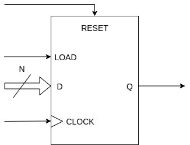


Se aprecian 3 estados principales:
1. **Reinicio**: Correspondiente a la 1<sup>er</sup> fila de la tabla, se da cuando la entrada *RESET* está en nivel alto (estado lógico 1), provocando que la salida *Q* y los *DATOS INTERNOS* almacenados se pongan en 0 independientemente de las entradas de carga *LOAD*, de datos *D* y de *CLOCK*. Esto se debe a que la entrada de reinicio es asincrónica y la de mayor jerarquía.

2. **Carga paralela**: Correspondiente a la 2<sup>da</sup> fila de la tabla, es cuando los datos presentes en la entrada *D* se cargan paralelamente en los *DATOS INTERNOS*. En esta situación, el *RESET* está desactivado (estado lógico 0) y la entrada *LOAD* está en 1, y al suceder un flanco de *CLOCK* ascendente se guardan los datos de entrada (*D<sub>1</sub>D<sub>0</sub>*) en los *DATOS INTERNOS* (*SERIAL_DATA(0)* y *SERIAL_DATA(1)*). La salida *Q* copia siempre al bit más significativo de los *DATOS INTERNOS*, que para el caso del registro de 2 bits es *SERIAL_DATA(1)*.

3. **Desplazamiento del dato almacenado**: Correspondiente a la 3<sup>er</sup> y 4<sup>ta</sup> fila de la tabla, se refiere al momento en que los *DATOS INTERNOS* se desplazan "en dirección a la salida", un bit por cada flanco ascendente de *CLOCK*. Para este caso, tanto el *RESET* como la carga paralela *LOAD* están desactivados, y no importa la entrada de datos *D* ya que esta solo tiene efecto en la carga paralela. Se aprecia que si en la entrada de reloj hay un flanco descendente o un nivel constante de 0 o 1, los *DATOS INTERNOS* y la salida *Q* no cambian y se mantienen en el estado en el que están (*Q<sub>0</sub>* y *Q<sub>1</sub>*). Cuando aparece un flanco ascendente de *CLOCK*, los *DATOS INTERNOS* se desplazan un bit a la derecha, por lo que para el caso del registro de 2 bits el valor *Q<sub>0</sub>* pasa a *SERIAL_DATA(1)* (y la salida *Q* por copia), y un 0 pasa a *SERIAL_DATA(0)*. Esto es porque a medida que se desplaza el dato almacenado van apareciendo ceros en la izquierda. Cuando pasen 2 flancos ascendentes de clock, los *DATOS INTERNOS* del registro estarán en todos en 0.

La entrada de ***RESET*** permite llevar al registro a un estado conocido, lo que usualmente se usa al momento de encender el dispositivo ya que ahí puede presentar cualquier estado posible.

Internamente, el registro se construye con una cantidad de ***Flip-Flops*** (FF) y **multiplexores** igual al número de bits del registro. Por ejemplo, para el caso visto de un PISO de 2 bits, este se puede fabricar con 2 *Flip-Flops* D y 2 multiplexores de dos entradas de 1 bit cada una, como se observa a continuación: 


Se ve como las entradas de *CLOCK_IN* y *RESET_IN* del registro se conectan a todas las entradas de reloj y reinicio de los FF. 

La entrada *LOAD_IN* controla que se aplica en las entradas de los FF. Si tiene un 0, la carga paralela está desactivada, por lo que la salida de un FF se conecta a la entrada del siguiente, o visto de otra forma se conectan los FF en cascada como en el caso de un registro de desplazamiento ([registro SISO](../08-Registro_ss)). De esta forma, con cada flanco ascendente de clock el dato interno se desplaza un bit hacia la derecha. Se aprecia como para este caso el FF de menor peso (*FF_D 0*) tiene un 0 aplicado en su entrada, lo que permite que aparezcan ceros a medida que se desplaza el dato almacenado. 

Por otro lado, si *LOAD_IN* tiene un 1 se aplican paralelamente los datos *D0_IN* y *D1_IN* en las entradas FF, quedando luego almacenados en las salidas de estos cuando suceda un flanco ascendente de CLOCK_IN. 

La salida *Q_OUT* del registro se conecta a la salida del FF de mayor peso (*FF_D 1*), por lo que copia siempre al bit más significativo de los datos internos (*Q1*).

---

Para este ejemplo, se desarrolla un registro PISO versátil, y más completo y genérico que el de diseño básico visto hasta ahora. El registro tendrá:

- Entrada de datos con **cantidad de bits configurable** con un *generic*.
- Activación por **flanco de clock modificable** por medio de un *generic*.
- Entrada asincrónica de **habilitación de salida** que permita o no poner la salida en alta impedancia. La línea encargada de esto se llamará **OUT_ENABLE**.
- Entrada asincrónica de reset.
- Entrada de clock.
- Entrada de **habilitación de clock**, llamada **CLOCK_ENABLE**, que permita habilitar o no el funcionamiento del registro.
- Salida de datos de 1 bit.

El diagrama de este diseño y una tabla de verdad para el caso particular en que la cantidad de bits **n** es 2 se muestran seguidamente:

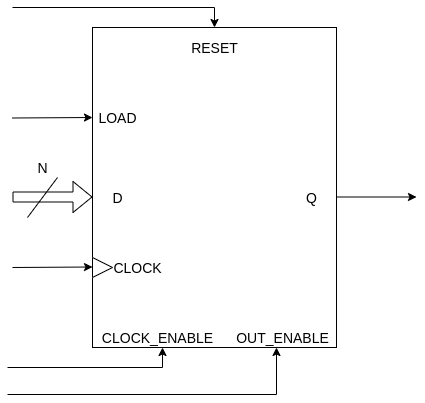


Se aprecian 5 características principales:
1. **Habilitación de salida**:  Se puede poner a la salida *Q* en alta impedancia (Z) independientemente de las otras entradas, quedando así "deshabilitada" aunque el registro sigue trabajando internamente. Esto se logra cuando la entrada *OUT_ENABLE* está en 0 y pone de manifiesto su asincronía y mayor jerarquía. En la tabla anterior se aprecia en las filas con fondo blanco cuando el registro está habilitado y con fondo naranja cuando está deshabilitado.

2. **Habilitación del registro**: Se refiere a habilitar la operación del registro, lo cual se hace aplicando un 1 en la entrada *CLOCK_ENABLE*. Si el registro está deshabilitado, los *DATOS INTERNOS* se mantienen constantes independientemente de las otras entradas.

3. **Reinicio**, **carga paralela** y **desplazamiento del dato almacenado**: Son los estados ya explicados en el registro PISO básico, con la salvedad de que la salida *Q* puede estar deshabilitada o no y que el registro debe estar habilitado (salvo para el reinicio donde no hace falta). 

## 2. Código

### 2.1. VHDL

Primero se incluyen los paquetes necesarios, que en este caso es solo el *std_logic_1164* para usar los tipos de datos **std_logic** y **std_logic_vector**.

```vhdl
--Inclusión de paquetes.
library ieee;                --Biblioteca estándar ieee.
use ieee.std_logic_1164.all; --Paquete para std_logic y std_logic_vector.
```

Luego, se declara la **entidad** del registro. Esta tiene las entradas y salidas ya mencionadas, y los *generics* **nBits** y **risingEdgeClock** permiten configurar la cantidad de bits del registro y el flanco de clock por el que se activa, respectivamente.

```vhdl
--Declaración de la entidad.
entity regPISO is
    generic(
            nBits           : integer := 8;
            risingEdgeClock : BOOLEAN := TRUE);
    port(
            d_in           : in  std_logic_vector(nBits-1 downto 0);
            load_in        : in  std_logic;
            reset_in       : in  std_logic;
            outEnable_in   : in  std_logic;
            clock_in       : in  std_logic;
            clockEnable_in : in  std_logic;
            q_out          : out std_logic);
end entity regPISO;
```
Finalmente, se declara la **arquitectura** del registro. Para almacenar la información interna del registro se declara la señal **serialData_reg**.

```vhdl
--Declaración de la arquitectura.
architecture regPISO_arch of regPISO is
    --Señal auxiliar que almacena la información serial interna del registro.
    signal serialData_reg : std_logic_vector(nBits-1 downto 0);
begin
```
Entonces, si la salida **q_out** está habilitada va a copiar al bit más significativo de los datos internos (**serialData_reg(nBits-1)**), de lo contario se pone en alta impedancia (Z).

```vhdl
--Declaración de la arquitectura.
architecture regPISO_arch of regPISO is
    --Señal auxiliar que almacena la información serial interna del registro.
    signal serialData_reg : std_logic_vector(nBits-1 downto 0);
begin
    --Asignación de la salida. El control de salida es asincrónico.
    q_out <= 'Z' when outEnable_in = '0' else
             serialData_reg(nBits-1);
```

Finalmente, como el flanco de clock que activa al registro es modificable, se utilizan estructuras de generación condicional con la sentencia *generate* y que se llaman **risingEdgeRegister** y **fallingEdgeRegister**. Estas permiten que solo se genere la lógica correspondiente al flanco ascendente o descendente, respectivamente, según el valor del *generic* **risingEdgeClock**. 

Dentro de cada estructura hay un proceso: **risingEdgeRegisterData** para la de flanco ascendente y **fallingEdgeRegisterData** para la de flanco descendente. Se usa un *process* para describir el comportamiento del registro porque este es un circuito secuencial. Su lista de sensibilidad solo tendrá la entrada de reloj **clock_in** y la entrada asincrónica de reinicio **reset_in**; y en su interior se hace el reinicio del registro y también la carga paralela y desplazamiento de los datos internos cuando suceda cierto flanco de clock y el dispositivo esté habilitado.

```vhdl
--Declaración de la arquitectura.
architecture regPISO_arch of regPISO is
    --Señal auxiliar que almacena la información serial interna del registro.
    signal serialData_reg : std_logic_vector(nBits-1 downto 0);
begin
    --Generación de un registro PISO activado por flanco ascendente.
    risingEdgeRegister : if (risingEdgeClock = TRUE) generate
        --Proceso para cambiar el dato interno del registro según sus entradas.
        risingEdgeRegisterData : process(clock_in, reset_in)
        begin
            if(reset_in = '1') then  --El reset es asincrónico.
                serialData_reg <= (others => '0');
            elsif((rising_edge(clock_in)) and (clockEnable_in = '1')) then
                if(load_in = '1') then
                    serialData_reg <= d_in;
                else
                    serialData_reg <= serialData_reg(nBits-2 downto 0) & '0';
                end if;
            end if;
        end process risingEdgeRegisterData;
    end generate risingEdgeRegister;

    --Generación de un registro PISO activado por flanco descendente.
    fallingEdgeRegister : if (risingEdgeClock = FALSE) generate
        --Proceso para cambiar el dato interno del registro según sus entradas.
        fallingEdgeRegisterData : process(clock_in, reset_in)
        begin
            if(reset_in = '1') then  --El reset es asincrónico.
                serialData_reg <= (others => '0');
            elsif((falling_edge(clock_in)) and (clockEnable_in = '1')) then
                if(load_in = '1') then
                    serialData_reg <= d_in;
                else
                    serialData_reg <= serialData_reg(nBits-2 downto 0) & '0';
                end if;
            end if;
        end process fallingEdgeRegisterData;
    end generate fallingEdgeRegister;

    --Asignación de la salida. El control de salida es asincrónico.
    q_out <= 'Z' when outEnable_in = '0' else
             serialData_reg(nBits-1);
end architecture regPISO_arch;
```
Para ver todo el **código** del módulo en VHDL, ir [aquí](VHDL/regPISO.vhdl)

## 3. Simulación

### 3.1. *Testbenches* en VHDL

Debido a la cantidad de entradas del registro, desarrollar *testbenches* exhaustivos implicaría analizar todos los estados posibles de las entradas y la salida, lo que complejizaría excesivamente las pruebas. Por lo tanto, en esta ocasión se diseñan dos *testbenches* para examinar los estados más importantes del dispositivo y **probar así sus principales características**: 

1. Carga paralela.
2. Desplazamiento interno y salida serial de datos.
3. Habilitación del registro.
4. Reinicio.
5. Habilitación de salida. 

Ambos *testbenches* son prácticamente iguales, diferenciándose en cual flanco de clock activa al registro por medio del valor del genérico **risingEdgeClock** mapeado. 

Respecto al código de los *testbenches*, se menciona primero la declaración de las constantes **TESTED_NBITS** y **PERIOD**, las cuales se utilizan para configurar la cantidad de bits del registro y el período de clock utilizado para probar el diseño, respectivamente. En este caso, el dispositivo tendrá **4 bits** para buscar un punto de equilibrio entre la complejidad de los ensayos y la del dispositivo implementado.

Además, se declaran distintas señales de estímulo y monitoreo del registro y una última para detener la simulación. 

```vhdl
--Declaración de constantes.
constant TESTED_NBITS : integer := 4;
constant PERIOD       : time    := 100 ns;

--Declaración de estímulos y señal de monitoreo.
--Entradas al registro.
signal test_d_reg_s       : std_logic_vector(TESTED_NBITS-1 downto 0);
signal test_load_s        : std_logic;
signal test_reset_s       : std_logic;
signal test_outEnable_s   : std_logic;
signal test_clock_s       : std_logic;
signal test_clockEnable_s : std_logic;

--Salidas al registro.
signal test_q_reg_s	: std_logic;

--Señal auxiliar para detener la simulación (por defecto es FALSE).
signal stopSimulation_s : BOOLEAN := FALSE;

--Declaración de una constante como estímulo de entrada.
constant IN_REGISTER : std_logic_vector := "1010";
```
En segundo lugar, se menciona que se declara un *procedure* llamado **LoadAndShiftRegister_proc** que permite cargar al registro en forma paralela y luego hacer que expulse en serie una cierta cantidad de bits por su salida. Según sus argumentos, el procedimiento aplica el valor **IN_REGISTER_PROC** en la entrada de datos **test_d_reg_proc_s** del registro y efectivamente lo carga aplicando una señal en la entrada de carga **test_load_proc_s**. Luego deja pasar **SHIFTS_QUANTITY_PROC** pulsos de clock, cuyo período es **PERIOD_PROC**, para así expulsar **SHIFTS_QUANTITY_PROC** bits del interior del registro . Esto hace que el código sea más legible, modular y reutilizable. 

```vhdl
--Procedimiento para cargar en la entrada del registro un dato en forma
--paralela y luego dejar pasar SHIFTS_QUANTITY_PROC períodos para expulsar
--bit a bit dicho dato en forma serial por su salida.
procedure LoadAndShiftRegister_proc(
    signal   test_load_proc_s     : out std_logic;
    signal   test_d_reg_proc_s    : out std_logic_vector;
    constant IN_REGISTER_PROC     : in  std_logic_vector;
    constant SHIFTS_QUANTITY_PROC : in  integer;
    constant PERIOD_PROC          : in  time
) is
begin
    test_load_proc_s  <= '1';
    test_d_reg_proc_s <= IN_REGISTER_PROC;
    wait for PERIOD_PROC; --Para cargar efectivamente los datos paralelamente.
    test_load_proc_s  <= '0';
    wait for (SHIFTS_QUANTITY_PROC * PERIOD_PROC);
end procedure LoadAndShiftRegister_proc;
```

Finalmente, se destacan los dos *process* utilizados. El primero, llamado **clockGeneration**, se utiliza para generar la señal de clock de período **PERIOD**.

```vhdl
--Proceso de generación de clock.
clockGeneration : process
begin
    test_clock_s <= '1';
    wait for PERIOD/2;
    test_clock_s <= '0';
    wait for PERIOD/2;
    if (stopSimulation_s = TRUE) then
        wait;
    end if;
end process clockGeneration;
```
El segundo *process*, llamado **applyStimulus**, se usa para aplicar distintas señales de estímulo para así poder probar las principales características del registro. Para cargarle paralelamente un dato y obtener información en su salida, se llama en varias ocasiones a **LoadAndShiftRegister_proc**. Los datos de entrada se cambian en el flanco contrario al que usa el registro para activarse, con el fin de tener mayor claridad en la interpretación de las señales.

```vhdl
--Proceso de aplicación de estímulos.
applyStimulus : process
begin
    --Estado inicial: dato de entrada todo en 0, carga paralela
    --deshabilitada y clock y salida habilitados.
    test_d_reg_s       <= (others=> '0');
    test_outEnable_s   <= '1';
    test_clockEnable_s <= '1';
    test_load_s        <= '0';
    stopSimulation_s   <= FALSE;

    --Reset inicial.
    test_reset_s <= '1';
    wait for (2.5*PERIOD);  --El reset dura dos períodos y medio de clock.
    test_reset_s <= '0';

    --Se aplica el estímulo en la entrada de datos del registro. Luego se
    --esperan TESTED_NBITS períodos para expulsar el dato en forma serial.
    LoadAndShiftRegister_proc(test_load_s, test_d_reg_s, IN_REGISTER,
                              TESTED_NBITS, PERIOD);

    --Se reaplica el estímulo para probar la deshabilitación del clock.
    --Luego de esto se rehabilita el clock.
    test_clockEnable_s <= '0';
    LoadAndShiftRegister_proc(test_load_s, test_d_reg_s, IN_REGISTER,
                              TESTED_NBITS, PERIOD);
    test_clockEnable_s <= '1';

    --Se hace un reset para poner la salida y el dato serie interno en cero
    --y luego se reaplica el estímulo en la entrada de datos. Aquí se prueba
    --la asincronía y mayor jerarquía de la entrada de reset. Luego de esto,
    --se desactiva el reset.
    test_reset_s <= '1';
    LoadAndShiftRegister_proc(test_load_s, test_d_reg_s, IN_REGISTER,
                              TESTED_NBITS, PERIOD);
    test_reset_s <= '0';

    --Se deshabilita la salida del registro y luego se reaplica el estímulo
    --en la entrada de datos. Aquí se prueba la asincronía y más alta
    --jerarquía de la entrada de habilitación de la salida.
    test_outEnable_s <= '0';
    LoadAndShiftRegister_proc(test_load_s, test_d_reg_s, IN_REGISTER,
                              TESTED_NBITS, PERIOD);

    --Se detiene la simulación.
    stopSimulation_s <= TRUE;
    wait;
end process applyStimulus;
```

[Aquí](VHDL/regPISO_tb_risingEdge.vhdl) podrá ver todo el código del *testbench* en VHDL donde el registro se activa por flanco ascendente, y [aquí](VHDL/regPISO_tb_fallingEdge.vhdl) cuando lo hace por flanco descendente.

Una vez hechos los *testbenches*, se realizan las simulaciones utilizando el *toolchain* correspondiente. Para más información, ver [sección 6](#6-información-adicional-uso-de-herramientas) del presente documento.

### 3.2. Resultados

A continuación, se muestran las imágenes de las formas de onda visualizadas con GTKWave para cada uno de los *testbenches*.

#### 3.2.1. Activación por flanco ascendente

Primero se ve la imagen de toda la simulación, donde se usaron marcadores para identificar las partes principales ya mencionadas en los comentarios del *testbench*:

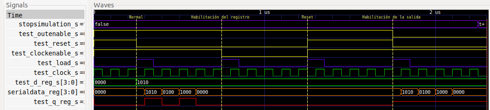

Haciendo zoom en cada una de dichas partes, se aprecia en primer medida el **reset inicial** que dura hasta el marcador **Normal**. Esta etapa consiste en habilitar tanto la salida como el registro, no hacer una carga paralela y activar el reset durante dos períodos y medio de clock. Se observa como la salida *test_q_reg_s* y los datos internos *serialData_reg* del registro se ponen en 0 mientras dura el reset:

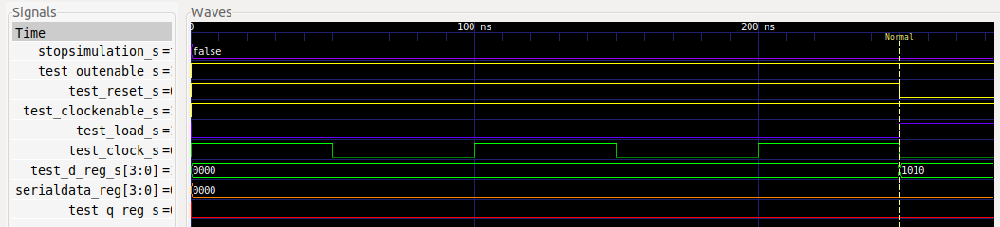

Luego está la sección de **funcionamiento normal**, que va desde la marca **Normal** hasta **Habilitación del registro**. En esta parte la salida y el registro están habilitados, el reset está desactivado y se hace una carga paralela del dato *1010* aplicándolo a la entrada *test_d_reg_s* y poniéndo la entrada *test_load_s* en alto durante un período para efectivizar la carga con un flanco ascendente. Después se dejan pasar 4 períodos de clock para expulsar serialmente dicho dato por la salida. 

Se aprecia como el dato almacenado en *serialData_reg* se desplaza un bit hacia la izquierda con cada flanco ascendente de clock y la salida *test_q_reg_s* es igual a su bit más significativo (*serialData_reg(3)*) en todo momento:

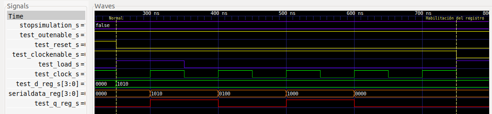

Luego está la parte donde **se prueba la habilitación del registro**, que va desde la marca **Habilitación del registro** hasta **Reset**. Se observa que teniendo la salida habilitada y el reset desactivado, el dato interno *serialData_reg* y la salida *test_q_reg_s* no cambian, manteniéndose en 0 aunque nuevamente se intente cargar el registro y dejar pasar 4 períodos de reloj. Esto se debe a que el registro está deshabilitado.

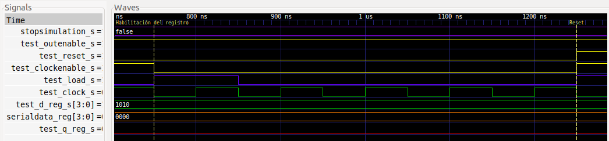

Después se encuentra la parte donde **se prueba el reset y su mayor jerarquía**, yendo desde la marca **Reset** hasta **Habilitación de la salida**. En esta sección se observa como el dato interno *serialData_reg* y la salida *test_q_reg_s* se mantienen en 0, independientemente que el registro esté habilitado, se lo intente cargar paralelamente y luego se dejen pasar 4 períodos de clock. Esto se debe a la activación del reset.

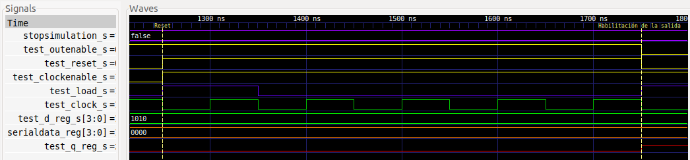

Finalmente, se muestra la sección donde **se ensaya la habilitación de la salida y su mayor jerarquía**, abarcando desde la marca **Habilitación de la salida**. Se aprecia que, con el reset desactivado y el registro habilitado, la salida *test_q_reg_s* se pone en alta impedancia, aunque internamente el registro continua funcionando ya que la carga paralela y el desplazamiento interno de los datos funciona.

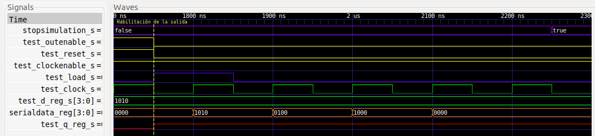

#### 3.2.2. Activación por flanco descendente

Para este caso solo se muestra la imagen de toda la simulación, donde también se usaron marcadores para identificar las partes principales:

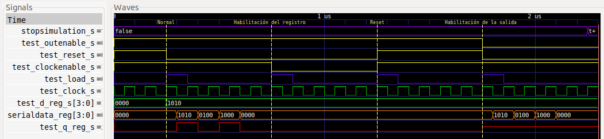

El/La lector/a podrá hacer zoom nuevamente en cada una de las partes para verlas en detalle y constatar que se cumple con lo pedido.

---

Se observa en ambos casos como la salida del registro cumple con el comportamiento deseado, quedando así verificado el diseño.

## 4. Implementación y ensayo

Para implementar el diseño en la [EDU-FPGA](https://gitlab.com/RamadrianG/wiki---fpga-para-todos/-/wikis/EDU-FPGA) se decide sintetizar el registro de 4 bits probado en la sección de simulación, para que el lector pueda pasar por todas las etapas del diseño digital con el mismo dispositivo.

Para poder apreciar el funcionamiento del registro, se necesita bajar la frecuencia de reloj de la EDU-CIAA-FPGA, que es de 12 MHz. Por lo tanto, a la entrada **clockEnable_in** del PISO se añade un *prescaler* (divisor de frecuencia) que permita activar el registro cada vez que pasen 12 millones de pulsos de clock. En otras palabras, el dispositivo permitirá reducir la frecuencia de trabajo del registro a 1 Hz. Se implementa este divisor de frecuencia con el [contador universal](../06-Contador_universal) desarrollado en un ejemplo anterior. Además, se utiliza un **Flip-Flop T** para que el usuario sepa cuando el registro se habilita y recibe un flanco de clock que activa su funcionamiento.

El diagrama esquemático final correspondiente al ***top-level*** es:


Se aprecia como el registro implementado se compone de un contador interno de 24 bits llamado **univCounter_0**, un registro PISO interno de 4 bits de nombre **regPISOWithExtraOutput_0** y un Flip-Flop T llamado **FF_T**. El registro interno, cuya entidad se llama **regPISOWithExtraOutput** y se verá luego, es prácticamente igual a la entidad **regPISO** antes vista, pero tiene la particularidad de tener una salida adicional llamada **STORED_DATA**. Esta salida se utiliza para fines didácticos y con el objetivo de presentar el dato binario almacenado internamente en el registro.

Se observa como las entradas de **RESET**, **CLOCK** y **OUT_ENABLE** del registro implementado son solidarias a las entidades de bajo nivel. Las entradas **LOAD** y **D** y la salida **Q** se conectan directamente con las del registro interno. El contador interno se configura en cuenta creciente (*COUNT_UP* en 1) y sin posibilidad de carga paralela (*LOAD* en 0), además de que su entrada de datos *D* y salida *Q* no se usan. La entrada **CLOCK_ENABLE** del registro implementado permite habilitar el contador interno y, en conjunto con la salida *TERMINAL_COUNT* del contador, también habilita al registro **regPISOWithExtraOutput_0** y al Flip-Flop **FF_T**.

La salida **ENABLE_REFERENCE** se agrega al top-level para que al usuario le resulte más didáctico el ensayo. Esta salida se conecta al terminal *Q* del Flip-Flop T y, como este tiene su entrada *T* en 1, cambiará de estado cada vez que el registro interno se habilite y reciba un flanco de clock que lo active. 

El contador es de **24 bits** para permitir tener un módulo igual a **12x10<sup>6</sup>** y así hacer la división de frecuencia deseada. Tener en cuenta que con esa cantidad de bits el módulo máximo es de 2<sup>24</sup>=16777216

### 4.1. Síntesis

Dado que ya se vió como se sintetiza un contador universal en un ejemplo anterior y que el Flip-Flop T es un dispositivo elemental, se explicará solo la síntesis del registro PISO interno de 4 bits. La entidad a sintetizar será **regPISO**, teniendo en cuenta que la entidad **regPISOWithExtraOutput** realmente implementada es prácticamente igual pero con la diferencia de que el dato binario almacenado internamente se presenta en la salida **STORED_DATA**.

La síntesis se hace con el programa *Synplify Pro* a través de *iCEcube2*.

#### 4.1.1. RTL View (alto nivel)

Este diseño es independiente de la tecnología utilizada y se compone de estructuras genéricas como registros, multiplexores, etc. A continuación, se aprecia su diagrama esquemático:


Se ve como el módulo sintetizado se compone de:

1. Un registro PIPO interno llamado **serialData[3:0]**, el cual tiene entrada de datos **D[3:0]**, de clock **C**, de reset **R** y de habilitación de funcionamiento **E**.

2. Un multiplexor llamado **changeRegisterOutput\\.serialData_reg_4[3:0]** que permite elegir que se conecta a la entrada de datos del registro PIPO **serialData[3:0]**.

3. Un *buffer tri-state* llamado **q_out_1** que permite poner o no a la salida del registro PISO en alta impedancia.

Analizando el diagrama desde el registro PIPO interno, se aprecia como las entradas *clock_in*, *clockEnable_in* y *reset_in* se conectan a dicho registro. De su salida *Q[3:0]*, el bit más significativo (*serialData_reg[3]*) se conecta a la entrada del *buffer Tri-state*, el cual copia su valor a la salida *q_out* del PISO o pone esta en alta impedancia.

A la entrada de datos *D[3:0]* del registro PIPO se aplica la entrada de datos *d_in[3:0]* del PISO, siempre y cuando *load_in* esté en 1. Sino, se le aplican los 3 bits menos significativos de la salida *Q[3:0]*, que son *serialData_reg[2:0]*, consiguendo así el desplazamiento interno deseado.

Se ve que este diseño concuerda con el del registro PISO propuesto.

#### 4.1.2. Tech View (bajo nivel)

Este diseño depende de la tecnología en FPGA utilizada y está formado por **primitivas de Lattice**[^1] para el caso de la EDU-FPGA. Estas primitivas son los bloques esenciales utilizados para describir un sistema digital en este bajo nivel, siendo por ejemplo: LUTs, multiplexores, buffers E/S, etc. 

A continuación, se aprecia su diagrama esquemático:


Se ve como aparecen las siguientes primitivas:

1. **SB_IO (gris)**: Es un buffer de entrada y/o salida que se conecta a un pin de entrada y/o salida para víncular este con el interior de la FPGA y definir el comportamiento de dicho pin (si es de entrada y/o salida, si está "latcheado", etc.). Para este diseño, se tiene a *clockEnable_in_ibuf*, *load_in_ibuf*, *reset_in_ibuf* y *outEnable_in_ibuf* como buffers para leer pines de entrada, y a *q_out_obuft* para controlar el pin de salida (*q_out*) y así poder ponerlo o no en alta impedancia (*buffer Tri-State*).

2. **SB_IO (violeta)**: Es un conjunto de SB_IO. En este caso se tiene a *G:d_in_ibuf[3:0]* para leer los 4 pines de datos (*d_in[3:0]*). 

3. **SB_GB_IO**: Estos son buffers globales de alto *fanout* que se utilizan para distribuir por toda la FPGA señales de clock, reset y habilitación[^2]. En este caso, se tiene a *clock_in_ibuf_gb_io* que se usa para leer la señal de entrada de reloj.

4. **SB_DFFER**: Es un registro PIPO de 3 bits con entrada de datos, de clock, de reset y de habilitación de funcionamiento. Está compuesto internamente por 3 FF D y en el diagrama se llama *G:serialData_reg[3:1]*.


5. **SB_DFFR**: Es un FF D con entrada de datos, de clock y de reset, y en el diagrama se llama *serialData_reg[0]*

6. **SB_LUT4_B8B8**: Es un multiplexor de dos entradas de datos de 3 bits cada una y una entrada de selección. Esta compuesto por 3 multiplexores de dos entradas de datos de 1 bit cada una y una entrada de selección, y en el diagrama se llama *G:serialData_reg_RNO[3:1]*.


7. **SB_LUT4_D580**: Es un multiplexor de dos entradas de datos de 1 bit cada una y una entrada de selección, con una compuerta AND conectada. En el diagrama se llama *serialData_reg_RNO[0]*.

Entendiendo a las anteriores primitivas, se puede ver que en definitiva se trata del mismo diseño que el que se vió en alto nivel, con la diferencia del agregado de *buffers*. La función de multiplexación la cumplen las primitivas *SB_LUT4_B8B8* y *SB_LUT4_D580*, mientras que el registro PIPO se compone de *SB_DFFER* y *SB_DFFR*.


### 4.2. Código de la implementación

#### 4.2.1. VHDL

##### 4.2.1.1. regPISOWithExtraOutput

Como se mencionó antes, el registro PISO interno de 4 bits implementado es de una entidad llamada **regPISOWithExtraOutput**. Esta entidad es prácticamente igual a la entidad **regPISO** vista anteriormente, con la diferencia que se agrega la salida **storedData_out** en la declaración de la entidad:

```vhdl
port(
    d_in           : in  std_logic_vector(nBits-1 downto 0);
    load_in        : in  std_logic;
    reset_in       : in  std_logic;
    outEnable_in   : in  std_logic;
    clock_in       : in  std_logic;
    clockEnable_in : in  std_logic;
    q_out          : out std_logic;
    storedData_out : out std_logic_vector(nBits-1 downto 0));
```

La **arquitectura** solo cambia en la asignación de esta salida. Como se puede ver a continuación, se presenta en dicha salida el valor interno almacenado **serialData_reg** siempre y cuando las salidas estén habilitadas, sino se pone en alta impedancia:

```vhdl
storedData_out <= (others => 'Z') when outEnable_in = '0' else
                  serialData_reg;
```

Para ver el archivo fuente completo de esta entidad ir [aquí](VHDL/regPISOWithExtraOutput.vhdl).

##### 4.2.1.2. top-level

Para el ***top-level***, la inclusión de paquetes y declaración de la entidad son muy similares a las de **regPISOWithExtraOutput**. Las diferencias son que se agrega la salida **enableReference_out** y el valor por defecto del *generic* **nBits** es **4**. Esto es porque el sintetizador usa dicho valor por defecto para realizar la síntesis del circuito.

```vhdl
--Inclusión de paquetes.
library ieee;                --Biblioteca estándar ieee.
use ieee.std_logic_1164.all; --Paquete para std_logic y std_logic_vector.

--Declaración de la entidad.
entity top_regPISO is
    generic(
            nBits           : integer := 4;
            risingEdgeClock : BOOLEAN := TRUE);
    port(
        d_in                : in  std_logic_vector(nBits-1 downto 0);
        load_in             : in  std_logic;
        reset_in            : in  std_logic;
        outEnable_in        : in  std_logic;
        clock_in            : in  std_logic;
        clockEnable_in      : in  std_logic;
        q_out               : out std_logic;
        storedData_out      : out std_logic_vector(nBits-1 downto 0);
        enableReference_out : out std_logic);
end entity top_regPISO;
```

Luego se declara la **arquitectura** del ***top-level***. Entonces, primeramente se declaran el registro y el contador internos a instanciar, constantes para guardar el valor de los *generics* **nBits** y **risingEdgeClock** del top-level, constantes para almacenar el valor de ciertos parámetros del contador interno y, por último, las señales internas que se utilizan para interconexiones.

Para el **Flip-Flop T** no se va a instanciar un módulo particular, sino que se va a hacer uso de la señal **registerEnableReference_s** y de lógica interna con un *process* para que el sintetizador termine generando dicho Flip-Flop.

<details>
  <summary> 
    <b> <mark>Hacer click aquí para mostrar u ocultar la parte declarativa de la arquitectura del top-level.
    </b> </mark>
  </summary>

```vhdl
--Declaración de la arquitectura.
architecture top_regPISO_arch of top_regPISO is
    --Declaración del registro PISO interno con la salida extra.
    component regPISOWithExtraOutput is
        generic (
            nBits           : integer := 8;
            risingEdgeClock : BOOLEAN := TRUE
        );
        port (
            d_in           : in  std_logic_vector(nBits-1 downto 0);
            load_in        : in  std_logic;
            reset_in       : in  std_logic;
            outEnable_in   : in  std_logic;
            clock_in       : in  std_logic;
            clockEnable_in : in  std_logic;
            q_out          : out std_logic;
            storedData_out : out std_logic_vector(nBits-1 downto 0)
        );
    end component;

    --Declaración del contador interno que se usa como prescaler.
    component univCounter is
        generic (
            nBits           : integer := 8;
            modulus         : integer := 256;
            risingEdgeClock : BOOLEAN := TRUE
        );
        port (
            d_in              : in  std_logic_vector(nBits-1 downto 0);
            clock_in          : in  std_logic;
            outEnable_in      : in  std_logic;
            reset_in          : in  std_logic;
            counterEnable_in  : in  std_logic;
            load_in           : in  std_logic;
            countUp_in        : in  std_logic;
            q_out             : out std_logic_vector(nBits-1 downto 0);
            terminalCount_out : out std_logic
        );
    end component;

    --Declaración de constantes para guardar el valor de los generics nBits y
    --risingEdgeClock del top-level.
    constant TOP_NBITS             : integer := nBits;
    constant TOP_RISING_EDGE_CLOCK : BOOLEAN := risingEdgeClock;

    --Declaración de constantes para el contador interno.
    constant COUNTER_NBITS   : integer := 24;
    constant COUNTER_MODULUS : integer := 12000000;

    --Declaración de señales internas para conexiones del registro PISO interno.
    signal registerLoad_ena     : std_logic;
    signal register_rst         : std_logic;
    signal register_clk         : std_logic;
    signal registerInputData_s  : std_logic_vector(nBits-1 downto 0);
    signal registerOutputData_s : std_logic;
    signal registerStoredData_s : std_logic_vector(nBits-1 downto 0);
    signal registerOut_ena      : std_logic;

    --Declaración de señales internas para conexiones del contador interno.
    signal counterInputData_s     : std_logic_vector(COUNTER_NBITS-1 downto 0)
                                    := (others => '0');
    signal counterLoad_ena        : std_logic := '0';
    signal counterUpCount_ena     : std_logic := '1';
    signal counterClock_ena       : std_logic;
    signal counterTerminalCount_s : std_logic;

    --Declaración de señal de 1 bit que cambia cada vez que el registro PISO
    --interno está habilitado y recibe un flanco de clock que activa su
    --funcionamiento.
    signal registerEnableReference_s : std_logic := '0';
```
</details>

Finalmente, en la arquitectura se instancian el registro y contador internos, llamándolos **regPISOWithExtraOutput_0** y **univCounter_0** respectivamente. Además, se desarrollan todas las interconexiones internas necesarias, teniendo en cuenta que:
- Como la salida **q_out** del contador interno no se usa, se la deja abierta (*open*).
- Debido a que en el ensayo se van a usar pulsadores con resistores pull-up como entradas al top-level, las entradas **d_in**, **load_in** y **reset_in** de éste se niegan internamente para contrarrestar el efecto de dichos resistores. Esto se verá con más detalle en la [sección 4.3. Circuito externo y asignación de pines](#43-circuito-externo-y-asignación-de-pines).

Para implementar la lógica que permite sintetizar un Flip-Flop T se hace uso de dos estructuras de generación condicional: **risingEdgeFlipFlopT** y **fallingEdgeFlipFlopT**. Estas generan la lógica del Flip-Flop según como esté configurada la activación por flanco del clock. Internamente cada una tiene un proceso: **getEnableReferenceRisingEdge** para la primera y **getEnableReferenceFallingEdge** para la segunda.

<details>
  <summary>
    <b> <mark>Hacer click aquí para mostrar u ocultar la arquitectura completa del top-level.
    </b> </mark>
  </summary>

```vhdl
--Declaración de la arquitectura.
architecture top_regPISO_arch of top_regPISO is
    --Declaración del registro PISO interno con la salida extra.
    component regPISOWithExtraOutput is
        generic (
            nBits           : integer := 8;
            risingEdgeClock : BOOLEAN := TRUE
        );
        port (
            d_in           : in  std_logic_vector(nBits-1 downto 0);
            load_in        : in  std_logic;
            reset_in       : in  std_logic;
            outEnable_in   : in  std_logic;
            clock_in       : in  std_logic;
            clockEnable_in : in  std_logic;
            q_out          : out std_logic;
            storedData_out : out std_logic_vector(nBits-1 downto 0)
        );
    end component;

    --Declaración del contador interno que se usa como prescaler.
    component univCounter is
        generic (
            nBits           : integer := 8;
            modulus         : integer := 256;
            risingEdgeClock : BOOLEAN := TRUE
        );
        port (
            d_in              : in  std_logic_vector(nBits-1 downto 0);
            clock_in          : in  std_logic;
            outEnable_in      : in  std_logic;
            reset_in          : in  std_logic;
            counterEnable_in  : in  std_logic;
            load_in           : in  std_logic;
            countUp_in        : in  std_logic;
            q_out             : out std_logic_vector(nBits-1 downto 0);
            terminalCount_out : out std_logic
        );
    end component;

    --Declaración de constantes para guardar el valor de los generics nBits y
    --risingEdgeClock del top-level.
    constant TOP_NBITS             : integer := nBits;
    constant TOP_RISING_EDGE_CLOCK : BOOLEAN := risingEdgeClock;

    --Declaración de constantes para el contador interno.
    constant COUNTER_NBITS   : integer := 24;
    constant COUNTER_MODULUS : integer := 12000000;

    --Declaración de señales internas para conexiones del registro PISO interno.
    signal registerLoad_ena     : std_logic;
    signal register_rst         : std_logic;
    signal register_clk         : std_logic;
    signal registerInputData_s  : std_logic_vector(nBits-1 downto 0);
    signal registerOutputData_s : std_logic;
    signal registerStoredData_s : std_logic_vector(nBits-1 downto 0);
    signal registerOut_ena      : std_logic;

    --Declaración de señales internas para conexiones del contador interno.
    signal counterInputData_s     : std_logic_vector(COUNTER_NBITS-1 downto 0)
                                    := (others => '0');
    signal counterLoad_ena        : std_logic := '0';
    signal counterUpCount_ena     : std_logic := '1';
    signal counterClock_ena       : std_logic;
    signal counterTerminalCount_s : std_logic;

    --Declaración de señal de 1 bit que cambia cada vez que el registro PISO
    --interno está habilitado y recibe un flanco de clock que activa su
    --funcionamiento.
    signal registerEnableReference_s : std_logic := '0';

begin
    --Instanciación del registro PISO interno.
    regPISOWithExtraOutput_0 : regPISOWithExtraOutput
        generic map ( nBits           => TOP_NBITS,
                      risingEdgeClock => TOP_RISING_EDGE_CLOCK)
        port map ( d_in           => registerInputData_s,
                   load_in        => registerLoad_ena,
                   reset_in       => register_rst,
                   outEnable_in   => registerOut_ena,
                   clock_in       => register_clk,
                   clockEnable_in => counterTerminalCount_s,
                   q_out          => registerOutputData_s,
                   storedData_out => registerStoredData_s);

    --Instanciación del contador interno que se usa como prescaler.
    univCounter_0 : univCounter
        generic map ( nBits           => COUNTER_NBITS,
                      modulus         => COUNTER_MODULUS,
                      risingEdgeClock => TOP_RISING_EDGE_CLOCK)
        port map ( d_in              => counterInputData_s,
                   clock_in          => register_clk,
                   outEnable_in      => registerOut_ena,
                   reset_in          => register_rst,
                   counterEnable_in  => counterClock_ena,
                   load_in           => counterLoad_ena,
                   countUp_in        => counterUpCount_ena,
                   q_out             => open,
                   terminalCount_out => counterTerminalCount_s);

    --Se hacen las conexiones internas.
    registerInputData_s <= not d_in;
    registerLoad_ena    <= not load_in;
    register_clk        <= clock_in;
    register_rst        <= not reset_in;
    registerOut_ena     <= outEnable_in;
    counterClock_ena    <= clockEnable_in;
    q_out               <= registerOutputData_s;
    enableReference_out <= registerEnableReference_s;
    storedData_out      <= registerStoredData_s;

    --Generación de Flip Flop T según el flanco de activación configurado. Tanto
    --el proceso getEnableReferenceRisingEdge como getEnableReferenceFallingEdge
    --permiten cambiar el estado de la señal registerEnableReference_s cuando
    --el registro PISO interno está habilitado y recibe un flanco de clock que
    --activa su funcionamiento. La señal se comporta como la salida de un
    --Flip Flop T.
    risingEdgeFlipFlopT : if (risingEdgeClock = TRUE) generate
        getEnableReferenceRisingEdge : process (clock_in)
        begin
            if( (rising_edge(clock_in)) and
                (counterTerminalCount_s = '1')) then
                registerEnableReference_s <= not registerEnableReference_s;
            end if;
        end process getEnableReferenceRisingEdge;
    end generate risingEdgeFlipFlopT;

    fallingEdgeFlipFlopT : if (risingEdgeClock = FALSE) generate
        getEnableReferenceFallingEdge : process (clock_in)
        begin
            if( (falling_edge(clock_in)) and
                (counterTerminalCount_s = '1')) then
                registerEnableReference_s <= not registerEnableReference_s;
            end if;
        end process getEnableReferenceFallingEdge;
    end generate fallingEdgeFlipFlopT;
end architecture top_regPISO_arch;
```
</details>

Para ver el archivo **.vhdl** completo ***top-level***, ir [aquí](VHDL/top_regPISO.vhdl)

### 4.3. Circuito externo y asignación de pines

Para esta implementación, se utilizan los **4 pulsadores embebidos** en la placa más **4 pulsadores externos conectados a pines GPIO** como entradas, y los **4 LED embebidos** más **2 LED externos conectados a pines GPIO** como salidas. Para poder encender estos LED externos se utiliza un **IC driver ULN2803A**[^3], debido a que los pines GPIO como salidas solo pueden proveer como máximo 6 mA.

El circuito a conectar con la EDU-CIAA-FPGA es:  

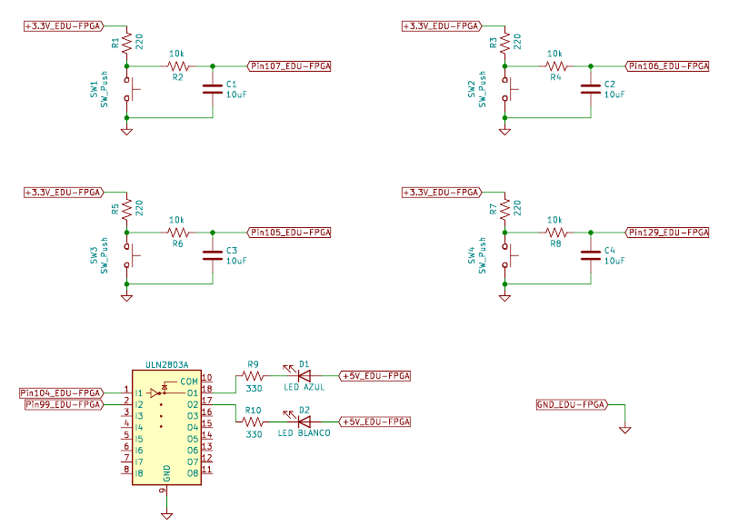

Cada pulsador está acompañado de un resistor *pull-up* y un circuito antirrebote (*debounce*) compuesto por un circuito serie RC (Resistor-Capacitor). A causa de los resistores pull-up, cuando los pulsadores no estén presionados transferirán un 1 a los pines de entrada, mientras que transferirán un 0 si se los pulsa. Esto es conveniente para las entradas **outEnable_in** y **clockEnable_in** ya que no se deben mantener presionados sus pulsadores constantemente para habilitar las salidas y el clock del registro. Sin embargo, no es adecuado para las entradas **d_in**, **load_in** y **reset_in** porque implica trabajar con **lógica negativa** para **d_in** y que el registro en todo momento está siendo cargado en forma paralela y/o reseteado a menos que se pulsen los interruptores apropiados. Por lo tanto, dentro del top-level se invierten estas tres entradas para contrarrestar el efecto de los resistores pull-up.

La asignación de pines en la EDU-CIAA-FPGA es:

|      **Componente**        |   **Pin FPGA**    | **Pin registro top-level** |
|:--------------------------:|:-----------------:|:--------------------------:|
| Pulsador embebido 1        |       31          |   d_in(0)                  |
| Pulsador embebido 2        |       32          |   d_in(1)                  |
| Pulsador embebido 3        |       33          |   d_in(2)                  |
| Pulsador embebido 4        |       34          |   d_in(3)                  |
| Pulsador externo 1 (GPIO)  |       107         |   outEnable_in             |
| Pulsador externo 2 (GPIO)  |       106         |   reset_in                 |
| Pulsador externo 3 (GPIO)  |       129         |   clockEnable_in           |
| Pulsador externo 4 (GPIO)  |       105         |   load_in                  |
| Oscilador 12 MHz a cristal |       94          |   clock_in                 |
| LED embebido 1             |       1           |   storedData_out(0)        |
| LED embebido 2             |       2           |   storedData_out(1)        |
| LED embebido 3             |       3           |   storedData_out(2)        |
| LED embebido 4	         |       4           |   storedData_out(3)        |
| LED externo 1              |       104         |   q_out                    |
| LED externo 2              |       99          |   enableReference_out      |

Para ver el archivo **.pcf** ir [aquí](top_regPISO.pcf), y para el pinout de la EDU-FPGA ir [aquí](https://github.com/ciaa/Hardware/blob/master/PCB/EDU-FPGA/Pinout/Pinout%20EDU%20FPGA.pdf)

### 4.4. Ensayo

Como último paso, se sintetiza e implementa el diseño en la placa. En la siguiente imagen se puede apreciar como queda todo el circuito utilizando dos "protoboards" para conectar los componentes externos y también se indica a que entrada o salida corresponde cada pulsador y LED:

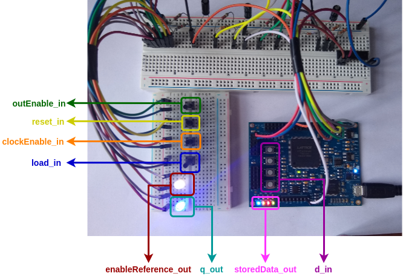

#### 4.4.1. Parte 1 del ensayo: Prueba de d_in y load_in

En el ensayo primero se valida que el registro almacene un dato y que este se vaya desplazando internamente con los pulsos de clock. Para esto, los pulsadores correspondientes a **clockEnable_in**, **reset_in** y **outEnable_in** no se presionan, quedando el registro habilitado completamente y sin resetear. Entonces, se presionan los pulsadores asociados de **d_in** de forma de generar el valor 0001 en dicha entrada, y luego se carga efectivamente el valor pulsando el interruptor de **load_in**. Esto se aprecia en el siguiente GIF:


Se puede ver como en el **paso 1** se carga el valor 0001 en el registro ya que solo el LED embebido 1 (verde) se enciende. Seguidamente, en el **paso 2** se observa como dicho valor se desplaza internamente, pasando:

1. De 0001 a 0010 (LED embebido rojo encendido).
2. De 0010 a 0100 (LED embebido amarillo encendido).
3. De 0100 a 1000 (LED embebido azul encendido).
4. De 1000 a 0000 (ningún LED embebido encendido).

En otras palabras, el desplazamiento interno se puede ver en como se apaga un LED embebido e inmediatamente se enciende el que está a su izquierda, evidenciando así como el bit 1 se va moviendo hacia la izquierda. 

Vale aclarar que en todo momento la salida **q_out** (LED externo azul) copia al bit más significativo almacenado internamente (**storedData_out(3)** o, lo que es lo mismo, al LED embebido azul). Además, es importante observar como el dato almacenado del registro **SOLO CAMBIA CUANDO EL LED EXTERNO BLANCO CONMUTA DE ESTADO**, lo que quiere decir que el registro interno cambia de estado cuando está habilitado y recibe un flanco de clock que lo active. Esto coincide con el comportamiento esperado.

---

La segunda parte del ensayo es acerca de validar que las entradas de control **clockEnable_in**, **reset_in** y **outEnable_in** funcionen correctamente. Para esto se realizan en orden los siguientes pasos:

#### 4.4.2. Parte 2, paso 1 del ensayo: Prueba de clockEnable_in

Se carga el valor 0010 en el registro, quedando encendido solo el LED embebido rojo. Luego se deja desplazar este a 0100 (LED embebido amarillo encendido) y se presiona el pulsador de **clockEnable_in**, deteniéndose la conmutación del LED externo blanco y quedando guardado dicho valor en el registro. Finalmente se libera el pulsador para rehabilitar el clock, por lo que se reanuda el desplazamiento interno del dato.


#### 4.4.3. Parte 2, paso 2 del ensayo: Prueba de reset_in

Se carga el valor 0010 en el registro, quedando encendido solo el LED embebido rojo. Luego se deja desplazar este a 0100 (LED embebido amarillo encendido) y se presiona el pulsador de **reset_in**. Cuando sucede esto todos los LED embebidos correspondientes a **storedData_out** quedan apagados porque el registro se reinicia.


#### 4.4.4. Parte 2, paso 3 del ensayo: Prueba de outEnable_in

Se carga el valor 0010 en el registro, quedando encendido solo el LED embebido rojo. Seguidamente, se deja desplazar dicho valor mientras que se presiona varias veces el pulsador de **outEnable_in**. Se observa como al estar presionado los LED de **storedData_out** y **q_out** quedan apagados porque las salidas se ponen en alta impedancia.


Se puede decir finalmente que el diseño top-level basado en un registro PISO de 4 bits **funciona según lo esperado**.


## 5. Véase también

### 5.1. Sintaxis relacionada

* [Descripción secuencial en VHDL](https://gitlab.com/RamadrianG/wiki---fpga-para-todos/-/wikis/Descripci%C3%B3n-secuencial-en-VHDL)
* [Descripción estructural en VHDL](https://gitlab.com/RamadrianG/wiki---fpga-para-todos/-/wikis/Descripci%C3%B3n-estructural-en-VHDL)
* [Testbenches en VHDL](https://gitlab.com/RamadrianG/wiki---fpga-para-todos/-/wikis/Testbenches-en-VHDL)
* [Automatización de testbenches en VHDL](https://gitlab.com/RamadrianG/wiki---fpga-para-todos/-/wikis/Testbench-automatizado-en-VHDL)

- [Descripción secuencial en Verilog](https://gitlab.com/RamadrianG/wiki---fpga-para-todos/-/wikis/Descripci%C3%B3n-secuencial-en-Verilog)
- [Descripción estructural en Verilog](https://gitlab.com/RamadrianG/wiki---fpga-para-todos/-/wikis/Descripci%C3%B3n-estructural-en-Verilog)
- [Testbenches en Verilog](https://gitlab.com/RamadrianG/wiki---fpga-para-todos/-/wikis/Testbenches-en-Verilog)
- [Automatización de testbenches en Verilog](https://gitlab.com/RamadrianG/wiki---fpga-para-todos/-/wikis/Testbench-automatizado-en-Verilog)

### 5.2. Ejemplos relacionados

1. [Flip Flop D](../05-FlipFlop_D)
2. [Registro de entrada paralela y salida paralela](../07-Registro_pp)
3. [Registro de entrada serie y salida serie](../08-Registro_ss)
4. [Registro de entrada serie y salida paralela](../10-Registro_sp)
5. [Contador universal](../06-Contador_universal)
6. [NCO](../11-NCO)

## 6. Información adicional: uso de herramientas

Para más información sobre cómo usar el *toolchain* para compilar y simular o 
descargar a la placa según el lenguaje utilizado, referirse a los siguientes 
vínculos:

 - VHDL y Verilog (recomendado): [Entorno basado en Atom][Entorno_Link].
 - Solo VHDL : [GHDL y GTKWave](https://gitlab.com/RamadrianG/wiki---fpga-para-todos/-/wikis/Herramientas-libres-para-VHDL) + [iCEcube2](https://gitlab.com/RamadrianG/wiki---fpga-para-todos/-/wikis/Software-Lattice) + [IceStorm][IceStorm_link]
 - Solo Verilog : [icarusVerilog y GTKWave](https://gitlab.com/RamadrianG/wiki---fpga-para-todos/-/wikis/Herramientas-libres-para-Verilog) + [IceStorm][IceStorm_link]

[Entorno_Link]: https://gitlab.com/RamadrianG/wiki---fpga-para-todos/-/wikis/Uso-del-entorno
[IceStorm_link]: https://gitlab.com/RamadrianG/wiki---fpga-para-todos/-/wikis/Proyecto-iCEstorm

## 7. Referencias

[^1]: "Lattice ICE<sup>TM</sup> Technology Library", Lattice Semiconductor, Hillsboro, Oregon, USA, Version 3.0, August 2016.
[^2]: "iCE40 LP/HX Family", Lattice Semiconductor, Hillsboro, Oregon, USA, Data Sheet, FPGA-DS-02029-3.5, September 2018.
[^3]: "ULN2803A Darlington Transistor Arrays", Texas Instruments, datasheet SLRS049H, february 1997–revised february 2017.
