# Registro Serie-Paralelo

[[_TOC_]]

## 1. Descripción

En este ejemplo se diseña un **registro de desplazamiento entrada en serie/salida en paralelo**. Es un **circuito secuencial**, esto quiere decir que su salida depende, no solo de la combinación presente en sus entradas en un determinado momento, sino también de la historia de las entradas anteriores.

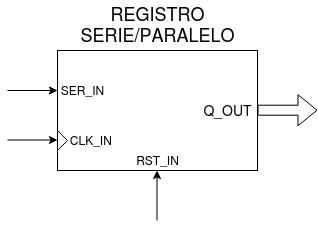

Al igual que el [registro SISO](../08-Registro_ss), está formado por una serie de [flip-flops tipo D](../05-FlipFlop_D) conectados en cascada donde podemos ingresar datos en serie por la entrada del primer flip-flop.  


<br>

*Topología interna de un registro SIPO de 4 bits.*

Su funcionamiento es extremadamente similar al del registro serie/serie, la única diferencia con respecto a estos es que en el registro serie/paralelo **todas las salidas** de los flip-flops son accesibles. Esto nos permite **convertir** los datos en serie que ingresan por la entrada *ser_in* a datos en paralelo que saldran por el bus de salida *q_out*.


## 2. Código

### 2.1 VHDL

Lo primero que debemos hacer es incluir los paquetes que vamos a necesitar, en nuestro caso vamos a necesitar el *std_logic_1164* para poder usar los tipos de datos **std_logic** y **std_logic_vector**.

```vhdl
library ieee;
use ieee.std_logic_1164.all;
```
A continuación vamos a declarar la **entidad**, en la cual se determinan las *entradas* y *salidas* que tendrá nuestro diseño y un genérico *Nbits* que determinará el tamaño del registro, es decir la cantidad de flip-flops que lo componen o, en otras palabras, la cantidad de veces que se desplazará un bit entrante dentro del registro.

```vhdl
--Entidad
entity regSIPO is
  generic (Nbits : integer range 8 to 64 := 8);
  port(
    clk_in : in std_logic;
    rst_in : in std_logic;
    ser_in : in std_logic;
    q_out : out std_logic_vector(Nbits-1 downto 0));
end entity regSIPO;
```
Por último, dentro de la **arquitectura** se debe determinar el funcionamiento interno de nuestro diseño.

Para ejecutar lógica secuencial, VHDL nos ofrece las estructuras del tipo [process](https://gitlab.com/RamadrianG/wiki---fpga-para-todos/-/wikis/Descripci%C3%B3n-secuencial-en-VHDL#procesos-secuenciales). El process se activa cuando se produce un cambio en el valor de una o más de las señales presentes en la **lista de sensibilidad**, en nuestro caso será: *clk_in*.

```vhdl
--Arquitectura
architecture regSIPO_arch of regSIPO is
signal serialReg_s : std_logic_vector(Nbits-1 downto 0);
begin
  do_shift:	process(clk_in) begin
    if (rising_edge(clk_in)) then
      if rst_in = '1' then
        serialReg_s <= (others => '0');
      else
        serialReg_s <= ser_in & serialReg_s(Nbits-1 downto 1);
      end if;
    end if;
  end process do_shift;
  q_out <= serialReg_s;
end architecture regSIPO_arch;
```
<br/>

Vemos que el *process* detecta si hay un flaco positivo de *clk_in*. Si la entrada de reset está en alto, se resetea el vector *serialReg_s* dejando todos sus bits en bajo.

A diferencia del registro serie/serie, no solo saldrá por salida el bit menos significativo sino que saldrá todo el *serialReg_s* ya que ahora *q_out* es un **vector**. 

```vhdl
q_out <= serialReg_s;
```
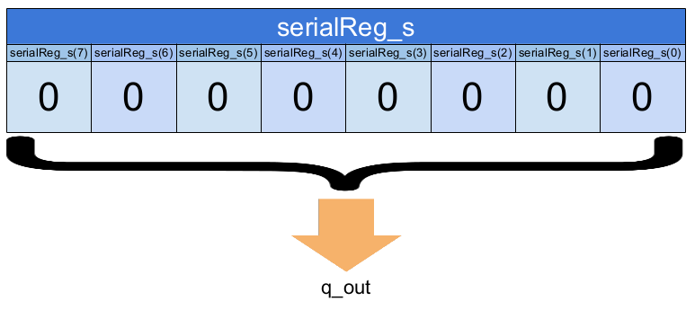

Ahora bien, si la entrada **rst_in** no esta en alto, de la misma forma que en registro SISO se realizará el *desplazamiento de los bits*:
```vhdl
serialReg_s <= ser_in & serialReg_s(Nbits-1 downto 1);
```

Se concatena el bit que llega desde la entrada **ser_in** con los 7 bits más significativos del vector *serialReg_s*.

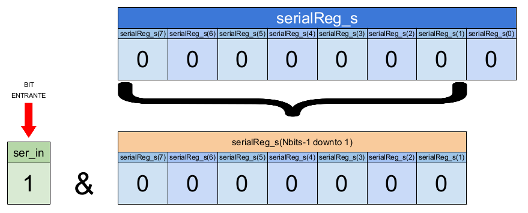

Al vector *serialReg_s* se le asigna como valor el resultado de esta concatenación y luego saldrá por **q_out**.

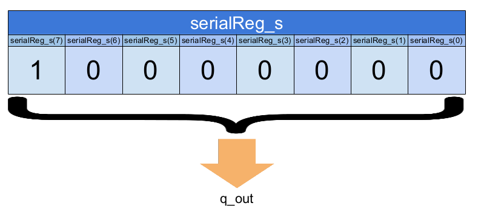

Al repetir este proceso se descarta el bit menos significativo del vector y se concatena como bit más significativo al bit entrante dando por resultado el desplazamiento de los bits. Convirtiendo así los datos que ingresan en **serie** a datos en **paralelo**.

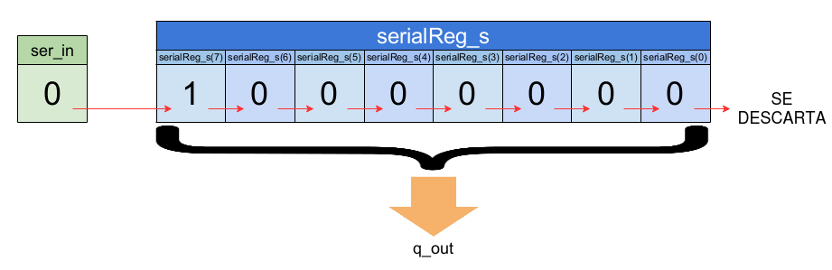

Si, por ejemplo, ingresamos un "0" por la entrada *ser_in*, vemos como se desplazan cada uno de los bits a través del registro y se descarta el lsb (least significant bit o bit menos significativo) quedando como resultado:  

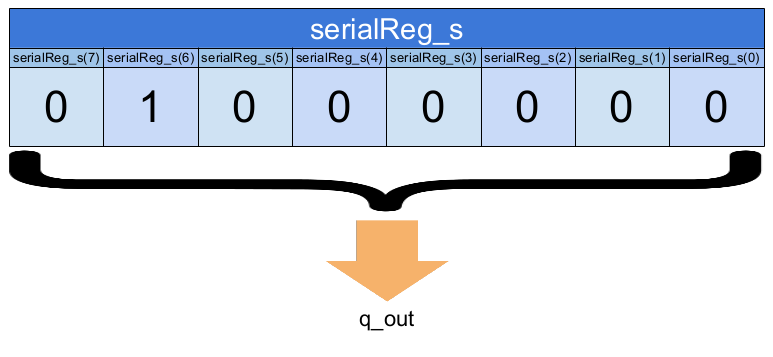


[Aquí](VHDL/regSIPO.vhdl) podrá encontrar el código completo.

## 3. Simulación
### 3.1 *Testbench* en VHDL

Teniendo en cuenta que el registro de desplazamiento SIPO (Serial Input/Parallel Output) es un **circuito secuencial**, es decir que el estado de sus salidas depende no solo del estado actual de sus entradas sino también de la historia anterior de las mismas, vamos verificar el diseño colocando algunos posibles valores en sus entradas que contemplen los diferentes casos que se pueden tener.

Realizaremos un testbench muy similar al que utilizamos para probar el registro SISO. La principal diferencia es que ahora la señal *test_q* sera un **vector**.
```vhdl
  signal test_q   : std_logic_vector(bits-1 downto 0);
```

Tanto la entrada *ser_in* como la entrada de clock *clk_in* estarán a la **misma frecuencia**.

Estas frecuencias se determinan a través de dos constantes que serán el periodo del clock y de la señal de entrada, respectivamente.

```vhdl
constant periodClk  : time := 60 ns;
constant periodData : time := 60 ns;
```

Probaremos un registro de 8 bits que se determina a través de la constante **bits**.

```vhdl
  constant bits   : integer := 8;

```

Se declara un array de 7 elementos llamado *dataTest_s* el cual guardará los valores que probaremos a la entrada de flip-flop.
```vhdl
  signal dataTest_s : std_logic_vector(31 downto 0) := "01010110111000011101100010000100";
```

También se declara una señal *test_stop* que la utilizaremos para detener la simulación.
```vhdl
signal test_stop : std_logic;
```

Utilizaremos 3 **process**. El primero pondrá en alto la entrada de *reset* por dos periodos de clock y luego la mantendrá en bajo.
```vhdl
--Proceso de reset inicial:
    process begin
        test_rst <= '1';
        wait for 2*periodClk; --El reset dura dos periods de clock
        test_rst <= '0';
        wait for periodClk;
        wait; --Bloquear al proceso
    end process;
```

El segundo, lo utilizaremos para generar una señal de clock:
```vhdl
--Proceso de generación de clock
    process begin
        test_clk <= '1';
        wait for periodClk/2;
        test_clk <= '0';
        wait for periodClk/2;
        if (test_stop='1') then
            wait;
        end if;
    end process;
```

Con el último process, a través de una estructura del tipo [for](https://gitlab.com/RamadrianG/wiki---fpga-para-todos/-/wikis/Testbenches-en-VHDL#for-loop) se probarán todos los valores almacenados en el vector a la entrada del registro los cuales se ingresan en serie, uno después del otro.
```vhdl
--Proceso de generación de entradas
    process begin
        test_stop <= '0';
        for i in 0 to ((dataTest_s'length - 1)) loop
          test_ser <= dataTest_s(i);
          wait for periodData;
        end loop;
        test_stop <= '1';
        wait;
    end process;
```

[Aquí](VHDL/regSIPO_tb_entradaSinc.vhdl) podrán encontrar el testbench utilizado para simular el diseño.

### 3.2 Resultados

Se muestra a continuación el resultado de la simulación.

#### 3.2.1 *Testbench* en VHDL con entrada sincrónica
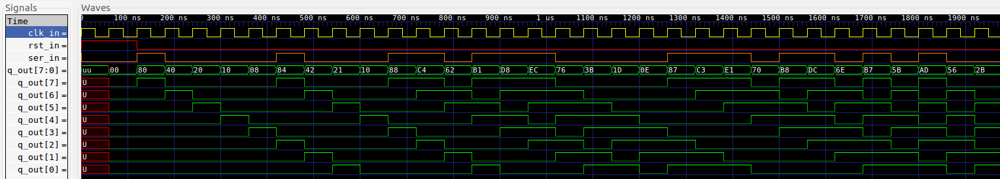
<br> *Simulación en GTKWave*.

Como se observa en la figura cada nuevo dato ingresa en serie por la entrada *ser_in* (señal en color naranja) se va desplazando a través de los bits del bus *q_out* desde el bit más significativo hasta llegar al bit menos significativo después de 8 períodos de clock.<br><br>
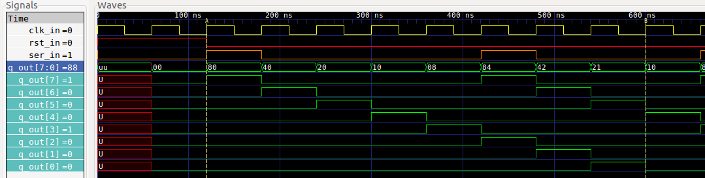

Entre los marcadores A y B podemos ver que los 8 primeros bits ingresador por *ser_in* luego de resetear el registro son 1000100. Pero como el primer bit ingresado es el menos significativo tendriamos el número binario 00100001, el cual equivale al 21 en hexadecimal.

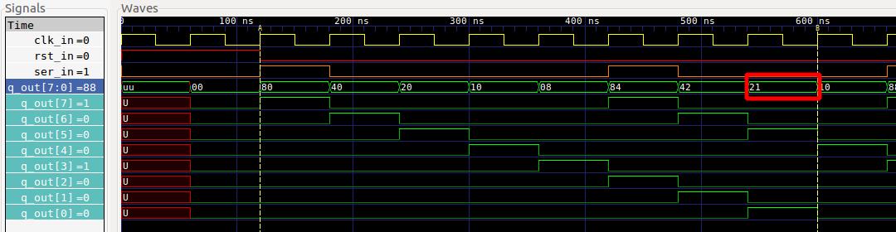

Se aprecia que después de transcurridos 8 períodos de clock podemos encontrar el dato 21 en base 16 en la salida *q_out*. Esto demuestra la conversión de los datos de **serie a paralelo**.

Vemos que este comportamiento se repite a lo largo de toda la simulación cumpliendo la conducta esperada, quedando así verificado el diseño.

## 4. Síntesis
Para sintetizar el registro SIPO de 8 bits se utiliza el programa *Synplify Pro* a través de *iCEcube2*.

### 4.1 RTL View (alto nivel)
Este diseño es independiente de la tecnología utilizada y se compone de estructuras genéricas como registros, multiplexores, etc. A continuación, se aprecia su diagrama esquemático:

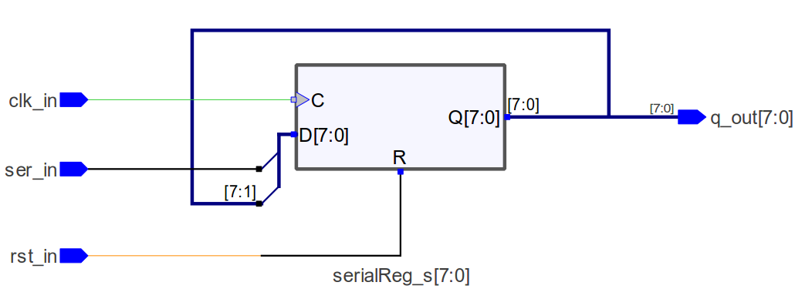

Se ve como el módulo sintetizado se compone de un registro SIPO interno llamado **serialReg_s[7:0]**, el cual tiene entrada de datos **D[7:0]**, de clock **C** y de reset **R** y como salida tiene **Q[7:0]**.

Se ve que este diseño concuerda con el del registro SIPO propuesto.

### 4.2 Tech View (alto nivel)

Este diseño depende de la tecnología en FPGA utilizada y está formado por **primitivas de Lattice**[^1] para el caso de la EDU-FPGA. Estas primitivas son los bloques esenciales utilizados para describir un sistema digital en este bajo nivel, siendo por ejemplo: LUTs, multiplexores, buffers E/S, etc. 

A continuación, se aprecia su diagrama esquemático:

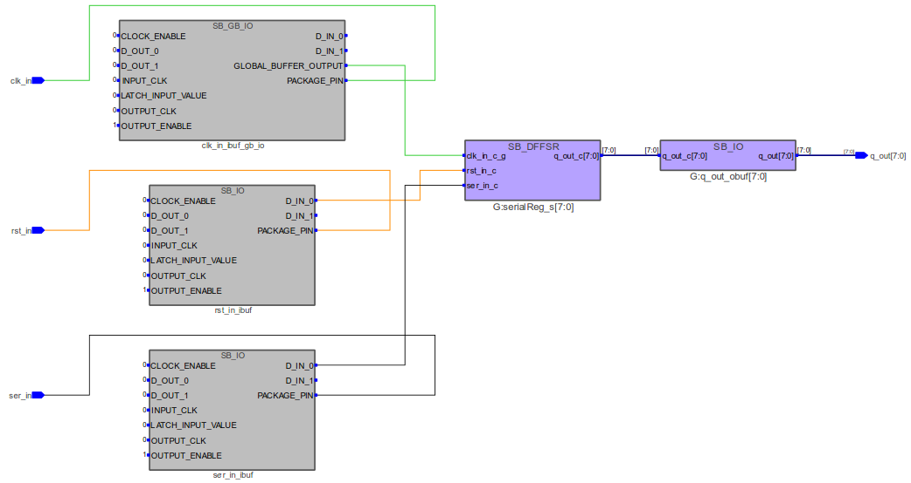

Se ve como aparecen las siguientes primitivas:

1. **SB_IO (gris)**: Es un buffer de entrada y/o salida que se conecta a un pin de entrada y/o salida para víncular este con el interior de la FPGA y definir el comportamiento de dicho pin (si es de entrada y/o salida, si está "latcheado", etc.). Para este diseño, se tiene a *ser_in_ibuf* y *rst_in_ibuf* como buffers para leer pines de entrada.
2. **SB_IO (violeta)**: Es un conjunto de SB_IO. En este caso se tiene a *G:q_out_obuft[7:0]* para controlar los pines de salida (*q_out[7:0]*).
3. **SB_GB_IO**: Estos son buffers globales de alto *fanout* que se utilizan para distribuir por toda la FPGA señales de clock, reset y habilitación[^2]. En este caso, se tiene a *clk_in_ibuf_gb_io* que se usa para leer la señal de entrada de reloj.
4. **SB_DFFER**: Es un registro SIPO de 8 bits con entrada de datos, de clock y de reset. En el diagrama se llama *G:serialReg_s[7:0]* e internamente está compuesto por 8 FF D como podemos ver en la siguiente figura.

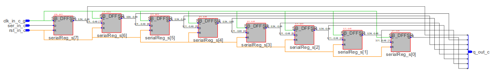

Esto nos indica que lo que hemos diseñado en el *process* a través de concatenar el bit entrante por *ser_in* al registro *serialReg_s[7:0]*, finalmente se sintetiza en una serie de flip-flops tipo D conectados en cascada. Esto concuerda con la topología interna del registro SIPO que se mostró al principio de este ejemplo.

Entendiendo las anteriores primitivas, se puede ver que en definitiva se trata del mismo diseño que el que se vió en alto nivel, con la diferencia del agregado de *buffers*.


## 5. Véase también

### 5.1 Sintaxis relacionada

* [Sintaxis de VHDL](https://gitlab.com/RamadrianG/wiki---fpga-para-todos/-/wikis/Sintaxis-VHDL)
* [Descripción secuencial en VHDL](https://gitlab.com/RamadrianG/wiki---fpga-para-todos/-/wikis/Descripcion-combinacional-en-VHDL)
* [Testbenches en VHDL](https://gitlab.com/RamadrianG/wiki---fpga-para-todos/-/wikis/Testbenches-en-VHDL#for-loop)

### 5.2 Ejemplos relacionados

* [Flip-Flop D](../05-FlipFlop_D)
* [Contador Universal](../06-Contador_universal)
* [Registro Paralelo-Paralelo](../07-Registro_pp)
* [Registro Serie-Serie](../08-Registro_ss)
* [Registro Paralelo-Serie](../09-Registro_ps)
* [Registro Serie-Paralelo](../10-Registro_sp)
* [NCO](../11-NCO)

---
## 6. Información adicional: uso de herramientas

Para más información sobre cómo usar el *toolchain* para compilar y simular o
descargar a la placa según el lenguaje utilizado, referirse a los siguientes
vínculos:
 - VHDL y Verilog (recomendado): [Entorno basado en Atom][Entorno_Link].
 - Solo VHDL : [GHDL y GTKWave](https://gitlab.com/RamadrianG/wiki---fpga-para-todos/-/wikis/Herramientas-libres-para-VHDL) + [iCEcube2](https://gitlab.com/RamadrianG/wiki---fpga-para-todos/-/wikis/Software-Lattice) + [IceStorm][IceStorm_link]
 - Solo Verilog : [icarusVerilog y GTKWave](https://gitlab.com/RamadrianG/wiki---fpga-para-todos/-/wikis/Herramientas-libres-para-Verilog) + [IceStorm][IceStorm_link]

[Entorno_Link]: https://gitlab.com/RamadrianG/wiki---fpga-para-todos/-/wikis/Uso-del-entorno
[IceStorm_link]: https://gitlab.com/RamadrianG/wiki---fpga-para-todos/-/wikis/Proyecto-iCEstorm

## 7. Referencias

[^1]: "Lattice ICE<sup>TM</sup> Technology Library", Lattice Semiconductor, Hillsboro, Oregon, USA, Version 3.0, August 2016.
[^2]: "iCE40 LP/HX Family", Lattice Semiconductor, Hillsboro, Oregon, USA, Data Sheet, FPGA-DS-02029-3.5, September 2018.