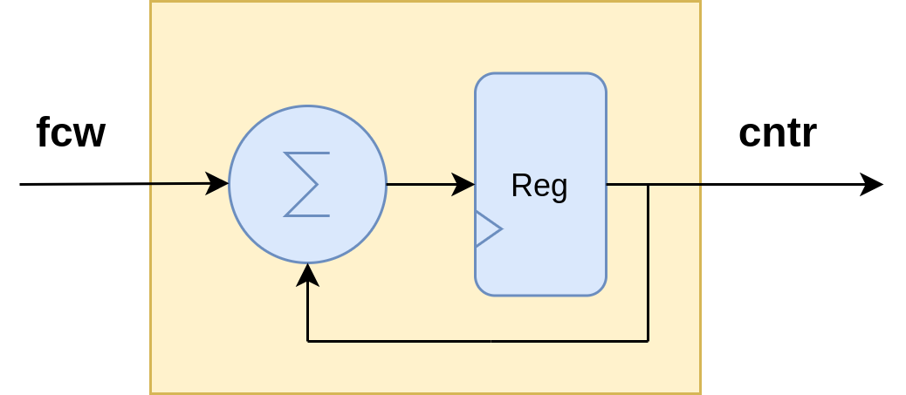
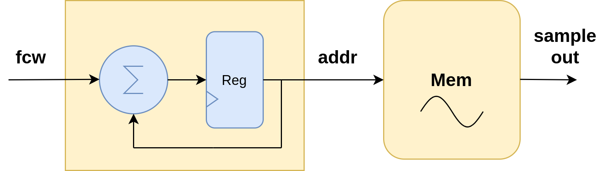
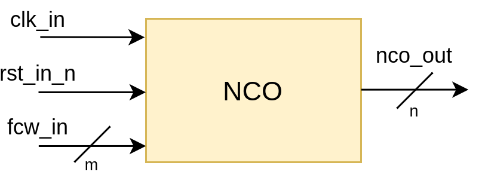
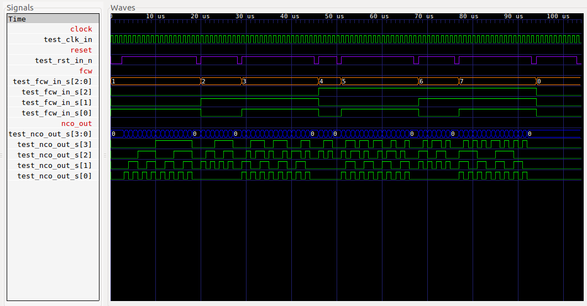
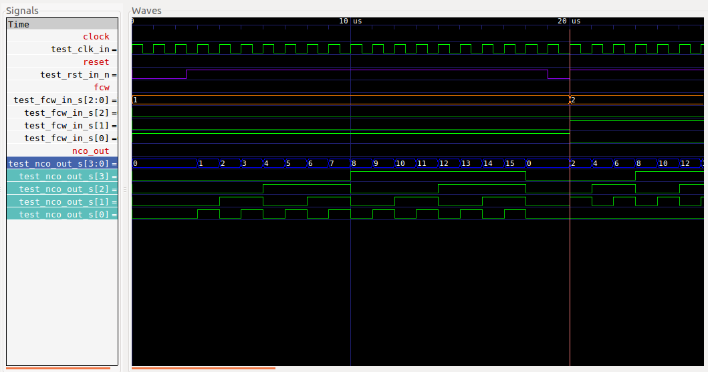
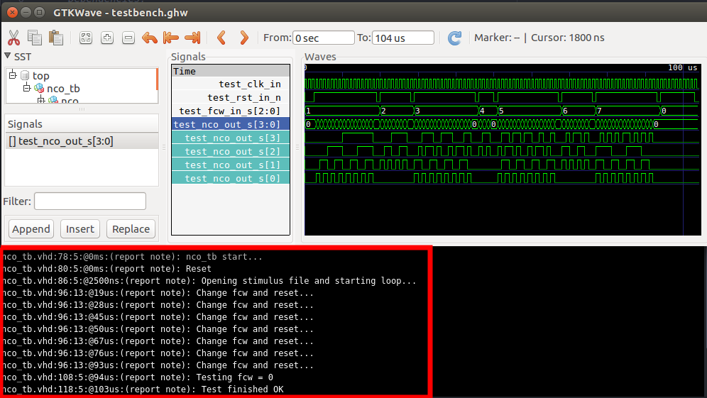

# NCO

## 1. Descripción
### Introducción
En este ejemplo se realizará la síntesis de un oscilador controlado numéricamente, comunmente conocido como NCO por sus siglas en inglés (Numerically Controlled Oscillator). Este tipo de oscilador "digital" resulta de gran utilidad en la práctica, por ejemplo en aplicaciones tales como: síntesis de señales, PLLs digitales, modulación y demodulación de señales para sistemas de radio, entre otras.
La siguiente imagen muestra el diagrama en bloques del NCO que implementaremos:


El funcionamiento es simple: consta de un contador que irá incrementando su valor con cada pulso de clock. La magnitud del incremento está definida por la **fcw** (Frequency Control Word), y una vez que llega a su valor máximo, se reinicia (es decir, vuelve a cero). De esta forma, con cada ciclo de clock, el contador hará la siguiente operación:

```math

cntr' = cntr+fcw

``` 
Siendo **cntr'** el estado que tomará el contador luego de cada pulso de clock, y **cntr** el valor actual del mismo.
Así de sencillo es su modo de funcionamiento. Cambia la fcw, cambia la magnitud de los incrementos. Sin embargo, por más sencillo que parezca, uno puede preguntarse: ¿De qué manera es controlada la frecuencia del oscilador? Una forma de responder esta pregunta es con un ejemplo.
### Ejemplo
Supongamos un NCO cuyo contador va de 0 a 15. Podríamos verlo como un contador de 4 bits, el cual es capaz de contar de 0 a 15 y luego se resetea para seguir contando nuevamente desde 0. Supongamos también una fcw que puede tomar valores entre 0 y 3 (es decir, una fcw de 2 bits). Siendo la fcw de 2 bits, podemos decir que hay 4 combinaciones posibles de valores que puede tomar, lo cual dará 4 valores de frecuencia distintos para nuestro NCO.
En primer lugar, teniendo en cuenta la expresión matemática del incremento del contador, podemos notar una característica: ¿Qué pasa si la fcw es igual a cero? Según la expresión presentada más arriba:

```math

cntr' = cntr+0 = cntr

``` 
En pocas palabras, si la fcw = 0, el contador **no se incrementa**. Lo cual da lugar a un valor constante, independientemente de los pulsos de clock que lleguen. Un valor constante con el tiempo representa una **frecuencia igual a cero**. Por lo tanto, la primer conclusión que sacamos es: **la frecuencia se hace cero si fcw = 0**.

Ahora veamos qué pasa si fcw = 1. En este caso, el contador se incrementará de 1 en 1 hasta llegar a 15. En el siguiente cuadro vamos a tabular la cantidad de pulsos de clock que entran vs el valor del contador:

|N°Pulsos de clock| Valor del contador|
|-----------------|-------------------|
|        0        |         0         |
|        1        |         1         |
|        2        |         2         |
|        3        |         3         |
|        4        |         4         |
|        5        |         5         |
|        6        |         6         |
|        7        |         7         |
|        8        |         8         |
|        9        |         9         |
|       10        |        10         |
|       11        |        11         |
|       12        |        12         |
|       13        |        13         |
|       14        |        14         |
|       15        |        15         |
|       16        |         0         |

Vemos aquí que, para que el contador de un ciclo completo (es decir, que vaya de 0 a 15 y vuelva a 0), la cantidad de pulsos de clock recibidos es igual a 16. Por lo tanto, **la frecuencia del NCO con fcw = 1 es 16 veces menor a la frecuencia del clock**. ¿Qué pasaría si en lugar de tener un contador de 4 bits tuvieramos uno de N bits? En ese caso, la cantidad de valores que toma es 2^N, y al tener una fcw = 1, la frecuencia de salida sería:

```math

f_{out} = {\frac {f_{clk}} {2^{N}}}

``` 

Veamos ahora qué pasa si fcw = 2:

|N°Pulsos de clock| Valor del contador|
|-----------------|-------------------|
|        0        |         0         |
|        1        |         2         |
|        2        |         4         |
|        3        |         6         |
|        4        |         8         |
|        5        |        10         |
|        6        |        12         |
|        7        |        14         |
|        8        |         0         |


En este caso, cada 8 pulsos de clock, el contador da un ciclo completo. De esta forma, la frecuencia del contador es 8 veces menor a la frecuencia del clock. Aquí, al duplicar el valor de la fcw, se duplicó el valor de la frecuencia. Por otro lado, si fcw = 0, la frecuencia es igual a cero, lo cual deja en evidencia la proporcionalidad existente entre la fcw y la frecuencia de salida. En síntesis, todo lo anterior se resume en la siguiente expresión, la cual es **característica del NCO**:

```math

f_{out} = fcw.{\frac {f_{clk}} {2^{N}}}

``` 

### Aplicación a síntesis de señales
Como se mencionó más arriba, una de las aplicaciones del NCO es la síntesis de señales. Si bien, esto se tratará en detalle en el ejemplo [NCO-LUT](../19-NCO_LUT), se hará una breve introducción aquí.

Sabiendo que el contador del NCO tiene N bits, surge lo siguiente: ¿Qué pasa si la salida del contador se usa como "dirección" de una memoria? ¿Qué pasa además si esa memoria guarda samples de una señal X que se desea sintetizar? El diagrama siguiente muestra lo que aquí se propone:



Supongamos entonces que en la memoria tenemos los samples de **un período** de una señal X, por ejemplo 1024 muestras de una señal senoidal. Usando un NCO con una salida de 10 bits, podemos direccionar esta memoria e ir leyendo un sample distinto por cada pulso de clock. La cantidad de samples que se lean de esa señal dependerá entonces de la cantidad de pulsos de clock que entran en un ciclo del contador. Por ejemplo, si un contador de 10 bits cuenta de 1 en 1, este irá desde 0 hasta 1023, para luego volver a 0. En este caso, **todos** los samples de la señal guardada en la memoria serán leídos en 1024 pulsos de clock. Si ahora suponemos que esos samples se envían a un DAC (Digital to Analog Converter) para sintetizar la señal, podríamos preguntarnos ¿Qué frecuencia tendría la señal sintetizada? Para responder esto, veamos lo siguiente: dijimos recién que se leyeron las 1024 muestras de la señal en 1024 pulsos de clock. Si quisieramos calcular el período total, esto sería:

```math

T_{out} = 1024.T_{clk}

``` 

Es decir, el período es 1024 veces mayor, o dicho de otra manera:

```math

f_{out} = {\frac {f_{clk}} {1024}}

``` 

La frecuencia será 1024 veces menor a la del clock. 
Ahora, supongamos que en lugar de contar de 1 en 1, el contador incrementa en 2 cada vez que llega un pulso de clock. En este caso, la memoria se recorre de 2 en 2, salteando un sample. Es decir que en lugar de leer 1024 samples de la memoria, se leen 512. En otras palabras, podemos decir que ahora el período de la señal sampleada "se recorre más rápido", al doble de velocidad dado que se saltea una muestra. Veamos entonces qué período tendría la señal que se convertiría con el DAC:

```math

T_{out} = 512.T_{clk}

```
El período es la mitad del ejemplo anterior de las 1024 muestras leídas, lo cual lógicamente deriva en que la frecuencia sea el doble, es decir fclk/512. Vemos entonces cómo es posible, teniendo un único período de una señal sampleada, **generar señales similares con frecuencia variable**.

Una pregunta válida es: ¿Acaso no pierdo detalles de la señal al saltear samples? Lógicamente, sí, se pierden samples. Esto es algo que sucede, por lo menos con esta implementación de NCO+memoria. Ahora bien, no siempre esta pérdida es perjudicial para el fin que uno quiera darle. 

Como se mencionó más arriba, esta introducción se hace con el fin de mostrar una de las aplicaciones del NCO, la cual será profundizada en otro ejemplo. A continuación, veremos el código del NCO básico, es decir del contador controlado por la fcw.

## 2. Código

Dado que el funcionamiento de este core fue explicado en la introducción, aquí repasaremos brevemente la interfaz propuesta y su comportamiento en términos de **VHDL**. La descripción completa del NCO se encuentra [aquí](VHDL/nco.vhd).

### Entidad

La interfaz del NCO, seguida de la descripción de su entidad se muestran a continuación:



```vhdl

entity nco is
generic(
    ncoBits : integer := 10; --Cantidad de bits para el contador del NCO
    freqControlBits : integer := 9); --Cantidad de bits para la palabra de control
port (
    clk_in : in  std_logic;
    rst_in_n : in  std_logic;
    fcw_in : in  std_logic_vector(freqControlBits-1 downto 0);
    nco_out : out std_logic_vector(ncoBits-1 downto 0));
end entity nco;


``` 
Vemos en principio dos generics: **ncoBits** y **freqControlBits**. El primero de ellos define la cantidad de bits que tendrá el contador del NCO, y el segundo define la cantidad de bits que tendrá la palabra de control **fcw_in**. Vale aclarar que la fcw debe tener una cantidad de bits menor o igual que la del contador.

### Funcionamiento

Como se mencionó previamente, el core del NCO no es más que un contador que se incrementa con el valor indicado por la fcw:

```vhdl

architecture nco_arch of nco is
signal nco_cnt : unsigned(ncoBits-1 downto 0);
begin

doNCO:
process(clk_in,rst_in_n)
begin
    if(rst_in_n='0') then
        nco_cnt <= (others=>'0');
    elsif(rising_edge(clk_in)) then
        nco_cnt <= nco_cnt + unsigned(fcw_in);
    end if;
end process doNCO;

nco_out <= std_logic_vector(nco_cnt);

end nco_arch;


``` 

La señal interna **nco_cnt** se usa en este caso como contador. Luego, la salida **nco_out** no es más que un reflejo de esta señal interna.

## 3. Simulación

El testbench de este ejemplo puede encontrarse [aquí](VHDL/nco_tb.vhd). Con el fin de probar todos los posibles valores de fcw y compararlo con la salida del NCO, se ha creado un script en Python para generar por un lado el archivo [stimulus.txt](VHDL/stimulus.txt), el cual contiene todas las cuentas que el NCO hará para cada posible valor de fcw. Por otro lado, este script también crea el package [parametersPackage.vhd](VHDL/parametersPackage.vhd), el cual contiene las constantes que indican el número de bits del NCO y de la fcw.
Para ejecutar el script, abrir un terminal en la carpeta "VHDL" de este ejemplo, y ejecutar el comando:

```bash

python Generate.py -n NCOBITS -f FCWBITS

```

En este caso, NCOBITS indica la cantidad de bits del NCO (4,3,10,etc.), mientras que FCWBITS indica la cantidad de bits de la palabra de control. Respecto a NCOBITS, es recomendable usar valores menores o iguales a 12, ya que para mayores tamaños del contador, el test puede requerir un tiempo de procesamiento elevado. FCWBITS se recomienda que sea, como mucho, igual a NCOBITS.

Una vez ejecutado el script, lo que este hará es:

1. Crear el package con las constantes
2. Crear el archivo de estímulos para el test

Para ejecutar el test, puede hacerse tanto desde el plugin de Atom, o bien abriendo un terminal en la carpeta "VHDL" de este ejemplo y  ejecutando el script "test.sh" mediante el comando:

```bash

./test.sh

```

### Resultado:

Luego de ejecutar el test, se abrirá la ventana del visor de formas de onda, mostrando la evolución de las entradas y salidas del NCO en función del tiempo. Para este caso, se realizó el test con NCOBITS = 4 y FCWBITS = 3:



La siguiente imagen muestra particularmente la evolución del NCO cuando fcw = 1, y luego el cambio a fcw = 2:



La salida de consola de Atom al terminar el test mostrará lo siguiente:



## 4. Ensayos

El ensayo final de este core se hará generando señales directamente en la EDU-FPGA. Por tal motivo, se sugiere al lector continuar con el ejemplo [NCO-LUT](../19-NCO_LUT) para estudiar la síntesis de señales, y finalmente con el ejemplo [NCO-LUT-UART](../20-NCO_LUT_UART) para sintetizar el código en VHDL, bajarlo a la placa y testearlo en Hardware.


