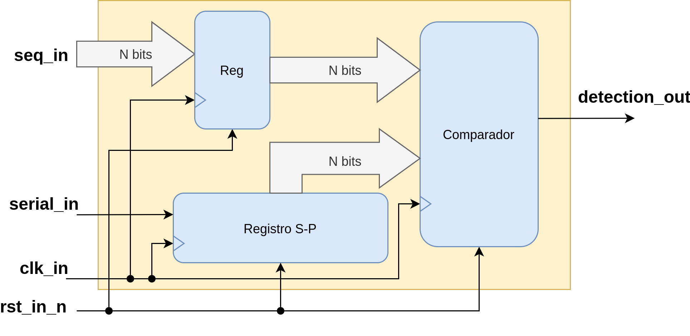
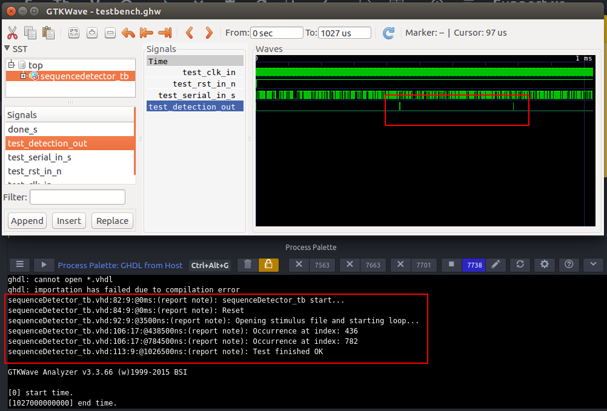
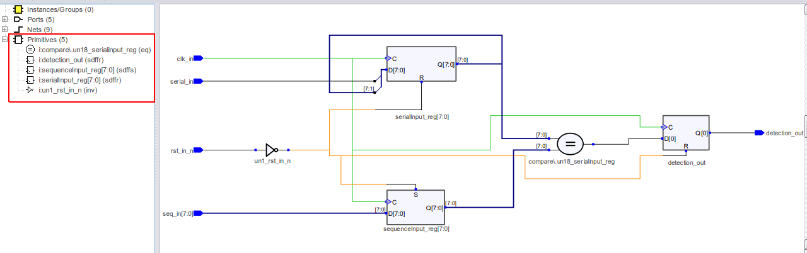
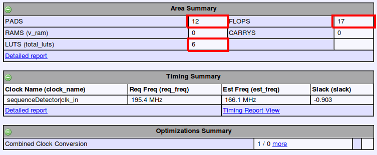
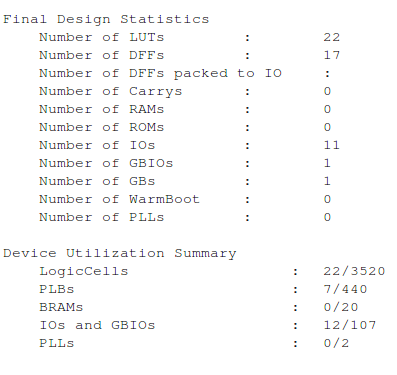

# Detector de trama

[[_TOC_]]

## 1. Descripción

En este ejemplo, se realizará la descripción, test y síntesis de un detector de trama de N bits.

### Introducción

En primer lugar, debe plantearse una arquitectura para el diseño del detector. Dado que hay múltiples formas de resolver un mismo problema, debemos en principio diagramar la solución que vamos a utilizar. 

Para este caso en cuestión, podríamos encarar el diseño mediante una FSM (Finite States Machine), y definir N estados para la secuencia que queremos detectar. Otra forma posible sería mediante un registro de desplazamiento de N bits, el cual recibe los bits en serie y los presenta a su salida en paralelo (es decir, un registro serie-paralelo). Luego, colocando un comparador de N bits en la salida paralelo podremos ver si la trama recibida se corresponde o no con la secuencia que esperábamos recibir. Esta última es la solución que vamos a implementar en este ejemplo, ya que la longitud de la secuencia a detectar no influye en la descripción del módulo (solo es necesario definir el tamaño del registro de desplazamiento y el comparador con un valor genérico de N bits). Si en cambio optamos por hacerlo mediante una FSM, donde el número de estados depende del tamaño de la secuencia a detectar, esto sería mucho más complejo de realizar en la descripción del módulo.

En resumen, el diagrama en bloques de la solución propuesta se presenta a continuación:



Este se compone por:

1. Registro serie paralelo

2. Comparador: presenta un '1' en su salida cuando las dos palabras de N bits de sus entradas son iguales

3. Registro de entrada que guarda la secuencia de N bits que se va a detectar


## 2. Código

A continuación, se presenta brevemente el código de [sequenceDetector.vhd](VHDL/sequenceDetector.vhd):

### Entidad

```vhdl

entity sequenceDetector is
    generic (nBits : integer range 4 to 64 := 8);
    port(
        clk_in : in std_logic;
        rst_in_n : in std_logic;
        serial_in : in std_logic;
        seq_in : in std_logic_vector(nBits-1 downto 0);
        detection_out : out std_logic);
end entity sequenceDetector;

```

La señal de entrada **seq_in** tiene un tamaño dado por el _generic_ **nBits**, y representa la secuencia que se desea detectar. Los datos serie entran por **serial_in**, y la salida **detection_out** se pone en '1' cuando la secuencia dada por **seq_in** fue recibida.

### Arquitectura

```vhdl

architecture sequenceDetector_arch of sequenceDetector is
    signal serialInput_reg : unsigned(nBits-1 downto 0);
    signal sequenceInput_reg : unsigned(nBits-1 downto 0);
begin

    shift_in:
    process(clk_in)
    begin
        if (rising_edge(clk_in)) then
	    if rst_in_n = '0' then
	        serialInput_reg <= (others => '0');
            else
		serialInput_reg <= unsigned(serial_in & serialInput_reg(nBits-1 downto 1));
	    end if;
        end if;
    end process shift_in;

    register_input_seq:
    process(clk_in)
    begin
        if (rising_edge(clk_in)) then
	    if rst_in_n = '0' then
                sequenceInput_reg <= (others => '1');
	    else
	        sequenceInput_reg <= unsigned(seq_in);
	    end if;
	end if;
    end process register_input_seq;

    compare:
    process(clk_in)
    begin
        if (rising_edge(clk_in)) then
	    if rst_in_n = '0' then
	        detection_out <= '0';
	    else
	        if(serialInput_reg = sequenceInput_reg) then
                    detection_out <= '1';
		else
                    detection_out <= '0';
	        end if;
	    end if;
        end if;
    end process compare;


end architecture sequenceDetector_arch;

```

El _process_ denominado **shift_in** corresponde al registro de desplazamiento serie-paralelo. El _process_ **register_input_seq** corresponde al registro de entrada de la señal **seq_in**. Notar que, cuando se da la condición de reset, la salida de este registro pone todos sus bits en '1'. Esto se hace para que al momento del reset, la salida del registro serie-paralelo y la salida del registro de entrada tomen valores distintos (uno pone todos sus bits en '1' mientras que el otro los pone a '0'); de esta forma evitamos que se produzca una "falsa detección" al salir de la condición de reset. Finalmente, el _process_ **compare** representa la descripción del comparador.

## 3. Simulación

La simulación toma como entrada los archivos:

1. [stimulus.txt](VHDL/stimulus.txt): archivo de estímulos con una secuencia de 1024 bits generada aleatoriamente

2. [indexes.txt](VHDL/indexes.txt): archivo que indica en qué posiciones de la trama de 1024 aparece la secuencia a detectar

3. [parametersPackage.vhd](VHDL/parametersPackage.vhd): parámetros de la simulación (número de bits, secuencia a detectar y el número de ocurrencias de esa secuencia en el archivo de estímulos)

Estos tres archivos de entrada se generan mediante el script [generate_stimulus.py](VHDL/generate_stimulus.py). El mismo debe ejecutarse de la siguiente forma:

```bash

python generate_stimulus.py -s 10011100

```

La trama que sigue luego de la opción "-s" es la que tomará el test como ejemplo para detectar. El código completo del testbench se encuentra [aquí](VHDL/sequenceDetector_tb.vhd)


### Resultado:

Ejecutando el test desde el plugin de Atom, se obtiene el siguiente resultado, en este caso se detecta la secuencia "10011100" dos veces en la trama de 1024 bits:



## 4. Síntesis

Utilizando el entorno **iCEcube2** para realizar la síntesis de este ejemplo, obtenemos el siguiente resultado:



En la imagen se puede notar que el diseño utiliza 5 primitivas:

1. Comparador, el cual está representado por el bloque circular con el signo "=" en su interior.

2. Flip-Flop D para la salida **detection_out**

3. Registro de 8 bits (formado por 8 Flip-Flop D) para el registro serie-paralelo, el cual se sintetizó con un tamaño de 8 bits

4. Registro de 8 bits (formado por 8 Flip-Flop D) para la entrada **seq_in**

5. Inversor para la entrada de reset

El reporte _post síntesis_ de recursos utilizados puede verse a continuación:



Este reporte muestra lo siguiente:

* Se utilizaron 12 pads, correspondientes a las señales **clk_in**, **rst_in_n**, **serial_in**, **detection_out** y **seq_in**, esta última con un tamaño de 8 bits, sumando en total 12.

* Se utilizó un total de 6 LUTs, probablemente para implementar el comparador.

* Se utilizó un total de 17 Flip-Flops D de 1 bit (uno para la salida **detection_out**, 8 para la entrada **seq_in** y 8 para el registro de desplazamiento). En total 17.

Luego de la síntesis, el siguiente paso es el _Place and Route_, el cual va a consumir una cantidad adicional de recursos de la FPGA. Esto puede verse en el reporte post PnR:



El mismo muestra un mayor uso de LUTs que el presentado en el reporte post síntesis (22 vs 6).

## 5. Información adicional: uso de herramientas

Para más información sobre el uso de las herramientas para compilar, simular y sintetizar, referirse a los siguientes vínculos:
 - [GHDL y gtkWave](https://gitlab.com/RamadrianG/wiki---fpga-para-todos/-/wikis/Herramientas-libres-para-VHDL) + [iCEcube2](https://gitlab.com/RamadrianG/wiki---fpga-para-todos/-/wikis/Software-Lattice)
 


