# Antirebote

[[_TOC_]]

## 1. Descripción

En este ejemplo se explicará el diseño de una **Finite State Machine** (FSM) que funciona como circuito anti rebote. 

### Introducción

El rebote es un fenómeno que existe en los contactos mecánicos cuando estos cambian de un estado a otro (por ejemplo de abierto a cerrado, o al revés). Durante el rebote (el cual puede durar un tiempo en el orden de milisegundos), el contacto presenta oscilaciones que impiden determinar su estado lógico. Este fenómeno puede solucionarse mediante filtros RC o bien mediante un algoritmo que lo detecte, de forma tal que este no afecte al resto de la lógica del sistema.

Aquí, se presentará una solución antirebote mediante FSM. Su funcionamiento se explica brevemente de la siguiente manera: cuando la FSM detecta un cambio de nivel en la entrada, pone a correr un timer durante un **tiempo fijo**. Luego de este tiempo, la FSM lee el nivel presente en la entrada y determina si el estado corresponde a un uno o un cero. En pocas palabras, cada vez que cambia el nivel lógico de entrada, la máquina espera un tiempo determinado y recién entonces determina efectivamente el estado lógico de la señal, esperando que pase el transitorio del rebote. 

A continuación se describen los estados de la FSM que aquí se propone y se presenta el diagrama de estados y transiciones de la misma:


1. **idle_state**: Estado inicial, timer inhabilitado, salida **y_out** en alta impedancia. En función del nivel de la señal de entrada **btn_in**, pasa a 'zero_state' o 'one_state'. 

2. **zero_state**: salida **y_out** en '0', timer inhabilitado. Cambia al estado 'wait_state' cuando la señal de entrada toma el valor '1'.

3. **one_state**: salida **y_out** en '1', timer inhabilitado. Cambia al estado 'wait_state' cuando la señal de entrada toma el valor '0'.

4. **wait_state**: aquí la salida y_out mantiene su nivel previo, y el timer comienza a contar. Sale una vez que el timer finaliza (timerTc_s = '1')

5. **compare_state**: estado donde la FSM lee el nivel de entrada una vez finalizado el tiempo de del timer (y el transitorio), y en función de ese nivel, cambia a 'zero_state' o 'one_state'.

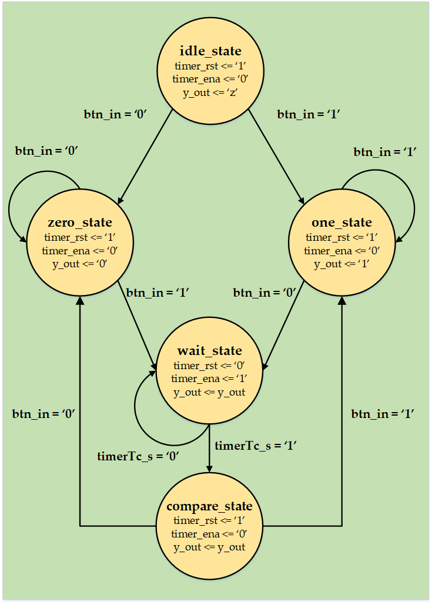

## 2. Código

A continuación, se presenta el código de [debounce.vhd](VHDL/debounce.vhd):

### Entidad

```vhdl

entity debounce is
generic(
    debounceTime : time := 10 ms; --debounceTime por defecto es 10 mseg
    clkFreqMhz : real := 1.0); --Frecuencia de clock en MHz, por defecto 1 MHz
port(
    btn_in : in std_logic;
    clk_in : in std_logic;
    rst_in_n : in std_logic;
    y_out : out std_logic);
end entity debounce;


```

Las señales **btn_in** y **y_out** corresponden a la entrada y salida, respectivamente. El _generic_ **debounceTime** representa el tiempo que la FSM esperará hasta que haya pasado el rebote. El _generic_ **clkFreqMhz** indica la frecuencia de clock (**clk_in**) en MHz. Estos _generics_ se usan en la arquitectura para calcular tanto el número de bits del contador, como el número de cuentas que este debe realizar para generar la demora de tiempo determinada por **debounceTime**.


### Arquitectura

#### Constantes y señales

```vhdl

architecture debounce_arch of debounce is
    --Constantes--
    constant CLK_PER_NS : time := (1.0/clkFreqMhz)*1000 ns;
    constant M_COUNTS : integer := integer(ceil(real(debounceTime/CLK_PER_NS))); --Nº de cuentas para esperar
    constant N_BITS_CNTR : integer := integer(ceil(log2(real(M_COUNTS)))); --Nº bits del timer
    --Timer--
    signal timer_cnt : unsigned(N_BITS_CNTR downto 0);
    signal timer_rst : std_logic; --reset del timer
    signal timer_ena : std_logic; --enable del timer
    signal timerTc_s : std_logic; --terminal count del timer
    --FSM--
    type statesFSM is (idle_state, zero_state, wait_state, compare_state, one_state);
    signal currentState_s, nextState_s : statesFSM;
begin

```

El código anterior muestra únicamente la declaración de constantes y señales usadas en la arquitectura. La constante **CLK_PER_NS** se calcula a partir del _generic_ **clkFreqMhz**, y representa el período del clock en nanosegundos. La constante **M_COUNTS** representa el número de cuentas que el timer hará para obtener la demora especificada, y se calcula a partir de **clkFreqMhz** y el _generic_ **debounceTime**. La constante **N_BITS_CNTR** determina la cantidad de bits del timer, y se calcula a partir de **M_COUNTS**. El resto de las señales declaradas aquí corresponden a señales de control del timer (resets, enables, cuenta terminal) y los estados de la FSM.

#### Timer

El siguiente código muestra el diseño del timer. El mismo incrementa su valor con cada pulso de clock, cuando las señales **timer_ena** y **timer_rst** estan en '1' y '0', respectivamente. Una vez que alcanza el valor **M_COUNTS - 1**, pone en '1' la señal **timerTc_s**:

```vhdl

    --Timer para esperar que pase el transitorio
    timer:
    process(clk_in)
    begin
        if rising_edge(clk_in) then
	    if (timer_rst = '1') then
	        timerTc_s <= '0';
	        timer_cnt <= (others => '0');
	    elsif (timer_ena = '1') then
	        if  (timer_cnt = M_COUNTS - 1) then
                    timerTc_s <= '1';
		else
                    timer_cnt <= timer_cnt + 1;
	        end if;
	    end if;
        end if;
    end process timer;

```

#### Parte secuencial de la FSM

El siguiente código muestra la lógica que asigna los estados de la FSM de manera sincrónica:

```vhdl

    --Parte secuencial de la FSM
    sequential:
    process(clk_in,rst_in_n)
    begin
        if (rst_in_n = '0') then
            currentState_s <= idle_state;
	elsif rising_edge(clk_in) then
	    currentState_s <= nextState_s;
	end if;
    end process sequential;

```

#### Parte combinacional de la FSM

La lógica de señales de control, estados y salidas se muestra a continuación:

```vhdl

--Parte combinacional de la FSM
    combinational:
    process(btn_in,timerTc_s,currentState_s)
    begin
        case currentState_s is
            when idle_state =>
                timer_rst <= '1';
	        timer_ena <= '0';
                y_out <= 'Z';
	        if (btn_in = '0') then
                    nextState_s <= zero_state;
		elsif (btn_in = '1') then
                    nextState_s <= one_state;		        
                else
                    nextState_s <= idle_state;
		end if;

	    when zero_state =>
	        timer_rst <= '1';
		timer_ena <= '0';
		y_out <= '0';
		if (btn_in = '1') then
		    nextState_s <= wait_state;
                else
                    nextState_s <= zero_state;
                end if;

	    when one_state =>
	        timer_rst <= '1';
		timer_ena <= '0';
		y_out <= '1';
		if (btn_in = '0') then
		    nextState_s <= wait_state;
                else
                    nextState_s <= one_state;
                end if;

	    when wait_state =>
	        timer_rst <= '0';
		timer_ena <= '1';
		if(timerTc_s = '1') then
		    nextState_s <= compare_state;
                else
                    nextState_s <= wait_state;
		end if;

	    when compare_state =>
	        timer_rst <= '1';
		timer_ena <= '0';
		if(btn_in = '1') then
		    nextState_s <= one_state;
		elsif(btn_in = '0') then
		    nextState_s <= zero_state;
                else
                    nextState_s <= idle_state;
		end if;

	    when others =>
	        timer_rst <= '1';
	        timer_ena <= '0';
		nextState_s <= idle_state;
        end case;
end process combinational;

```

## 3. Simulación

Con el fin de simular y probar el diseño propuesto, se han capturado con un **DSO** (Digital Storage Oscilloscope) un conjunto de señales que presentan rebotes e incluso _glitches_. Las señales que se muestran a continuación fueron guardadas en formato _.csv_ para su procesamiento. Dado que los estímulos de entrada para el testbench que aquí se utiliza deben ser digitales, es necesario procesar las señales obtenidas con el DSO para "limpiarlas" y obtener a partir de ellas señales equivalentes con dos estados lógicos posibles ('0' o '1'). Con este objetivo, basta fijar un umbral (por ejemplo, la mitad de la tensión equivalente al '1' lógico) de forma tal que las tensiones por debajo de ese umbral se consideren un '0', mientras que las tensiones por encima se consideran '1'.

1. Señal que presenta un transición de '0' a '1' con rebote:

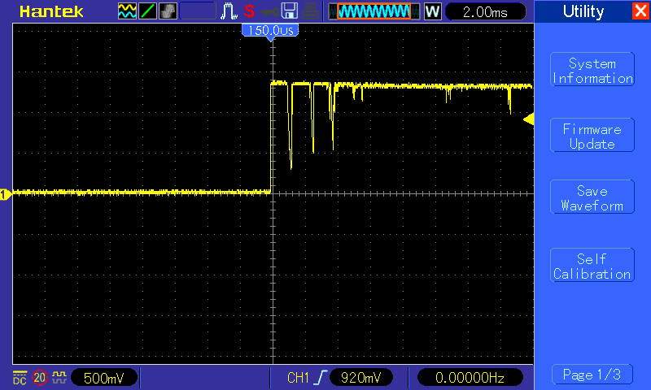

Pre y post procesamiento:

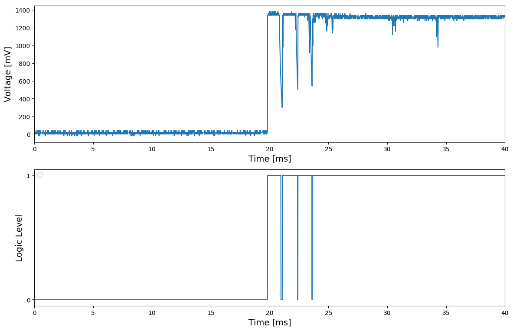

2. Señal en estado '1' que presenta glitches momentáneamente:

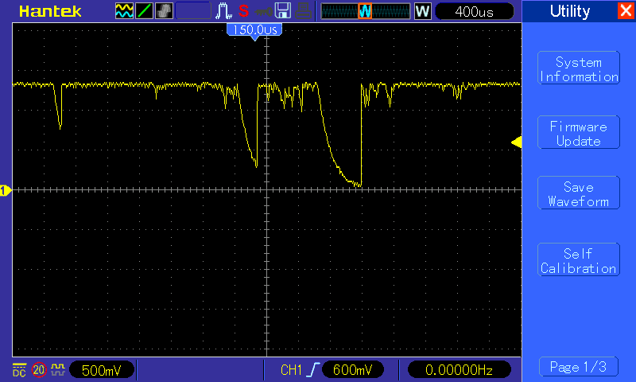

Pre y post procesamiento:


3. Señal en estado '0' que presenta glitches momentáneamente:

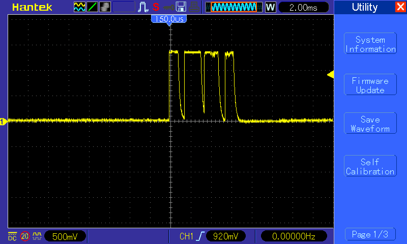

Pre y post procesamiento:

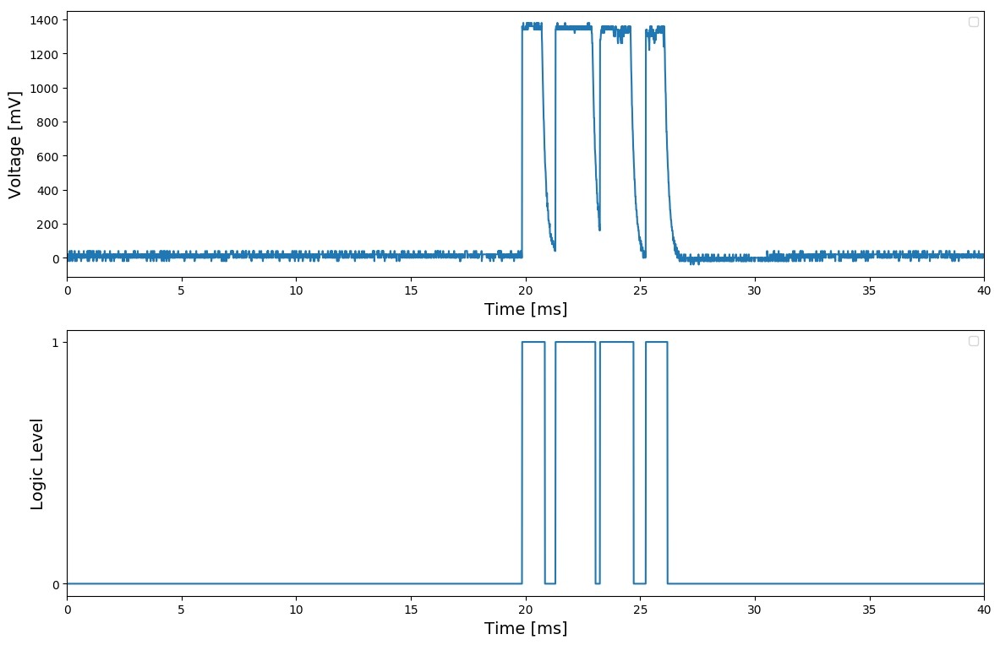


A partir de los tres casos anteriores y un cuarto caso que sería equivalente a la transición del cero al uno se pueden desarrollar cuatro escenarios de pruebas distintos. Con el fin de probar estos 4 escenarios, se testean los siguientes casos con las señales capturadas:

1. [debounce_tb_oneGlitch](VHDL/debounce_tb_oneGlitch.vhd): señal que, estando en '1', presenta un _glitch_ momentáneamente.

2. [debounce_tb_oneToZero](VHDL/debounce_tb_oneToZero.vhd): señal que pasa de '1' a '0' presentando rebotes en su transición.

3. [debounce_tb_zeroGlitch](VHDL/debounce_tb_zeroGlitch.vhd): señal que, estando en '0', presenta un _glitch_ momentáneamente.

4. [debounce_tb_zeroToOne](VHDL/debounce_tb_zeroToOne.vhd): señal que pasa de '0' a '1' presentando rebotes en su transición.

>Nota: tal como se comentó más arriba, la señal utilizada en el caso 2 ('debounce_tb_oneToZero'), simplemente es la inversa (negada) de la señal utilizada en el caso 4. Es decir, a la señal capturada con DSO y procesada para el caso 4, se niega para ser usada en el caso 2; de esta forma se convierte una transición de '0' a '1' en una transición de '1' a '0'.


### Resultado:

A continuación se presentan los resultados obtenidos para cada caso, en función del tiempo asignado a **debounceTime**. Para todos los testbenches, este parámetro se carga desde el _package_ [parametersPackage.vhd](VHDL/parametersPackage.vhd), específicamente de la constante **DEBOUNCE_TIME**.

#### 1. debounce_tb_oneGlitch:

Aquí, se han probado tiempos de 7 ms (resultado OK, pasa el test) y 50 us (resultado NO-OK, no pasa el test):

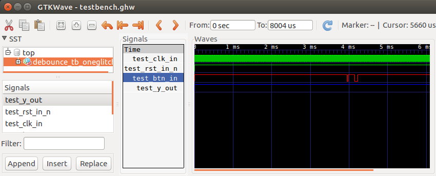

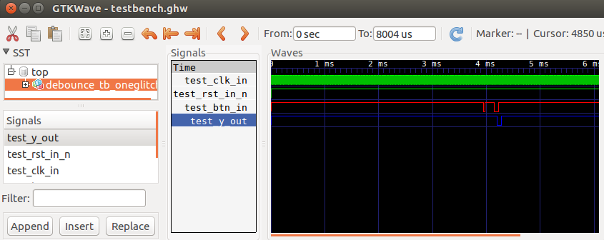


#### 2. debounce_tb_oneToZero:

Aquí, se han probado tiempos de 7 ms (resultado OK, pasa el test) y 100 us (resultado NO-OK, no pasa el test):

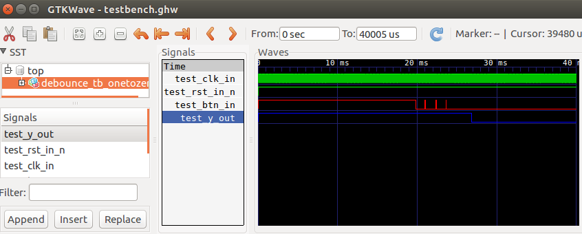

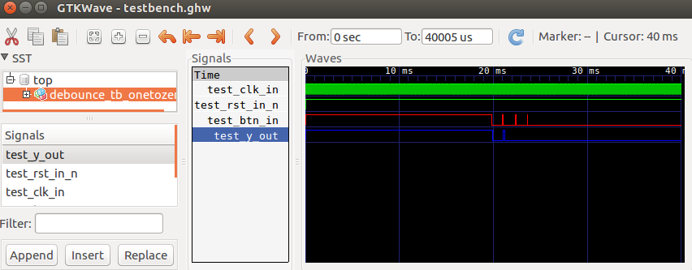

#### 3. debounce_tb_zeroGlitch:

Aquí, se han probado tiempos de 7 ms (resultado OK, pasa el test) y 1 ms (resultado NO-OK, no pasa el test):


#### 4. debounce_tb_zeroToOne:

Aquí, se han probado tiempos de 5 ms (resultado OK, pasa el test) y 100 us (resultado NO-OK, no pasa el test):

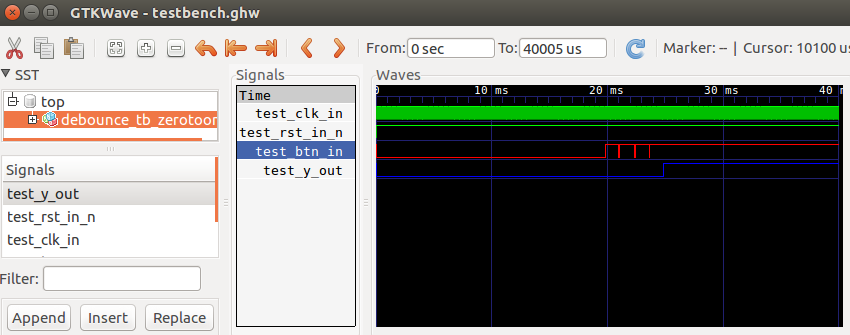

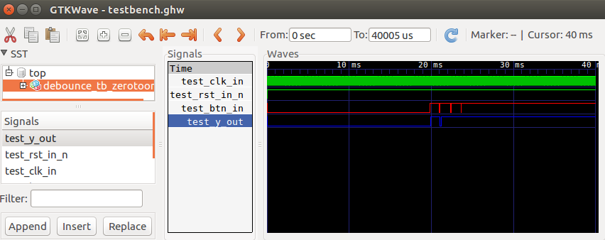


## 4. Síntesis

Utilizando el entorno **iCEcube2** para realizar la síntesis de este ejemplo, se obtiene el siguiente resultado:

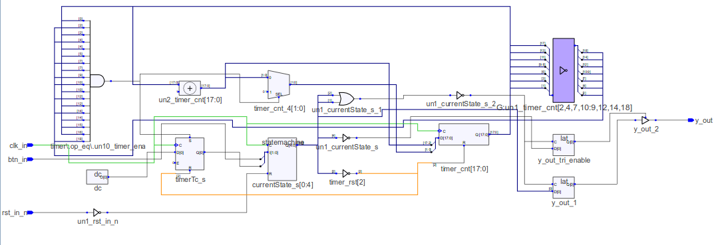

Luego, el reporte final (posterior al _place and route_) indica la siguiente utlización de recursos de la FPGA:

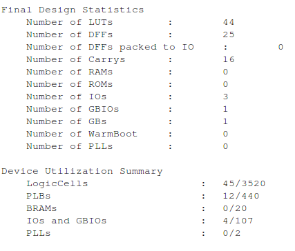

## 5. Prueba en Hardware

Finalmente, con el objetivo de probar este ejemplo en la **EDU-CIAA-FPGA**, se ha generado una señal de prueba con un microcontrolador para simular una transición con rebote. Las siguientes imágenes muestran en detalle el test final, siendo la señal amarilla la salida **y_out** del circuito antirebote, y la señal celeste la entrada **btn_in** del mismo circuito:

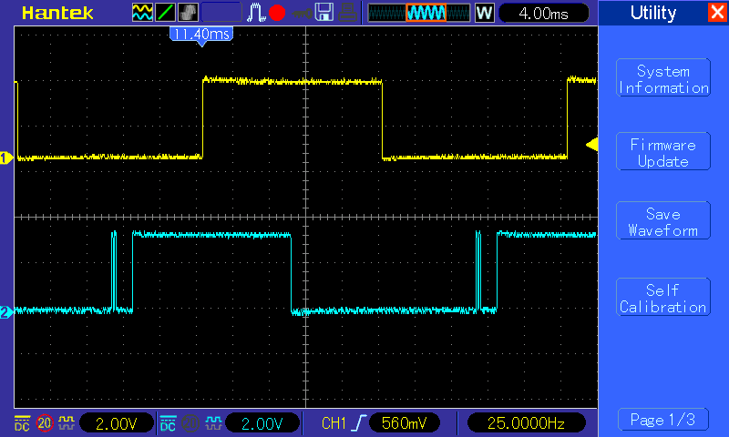

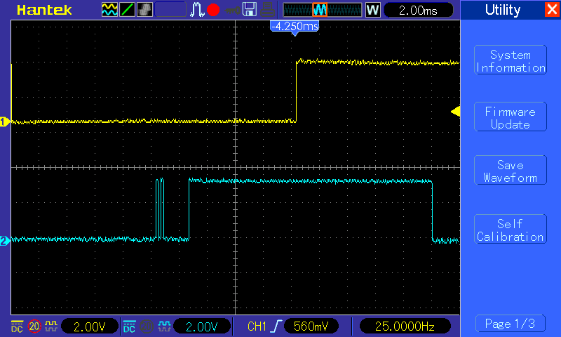

## 6. Información adicional: teoría y uso de herramientas

Para más información teórica y sobre el uso de las herramientas para compilar, simular y sintetizar, referirse a los siguientes vínculos:
 - [Finite States Machines](https://gitlab.com/RamadrianG/wiki---fpga-para-todos/-/wikis/FSM)
 - [GHDL y gtkWave](https://gitlab.com/RamadrianG/wiki---fpga-para-todos/-/wikis/Herramientas-libres-para-VHDL) + [iCEcube2](https://gitlab.com/RamadrianG/wiki---fpga-para-todos/-/wikis/Software-Lattice)


 


 

