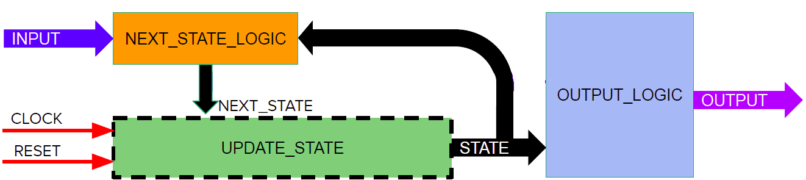
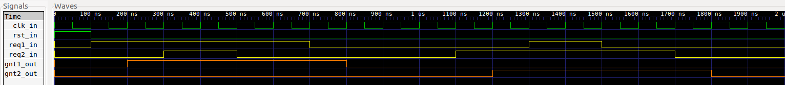
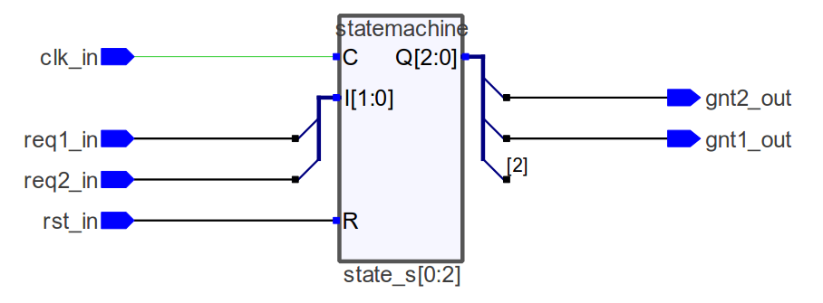
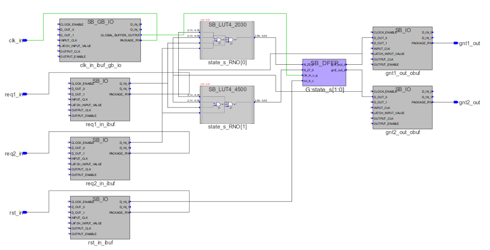

# Arbiter

[[_TOC_]]

## 1. Descripción

En este ejemplo se diseña un **arbiter** con el enfoque de [FSM](https://gitlab.com/RamadrianG/wiki---fpga-para-todos/-/wikis/FSM). Cuando se implementan, todas las máquinas de estado son **circuitos secuenciales**, ya que su salida depende tanto de las entradas actuales como del estado interno actual de la máquina el cuál ,a su vez, depende de la historia anterior.

Un *arbiter* o árbitro es un bloque cuya función es administrar el acceso a un **recurso compartido** por parte de **múltiples dispositivos**. Por ejemplo, si dos módulos de hardware intentan acceder simultáneamente a un puerto serie, el arbiter le otorgará acceso al primero en llegar, y el otro deberá esperar su turno. 


La notación para esta FSM es:

- reqX_in (request): Entrada mediante la cual el proceso X solicita acceso al dispositivo
- gntX_out (grant) : Salida o estado que le otorga al proceso X acceso al dispositivo

Para simplificar el diagrama de estados y transiciones se elimina el sufijo que indica la direccionalidad de la señal. 

## 2. Código

### 2.1 VHDL

Para realizar este circuito vamos a diseñar un Máquina de Moore. Las mismas tienen la siguiente estructura:


Para ello, lo primero que debemos hacer es incluir los paquetes que vamos a necesitar, en nuestro caso vamos a necesitar el *std_logic_1164* para poder usar los tipos de datos **std_logic**.

```vhdl
library ieee;
use ieee.std_logic_1164.all;
```

A continuación vamos a declarar la **entidad**, en la cual se determinan las *entradas* y *salidas* que tendrá nuestro diseño.

```vhdl
--Entidad
entity arbiter is
    port(
        -- Entradas
        req1_in : in std_logic;
        req2_in : in std_logic;

        -- Reset
        rst_in : in std_logic;

        -- Clock
        clk_in : in std_logic;

        -- Salidas
        gnt1_out : out std_logic;
        gnt2_out : out std_logic
    );
end entity arbiter;
```
Dentro de la **arquitectura** se debe determinar el funcionamiento interno de nuestro diseño.

En ella vamos a declarar las siguientes constantes:

```vhdl
-- La cantidad de bits para representar el numero de estado
constant N_BITS_STATE : integer := 2;

-- Las posibles estados del sistema
constant IDLE: std_logic_vector(N_BITS_STATE-1 downto 0) := "00";
constant GNT1: std_logic_vector(N_BITS_STATE-1 downto 0) := "01";
constant GNT2: std_logic_vector(N_BITS_STATE-1 downto 0) := "10";
```
Y las siguientes señales, las cuales determinan el estado actual y el siguiente:

```vhdl
-- Estado actual
signal state_s : std_logic_vector(N_BITS_STATE-1 downto 0);

-- Proximo estado
signal nextState_s : std_logic_vector(N_BITS_STATE-1 downto 0);
```

Lo único que nos resta ahora es diseñar los 3 bloques que se muestran en el diagrama de la máquina de Moore: *NextStateLogic*, *UpdateState* y *OutputLogic*.

**NextStateLogic**: para este bloque definimos un *process* que se activa cuando aparece un cambio en las entradas *req1_in* y/o *req2_in*. El mismo determina cual será el **estado siguiente** dependiendo de las entradas del sistema y del estado actual de la máquina.

```vhdl
--Definicion combinacional del proximo estado
nextStateLogic: process (req1_in,req2_in) begin
    case state_s is
        when IDLE =>
            if (req1_in='1' and req2_in='0') then
                nextState_s <= GNT1;
            elsif (req1_in='0' and req2_in='1') then
                nextState_s <= GNT2;
            else
                nextState_s <= IDLE;
            end if;

        when GNT1 =>
            if (req1_in='1') then
                nextState_s <= GNT1;
            else
                nextState_s <= IDLE;
            end if;

        when GNT2 =>
            if (req2_in='1') then
                nextState_s <= GNT2;
            else
                nextState_s <= IDLE;
            end if;
        when others => nextState_s <= IDLE;
    end case;
end process;
```
**UpdateState**: este bloque esta definido por un *process* cuya lista de sensibilidad son las entradas *rst_in* y *clk_in*. Si el reset se encuentra en estado "alto" se resetea el arbiter llevandolo al estado IDLE, determinando así un reset asincrónico. En cambio, si se presenta un *flanco positivo* en la entrada de clock determina que el estado siguiente *nextState_s* es ahora el estado actual *state_s*, actualizando el estado del arbiter.

```vhdl
-- Actualizacion sincronica del estado
UpdateState: process(rst_in, clk_in) begin
    if (rst_in='1') then
        state_s <= IDLE;
    elsif (rising_edge(clk_in)) then
        state_s <= nextState_s;
    end if;
end process;
```
**OutputLogic**: este *process* se activa cuando cambia el estado actual del arbiter *state_s* y determina el valor de las salidas según el nuevo estado del arbiter. Cómo el diseño es una máquina de Moore las salidas sólo dependen del estado actual.

```vhdl
--Definicion combinacional de las salidas segun el estado actual (Maquina de Moore)
OutputLogic: process(state_s) begin
    case state_s is
        when IDLE =>
            gnt1_out <= '0';
            gnt2_out <= '0';

        when GNT1 =>
            gnt1_out <= '1';
            gnt2_out <= '0';

        when GNT2 =>
            gnt1_out <= '0';
            gnt2_out <= '1';

        when others =>
            gnt1_out <= '0';
            gnt2_out <= '0';
    end case;
end process;
```
[Aquí](VHDL/arbiter.vhdl) podrá encontrar el código completo.


## 3. Simulación
### 3.1 *Testbench* en VHDL

Teniendo en cuenta que el *arbiter* es un **circuito secuencial**, vamos verificar el diseño colocando algunos posibles valores en sus entradas que contemplen los diferentes casos que se pueden tener.

Para realizar este testbench declararemos las señales que enviarán y recibiran los estímulos de nuestro **DUT**(Device Under Test o Dispositivo bajo testeo):

```vhdl
signal test_req1 : std_logic;
signal test_req2 : std_logic;
signal test_rst  : std_logic;
signal test_clk  : std_logic;
signal test_gnt1 : std_logic;
signal test_gnt2 : std_logic;
```
También se declara una señal *test_stop* que la utilizaremos para detener la simulación.
```vhdl
signal test_stop : std_logic;
```
Y una constante que determinará el período de clock.

```vhdl
constant PERIODO : time := 100 ns;
```

Utilizaremos 3 **process** para crear los estímulos en las entradas. 

El primero pondrá en alto la entrada de *reset* por un periodo de clock y luego la mantendrá en bajo.
```vhdl
--Proceso de reset inicial:
process begin
    test_rst <= '1';
    wait for 1*PERIODO; --El reset dura un PERIODO de clock
    test_rst <= '0';
    wait; --Bloquear al proceso
end process;
```

El segundo, lo utilizaremos para generar una señal de clock:
```vhdl
--Proceso de generación de clock
process begin
    test_clk <= '1';
    wait for PERIODO/2;
    test_clk <= '0';
    wait for PERIODO/2;
    if (test_stop='1') then
        wait;
    end if;
end process;
```

Con el último process, probaremos algunas posibles estados en las entradas del arbiter.

```vhdl
--Proceso de generación de entradas
process begin
    --Comienzan ambas entradas en bajo
    test_stop <= '0';
    test_req1 <= '0';
    test_req2 <= '0';
    wait for PERIODO;

    --Pedimos habilitacion para el primer dispositivo
    -- (se debería habilitar el grant para el primer dispositivo)
    test_req1 <= '1';
    wait for 2*PERIODO;

    -- Y luego de 2 periodos, pedimos para el segundo
    -- (como ya esta debería estar habilitado el grant para el
    -- primer dispositivo, esta request deberia ser ignorada)
    test_req2 <= '1';
    wait for 2*PERIODO;

    -- Luego de dos periodos llevamos a bajo el req2_in
    test_req2 <= '0';
    wait for 2*PERIODO;

    -- Y tambien el req1_in.
    -- (El arbiter debería pasar a estado IDLE)
    test_req1 <= '0';
    wait for 4*PERIODO;

    -- Repetimos el mismo proceso, pero a la inversa
    test_req2 <= '1';
    wait for 2*PERIODO;
    test_req1 <= '1';
    wait for 2*PERIODO;
    test_req1 <= '0';
    wait for 2*PERIODO;
    test_req2 <= '0';
    wait for 2*PERIODO;
    test_stop <= '1';
    wait;
end process;
```

[Aquí](VHDL/arbiter_tb.vhdl) podrán encontrar el testbench utilizado para simular el diseño.

### 3.2 Resultados

Se muestra a continuación el resultado de la simulación.

#### 3.2.1 *Testbench* en VHDL con entrada sincrónica

Simulación en GTKWave.
<br>

Podemos ver que el proceso 1 es el primero en solicitar acceso (req1 = 1), el cual se le concede (gnt1 = 1).
Luego, el proceso 2 solicita acceso (req2 = 1), pero la solicitud es denegada (gnt2 = 0).

El proceso opuesto se repite una vez que el proceso 1 libera el recurso (req1 = 0).

La simulación cumple con el comportamiento esperado, quedando así verificado el diseño.

## 4. Síntesis

Para sintetizar el arbiter se utiliza el programa Synplify Pro a través de iCEcube2.

### 4.1  RTL View (alto nivel)

Este diseño es independiente de la tecnología utilizada y se compone de estructuras genéricas como registros, multiplexores, etc. A continuación, se aprecia su diagrama esquemático:



Como podemos apreciar en la figura al sintetizar el diseño a nivel de bloques, el sintetizador reconoce que la secuencia adoptada corresponde a una máquina de estados.

### 4.2 Tech View (alto nivel)
Este diseño depende de la tecnología en FPGA utilizada y está formado por primitivas de Lattice1 para el caso de la EDU-FPGA. Estas primitivas son los bloques esenciales utilizados para describir un sistema digital en este bajo nivel, siendo por ejemplo: LUTs, multiplexores, buffers E/S, etc.
A continuación, se aprecia su diagrama esquemático:



## 5. Véase también

### 5.1 Sintaxis relacionada

* [FSM]https://gitlab.com/RamadrianG/wiki---fpga-para-todos/-/wikis/FSM)
* [Testbenches en VHDL](https://gitlab.com/RamadrianG/wiki---fpga-para-todos/-/wikis/Testbenches-en-VHDL#for-loop)

### 5.2 Ejemplos relacionados

* [Antirebote](../13-Antirebote)

---
## 6. Información adicional: uso de herramientas

Para más información sobre cómo usar el *toolchain* para compilar y simular o
descargar a la placa según el lenguaje utilizado, referirse a los siguientes
vínculos:
 - VHDL y Verilog (recomendado): [Entorno basado en Atom][Entorno_Link].
 - Solo VHDL : [GHDL y GTKWave](https://gitlab.com/RamadrianG/wiki---fpga-para-todos/-/wikis/Herramientas-libres-para-VHDL) + [iCEcube2](https://gitlab.com/RamadrianG/wiki---fpga-para-todos/-/wikis/Software-Lattice) + [IceStorm][IceStorm_link]
 - Solo Verilog : [icarusVerilog y GTKWave](https://gitlab.com/RamadrianG/wiki---fpga-para-todos/-/wikis/Herramientas-libres-para-Verilog) + [IceStorm][IceStorm_link]

[Entorno_Link]: https://gitlab.com/RamadrianG/wiki---fpga-para-todos/-/wikis/Uso-del-entorno
[IceStorm_link]: https://gitlab.com/RamadrianG/wiki---fpga-para-todos/-/wikis/Proyecto-iCEstorm
