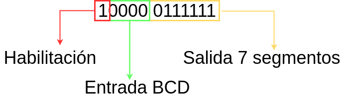
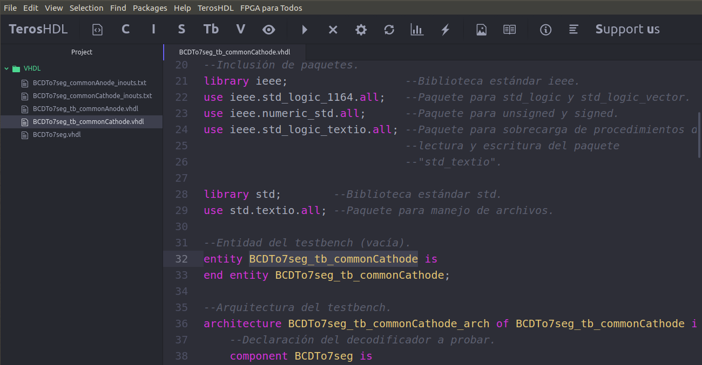
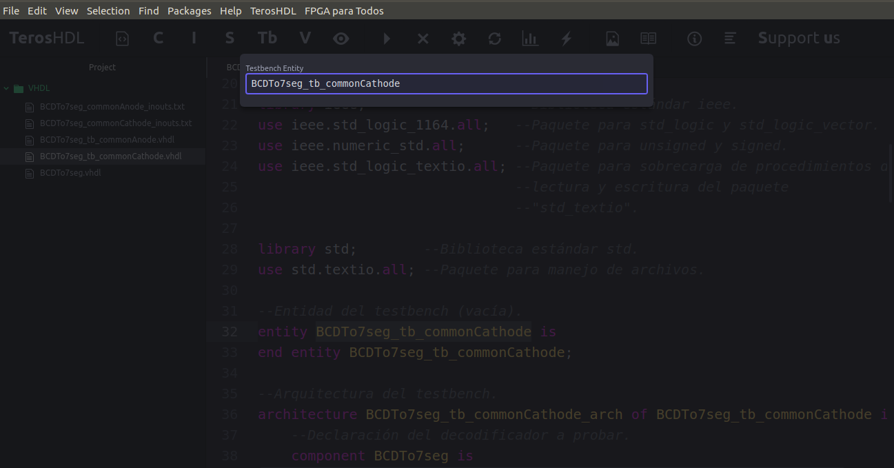
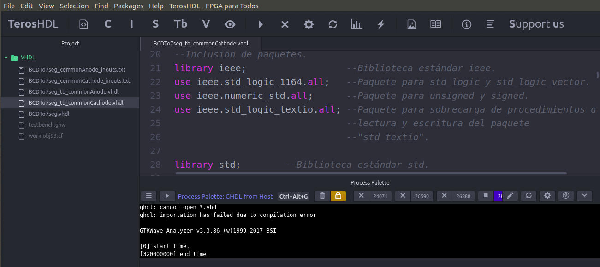
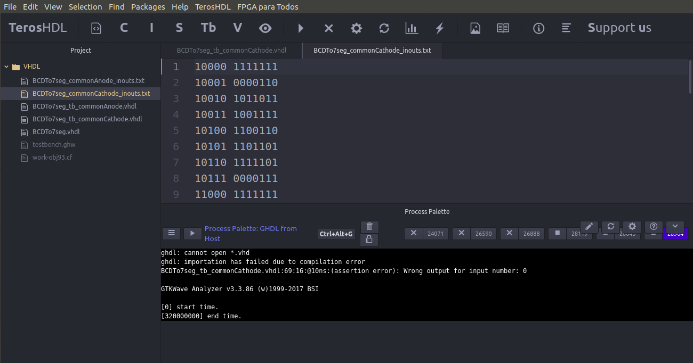
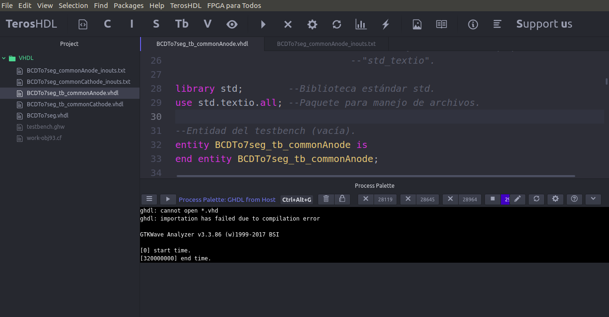
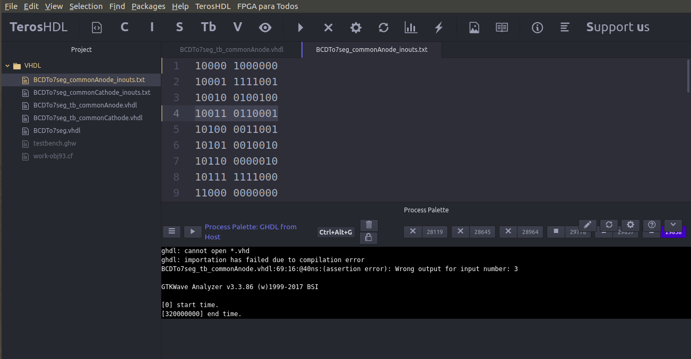

# DECODIFICADOR BCD A 7 SEGMENTOS - TESTBENCH MEJORADO

[[_TOC_]]

## 1. Descripción

El presente ejemplo trata sobre un caso ya estudiado: 
**un decodificador BCD (Binary-Coded Decimal) a 7 segmentos**. En este caso, no 
se va a rediseñar el decodificador, sino que se desarrollan *testbenches* 
diferentes con el objetivo de **ejercitar sobre técnicas de verificación y automatización de pruebas**.

Debido a esto, se recomienda al lector/a ir el [ejemplo 4](../04-BCD_a_7seg)
en caso de no haberlo visto o necesitar repasar sobre el decodificador 
desarrollado.

## 2. Código y simulación

Como se trata de un **circuito combinacional**, se diseñan dos *testbenches* para 
probar de **forma exhaustiva** al decodificador. Cada uno de ellos ensaya al 
decodificador para uno de los modos de operación: ánodo o cátodo comúnn. 

### 2.1. VHDL

Los *testbenches* a desarrollar tienen una dinámica distinta a los realizados en
ejemplos anteriores: en vez de generar los estímulos al decodificador por medio 
de un *process*, **se los lee de un archivo de texto** y, luego de aplicarlos al 
decodificador, **se compara la salida de este con un valor de referencia** que 
está en el mismo archivo. En caso de que no coincidan los valores, se da aviso 
al usuario que esté realizando la simulación. Esta dinámica implica que, la 
confección de este *testbench* permite aplicar los conocimientos del 
**manejo de archivos en VHDL**.

Para comenzar, se crea el archivo de texto mencionado. La idea es poner por cada
línea un dato de entrada separado de su respectiva salida. Por ejemplo, si una
línea es **10000 0111111** esto corresponde a:



Para el valor de la salida de 7 segmentos, el MSB corresponde al segmento "g",
el siguiente al "f", y así sucesivamente hasta el LSB que corresponde al 
segmento "a".

Dicho esto, se confeccionan dos archivos de texto: **BCDTo7seg_commonCathode_inouts.txt** 
y **BCDTo7seg_commonAnode_inouts.txt**, los cuales pueden encontrarse en la carpeta 
del ejemplo. El primer archivo es para probar al decodificador en modo ánodo 
común, y el segundo para cátodo común. A modo de ejemplo, se muestra el 
contenido de **BCDTo7seg_commonCathode_inouts.txt** .

```
10000 0111111	
10001 0000110
10010 1011011
10011 1001111
10100 1100110
10101 1101101
10110 1111101
10111 0000111
11000 1111111
11001 1101111
11010 1110111
11011 1111100
11100 0111001
11101 1011110
11110 1111001
11111 1110001
00000 0000000
00001 0000000
00010 0000000
00011 0000000
00100 0000000
00101 0000000
00110 0000000
00111 0000000
01000 0000000
01001 0000000
01010 0000000
01011 0000000
01100 0000000
01101 0000000
01110 0000000
01111 0000000
```
Luego de esto, se continuó con el desarrollo del código de los dos *testbenches*
. Se destaca que ambos son prácticamente idénticos ya que solo cambia el valor 
del genérico **commonAnode** mapeado y el nombre del archivo que se lee.

Primero, se **incluyen los paquetes necesarios** para manejar archivos y los 
tipos de datos deseados.

```vhdl
--Inclusión de paquetes.
library ieee;                  --Biblioteca estándar ieee.
use ieee.std_logic_1164.all;   --Paquete para std_logic y std_logic_vector.
use ieee.numeric_std.all;      --Paquete para unsigned y signed.
use ieee.std_logic_textio.all; --Paquete para sobrecarga de procedimientos de
                               --lectura y escritura del paquete
                               --"std_textio".

library std;        --Biblioteca estándar std.
use std.textio.all; --Paquete para manejo de archivos.
```

Seguidamente, se declara la **entidad**, la cual no tiene ni puertos ni genéricos 
por tratarse de un *testbench*.

```vhdl
--Entidad del testbench (vacía).
entity BCDTo7seg_tb_commonCathode is
end entity BCDTo7seg_tb_commonCathode;
```

Después, se comienza a declarar la **arquitectura**. Inicialmente, se declara
el decodificador a simular y las señales internas necesarias para estimular al
DUT y monitorear su salida.

```vhdl
--Arquitectura del testbench.
architecture BCDTo7seg_tb_commonCathode_arch of BCDTo7seg_tb_commonCathode is
    --Declaración del decodificador a probar.
    component BCDTo7seg is
        generic (
            commonAnode : BOOLEAN := TRUE
        );
        port (
            BCD_in   : in  std_logic_vector(3 downto 0);
            ena_in   : in  std_logic;
            seg7_out : out std_logic_vector(6 downto 0)
        );
    end component;

    --Declaración de estímulos y señal de monitoreo.
    --Entradas al decodificador.
    signal test_BCD_s : std_logic_vector(3 downto 0);
    signal test_ena_s : std_logic;

    --Salidas del decodificador.
    signal test_seg7_s : std_logic_vector(6 downto 0);

    --Declaración de señal auxiliar para guardar el número de estímulo leído.
    signal stimulus_cnt_s : unsigned(4 downto 0);
```

Para terminar con la parte declarativa de la arquitectura, se desarrolla un 
**procedure**. Este se va a encargar de comparar el valor de la salida del 
decodificador con el dato de referencia. En caso de que no coincidan, se da 
aviso al usuario por medio de **assertions** y **reports**.

Se hace un *procedure* y no una *function* ya que no se debe retornar nada 
en este caso.

```vhdl
    --Procedimiento para hacer un assertion y mostrar un reporte en caso de que
    --el valor de salida no coincida con el de prueba. Los valores de entrada
    --son constantes para que no se puedan alterar dentro del procedimiento.
    procedure AssertIfNoMatch_proc(
        constant VALUE_TO_TEST : in std_logic_vector(6 downto 0);
        constant CHECK_VALUE   : in std_logic_vector(6 downto 0);
        constant CHECK_CNT     : in unsigned(4 downto 0)
    ) is
    begin
        assert (unsigned(VALUE_TO_TEST) = unsigned(CHECK_VALUE))
        report "Wrong output for input number: "
                & integer'image(to_integer(CHECK_CNT))
        severity error;
    end procedure AssertIfNoMatch_proc;
```
Se puede ver como los argumentos del *procedure* son:
* VALUE_TO_TEST: Valor de la salida del decodificador.
* CHECK_VALUE: Valor de salida de referencia leído del archivo.
* CHECK_CNT: Contador del número de estímulo. Sirve como guía para saber que valor fue el que no coincidió.

Finalmente, se concluye el código con la **descripción principal** de la 
arquitectura. En esta se:
* Instancia el decodificador a simular. Se configura su modo según el valor del genérico "commonAnode".
* Se declara un proceso que permite la lectura del archivo.

```vhdl
begin
    --Instanciación del DUT (Device Under Test).
    BCDTo7seg_0: BCDTo7seg
        generic map (commonAnode => FALSE)
        port map ( BCD_in   => test_BCD_s,
                   ena_in   => test_ena_s,
                   seg7_out => test_seg7_s );

    --Proceso de lectura y aplicación de estímulos.
    readStimulus : process
        --Se crean las variables necesarias para la lectura.
        file file_v      : text;
        variable buff_v  : line;
        variable ena_v   : std_logic;
        variable bcd_v   : std_logic_vector(3 downto 0);
        variable check_v : std_logic_vector(6 downto 0);
    begin
        stimulus_cnt_s <= to_unsigned(0, 5); --Valor inicial.

        file_open(file_v , "BCDTo7seg_commonCathode_inouts.txt", read_mode);
        while not endfile(file_v) loop
            --Lectura del archivo.
            readline(file_v, buff_v);
            read(buff_v, ena_v);
            read(buff_v, bcd_v);
            read(buff_v, check_v);

            --Asignación de señales estímulo.
            test_ena_s <= ena_v;
            test_BCD_s <= bcd_v;
            wait for 10 ns;

            --Assertion y reporte en caso de no coincidir la salida con el valor
            --esperado.
            AssertIfNoMatch_proc(test_seg7_s, check_v, stimulus_cnt_s);

            stimulus_cnt_s <= stimulus_cnt_s + 1;
        end loop;
        file_close(file_v);
        wait;
    end process readStimulus;
end architecture BCDTo7seg_tb_commonCathode_arch;
```

Se ve que el archivo **se lee línea por línea**, guardando en las variables 
**ena_v**, **bcd_v** y **check_v** el valor de habilitación, BCD de entrada y 
salida de 7 segmentos de referencia, respectivamente. Después se asignan los 
valores a las señales de estímulo, para finalmente comparar la salida del DUT 
con el valor de referencia. Esto **se repite hasta que se termine de leer todo el archivo**.

Una vez hechos los *testbenches*, se realizan las simulaciones utilizando el 
*toolchain* correspondiente. Para más información, ver sección 5 del presente 
documento.

### 2.2. Resultados

En esta ocasión, para simular el ejemplo se hace uso del 
**editor Atom con el menú personalizado "FPGA para Todos"**. Se utiliza una PC 
con una distribución de Linux y las herramientas ya instaladas para realizar 
la simulación.

#### 2.2.1. Cátodo común

Para verificar el funcionamiento del decodificador en modo cátodo común, en 
primera medida se siguen estos pasos:

1. se abre el editor Atom.
2. desde Atom se abre la carpeta donde está el código fuente en VHDL.
3. se abre el archivo **BCDTo7seg\_tb\_commonCathode.vhdl** y se navega en este hasta donde se declara la entidad del *testbench*.

Se observa lo siguiente en pantalla:



Seguidamente, se copia el nombre de la entidad, que en este caso es **BCDTo7seg_tb_commonCathode**.
Luego, se ejecuta el comando: 

- **FPGA para Todos -> GHDL -> GHDL from Host**

o se presionan las teclas Ctrl + Alt + G que provoca el mismo resultado.


Al hacer esto se abre una ventana donde se debe ingresar el nombre de la entidad
del *testbench* que se quiere simular. Allí se pega el nombre 
**BCDTo7seg_tb_commonCathode**.



Entonces se presiona la tecla *enter* para dar comienzo a la simulación. Lo que
se aprecia después es que en Atom se abre una **pantalla** donde se muestran los
resultados de la simulación. También se abre el programa **GTKWave**, pero en 
este ejemplo no es el objetivo ver las formas de onda.



Se observan varios mensajes en la pantalla:
1.  algunos porque GHDL no encontró archivos **.vhd** en la carpeta, lo cual es correcto.

    ```
    ghdl: cannot open *.vhd 
    ghdl: importation has failed due to compilation error
    ```

2. otros sobre el uso de GTKWave, que ya mencionamos que no interesa en este caso.

    ```
    GTKWave Analyzer v3.3.86 (w)1999-2017 BSI
    [0] start time.
    [320000000] end time.
    ```

Lo importante de esto es que **no aparece ningún mensaje de error por assertions**, 
lo que significa que el decodificador **pasó la prueba sin error alguno** y que 
la verficación fue exitosa. 

---

Para chequear el buen funcionamiento del *testbench* se modifica el archivo de 
texto **BCDTo7seg_commonCathode_inouts.txt** para generar un error a propósito.
Entonces, primero se abre este archivo desde Atom y se modifica la línea n°1:

```
10000 0111111
```

por 

```
10000 1111111
```

Lo que se hizo fue **cambiar el bit más significativo de la salida para el valor de entrada 10000**. 
Este nuevo valor no es el que va a tener el decodificador en su salida cuando se
lo simule, por lo que se va a producir una *assertion*. 

Luego de este cambio, se ejecuta nuevamente el comando:

- **FPGA para Todos -> GHDL -> GHDL from Host**

como se indicó antes, y se observa lo siguiente por la pantalla del Atom:



Además de los mismos mensajes que antes, ahora aparece esto:

```
BCDTo7seg_tb_commonCathode.vhdl:69:16:@10ns:(assertion error): Wrong output for input number: 0
```

Este mensaje es un *report* que indica que sucedió una *assertion* de tipo *error*
para la entrada n°0 (primer valor de entrada), lo cual
**se corresponde con lo modificado en el archivo de texto**.


#### 2.2.2. Ánodo común

Para verificar el funcionamiento del decodificador en modo ánodo común se hace 
exactamente lo mismo que antes, con la salvedad de que se trabaja con los archivos
**BCDTo7seg_tb_commonAnode.vhdl** y **BCDTo7seg_commonAnode_inouts.txt**. Debido
a esto, no se detalla el paso a paso como para el caso del cátodo común.

Sin modificar el archivo de texto, se hizo la simulación y se obtuvo lo 
siguiente por pantalla:



Nuevamente se aprecia como **no aparece ningún mensaje de error por assertions**, 
lo que significa que el decodificador **pasó la prueba sin errores** y que la 
verficación fue exitosa. 

---
Para chequear el buen funcionamiento del *testbench* se modifica el archivo de 
texto **BCDTo7seg_commonAnode_inouts.txt** para generar un error a propósito.
Entonces, primero se abre este archivo desde Atom y se modifica la línea n°4:

```
10011 0110000
```

por

```
10011 0110001
```

Lo que se hizo fue **cambiar el bit menos significativo de la salida para el valor de entrada 10011**. 
Este nuevo valor no es el que va a tener el decodificador en su salida cuando se
lo simule, por lo que se va a producir una *assertion*. 

Luego de este cambio, nuevamente se simula y observa por la pantalla del Atom:



Además de los mismos mensajes que antes, ahora aparece esto:

```
BCDTo7seg_tb_commonAnode.vhdl:69:16:@40ns:(assertion error): Wrong output for input number: 3
```
Este mensaje es un *report* que indica que sucedió una *assertion* de tipo *error*
para la entrada n°3 (cuarto valor de entrada), lo cual
**se corresponde con lo modificado en el archivo de texto**.

## 3. Implementación y ensayo

Como en este caso solo se trata el desarrollo de un mejor testbench para un
conversor BCD a 7 segmentos ya creado, la implementación y ensayo es la misma 
que la que ya se hizo antes. Para verla, hacer click [aquí](../04-BCD_a_7seg/README.md).

## 4. Véase también

### 4.1. Sintaxis relacionada

* [Sintaxis básica VHDL](https://gitlab.com/RamadrianG/wiki---fpga-para-todos/-/wikis/Sintaxis-VHDL)
* [Descripción combinacional en VHDL](https://gitlab.com/RamadrianG/wiki---fpga-para-todos/-/wikis/Descripcion-combinacional-en-VHDL)
* [Testbenches en VHDL](https://gitlab.com/RamadrianG/wiki---fpga-para-todos/-/wikis/Testbenches-en-VHDL)
* [Automatización de testbenches en VHDL](https://gitlab.com/RamadrianG/wiki---fpga-para-todos/-/wikis/Testbench-automatizado-en-VHDL)

- [Sintaxis básica en Verilog](https://gitlab.com/RamadrianG/wiki---fpga-para-todos/-/wikis/Sintaxis-Verilog)
- [Descripción combinacional en Verilog](https://gitlab.com/RamadrianG/wiki---fpga-para-todos/-/wikis/Descripcion-combinacional-en-Verilog)
- [Testbenches en Verilog](https://gitlab.com/RamadrianG/wiki---fpga-para-todos/-/wikis/Testbenches-en-Verilog)
- [Automatización de testbenches en Verilog](https://gitlab.com/RamadrianG/wiki---fpga-para-todos/-/wikis/Testbench-automatizado-en-Verilog)

### 4.2. Ejemplos relacionados

1. [Antirrebote con testbench mejorado](../../Ejemplos_Base)
2. [Detector de trama con testbench mejorado](../../Ejemplos_Base)

**Pendiente: Arreglar link para ejemplos relacionados**:warning:

## 5. Información adicional: uso de herramientas

Para más información sobre cómo usar el *toolchain* para compilar y simular o 
descargar a la placa según el lenguaje utilizado, referirse a los siguientes 
vínculos:

 - VHDL y Verilog (recomendado): [Entorno basado en Atom][Entorno_Link].
 - Solo VHDL : [GHDL y GTKWave](https://gitlab.com/RamadrianG/wiki---fpga-para-todos/-/wikis/Herramientas-libres-para-VHDL) + [iCEcube2](https://gitlab.com/RamadrianG/wiki---fpga-para-todos/-/wikis/Software-Lattice) + [IceStorm][IceStorm_link]
 - Solo Verilog : [icarusVerilog y GTKWave](https://gitlab.com/RamadrianG/wiki---fpga-para-todos/-/wikis/Herramientas-libres-para-Verilog) + [IceStorm][IceStorm_link]

[Entorno_Link]: https://gitlab.com/RamadrianG/wiki---fpga-para-todos/-/wikis/Uso-del-entorno
[IceStorm_link]: https://gitlab.com/RamadrianG/wiki---fpga-para-todos/-/wikis/Proyecto-iCEstorm
