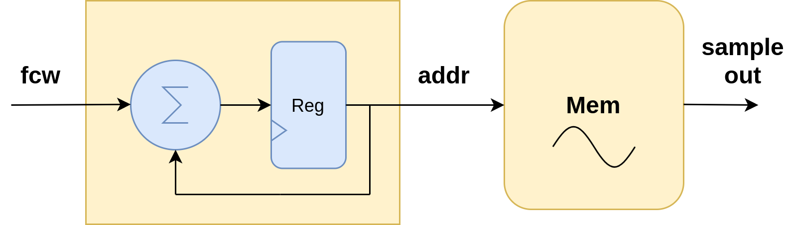
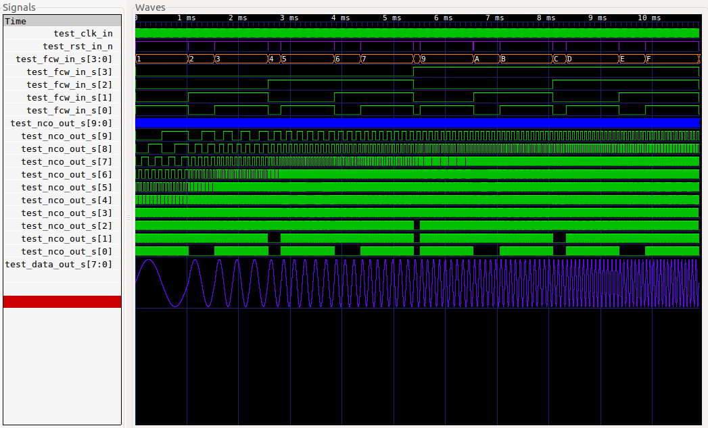
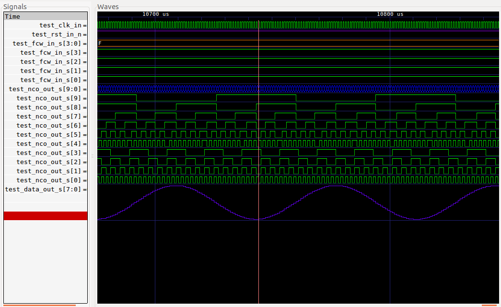
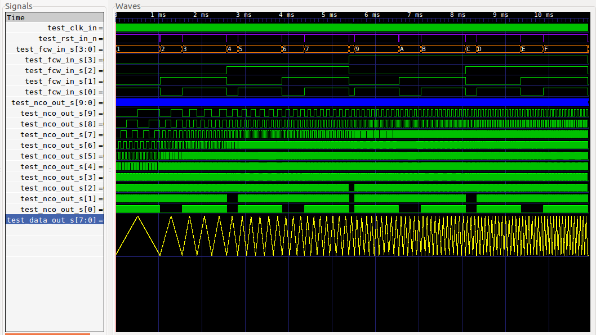
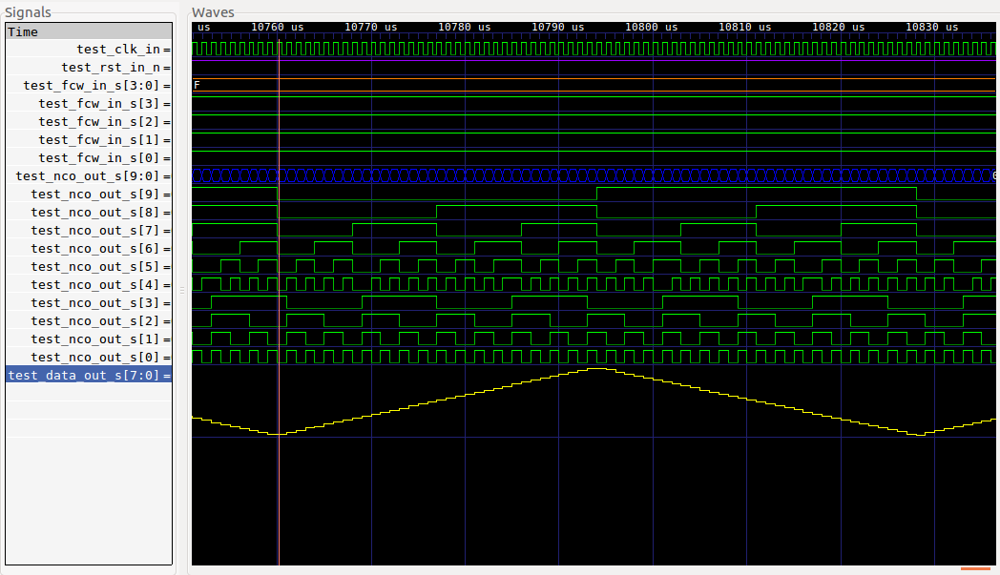

# NCO + LUT

## 1. Descripción

En este ejemplo, tomaremos el core [nco.vhd](VHDL/nco.vhd) y agregaremos una memoria con los "samples" de una señal X para luego sintetizarla, tal como se explicó en [11-NCO](../11-NCO). Según lo visto en el ejemplo mencionado, es posible tomar un oscilador digital y asociarlo al bus de direcciones de una memoria para generar una señal:



Lo que veremos ahora es: ¿Qué características tiene esta memoria y cómo puede implementarse en una FPGA?

### Introducción

En [esta sección de la Wiki](https://gitlab.com/RamadrianG/wiki---fpga-para-todos/-/wikis/FPGA), se introdujo el concepto de "Bloques lógicos configurables" y la arquitectura matricial que tienen las FPGAs:


Si bien, cada bloque lógico puede variar de una marca a otra ([Xilinx](https://www.xilinx.com/support/documentation/user_guides/ug474_7Series_CLB.pdf),[Lattice](https://www.latticesemi.com/Products/FPGAandCPLD/iCE40#_21E33C7EC0BD48AA80FE384ED73CC895)), todas las FPGA modernas cotienen, dentro de sus bloques lógicos, lo que se conoce como **LUT** (Look Up Table).

Las LUT son bloques que permiten sintetizar circuitos puramente **combinacionales**. Para dar una idea más comprensible de las mismas, podemos decir que las LUTs son una "tabla de verdad", como aquellas que se usan (o usaban) para describir el comportamiento de un circuito compuesto por compuertas (AND, OR, XOR, NOT, etc). Las Look Up Tables tienen sus salidas en función de la combinación de sus entradas. 

Ahora, ¿Es posible obtener una salida de, por ejemplo, 8 bits en función de las entradas? Por supuesto, entonces: si tomamos la idea introducida en el ejemplo del NCO, podríamos intentar implementar una memoria con una LUT. Es posible, pero hay un inconveniente: **las LUT no son de gran tamaño**. Si quisiéramos implementar una memoria con 1024 muestras de una señal, esto sería imposible **con una sola LUT**. Este inconveniente se soluciona usando no una, sino varias. Esta es una particularidad característica de las FPGAs, y lo que las hace tan versátiles, ya que las mismas contienen miles o cientos de miles LUTs que a su vez pueden **interconectarse** para formar circuitos de mayor tamaño y, de esta manera, permitirnos implementar una memoria con 1024 muestras.

Debido a la necesidad de interconectar varias LUTs **distribuidas** en la FPGA para crear una memoria, esta técnica se conoce comunmente como **Distributed RAM**, es decir "RAM distribuida". 

Al implementar memorias con LUTs, debemos saber que estamos utilizando recursos de la FPGA que, dependiendo el tamaño de la misma y el diseño, pueden resultar costosos en términos de **área**. Dicho en otras palabras: aquella persona encargada de un diseño, debe tener en cuenta que al implementar memorias con LUTs, está utilizando recursos de la FPGA que podrían aprovecharse para realizar otra tarea. Si la memoria es muy grande, o la FPGA es muy chica en términos de bloques programables, quizas utilizar una memoria distribuida **no sea la mejor idea**.

Una forma distinta de implementar una memoria en la FPGA es usar los bloques que la misma trae destinados específicamente para esta aplicación: las **Block RAMs**. Las Block RAM (o BRAM) son un área del chip destinada **exclusivamente** para implementar memorias. De esta forma, al usar BRAM estamos optimizando los recursos de la FPGA. Para explicar mejor esto último: no es muy útil utilizar el 50% de las LUTs para implementar una memoria y tener las BRAM 100% desocupadas, es decir, en desuso.

Habiendo presentado las memorias distribuidas y las BRAM, con sus características y diferencias; podemos definir el propósito de este ejemplo: aquí utilizaremos LUTs, es decir memoria distribuida, para generar señales con un NCO. 

## 2. Código

En esta sección presentaremos el código de la memoria que contiene las muestras de la señal a sintetizar. No se explicará el diseño del NCO ya que el mismo fue presentado [previamente](../11-NCO).

### Entidad

La entidad de esta memoria se muestra a continuación:

```vhdl

entity signalLUT is
generic( dataBits : integer := 12; --data bits
	addBits : integer := 10); --address bits
port (
  addr_in         : in  std_logic_vector(addBits-1 downto 0);
  data_out         : out std_logic_vector(dataBits-1 downto 0));
end entity signalLUT;

```

Notar que solo hay un bus de direcciones (**addr_in**) y un bus de datos (**data_out**). La entidad no tiene señales de habilitación de escritura, lectura, clocks, etc. Esto es así porque implemente se comporta como una memoria ROM asincrónica.

La arquitectura de **signalLUT** se presenta a continuación:

```vhdl

architecture signalLUT_arch of signalLUT is
begin

	    data_out  <= std_logic_vector(to_unsigned(C_SIG_TABLE(to_integer(unsigned(addr_in))),dataBits));

end architecture signalLUT_arch;

```

El comportamiento es el siguiente: en primer lugar se convierte la dirección **addr_in** al tipo entero con un ancho de palabra dado por **dataBits**. Luego, esta dirección se usa para indexar una constante: **C_SIG_TABLE**. Esta constante es nuestra memoria distribuida, la cual guarda las muestras de un período de la señal que queremos sintetizar. La misma se encuentra definida en el package [LUTPackage.vhd](VHDL/LUTPackage.vhd), el cual es generado automáticamente, como se explicará en la siguiente sección. La memoria entonces se define de la siguiente manera:

```vhdl

package LUTPackage is
    type t_sig_table is array(0 to 1023) of integer range 0 to 255;
    constant C_SIG_TABLE  : t_sig_table := (
        127,
        127,
        128,
        ...

```

Luego, una vez indexada la memoria, se convierte su salida al tipo **std_logic_vector** y finalmente se asigna el dato al puerto de salida **data_out**

## 3. Simulación

El testbench de este ejemplo puede encontrarse [aquí](VHDL/ncoLUT_tb.vhd). Con el fin de probar todos los posibles valores de fcw y compararlo con la salida del NCO (tal como se hizo previamente en el ejemplo [11-NCO](../11-NCO)), se ha creado un [script](VHDL/generate_LUT.py) para generar:

1. El archivo [stimulus.txt](VHDL/stimulus.txt), el cual contiene todas las cuentas que el NCO hará para cada posible valor de fcw.
2. El package [parametersPackage.vhd](VHDL/parametersPackage.vhd), el cual contiene las constantes que indican el número de bits del NCO y de la fcw, así como también el tamaño de los samples (en números de bits) que se guardarán en la memoria.
3. El package [LUTPackage.vhd](VHDL/LUTPackage.vhd), el cual contiene el vector de samples de la señal a sintetizar.

Para ejecutar el script, abrir un terminal en la carpeta "VHDL" de este ejemplo, y ejecutar el comando:

```bash

python generate_LUT.py -n NCOBITS -f FCWBITS -w WAVE

```
En este caso, NCOBITS indica la cantidad de bits del NCO (4,3,10, etc.), mientras que FCWBITS indica la cantidad de bits de la palabra de control. Respecto a NCOBITS, es recomendable usar valores menores o iguales a 12, ya que para mayores tamaños del contador, el test puede requerir un tiempo de procesamiento elevado. FCWBITS se recomienda que sea, como mucho, igual a NCOBITS. La opción WAVE indica la forma de onda a sintetizar:

* sin : seno
* cos : coseno
* saw : diente de sierra
* tri : triangular

Por defecto, si no se indica nada, la forma de onda será senoidal.

Una vez ejecutado el script, lo que este hará es:

1. Crear el package con las constantes
2. Crear el package con la memoria
3. Crear el archivo de estímulos para el test

Para ejecutar el test, podemos hacerlo mediante el plugin de Atom, o bien abriendo un terminal en la carpeta "VHDL" de este ejemplo, y ejecutando de forma manual el script "test.sh" con el comando:

```bash

./test.sh

```


### Resultado:

Luego de ejecutar el test, se abrirá la ventana del visor de formas de onda, mostrando la evolución de las entradas y salidas del NCO en función del tiempo y la señal sintetizada. Aquí vale aclarar algo importante: si bien la imagen que sigue muestra la forma de onda sintetizada, esto **no significa** que la FPGA sintetice una señal **analógica**. Lo que muestra el visor de onda es la representación de las muestras guardadas en la memoria, de forma tal que podamos verla "cómodamente", en lugar de leer valores de samples como "125","127",etc. Para este caso, se realizó el test con NCOBITS = 10 y FCWBITS = 4:



Para visualizar la señal de salida de forma "analógica", debemos hacer click derecho en el nombre de la misma (en este caso es **test_data_out_s[7:0]**) y seleccionar: **Data Format** -> **Analog** -> **Step**. Luego, para agrandar su tamaño, click derecho nuevamente en el nombre de la señal y seleccionar la opción **Insert Analog Height Extension**.

La siguiente imagen muestra con mayor detalle la señal senoidal generada:



Si en cambio ejecutamos el script de la siguiente forma:

```bash

python generate_LUT.py -n 10 -f 3 -w tri

```

Obtenemos las siguientes salidas para una señal del tipo triangular:





## 4. Ensayos

El ensayo en la EDU-FPGA se hará en el ejemplo [20-NCO_LUT_UART](../20-NCO_LUT_UART). En él, se agregará a lo visto en este ejemplo, una UART para enviar los samples de la señal sintetizada a la PC por medio del puerto COM virtual de la EDU-FPGA.


