# NCO + LUT + UART

[[_TOC_]]

## 1. Descripción

En este ejemplo se implementará el [NCO+LUT](../19-NCO_LUT) presentado anteriormente, con el agregado de una [UART](../Puerto_COM) para enviar muestras desde la **EDU-FPGA** hacia la PC, y de esta forma poder graficar con un script hecho en **Python**, la señal generada en la FPGA.

### Diagrama en bloques

A continuación se presenta el diagrama en bloques del diseño propuesto:

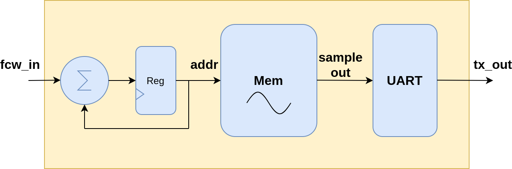


## 2. Código

Aquí se presenta el [Top Level](VHDL/topNCO_LUT_UART.vhd) del diseño, dentro del cual se instancian los tres componentes principales (NCO, LUT y UART) y se interconectan, agregando una lógica de control mínima que se explicará en breve.

### Entidad

En principio, comenzaremos presentando la entidad del top level. Esta se compone por unos pocos puertos de entrada y una única salida:

```vhdl

entity topNCO_LUT_UART is
    generic(
        brDivisor : positive:= 26; --Divisor para elegir baudrate => 26 ~= 12MHz/(4*115200)
        dataBits : integer range 7 to 8 := 8;
        ncoBits : integer range 1 to 12 := 10;
        freqControlBits : integer range 1 to 8 := 3);
    port(
        clk_in : in std_logic;
        rst_in_n : in std_logic;
        fcw_in : in std_logic_vector(freqControlBits-1 downto 0);
        tx_out : out std_logic);
end entity topNCO_LUT_UART;

```
A continuación se describen con mayor detalle los _generics_ y _ports_ del top level:

#### Generics

* **brDivisor**: valor entero por el cual se divide el clock del sistema para generar el baud rate deseado en la UART. Vale aclarar que este debe ser un número entero para que el diseño sea **sintetizable**. No es necesario utilizar números reales aquí, dado que el puerto serie tiene un margen de tolerancia respecto a la frecuencia de transmisión/recepción.
* **dataBits**: tamaño en bits de las muestras de la señal generada. Tener en cuenta que la UART utiliza un buffer de 8 bits para transmisión y recepción, por lo tanto se aconseja mantener **dataBits** = 8.
* **ncoBits**: tamaño en bits del NCO.
* **freqControlBits**: tamaño en bits de la **fcw** (_Frequency Control Word_).

#### Ports

* **clk_in**: entrada de clock de 12 MHz (pin 94 de la EDU-FPGA).
* **rst_in_n**: entrada de reset.
* **fcw_in**: entrada de **frequency control word**.
* **tx_out**: salida tx de la UART (pin 56 de la EDU-FPGA).

### Arquitectura

#### Señales internas del Top Level

A continuación se muestran las señales utilizadas internamente para la conexión de los componentes principales del Top Level:

```vhdl

architecture topNCO_LUT_UART_arch of topNCO_LUT_UART is
    --Señales de UART_C--
    signal wb_clk : std_logic;  -- clock
    signal wb_rst : std_logic;  -- Reset input
    signal wbAdr_bus : std_logic_vector(0 downto 0); -- Adress bus
    signal wbDatIn_bus : std_logic_vector(7 downto 0); -- DataIn Bus
    signal wbDatOut_bus : std_logic_vector(7 downto 0); -- DataOut Bus
    signal wbWrite_ena  : std_logic;  -- Write Enable
    signal wbStb_s : std_logic;  -- Strobe
    signal wbAck_s : std_logic;  -- Acknowledge
    signal inttx_s  : std_logic;  -- Transmit interrupt: indicate waiting for Byte
    signal intrx_s  : std_logic;  -- Receive interrupt: indicate Byte received
    signal br_clk : std_logic;  -- Clock used for Transmit/Receive
    signal txd_s : std_logic;  -- Tx RS232 Line
    signal rxd_s : std_logic; -- Rx RS232 Line
    --Señales de NCO--
    signal nco_out_s :  std_logic_vector(ncoBits-1 downto 0);
    signal fcw_s : std_logic_vector(freqControlBits-1 downto 0);
    --Señales LUT
    signal sample_s : std_logic_vector(dataBits-1 downto 0);
begin


```
#### UART

El siguiente bloque de código muestra la instanciación de la UART, junto con la conexión de sus señales al resto del Top Level. También se agrega el bloque "_load_", el cual describe una lógica adicional para cargar la muestra **sample_s** en la UART.

```vhdl

    --Instanciar UART
    UART: entity work.UART_C
        generic map(BRDIVISOR => BrDivisor)
        port map(
                wb_clk_i => wb_clk, 
                wb_rst_i => wb_rst, 
                wb_adr_i => wbAdr_bus,
                wb_dat_i => wbDatIn_bus, 
                wb_dat_o => wbDatOut_bus, 
                wb_we_i => wbWrite_ena,
                wb_stb_i => wbStb_s, 
                wb_ack_o => wbAck_s, 
                inttx_o => inttx_s,
                intrx_o => intrx_s, 
                br_clk_i => br_clk, 
                txd_pad_o => txd_s,
                rxd_pad_i => rxd_s);

    wb_clk <= clk_in;
    wb_rst <= not rst_in_n;
    wbAdr_bus <= "0";
    br_clk <= '1';
    wbStb_s <= '1';
    rxd_s <= '0';

    --Enviar sample
    load:
    process(clk_in)
    begin
        if(rising_edge(clk_in)) then
            if(wb_rst = '1') then
                wbWrite_ena <= '0';
            elsif(inttx_s = '1') then
                wbDatIn_bus  <= sample_s;
                wbWrite_ena <= '1';
            else
                wbWrite_ena <= '0';
            end if; --reset
        end if; --rising_edge clk_in
    end process load;

```

#### NCO

Esta sección muestra la instanciación del NCO y la lógica adicional que define el progreso de su contador (ver comentario en el bloque de código):

```vhdl

    --Instanciar NCO
    nco: entity work.nco
    generic map(ncoBits => ncoBits, freqControlBits => freqControlBits)
    port map(
        clk_in => clk_in,
        rst_in_n => rst_in_n,
        fcw_in => fcw_s,
        nco_out => nco_out_s);

    --Cuando la UART está transmitiendo (inttx_s = 0)
    -- el NCO no cuenta (fcw_s = 0). Una vez que termina
    -- de transmitir un sample, inttx_s = 1, y el NCO
    -- incrementa su contador en la cantidad dada por fcw_in
    fcw_s <= fcw_in when inttx_s = '1' else (others=>'0');

```

#### LUT

Instanciación de la memoria distribuida con los samples de la señal a generar:

```vhdl

    --Instanciar LUT
    LUT: entity work.signalLUT
    generic map(dataBits => dataBits, addBits => ncoBits)
    port map(
        addr_in => nco_out_s, 
        data_out => sample_s);


```

#### Salidas

La lógica de salida simplemente asigna la señal interna **txd_s** (conectada al puerto **txd_pad_o** de la UART) a la salida **tx_out** del Top Level. 

```vhdl

    --Outputs
    tx_out <= txd_s;

```

## 3. Simulación

Dado que el test final se hará en la EDU-FPGA, el [testbench](VHDL/topNCO_LUT_UART_tb.vhd) que aquí se muestra es un testbench básico, con el fin de verificar a simple vista si el sistema funciona como es de esperar. De forma similar a lo realizado en el ejemplo [19-NCO_LUT](../19-NCO_LUT), se ha utilizado un [script](VHDL/generate.py) en Python para generar:

1. El archivo [stimulus.txt](VHDL/stimulus.txt), el cual contiene todas las cuentas que el NCO hará para cada posible valor de fcw.
2. El package [parametersPackage.vhd](VHDL/parametersPackage.vhd), el cual contiene las constantes que indican el número de bits del NCO y de la fcw, así como también el tamaño de los samples (en números de bits) que se guardarán en la memoria y el divisor para generar el baudrate de la UART.
3. El package [LUTPackage.vhd](VHDL/LUTPackage.vhd), el cual contiene el vector de samples de la señal a sintetizar.

Para ejecutar el script, abrir un terminal en la carpeta "VHDL" de este ejemplo, y ejecutar el comando:

```bash

python generate.py -n NCOBITS -f FCWBITS -d DATABITS -w WAVE

```
En este caso, NCOBITS indica la cantidad de bits del NCO (4,3,10, etc.), mientras que FCWBITS indica la cantidad de bits de la palabra de control. Respecto a NCOBITS, es recomendable usar valores menores o iguales a 12, ya que para mayores tamaños del contador, el test puede requerir un tiempo de procesamiento elevado. FCWBITS se recomienda que sea, como mucho, igual a NCOBITS. La opción DATABITS indica el tamaño en bits de los samples que serán guardados en la memoria distribuida, por defecto son 8 bits. La opción WAVE indica la forma de onda a sintetizar:

* sin : seno
* cos : coseno
* saw : diente de sierra
* tri : triangular

Por defecto, si no se indica nada, la forma de onda será senoidal.

Para este caso, la cantidad de bits de cada muestra debe ser igual a 8, de forma tal que entre una muestra entera en el buffer de la UART, y no tener que hacer múltiples transmisiones. Dado que la señal generada es senoidal por defecto, el script (para este caso particular) se ejecuta de la siguiente forma:

```bash

python generate.py -n 10 -f 3


```

Luego, el test puede ejecutarse mediante el plugin de **Atom** utilizando las opciones **GHDL from Host** o **GHDL from Docker**.


### Resultado:

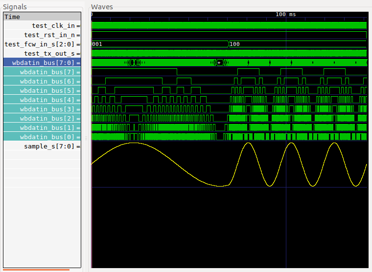


## 4. Síntesis

La síntesis de este ejemplo fue hecha en [iCEcube2](http://www.latticesemi.com/iCEcube2). Para crear el proyecto, es necesario agregar todos los archivos fuente con extensión **.vhd** que se encuentran en la carpeta [VHDL](VHDL/) de este ejemplo (exceptuando el testbench):

* [nco.vhd](VHDL/nco.vhd)
* [signalLUT.vhd](VHDL/signalLUT.vhd)
* [UART_C.vhd](VHDL/UART_C.vhd)
* [RxUnit.vhd](VHDL/RxUnit.vhd)
* [TxUnit.vhd](VHDL/TxUnit.vhd)
* [BRGen.vhd](VHDL/BRGen.vhd)
* [LUTPackage.vhd](VHDL/LUTPackage.vhd)
* [parametersPackage.vhd](VHDL/parametersPackage.vhd) 
* [topNCO_LUT_UART.vhd](VHDL/topNCO_LUT_UART.vhd)

>Nota: dado que el Top Level no utiliza la linea Rx de la UART, en principio no es necesario agregar el fuente RxUnit.vhd. Sin embargo, es preferible mantenerlo dentro del listado para respetar la arquitectura de la UART aquí implementada (UART_C.vhd).

### Resultado de la síntesis

En esta sección se estudiará con mayor detalle el proceso de síntesis, particularmente sus reportes de compilación. La idea es mostrar un problema que puede surgir de vez en cuando al sintetizar nuestros diseños.

Una vez creado el proyecto en **iCEcube2**, la herramienta [Synplify Pro](https://www.synopsys.com/implementation-and-signoff/fpga-based-design/synplify-pro.html) nos permite realizar la síntesis del diseño. Al finalizar el mismo, podemos ver en la sección **Area Summary** la cantidad de recursos utilizados para la síntesis: 

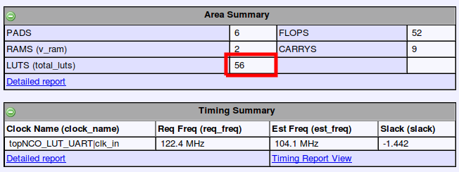

La imagen anterior muestra un total de 56 LUTs utilizadas para este diseño. Si recordamos el diseño del [Antirebote](../13-Antirebote), la síntesis del mismo dio un resultado final de 45 LUTs utilizadas. Teniendo en cuenta que el Top Level de este ejemplo implementa, entre todos sus componentes, una memoria de **1024 samples** con LUTs, el resultado de 56 LUTs utilizadas parece sospechoso. Para indagar un poco más sobre el resultado de la síntesis, podemos abrir el reporte detallado dentro de la sección de **Run Status**:

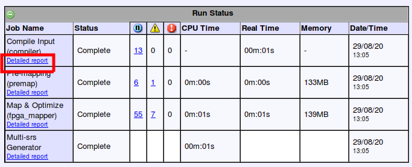

Dentro del mismo se encuentran las notas y warnings que el sintetizador indica al compilar el diseño. Si buscamos en este archivo, encontramos lo siguiente:

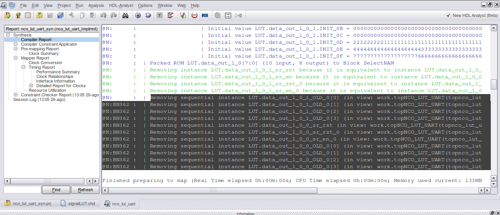

Vemos que, el sintetizador reconoce la ROM LUT, pero por algún motivo la elimina o **simplifica**. Muchas veces los sintetizadores suprimen lógica de nuestros diseños por considerar que es redundante o no se utiliza. Al detectar esto, el diseñador o diseñadora puede tomar varios caminos: realizar una simulación post-síntesis para evaluar si el diseño mantiene su funcionamiento, volver sobre sus pasos y mirar en detalle el código fuente, indicar al sintetizador que no optimice ni simplifique ciertos componentes, entre otras. 

La solución adoptada en este caso particular fue la de restringir las optimizaciones del sintetizador. Para esto, se utilizan **atributos del sintetizador**, que permiten introducir pocas líneas de código en nuestros archivos fuente para evitar estas simplificaciones. Para el caso de **Synplify Pro**, el manual de atributos del sintetizador ([Synopsys FPGA Synthesis - Attribute Reference Manual](https://www.microsemi.com/document-portal/doc_download/134092-synopsys-fpga-synthesis-attribute-reference-manual-i-2013-09m-sp1-1)) presenta el listado de atributos admitidos por Synplify, junto con sus funciones y ejemplos de uso.

Veamos por ejemplo el _attribute_ **syn_hier**:


Tal como indica su documentación, este atributo nos brinda un control sobre qué módulos o arquitecturas deben preservarse sin optimizar para mantener su jerarquía dentro del diseño. En el caso particular de **syn_hier**, este puede tomar tres valores:

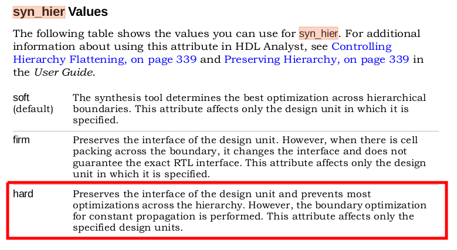

En este caso, el valor "hard" es el que usaremos dentro de la arquitectura de [signalLUT.vhd](VHDL/signalLUT.vhd) para impedir la optimización de esta unidad. La siguiente imagen muestra cómo se declaran los atributos y cómo asociarlos, en este caso, a una arquitectura particular:

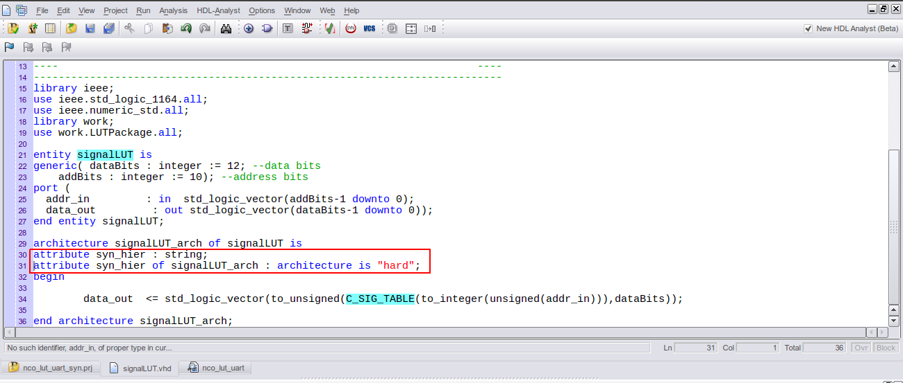

Luego de estas modificaciones, al ejecutar la síntesis se obtienen los siguientes resultados:

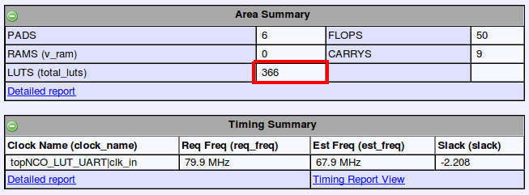

Vemos aquí que, con el agregado del mencionado atributo, nuestro diseño pasa de utilizar 56 LUTs, a utilizar un total de 366. Este aumento de uso en los recursos se condice con la síntesis de la memoria ROM que se había descrito y había sido "simplificada" por el sintetizador, previo al uso del atributo. Esto se puede apreciar en el siguiente reporte post-síntesis:

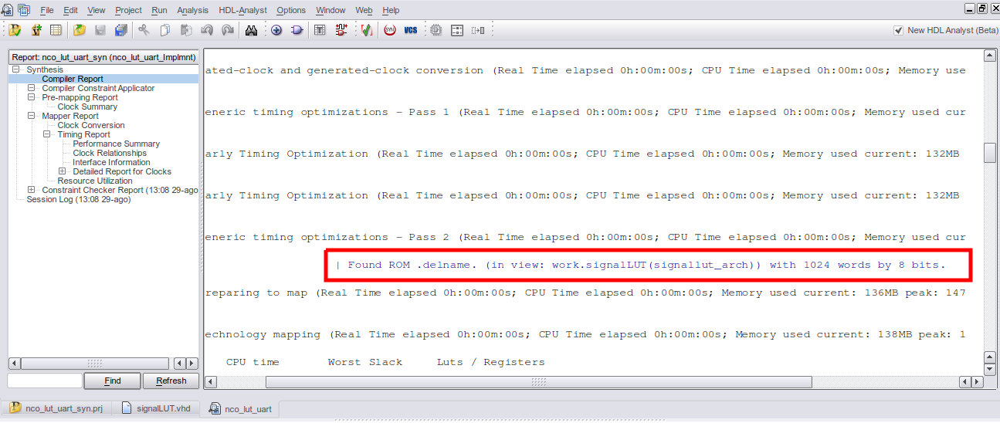

Aquí el sintetizador indica que se encontró una ROM de 1024 palabras de 8 bits, que claramente es lo que se quiere implementar.

Finalmente, la siguiente imagen muestra el diagrama en bloques del diseño sintetizado:

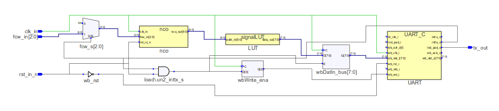

Al hacer doble click sobre un bloque, podemos abrirlo para ver cómo está implementado. Por ejemplo, abriendo el NCO vemos lo siguiente:

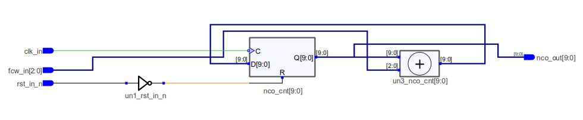

### Asignación de pines

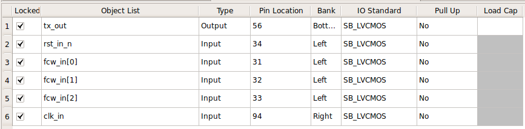

### Reporte final de recursos utilizados

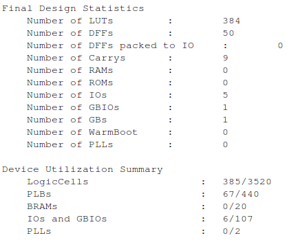

## 5. Prueba en Hardware

Una vez sintetizado el código y descargado el **bitstream** en la **EDU-FPGA**, el script [serial_plot.py](VHDL/serial_plot.py) nos permitirá visualizar la señal generada en la FPGA. Para esto, debemos asegurarnos de tener **Python 3.5 o superior** instalado en **Linux**, junto con los siguientes packages:

* serial
* struct
* matplotlib
* numpy

>Nota: la versión de matplotlib utilizada para esta prueba fue 3.1.3 en Python 3.7.6

Luego, conectando la EDU-FPGA al puerto USB y abriendo un terminal en la carpeta [VHDL](VHDL/) de este ejemplo, podemos correr el script de la siguiente forma:

```bash

python serial_plot.py

```

Esto abrirá una ventana como la que se muestra a continuación:

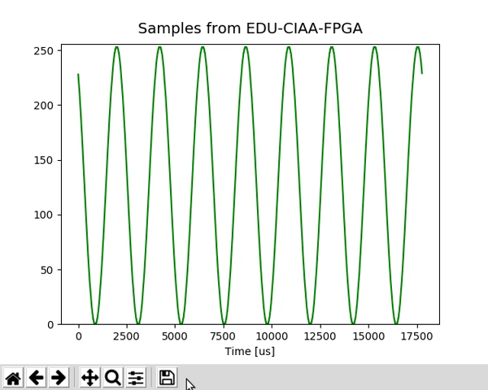

Aquí podemos experimentar cómo cambia la frecuencia de la señal al pulsar los _pushbuttons_ de la placa. Para finalizar, simplemente introducimos **"Ctrl+C"** en el terminal donde ejecutamos el script.


## 6. Información adicional: teoría y uso de herramientas

Para más información teórica y sobre el uso de las herramientas para compilar, simular y sintetizar, referirse a los siguientes vínculos:
 - [GHDL y gtkWave](https://gitlab.com/RamadrianG/wiki---fpga-para-todos/-/wikis/Herramientas-libres-para-VHDL)
 - [iCEcube2](https://gitlab.com/RamadrianG/wiki---fpga-para-todos/-/wikis/Software-Lattice)


