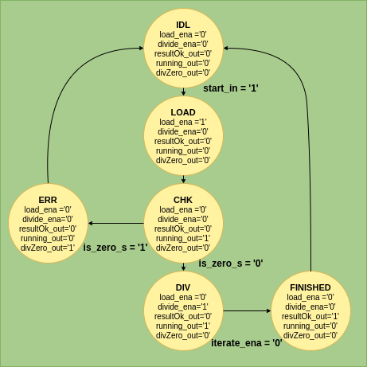
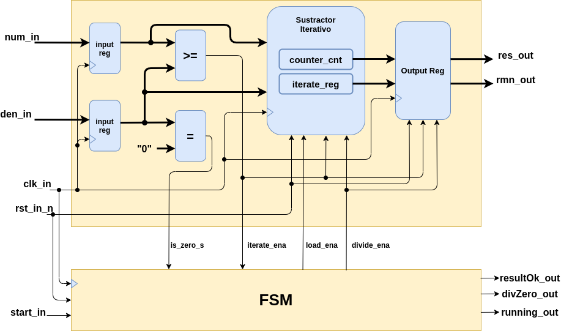
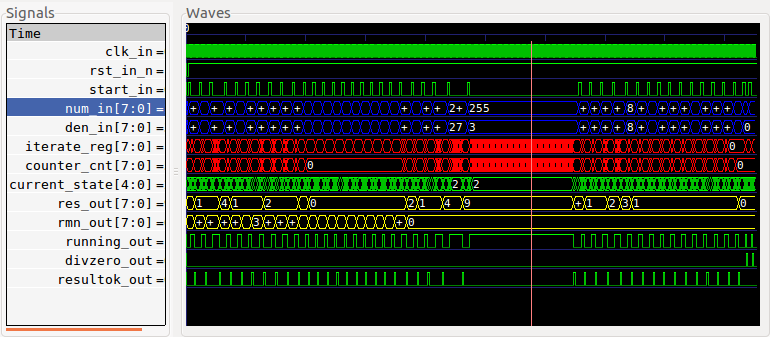
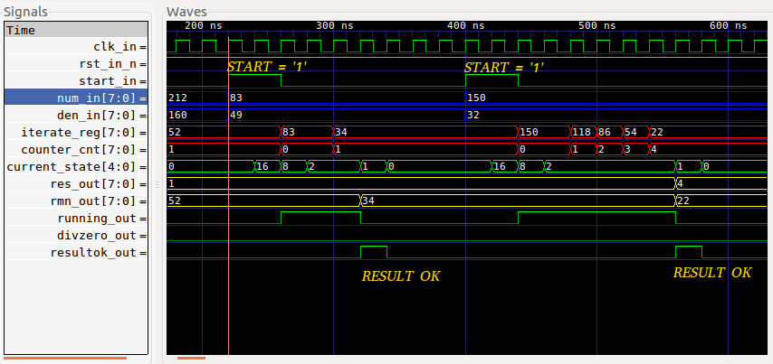
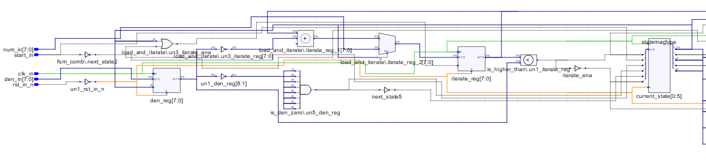
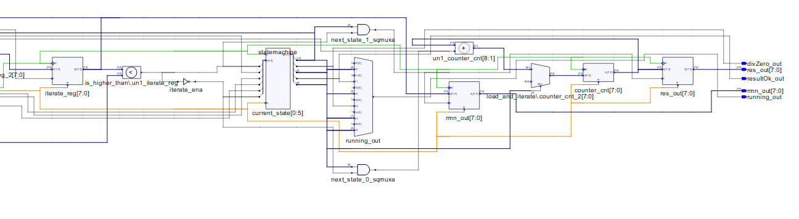
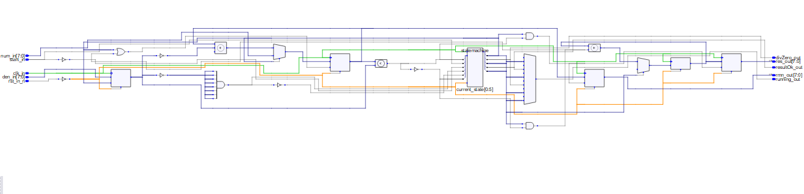
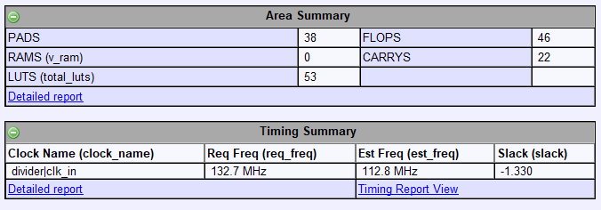
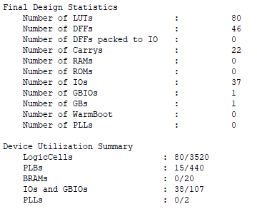

# Divisor

[[_TOC_]]

## 1. Descripción

Este ejemplo muestra el diseño de un divisor de números enteros mediante el uso de una **FSMD** (Finite State Machine with Datapath).

### Introducción

Las FSMD están compuestas por:

* Camino de datos: bloques combinacionales y/o secuenciales que procesan la información.

* Camino de control: FSM que "guía" el camino de los datos a través de los bloques combinacionales o secuenciales que procesan la información.

El diseño que se presenta aquí propone los siguientes pasos para el diseño del divisor:

1. En primer lugar, reconocer y diagramar el algoritmo que será utilizado para procesar los datos (en este caso para dividir). Aquí no se busca reconocer los bloques de hardware que procesarán los datos, solo reconocer las operaciones a realizar, por ejemplo: cargar datos, sumar, restar, contar, etc.

2. Luego, todo lo anterior puede plasmarse en un **diagrama de estados y transiciones**. Este diagrama será el que describe el comportamiento del camino de control de la FMSD.

3. Con el diagrama de estados y transiciones, y las operaciones a realizar, el paso final es determinar qué elementos de hardware (registros, flip-flops, contadores, memorias, etc.) se requieren para llevar a cabo el algoritmo propuesto. Un diagrama en bloques puede resultar muy útil en esta instancia, ya que ayuda a visualizar el hardware que se va a implementar, con sus respectivas entradas, salidas y señales de control, como se verá en breve.

### Algoritmo de división

Tal como se mencionó anteriormente, en primer lugar es necesario determinar el algoritmo a utilizar. En este caso, para dividir dos números enteros de N bits, se propone lo siguiente:

1. Cargar los datos, en este caso numerador y denominador de la división.

2. Determinar si el denominador es distinto de cero. Si el denominador fuera igual a cero, la división no sería posible. En este caso el proceso termina, pudiendo informar esta situación mediante algún mensaje o señal de error. De lo contrario, es posible realizar la división.

3. Para obtener el resultado y el resto de la división, es posible restar al numerador una cantidad igual al denominador, iterando sucesivamente hasta que el numerador sea menor al denominador. Cuando esto sucede, el resultado es igual al número de iteraciones realizadas, y el resto de la división es igual al valor del numerador tras la última iteración. Por ejemplo, para hacer 5 dividido 2 el proceso es el siguiente, dando como resultado 2 y resto 1:

```math
i_{1} = 5 - 2 = 3  

```  

```math
i_{2} = 3 - 2 = 1  

```  

### Diagrama de estados y transiciones

A continuación se muestra el diagrama de estados y transiciones propuesto para este caso particular. El mismo está compuesto por 6 estados, los cuales se detallan a continuación:

* **IDL**: Estado inicial de la FSM. Aquí, todas las salidas y señales internas se ponen a cero. La FSM permanece en este estado hasta que la señal de entrada **start_in** se ponga en '1', indicando el comienzo del procesamiento de datos.

* **LOAD**: Carga los datos de entrada (numerador y denominador) e inmediatamente pasa al estado siguiente.

* **CHK**: Aquí se realiza el chequeo del denominador, verificando el estado de la señal **is_zero_s**, la cual indica si el denominador es igual o distinto de cero. Si este es distinto de cero (**is_zero_s** = '0'), es posible continuar con la división, de lo contrario (**is_zero_s** = '1'), la operación no puede realizarse y se pasa al estado de error **ERR**. Durante el chequeo la salida **running_out** se pone en '1', indicando que los datos comienzan a procesarse.

* **ERR**: Estado de error, se pone en '1' la salida **divZero_out** para notificar que el denominador es igual a cero e inmediatamente vuelve al estado **IDL**.

* **DIV**: Se ejecuta la división hasta que la señal **iterate_ena** (señal que va desde el _datapath_ hacia la FSM) sea igual a '0', indicando que no debe seguir iterando. Cuando esto sucede, se pasa al estado siguiente que indica el final de la división.

* **FINISHED**: Resultado y resto de la división listos. Se pone en '0' la salida **running_out**, y en '1' la salida **resultOk_out**. La FSM vuelve al estado **IDL** en el siguiente pulso de clock.

El diagrama completo de estados y transiciones se muestra en la siguiente imagen:



#### E/S de la FSM

Las señales que van desde la FSM hacia el _datapath_ son: **load_ena** (habilita la carga de datos) y **divide_ena** (habilita el comienzo de la división). Las salidas de la FSM son: **resultOk_out** (resultado Ok de la división), **running_out** (procesamiento en curso) y **divZero_out** (indicación de división por cero).

### Diagrama en bloques del Hardware

Tal como se mencionó más arriba, el objetivo del diagrama en bloques es llevar el algoritmo a una implementación en hardware. Para eso, es necesario identificar las operaciones que se desarrollan en él:

* Comparación: para determinar si el denominador es igual a cero y si es posible seguir iterando, es decir, que el resultado de la iteración sea mayor o igual al denominador.

* Resta: operación necesaria en cada iteración.

* Contar: determinar el número de iteraciones hechas para obtener el resultado final.

* Registrar: cargar datos de entrada y salida para que estos se sincronicen con el clock del sistema.

La siguiente figura muestra el diagrama en bloques del Hardware propuesto. La parte superior del mismo corresponde al camino de datos (_datapath_), y en él se encuentran los registros, comparadores, contadores y restadores que procesan los datos de entrada: 



Notar que el bloque "Sustractor Iterativo" es el que registra los datos de entrada y realiza las iteraciones descriptas en el algoritmo.


## 2. Código

A continuación, se presenta el código de [divider.vhd](VHDL/divider.vhd):

### Entidad

```vhdl

entity divider is
    generic (nBits : integer := 8);
    port(
        num_in : in unsigned(nBits-1 downto 0); --Numerador
        den_in : in unsigned(nBits-1 downto 0); --Denominador
        clk_in : in std_logic;    --Entrada de clock
        rst_in_n : in std_logic;  --Entrada de reset
        start_in : in std_logic;  --Señal de start
        res_out : out unsigned(nBits-1 downto 0); --Resultado
        rmn_out : out unsigned(nBits-1 downto 0); --Remanente
        resultOk_out : out std_logic;   --Indicación de resultado Ok
        divZero_out  : out std_logic;   --Indicación de division por cero
        running_out   : out std_logic); --Indicación de procesamiento en curso
end entity divider;


```

### Arquitectura

#### FSM

A continuación, se muestran los bloques de código correspondientes a la FSM, es decir, el camino de control:

* Actualización de estado:

```vhdl
--Actualizacion de estados:
fsm_seq:
process (clk_in,rst_in_n)
begin
    --Accion de reset
    if (rst_in_n = '0') then
        current_state <= IDL;
    elsif (rising_edge(clk_in)) then
        --Actualizar el estado
        current_state <= next_state;
    end if;
end process fsm_seq;

```

* Lógica de selección de estado siguiente:

```vhdl

--Proceso combinacional : seleccion de la salida y del proximo estado segun estado actual
fsm_comb:
process (current_state,start_in,is_zero_s,iterate_ena)
begin
    case (current_state) is
        when IDL =>
            --Proximo estado
            if (start_in = '1') then
                next_state <= LOAD;
            else
                next_state <= IDL;
            end if;
            --Salidas de la FSM
            load_ena  <= '0';
            divide_ena <= '0';
            resultOk_out <= '0';
            running_out   <= '0';
            divZero_out  <= '0';

        when LOAD =>
            --Proximo estado
            next_state <= CHK;
            --Salidas de la FSM
            load_ena  <= '1';
            divide_ena <= '0';
            resultOk_out <= '0';
            running_out   <= '0';
            divZero_out  <= '0';

        when CHK =>
            --Proximo estado
            if (is_zero_s = '1') then
                next_state <= ERR;
            else
                next_state <= DIV;
            end if;
            --Salidas de la FSM
            load_ena  <= '0';
            divide_ena <= '0';
            resultOk_out <= '0';
            running_out   <= '1';
            divZero_out  <= '0';

        when ERR =>
            --Proximo estado
            next_state <= IDL;
            --Salidas de la FSM
            load_ena <= '0';
            divide_ena <= '0';
            resultOk_out <= '0';
            running_out <= '0';
            divZero_out <= '1';

        when DIV =>
            --Proximo estado
            if (iterate_ena = '1') then
                next_state <= DIV;
            else
                next_state <= FINISHED;
            end if;
            --Salidas de la FSM
            load_ena <= '0';
            divide_ena <= '1';
            resultOk_out <= '0';
            running_out <= '1';
            divZero_out <= '0';

        when FINISHED =>
            --Proximo estado
            next_state <= IDL;
            --Salidas de la FSM
            load_ena <= '0';
            divide_ena <= '0';
            resultOk_out <= '1';
            running_out <= '0';
            divZero_out <= '0';

        when others =>
            next_state <= IDL;
            load_ena <= '0';
            divide_ena <= '0';
            resultOk_out <= '0';
            running_out <= '0';
            divZero_out <= '0';

    end case;
end process fsm_comb;

```

#### Datapath

Los siguientes bloques corresponden al camino de datos:

* Sustractor iterativo:

```vhdl
--Sustractor iterativo
load_and_iterate:
process(clk_in, rst_in_n)
begin
    if(rst_in_n = '0') then
        num_reg <= ZERO;
        den_reg <= ZERO;
        counter_cnt <= ZERO;
        iterate_reg <= ZERO;
    elsif(rising_edge(clk_in)) then
        if(load_ena = '1') then
            num_reg <= num_in;
            den_reg <= den_in;
            iterate_reg <= num_in;
            counter_cnt <= ZERO;
        elsif(iterate_ena = '1' and divide_ena = '1') then
            iterate_reg <= iterate_reg - den_reg;
            counter_cnt <= counter_cnt + 1;
        end if;
    end if;
end process load_and_iterate;

```

* Comparador den = 0:

```vhdl

--Proceso combinacional : comparacion del divisor con cero
is_den_zero:
process (den_reg)
begin
    if (den_reg = ZERO) then
        is_zero_s <= '1';
    else
        is_zero_s <= '0';
    end if;
end process is_den_zero;

```

* Comparador '>=':

```vhdl
--Proceso combinacional : comparacion de numerador y denominador
is_higher_than:
process (iterate_reg)
begin
    if (iterate_reg >= den_reg) then
        iterate_ena <= '1';
    else
        iterate_ena <= '0';
    end if;
end process is_higher_than;

```

* Registro de salida:

```vhdl

--Registro de salida
output_reg:
process(clk_in,rst_in_n)
begin
    if(rst_in_n = '0') then
        res_out <= ZERO;
        rmn_out <= ZERO;
    elsif(rising_edge(clk_in)) then
        if (divide_ena = '1' and iterate_ena = '0') then
            res_out <= counter_cnt;
            rmn_out <= iterate_reg;
        end if;
    end if;
end process output_reg;

```


## 3. Simulación

Para simular el divisor y validlar su funcionamiento se utiliza el archivo [stimulus.txt](VHDL/stimulus.txt), el cual es generado mediante el script [generate.py](VHDL/generate.py). Este script también genera el **package** [parametersPackage.vhd](VHDL/parametersPackage.vhd), el cual contiene las constantes necesarias para instanciar y simular el divisor dentro del testbench [divider_tb](VHDL/divider_tb.vhd). 

Para generar el archivo de estímulos se ejecuta el script de la siguiente forma:

```bash

python generate.py -n 8

```

Siendo la opción '-n 8' la que indica el tamaño en bits de los números enteros a dividir (en este caso, 8 bits).


### Resultado:

Las siguientes imágenes muestran la simulación del divisor con n = 8. Las señales resaltadas en azul corresponden a las señales de entrada del numerador y denominador. Las rojas representan al registro que decrementa su valor con cada iteración y al contador que acumula la cantidad de iteraciones realizadas. Las señales amarillas corresponden al resultado y resto de salida:



Para mayor detalle, a continuación puede verse el proceso de división para dos casos. Primero se realiza 83/49, dando como resultado 1 y resto 34. Notar que luego de dar la señal de comienzo (**start_in** = '1'), los datos se cargan y comienza la división hasta obtener el resultado (**resultOk_out** = '1'). La siguiente división que se observa es 150/32, dando como resultado 4 y resto 22:



Finalmente, la imagen siguiente muestra dos casos donde se intenta dividir por cero. En ambos, la salida **divZero_out** se pone en '1' luego del chequeo para indicar esta situación:


### Full Test 

El testbench presentado en la sección anterior utiliza el archivo **stimulus.txt**, el cual contiene una serie de combinaciones de numerador y denominador, junto al resultado y resto de su división. Sin embargo, este test no cubre el 100% de los casos, ya que el archivo de estímulos no contiene todas las combinaciones posibles de numeradores y denominadores. Para contemplar todos estos casos, se creó el script [generate_full.py](VHDL/generate_full.py), el cual se encarga de crear el archivo [stimulus_full.txt](VHDL/stimulus_full.txt). Si el lector o lectora desea realizar un test del 100% de los casos, puede utilizar entonces este archivo dentro del testbench. Sin embargo, debe tener en cuenta que al ser una prueba mucho más exhaustiva, su ejecución puede demorar varios minutos.

De forma similar al script **generate.py**, el archivo de estímulos con covertura de 100% se crea con el comando:

```bash

python generate_full.py -n 8

```
Siendo la opción '-n 8' la que indica el tamaño en bits de los números enteros a dividir.

## 4. Síntesis

El resultado de la síntesis realizada desde **iCEcube2** se muestra en las siguientes imágenes:







En las imágenes anteriores pueden observarse algunos de los bloques presentados en la descripción del código, tales como: comparadores, sumadores/restadores, contadores y registros de entrada y salida. Un detalle interesante en este punto es que el registro **num_reg** no se ha implementado. Si se observa en detalle el código VHDL del divisor, es posible notar que a fines prácticos este registro no es utilizado. Si bien el registro existe en la descripción, el sintetizador es capaz de detectar que no se usa y, consecuentemente, no implementarlo físicamente en la FPGA. Para este caso particular, el funcionamiento del divisor no se ve afectado por su inexistencia. Existen otros casos donde el sintetizador puede eliminar registros o señales sin que el diseñador lo desee. En esos casos, hacer una simulación post síntesis es adecuada para validar el funcionamiento del diseño luego de esta etapa. Otras herramientas que existen para evitar estas "optimizaciones" del sintetizador son los **atributos** del mismo. Por ejemplo, la lista de atributos de **Synplify Pro** (sintetizador integrado en iCEcube2) puede encontrarse [aquí](https://www.microsemi.com/document-portal/doc_download/134092-synopsys-fpga-synthesis-attribute-reference-manual-i-2013-09m-sp1-1).

A continuación se muestran la utilización de recursos y la estimación de la frecuencia máxima del clock, post síntesis:



Luego del _place and route_, la utilización total de recursos incluye también aquellos utilizados para el ruteo de los bloques internos de la FPGA. El resumen final de recursos utilizados post _place and route_ se muestra a continuación:



## 5. Información adicional: teoría y uso de herramientas

Para más información teórica y sobre el uso de las herramientas para compilar, simular y sintetizar, referirse a los siguientes vínculos:
 - [Finite States Machines](https://gitlab.com/RamadrianG/wiki---fpga-para-todos/-/wikis/FSM)
 - [Finite States Machines with Datapath](https://gitlab.com/RamadrianG/wiki---fpga-para-todos/-/wikis/FSMD)
 - [GHDL y gtkWave](https://gitlab.com/RamadrianG/wiki---fpga-para-todos/-/wikis/Herramientas-libres-para-VHDL)
 - [iCEcube2](https://gitlab.com/RamadrianG/wiki---fpga-para-todos/-/wikis/Software-Lattice)


 


 

