# SPI

[[_TOC_]]

## 1. Descripción

Este ejemplo muestra el diseño de un periférico **SPI Master**, el cual permite ser configurado mediante _generics_ para operar en diferentes modos de funcionamiento y con diferentes tamaños de datos (cantidad de bits).

### Introducción

El protocolo SPI es un estándar que permite la comunicación full-duplex entre un dispositivo **Master** que controla el bus de datos y uno o varios dispositivos **Slaves** conectados a este, que esperan ser habilitados para enviar y/o recibir datos del bus. La comunicación es coordinada mediante cuatro señales:

* **SCLK**: clock del bus de datos
* **CS**: Chip-Select, señal que habilita al **Slave** para leer y/o escribir. En principio, hay un **CS** por cada dispositivo esclavo.
* **MOSI**: _Master Output - Slave Input_, datos enviados desde el master hacia el slave.
* **MISO**: _Master Input - Slave Output_, datos enviados desde el slave hacia el master.

Ya que la intención de este documento es describir el diseño propuesto en HDL para el periférico, no se explicará detalladamente el protocolo SPI en sí. En caso que el lector o la lectora deseen profundizar en este tema, se los invita a visitar los siguientes enlaces:

* [Introduction to SPI interface](https://community.nxp.com/docs/DOC-332403)
* [Serial Peripheral Interface (SPI)](https://learn.sparkfun.com/tutorials/serial-peripheral-interface-spi)
* [Introduction to I²C and SPI protocols](https://www.byteparadigm.com/applications/introduction-to-i2c-and-spi-protocols/)


### Diseño propuesto

Para la descripción del periférico, se propone un diseño basado en una [FSMD](https://gitlab.com/RamadrianG/wiki---fpga-para-todos/-/wikis/FSMD). De esta forma, habrá bloques de hardware bien definidos en el camino de datos que serán controlados mediante una **FSM** encargada del camino de control. 

El componente principal de este periférico es el **registro de desplazamiento**, el cual se utiliza para almacenar los bits que ingresan por la línea **MISO** y desplazar los bits que deben enviarse por la línea **MOSI**. El diagrama en bloques siguiente muestra la arquitectura simplificada del diseño propuesto. A fines de mantener este diagrama simplificado, se muestran aquí únicamente las señales y bloques de mayor importancia. El resto se explicarán al presentar la entidad del dispositivo:

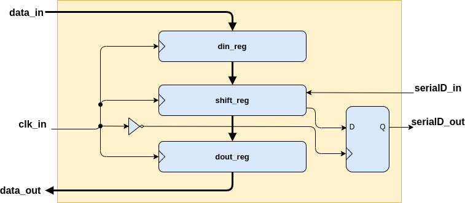

Del diagrama anterior, puede notarse que las líneas **MISO** y **MOSI** llevan el nombre **serialD_in** y **serialD_out**, respectivamente. Tanto los datos de entrada **data_in** (datos a enviar), como los datos de salida **data_out** (datos recibidos), son almacenados en los registros **din_reg** y **dout_reg**, respectivamente. 

El agregado de un Flip-Flop D (el cual funciona con el flanco de clock opuesto al resto de los registros) tiene como objetivo desplazar los bits de salida por la línea **serialD_out** con el flanco de clock opuesto al de las lecturas en **serialD_in**. De esta forma, los datos se leen con un flanco de clock (puede ser ascendente o descendente), y se desplazan con el flanco opuesto, tal como lo indica el protocolo SPI.


## 2. Código

A continuación, se presenta el código de [spi.vhd](VHDL/spi.vhd):

### Entidad

Para dar una explicación clara, se presenta primero la entidad y luego se describirán los _generics_ y los _ports_ por separado:

```vhdl

entity spi is
generic(
    dataBits : integer range 4 to 32 := 8;
    cPol : std_logic := '1';
    cPha : std_logic := '1';
    csPol : std_logic := '0');
port(
    clk_in : in std_logic;
    rst_in_n : in std_logic; 
    drdy_in : in std_logic; 
    serialD_in : in std_logic;
    serialD_out : out std_logic;
    cs_out : out std_logic;
    sclk_out : out std_logic; 
    dataReceived_out : out std_logic; 
    shifting_out : out std_logic; 
    write_in : in std_logic; 
    data_in : in std_logic_vector(dataBits-1 downto 0);
    data_out : out std_logic_vector(dataBits-1 downto 0));
end entity spi;

```

#### Generics

* **dataBits**: define el tamaño de los datos en bits.
* **cPol**: define la polaridad del **SCLK** cuando está inactivo. De esta forma, **cPol** = '1' indica que **SCLK** permanece en '1' cuando no hay intercambio de datos, mientras que **cPol** = '0' indica que **SCLK** permanece en '0' en la misma situación.
* **cPha**: define con qué flanco de clock se leen los datos. Si **cPha** = '0', los datos se leen con el primer flanco de clock al momento de comenzar la recepción. Por el contrario, si **cPha** = '1', los datos se leen con el segundo flanco de clock luego de comenzar la recepción.
* **csPol**: polaridad de la línea _chip select_.

#### Ports

* **clk_in**: Entrada de clock
* **rst_in_n**: Entrada de reset negado
* **drdy_in**: Entrada que indica la presencia datos disponibles para leer
* **serialD_in**: MISO
* **serialD_out**: MOSI
* **cs_out**: Chip select
* **sclk_out**: SCLK
* **dataReceived_out**: Indicación de datos recibidos
* **shifting_out**: Transmisión en curso
* **write_in**: Señal para comenzar proceso de transmisión de datos (escritura)
* **data_in**: Entrada de datos para transmitir
* **data_out**: Datos recibidos
* ****

### Arquitectura

A continuación se presenta la arquitectura del periférico SPI. Los bloques principales son:

* **Registro de entrada**
* **Registro de salida**
* **Registro de desplazamiento**
* **Desplazamiento de salida con Flip-Flop D**
* **Contador de pulsos de clock**
* **Lógica de salida**

#### Registro de entrada

Tanto este registro, como los registros de salida y desplazamiento, funcionan con el flanco de **clk_in** definido por la constante  **SHIFT_IN_EDGE**. Esta constante depende del modo de funcionamiento del periférico SPI. En otras palabras, depende de los _generics_ **cPol** y **cPha** (más adelante se verá su definición).

```vhdl

    --Registro de entrada
    input_register:
    process(clk_in,rst_in_n)
    begin
        if(rst_in_n = '0') then
            din_reg <= (others => '0');
        elsif(clk_in'event and clk_in=SHIFT_IN_EDGE) then
            if(loadDin_ena = '1') then
                din_reg <= data_in;
            end if;
        end if;
    end process input_register;

```

#### Registro de salida

```vhdl

    --Registro de salida
    output_register:
    process(clk_in,rst_in_n)
    begin
        if(rst_in_n = '0') then
            dout_reg <= (others => '0');
        elsif(clk_in'event and clk_in=SHIFT_IN_EDGE) then
            if(loadDout_ena = '1') then
                dout_reg <= shift_reg;
            end if;
        end if;
    end process output_register;

```

#### Registro de desplazamiento

```vhdl

    --Registro de desplazamiento
    do_shift_in:
    process(clk_in,rst_in_n)
    begin
        if(rst_in_n = '0') then
            shift_reg <= (others => '0');
            shiftBitsIn_s <= (others => '0');
            dataReceived_s <= '0';
        elsif(clk_in'event and clk_in=SHIFT_IN_EDGE) then
            if(shiftLoad_ena_n = '0') then
                shift_reg <= din_reg;
                shiftBitsIn_s <= (others => '0');
                dataReceived_s <= '0';
            elsif(shift_ena = '1') then
                shift_reg <= shift_reg(dataBits-2 downto 0)&serialD_in;
	        if(shiftBitsIn_s = dataBits-2) then
		    dataReceived_s <= '1';
                    shiftBitsIn_s <= shiftBitsIn_s+1;
                elsif(shiftBitsIn_s = dataBits-1) then
                    dataReceived_s <= '0';
                    shiftBitsIn_s <= (others => '0');
		else
	            dataReceived_s <= '0';
                    shiftBitsIn_s <= shiftBitsIn_s+1;
	        end if;
            end if;
        end if;
    end process do_shift_in;

```

#### Desplazamiento de salida con Flip-Flop D

Este Flip-Flop D, tal como se mostró en el diagrama en bloques, opera con el flanco opuesto al resto de los registros. Por tal motivo, su comportamiento se define con la constante **SHIFT_OUT_EDGE**, la cual equivale a **SHIFT_IN_EDGE** negado.

```vhdl

    --Desplazamiento de salida con FF D
    do_shift_out:
    process(clk_in,rst_in_n)
    begin
        if(rst_in_n = '0') then
            serialD_out <= '0';
        elsif(clk_in'event and clk_in=SHIFT_OUT_EDGE) then
            serialD_out <= shift_reg(dataBits-1);
        end if;
    end process do_shift_out;

```

#### Contador de pulsos de clock

Este bloque se encarga de contar los pulsos de clock para determinar si la señal **sclk_out** debe volver al estado inactivo definido por **cPol**.

```vhdl

    --Contar pulsos de clock en funcion del modo SPI
    count_clock_pulses:
    process(clk_in)
    begin
        if(clk_in'event and clk_in=cPol) then
            if(sclkOutput_ena = '0') then
                pulseCounter_cnt <= (others => '0');
                pulseCounterTC_s <= '0';
            else
                if(pulseCounter_cnt = dataBits-1) then
                    pulseCounter_cnt <= (others => '0');
                    pulseCounterTC_s <= '1';
                else
                    pulseCounter_cnt <= pulseCounter_cnt + 1;
                    pulseCounterTC_s <= '0';
                end if;
            end if;
        end if;
    end process count_clock_pulses;

```

#### Lógica de salida

La lógica combinacional que se describe aquí está asociada al control de **sclk_out**. Se compone por un multiplexor comandado por la señal **sclkOutputSelect_s** (la cual depende de las señales **sclkOutput_ena** y **pulseCounterTC_s**). De esta forma, el clock **clk_in** se asigna a la salida **sclk_out** cuando **sclkOutputSelect_s** = '1'. Por el contrario, cuando **sclkOutputSelect_s** = '0', la salida **sclk_out** pasa a su estado inactivo definido por **cPol**.

```vhdl

    --Salidas
    sclk_out <= sclk;
    sclkOutputSelect_s <= (sclkOutput_ena) and (not pulseCounterTC_s);
    with sclkOutputSelect_s select
        sclk <=
            clk_in when '1',
            cPol when others;

    data_out <= dout_reg;

```

La siguiente figura muestra el hardware que aquí se describe:


#### Señales y constantes de la arquitectura

```vhdl

    architecture spi_arch of spi is
        ----Chip Select y flancos de lectura y desplazamiento----
        constant SHIFT_OUT_EDGE : std_logic := (cPol xor cPha);
        constant SHIFT_IN_EDGE : std_logic := not(SHIFT_OUT_EDGE);
        constant CS_ACTIVE : std_logic := csPol;
        constant CS_INACTIVE : std_logic := not(csPol);
        ----SCKL----
        signal sclk : std_logic;
        signal sclkOutput_ena : std_logic;
        signal sclkOutputSelect_s : std_logic;
        ----Contador de pulsos de clock----
        constant PULSE_CNTR_N_BITS : integer := integer(ceil(log2(real(dataBits))));
        signal pulseCounter_cnt : unsigned(PULSE_CNTR_N_BITS-1 downto 0);
        signal pulseCounterTC_s : std_logic;
        ----Registro de entrada----
        signal din_reg : std_logic_vector(dataBits-1 downto 0);
        signal loadDin_ena : std_logic;
        ----Registro de salida----
        signal dout_reg : std_logic_vector(dataBits-1 downto 0);
        signal loadDout_ena : std_logic;
        ----Registro de desplazamiento----
        signal shift_reg : std_logic_vector(dataBits-1 downto 0);
        signal shiftBitsIn_s : unsigned(dataBits-1 downto 0);
        signal shiftLoad_ena_n : std_logic;
        signal shift_ena : std_logic;
        signal dataReceived_s : std_logic;
        ----Estados de la FSM----
        type fsmd_states is (IDLE, LOAD_INPUT, LOAD_SR, CSELECT, SHIFT, DONE, CNOTSELECT);
        signal currentState_s, nextState_s : fsmd_states;
    begin

```

## 3. Simulación

Con el fin de verificar los cuatro modos de funcionamiento del periférico, se realizó un test para cada uno de ellos y el conjunto fue ejecutado con el _framework_ de testing [VUnit](https://vunit.github.io/), integrado directamente en **Atom**. 

**VUnit** es un _framework_ de testing _open source_, que permite correr de forma automática una serie de **testbenches** sobre el **DUT** (_Device Under Test_) que queremos verificar. De esta manera, **VUnit** se encarga de detectar nuestros testbenches y archivos fuente dentro del directorio especificado, correrlos y posteriormente informar el procentaje de test pasados correctamente. Es importante aclarar que esta herramienta **no define** el **método** que se usará para verificar el diseño (generación aleatoria de estímulos, lectura de estímulos desde archivos, generación de estímulos dentro del testbench, etc.), simplemente nos permite correr nuestros testbenches de forma automática, mediante un único comando, informándonos luego el resultado para cada uno de ellos. 

Para verificar el periférico SPI, los siguientes testbenches fueron ejecutados automáticamente con VUnit:

* [spiMode0_tb](VHDL/test/spiMode0_tb.vhd)
* [spiMode1_tb](VHDL/test/spiMode1_tb.vhd)
* [spiMode2_tb](VHDL/test/spiMode2_tb.vhd)
* [spiMode3_tb](VHDL/test/spiMode3_tb.vhd)

La principal diferencia entre ellos es el valor que se les da a **cPol** y **cPha**, los cuales definen el modo de funcionamiento del DUT instanciado. El resto del testbench es idéntico para los cuatro casos.

A continuación se muestran algunas formas de onda para los modos 0 y 3:

* Modo 0 - lectura:

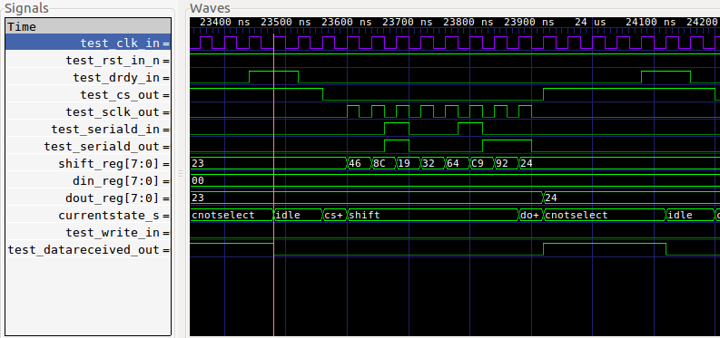

* Modo 0 - escritura:


* Modo 3 - lectura:

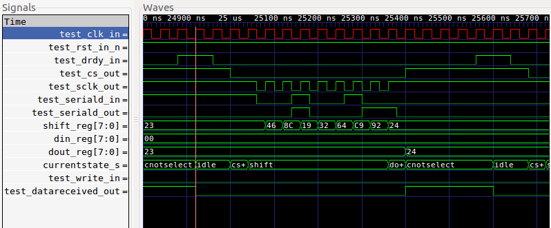

* Modo 3 - escritura

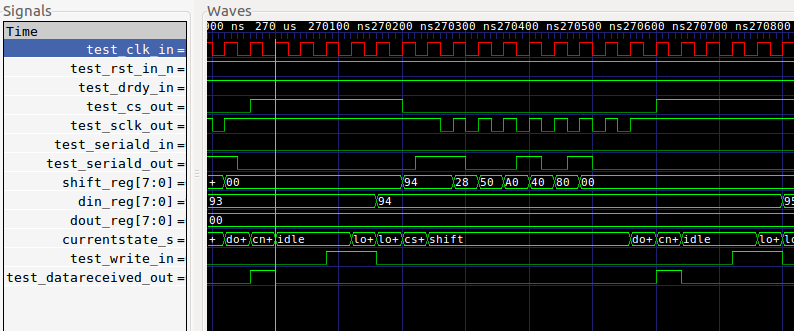


## 4. Síntesis

El diseño fue sintetizado con la herramienta [iCEcube2](http://www.latticesemi.com/iCEcube2) de [Lattice Semiconductor](http://www.latticesemi.com/en). Las siguientes capturas muestran el resultado de la misma, resaltando en ellas los bloques de hardware presentados previamente:

### Registros, lógica de salida y contador de pulsos de clock:

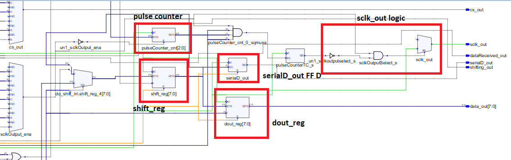

### Registro de entrada y lógica de estado actual de la FSM:

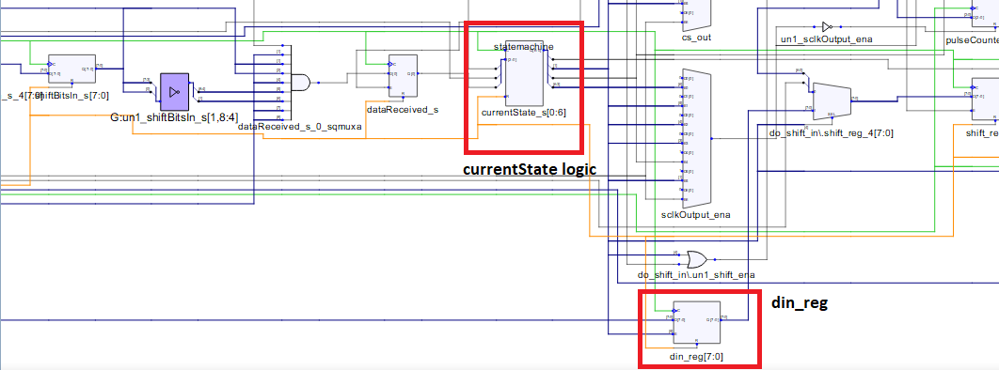

### Síntesis completa:

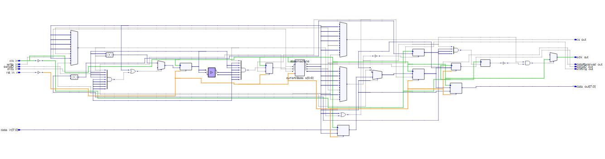

### Recursos utilizados

|Device Utilization Summary |      N°    |
|---------------------------|------------|
|LogicCells                 |	58/3520  |
|PLBs                       | 	14/440   |
|BRAMs                      | 	0/20     |
|IOs and GBIOs              | 	26/107   |
|PLLs                       | 	0/2      |


## 5. Simulación post síntesis

Para tener mayor certeza sobre el correcto funcionamiento de un diseño, es aconsejable realizar una simulación de la **netlist** generada luego de los procesos de síntesis y _Place and Route_. Esta netlist es un archivo de lenguaje HDL (VHDL o Verilog, por ejemplo) que representa una descripción del diseño sintetizado y ruteado, pero a nivel de bloques lógicos de la FPGA, es decir, contemplando ya la **tecnología** del chip. Este archivo indica cómo se conectan las luts, flip flops, memorias y todo elemento propio de la FPGA que sea utilizado en una aplicación particular. Junto con otros archivos de diseño, permiten realizar una simulación que se aproxime más a la realidad, es decir, al diseño corriendo en la FPGA. Por ejemplo, los archivos de extensión .sdf definen los _delays_ estándar que tienen los bloques lógicos de una familia de FPGA determinada. De esta forma, tomando la netlist junto al archivo .sdf correspondiente, es posible correr el testbench contemplando ahora los tiempos de respuesta propios de la familia.

En este caso particular, se ha usado el simulador [Active-HDL](https://www.aldec.com/en/support/resources/documentation/faq/1746), el cual viene integrado con **iCEcube2** en su versión para **Windows**. El procedimiento para crear el proyecto y simular la netlist se encuentra en el capítulo 10 del [manual de iCEcube2](https://www.latticesemi.com/-/media/LatticeSemi/Documents/UserManuals/EI/iCEcube201701UserGuide.ashx?document_id=52071). En caso que el lector desee realizar este análisis, la carpeta [VHDL/test/netlist/](VHDL/test/netlist/) de este ejemplo, contiene los archivos de netlist y test correspondientes a la síntesis del periférico SPI (Modo 0).

A continuación se presentan algunas capturas de esta simulación:

### Modo 0 - lectura

La siguiente imagen muestra la lectura del byte **0x24**, el cual ingresa por **serialD_in** (o **test_serialD_in** dentro del Testbench):

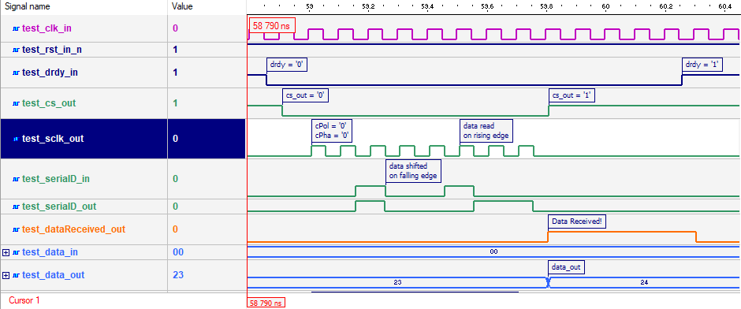

En principio, las diferencias que se observan respecto a la simulación pre-síntesis son pocas. Para ver con más detalle los retardos propios de la tecnología utilizada, podemos hacer _zoom in_ a las transiciones de las señales que nos interesan. Por ejemplo, veamos qué ocurre al momento en que la información recibida es presentada a la salida:

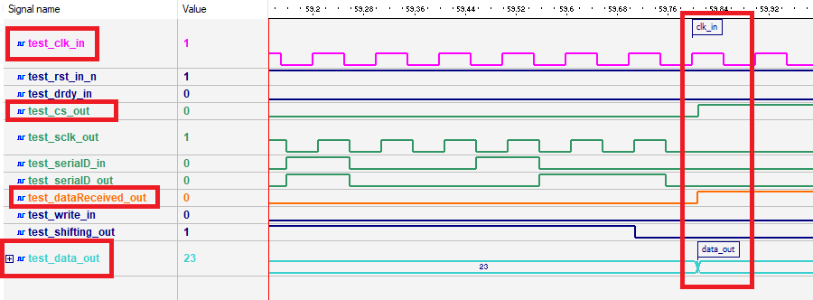

La imagen anterior resalta las transiciones de interés. En este caso, pondremos atención en las señales:

* **test_clk_in**
* **test_cs_out**
* **test_dataReceived_out**
* **test_data_out**

Al hacer _zoom in_ en ellas, veremos lo siguiente:

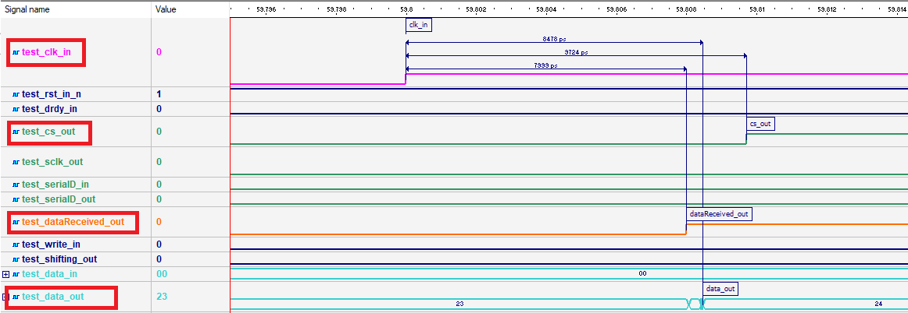

Se observa que hay un retardo de entre 8 y 10 nanosegundos entre el flanco de clock y el resto de las señales de interés. El peor caso ocurre para la salida **cs_out**, el cual presenta un retardo de **9724 ps**. 

Veamos ahora qué ocurre con la salida **test_data_out**. Para este caso particular, la longitud de **test_data_out** es de 8 bits. La imagen que sigue muestra la transición de los bits de esta salida y el retardo entre las salidas **test_dataReceived_out** y **test_data_out**:

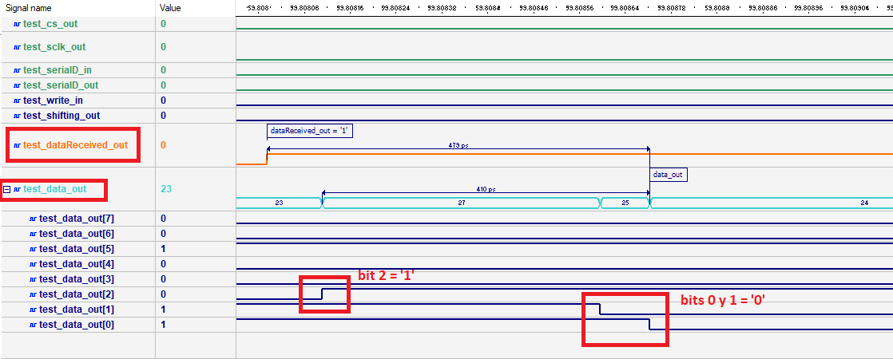

Lo que se observa es que, a diferencia del resultado obtenido del test pre-síntesis, aquí podemos ver que no todos los bits de un dato paralelo cambian exactamente al mismo tiempo. Existen demoras que la simulación post-síntesis deja en evidencia. En este caso, podemos ver que los datos de salida se estabilizan **0,5 ns** después del flanco de subida de la señal **test_dataReceived_out**.

Veamos a continuación el retardo existente entre el clock de entrada **clk_in** y el clock de salida **sclk_out**:

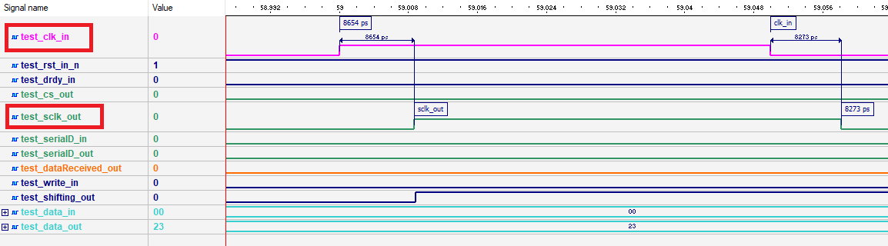

En este caso, existe un retardo mayor a **8 ns**. Para determinar si este es un valor aceptable o no, debemos referirnos a la aplicación particular que tendrá el ip core. Para la comunicación SPI, suelen utilizarse clocks de frecuencia menor a 12,5 MHz, por lo tanto el retardo aquí observado no sería un inconveniente.


## 6. Información adicional: teoría y uso de herramientas

Para más información teórica y sobre el uso de las herramientas para compilar, simular y sintetizar, referirse a los siguientes vínculos:
 - [Finite States Machines](https://gitlab.com/RamadrianG/wiki---fpga-para-todos/-/wikis/FSM)
 - [Finite States Machines with Datapath](https://gitlab.com/RamadrianG/wiki---fpga-para-todos/-/wikis/FSMD)
 - [VUnit](../../VUnit)
 - [iCEcube2](https://gitlab.com/RamadrianG/wiki---fpga-para-todos/-/wikis/Software-Lattice)


 


 

