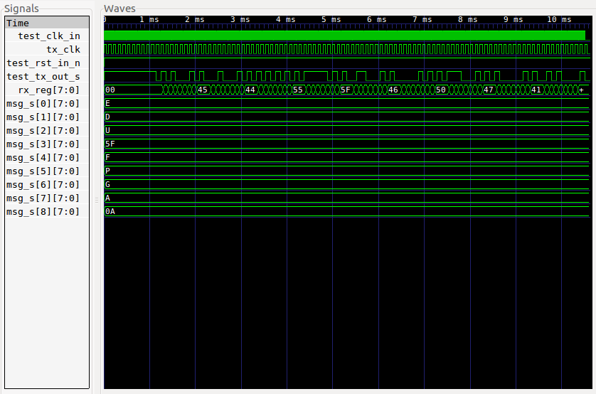
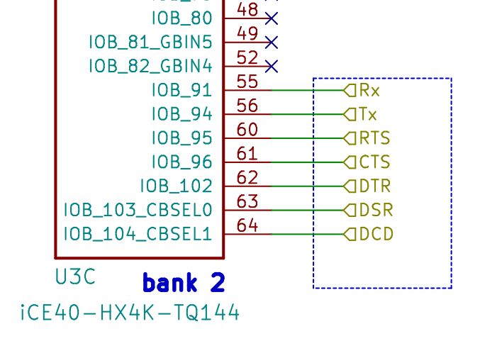
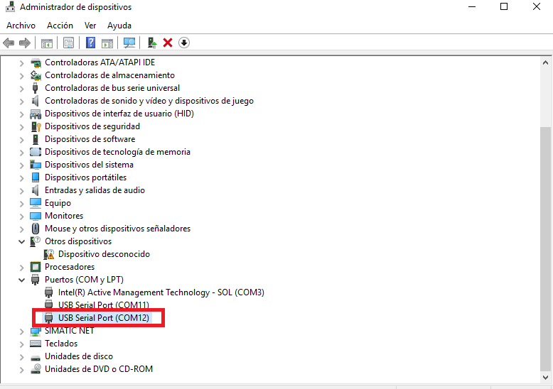
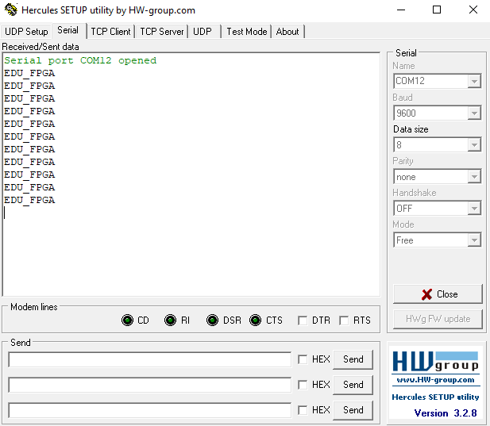

# Puerto COM

## 1. Descripción
### Introducción
Este ejemplo muestra el uso de un [ip core](https://en.wikipedia.org/wiki/Semiconductor_intellectual_property_core) para la implementación de una UART que nos permita probar el puerto COM de la EDU-FPGA. El ip core que se utiliza se llama MiniUART, diseñado originalmente por Philippe Carton, y su documentación detallada puede verse [aquí](https://opencores.org/websvn/filedetails?repname=miniuart2&path=%2Fminiuart2%2Ftags%2Faversion%2Fdoc%2FMiniUart.pdf). Tanto este como muchos otros ip cores pueden descargarse libremente del sitio [OpenCores](https://opencores.org/).
### Propósito:
Utilizar una UART para enviar un mensaje desde la EDU-FPGA hacia la PC cada 1 segundo. El mismo puede verse abriendo un monitor de puerto serie. 
>Nota: Este ejemplo solo prueba la comunicación Tx de la placa, no se implementa la recepción.
## 2. Código
Dado que el ejemplo muestra el uso de un ip core externo, el código que nos toca desarrollar simplemente debe tomar ese módulo, instanciarlo y diseñar la lógica necesaria para utilizarlo según nuestras necesidades. En este caso, se envía el mensaje **"EDU-FPGA"** cada 1 segundo. Tanto la instanciación como la lógica necesaria para el envío del mensaje se hace en el Top Level del diseño ([TopCOMPort.vhd](VHDL/TopCOMPort.vhd)). En esta sección se detallan algunos segmentos del Top Level a modo de explicación. No se entrará en detalle sobre el funcionamiento de la MiniUART.

### Entidad
Las señales que componen el Top Level son simplemente 3: **clk_in** (entrada de clock), **rst_in_n** (entrada de reset) y **tx_out** (pin de transmisión serie). A su vez, el generic **brDivisor** permite configurar el baud rate de la UART según la expresión:

```math
brDivisor = clkfreq / (4*baudrate)

``` 

Por otro lado, el generic **timerCount** permite configurar el tiempo entre mensajes, de forma tal que la visualización del mismo por pantalla sea más amena:

```math
timerCount = clkfreq[Hz]*tiempo[s]

``` 
En este ejemplo, se ha checho **timerCount = 12000000** para obtener un delay de 1 segundo.
En caso que el lector desee profundizar sobre la configuración del baudrate, puede hacerlo ingresando a la [documentación](https://opencores.org/websvn/filedetails?repname=miniuart2&path=%2Fminiuart2%2Ftags%2Faversion%2Fdoc%2FMiniUart.pdf) de la MiniUART.

El código de la entity a continuación:

```vhdl

entity TopCOMPort is
generic(
    brDivisor : positive:= 312; --Divisor para elegir baudrate => 312 = 12MHz/(4*9600)
    timerCount: integer := 12000000);
port(
    clk_in : in std_logic;
    rst_in_n : in std_logic;
    tx_out : out std_logic);
end entity TopCOMPort;


``` 

### Instanciar

Al instanciar el módulo, debemos asegurarnos de asignar a cada señal de la UART una señal en nuestro Top Level. En este ejemplo, dado que solo probamos la transferencia de datos unidireccional (desde la EDU-FPGA hacia la PC), hay ciertas señales del módulo UART que no se usan (por ejemplo **rxd_pad_i**). De todas formas, estas señales deben estar ruteadas al Top Level. Esto permite también, en un futuro ejemplo, tener el módulo ruteado para implementar también la recepción de datos por UART:

```vhdl

UART: entity work.UART_C
    generic map(BRDIVISOR => BrDivisor)
    port map(
		    wb_clk_i => wb_clk, wb_rst_i => wb_rst, wb_adr_i => wbAdr_bus,
		    wb_dat_i => wbDatIn_bus, wb_dat_o => wbDatOut_bus, wb_we_i => wbWrite_ena,
		    wb_stb_i => wbStb, wb_ack_o => wbAck, inttx_o => inttx_s,
		    intrx_o => intrx_s, br_clk_i => br_clk, txd_pad_o => txd_s,
		    rxd_pad_i => rxd_s);


``` 
En el código presentado arriba, el lector puede notar el uso de cierta nomenclatura para las señales de la UART: todas llevan el prefijo "wb". Esto se debe a que el módulo presenta una interfaz Wishbone. Wishbone es una arquitectura de interconexión pensada para darle portabilidad a ip cores, permitiendo que módulos diseñados por distintas personas o equipos puedan integrarse unos con otros fácilmente. La documentación detallada de esta interfaz puede verse [aquí](https://opencores.org/cdn/downloads/wbspec_b3.pdf).

### Cargar datos en la UART

En primer lugar, crea un array de constantes que guardará el mensaje que luego enviaremos por UART. En este caso, el mensaje es "**EDU-FPGA**", y el array es **msg_s**:

```vhdl

--Mensaje a enviar por uart--
constant E : unsigned := "01000101";
constant D : unsigned := "01000100";
constant U : unsigned := "01010101";
constant DASH : unsigned := "01011111";
constant F : unsigned := "01000110";
constant P : unsigned := "01010000";
constant G : unsigned := "01000111";
constant A : unsigned := "01000001";
constant NEW_LINE : unsigned := "00001010";
type matrix is array (0 to 8) of unsigned (7 downto 0);
signal msg_s : matrix := (others => (others => '0'));
signal msgSend_s : std_logic; --Señal de mensaje enviado

``` 

Luego, mediante un **process**, se envían los caracteres por UART:

```vhdl

--Enviar mensaje
load:
process(clk_in)
variable index : integer range 0 to 8;
begin
    if(rising_edge(clk_in)) then
        msgSend_s <= '0';
        if(wb_rst = '1') then
        wbWrite_ena <= '0';
        index := 0;
        elsif(inttx_s = '1' and timerTc_s = '1') then
            wbDatIn_bus <= std_logic_vector( msg_s(index) );
            wbWrite_ena <= '1';
            if(index = 8) then
                index := 0;
                msgSend_s <= '1';
            else
                index := index + 1;
            end if; --index = 8
        else
            wbWrite_ena <= '0';

        end if; --reset
    end if; --rising_edge clk_in
end process load;


``` 
Notar que el envío de la cadena se hace cuando las señales **inttx_s** y **timerTc_s** son ambas iguales a 1. La señal **inttx_s** indica que la UART está lista para enviar un nuevo dato. Por otro lado, **timerTc_s** es la señal que cada 1 segundo habilita el envío de la cadena de caracteres por UART. Esto último se hace para generar una pausa entre mensajes, y que el usuario pueda verlo de forma más cómoda en el monitor de puerto serie.

### Contador para tiempo de espera

La pausa entre mensajes se hace mediante un **process** llamado **counterDelay**. En este caso, el mismo cuenta de 0 hasta 11999999 (recordar que el clock de la EDU-FPGA trabaja en 12 MHz). Cuando alcanza su cuenta terminal, pone a '1' la señal  **timerTc_s**, la cual habilita el envío de datos por UART:

```vhdl

--Timer para espera entre mensajes
counterDelay:
process(clk_in,timer_rst)
begin
    if(timer_rst = '1') then
        timer_cnt <= (others => '0');
        timerTc_s <= '0';
    elsif(rising_edge(clk_in)) then
        if(timer_cnt < TimerCount-1) then
            timer_cnt <= timer_cnt + 1;
            timerTc_s <= '0';
        else
            timerTc_s <= '1';
        end if;--timer_cnt < TimerCount-1
    end if;--rising_edge(clk_in)
end process counterDelay;


```
Una vez que se envía la cadena de caracteres, el contador se resetea con la señal **msgSend_s**. Esta última indica que se ha enviado el mensaje por el puerto serie:

```vhdl

timer_rst <= (not rst_in_n) or msgSend_s;

```

## 3. Simulación

El testbench [TopCOMPort_tb.vhd](VHDL/TopCOMPort_tb.vhd) instancia al top level de este ejemplo ([TopCOMPort.vhd](VHDL/TopCOMPort.vhd)) y luego lee del archivo [bytes.txt](VHDL/bytes.txt) los estímulos necesarios para determinar si el mensaje que transmite la UART llega correctamente.
El test puede ejecutarse usando el plugin de Atom, o bien, abriendo un terminal en la carpeta VHDL de este ejemplo y corriendo el script [test.sh](VHDL/test.sh):

```bash

./test.sh

```
### Resultado:



## 4. Bajada a la placa y ensayo

### Síntesis y grabación en la memoria

La creación del proyecto en [iCEcube2](http://www.latticesemi.com/iCEcube2) y la síntesis, se realizan según lo indicado en la [Wiki](https://gitlab.com/RamadrianG/wiki---fpga-para-todos/-/wikis/Software-Lattice) de FPGA para todos.

El pinout de las señales del Top Level:

|Señal     |   #Pin     |
|----------|------------|
| clk_in   |    94      |
| rst_in_n |    31      |
| tx_out   |    56      |

>Nota: para **rst_in_n** pueden usarse cualquiera de los pines 31, 32, 33 o 34, los cuales corresponden a los 4 pulsadores de la placa.

El pin 56 de la FPGA está ruteado al FTDI Chip de la EDU-FPGA, el cual hace de interfaz entre protocolos:



Finalmente, la grabación del bitmap en la memoria de la EDU-FPGA se hace mediante el comando **iceprog**:

```bash

iceprog carpeta_del_proyecto_icecube2/sbt/outputs/bitmap/top_bitmap.bin

```

### Ensayo

#### Usuarios de Linux (Ubuntu 16.04)

En Ubuntu 16.04, podemos probar este ejemplo ejecutando el script [serial_msg.py](serial_msg.py) hecho en [Python](https://www.python.org/), mediante el siguiente comando:

```bash

sudo python serial_msg.py

```

>Nota: la versión de Python utilizada en este ejemplo es [Python3.5.2](https://www.python.org/downloads/release/python-352/) 

El script mostrará en pantalla 10 lineas con el mensaje leído por puerto serie:


#### Usuarios de Windows

Para probar el puerto COM en Windows, en primer lugar, conectamos la EDU-FPGA al puerto USB de la PC. Luego, abrimos Administrador de Dispositivos para ver los puertos COM presentes:



En este caso, los puertos **COM11** y **COM12** corresponden al FTDI Chip de nuestra placa. El puerto COM12 es el que se usa en este ejemplo, ya que la señal tx_o (pin 56) de la FPGA está ruteada al puerto B del FTDI. En caso de presentar problemas con el driver del FTDI, ver la sección siguiente de este instructivo.
Si todo está bien y Windows reconoce el dispositivo, el paso siguiente es abrir un monitor de puerto serie para ver el COM12. En este caso se usó [Hercules](https://www.hw-group.com/software/hercules-setup-utility), pero puede utilizarse cualquier otro. Luego, al abrir el puerto veremos algo como lo siguiente:




##### Troubleshoot: drivers en Windows

En caso de presentar problemas para abrir el puerto COM desde Windows, se sugieren los siguientes pasos:

1. Desinstalar el dispositivo desde administrador de dispositivos.
2. [Descargar el driver](https://www.ftdichip.com/Drivers/D2XX.htm) "CDM21228_Setup.exe", descomprimir y ejecutarlo.
3. Desconectar y volver a conectar el dispositivo.


