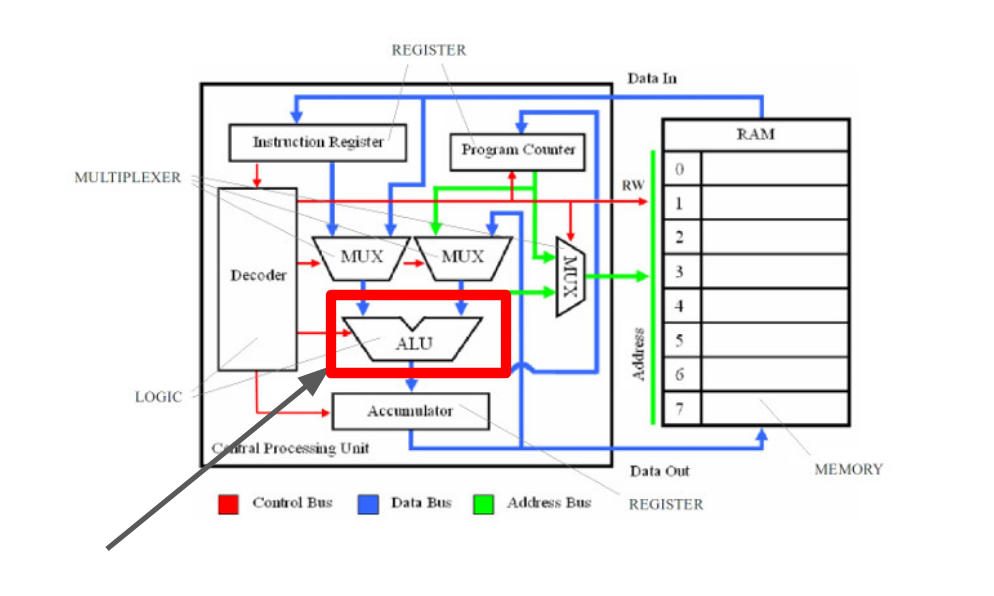
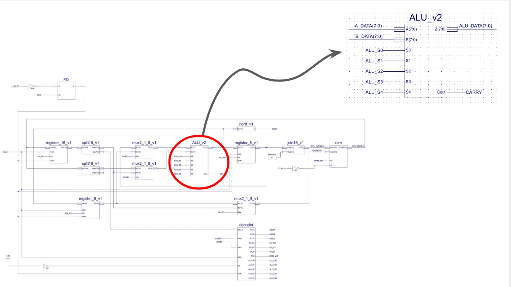
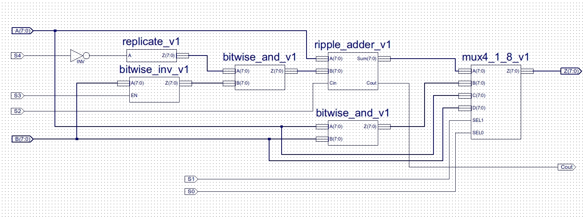
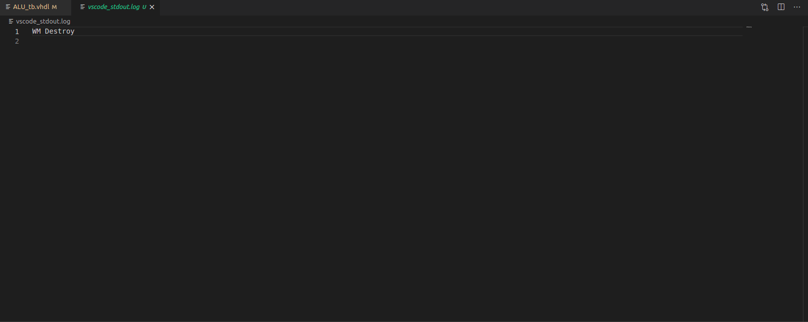

# ALU

* [Volver atras](../../README.md)

[[_TOC_]]



La Unidad Aritmetico Logica o ALU por sus siglas en ingles (**A**rithmetic **L**ogic **U**nit) es primeramente un **circuito netamente combinacional** de dos entradas de datos y en este caso 5 de control el cual se encargara de hacer todas las operaciones artimeticas que el procesador necesite, de el dependen las instrucciones *add, and* y *sub* que corresponden respectivamente a sumar los operandos de sus entradas, hacer una *bitwise and* entre ellos y restarlos. ademas la ALU en nuestro diseño puede incrementar o decrementar en 1 el resultado de sus operaciones, pasamos a presentar una tabla con la correspondencia entre las operaciones y sus respectivas lineas de control.

|s4 s3 s2 s1 s0|      Operación        |
|--------------|-----------------------|
|00000         |ADD (A+B)              |
|00001         |BITWISE AND (A&B)      |
|00010         |INPUT A                |
|00011         |INPUT B                |
|01100         |SUBTRACT (A-B)         |
|10100         |INCREMENT A+1          |
|10000         |INPUT A                |
|00100         |ADD (A+B) + 1          |
|01000         |SUBTRACT (A-B) - 1     |

Podemos encontrarla ubicada en el diagrama circuital recibiendo como operandos a las salidas de los multiplexores que deciden entre el dato entrante desde la RAM, la instruccion actual que llega desde el *Instruction Register*, un dato realimentado directamente desde el acumulador o el valor del *Program Counter* para cuando por ejemplo debemos incrementar su valor en 1 al final del ciclo de ejecucion.



La implementación de la ALU se realizará utilizando como referencia el circuito brindado por la bibliografía.



## Codigo

Simplemente el esquematico en VHDL vamos a generar nuestro componente.

### Entidad

```vhdl
entity ALU is
    generic(
        N_BITS : integer := 8
    );
    port(
        a_in    : in  std_logic_vector(N_BITS-1 downto 0);
        b_in    : in  std_logic_vector(N_BITS-1 downto 0);
        s0_in   : in  std_logic;
        s1_in   : in  std_logic;
        s2_in   : in  std_logic;
        s3_in   : in  std_logic;
        s4_in   : in  std_logic;
        z_out   : out std_logic_vector(N_BITS-1 downto 0);
        Car_out : out std_logic
    );
end entity ALU;
```

Dentro de la entidad representamos con los puertos **s0 a s4** a las entradas de control de la ALU, **a_in** y **b_in** son los dos operandos que ingresan al circuito para ser procesados y finalmente **z_out** es el resultado de la operacion y **car_out** es una linea que se activa en el caso de haberse generado carry en la operacion realizada.

### Constantes y Señales


```vhdl
  --Señales para MUX de salida.
    signal muxSel_s : std_logic_vector(1 downto 0);
    signal muxOut_s : std_logic_vector(N_BITS-1 downto 0);

    --Señales para el sumador.
    signal expandA_s      : unsigned(N_BITS downto 0);
    signal expandAndOp1_s : unsigned(N_BITS downto 0);
    signal expandS2_s     : unsigned(N_BITS downto 0);
    signal expandSum_s    : unsigned(N_BITS downto 0);
    signal adderSum_s     : std_logic_vector(N_BITS-1 downto 0);

    --Señales para la operación AND 1.
    signal andOp1_s   : std_logic_vector(N_BITS-1 downto 0);
    signal expandS3_s : std_logic_vector(N_BITS-1 downto 0);
    signal expandS4_s : std_logic_vector(N_BITS-1 downto 0);

    --Señales para la operación AND 2.
    signal andOp2_s : std_logic_vector(N_BITS-1 downto 0);

    --Constantes para legibilidad del código.
    constant ZERO : std_logic_vector(N_BITS-1 downto 0) := (others => '0');

```

### Arquitectura 

A continuacion vemos la descripcion completamente combinacional de la ALU.

```vhdl
--Operador AND 1.
    expandS3_s <= s3_in & s3_in & s3_in & s3_in & s3_in & s3_in & s3_in & s3_in;
    expandS4_s <= s4_in & s4_in & s4_in & s4_in & s4_in & s4_in & s4_in & s4_in;
    andOp1_s   <= (not expandS4_s) and (b_in xor expandS3_s);

    --Operador AND 2.
    andOp2_s <= a_in and b_in;

    --Lógica y conexiones del sumador.
    expandA_s      <= unsigned('0' & a_in);
    expandAndOp1_s <= unsigned ('0' & andOp1_s);
    expandS2_s     <= unsigned(ZERO(N_BITS-1 downto 0) & s2_in);
    expandSum_s    <= (expandA_s + expandAndOp1_s + expandS2_s);
    adderSum_s     <= std_logic_vector(expandSum_s(N_BITS-1 downto 0));
    Car_out        <= expandSum_s(N_BITS);

    --Conexiones del MUX.
    muxSel_s <= s1_in & s0_in;

    with muxSel_s select
        muxOut_s <= adderSum_s when "00",
                    andOp2_s   when "01",
                    a_in       when "10",
                    b_in       when others; --Por defecto.

    z_out <= muxOut_s;
```

De esta forma también podemos observar que el comportamiento de la ALU está regido por la líneas de control antes presentadas, por ejemplo, si la operación que uno quiere realizar es la suma entre los dos operandos a y b, entonces las lineas de control de la ALU deben ser todas 0, bajo estas condiciones, a y b entrarían sin alterarse en el sumador y las lineas de control del mux lo forzarían a tomar la salida del sumador.

## Testbench

La ALU, al tratarse de un circuito netamente combinacional, vamos a probar lo que ocurre con todos los valores posibles de todas las entradas para cada uno de los valores posibles de las líneas de control, sin embargo esto generaría un diagrama de ondas imposible de leer para una persona, por eso nos apoyamos en el uso de assertions para "atrapar" cualquier valor errado, pasamos a presentar el código del loop que genera las assertions y las señales del testbench.

```vhdl

--Declaración de constantes.
  constant DELAY    : time    := 100 ns;
    constant NUM_BITS : integer := 8;
    constant N_CONTROL: integer := 5; --Cantidad de lineas de control

    constant A1 : std_logic_vector := x"E8";
    constant B1 : std_logic_vector := x"22";

  --Declaración de estímulos y señal de monitoreo.
    signal stop_simulation_s : BOOLEAN := FALSE ;
  --Entradas a la ALU.
    signal test_a_s   : std_logic_vector(NUM_BITS-1 downto 0);
    signal test_b_s   : std_logic_vector(NUM_BITS-1 downto 0);
    signal test_s0_s  : std_logic;
    signal test_s1_s  : std_logic;
    signal test_s2_s  : std_logic;
    signal test_s3_s  : std_logic;
    signal test_s4_s  : std_logic;

  --Salidas de la ALU.
    signal test_z_s   : std_logic_vector(NUM_BITS-1 downto 0);
    signal test_Car_s : std_logic;
    --Linea de control auxiliar
    signal test_aux_control  : std_logic_vector(N_CONTROL-1 downto 0); -- de aca salen los valores de las lineas de control 

```
<details>
  <summary>
    <b> <mark>Hacer click aquí para aqui para ver la arquitectura del testbench
    </b> </mark>
  </summary>

```vhdl
--Proceso de aplicación de estímulos en la entrada del DUT.
  applyStimulus : process
  begin
        -- Loop para probar todas las entradas de los operandos
        testLoop : for i in 0 to (2**NUM_BITS)-1  loop
          -- para cada valor posible de la entrada se prueban todos los valores posibles de los operandos
          test_a_s <= std_logic_vector(to_unsigned(i,NUM_BITS)) ; -- desde 00 hasta FF
          test_b_s <= std_logic_vector(x"FF" - to_unsigned(i,NUM_BITS)) ; --desde FF hasta 00 para evitar ambiguedades
          -- se generan todos los valores posibles para las lineas de control
            controlSignalLoop : for j in 0 to (2**N_CONTROL)-1 loop
              test_aux_control <= std_logic_vector(to_unsigned(j,N_CONTROL)) ;
              -- Case para verificar las operaciones
              case( test_aux_control ) is

                  when "00000" => -- add
                                  assert(test_z_s = std_logic_vector(unsigned(test_a_s) + unsigned(test_b_s)))
                                  report "Fallo al procesar la suma"
                                  severity error;
                  when "00001" => -- bitwise and
                                  assert(test_z_s =( test_a_s and test_b_s)  )
                                  report "Fallo al procesar la bitwise and"
                                  severity error;
                  when "00010" => -- input A
                                  assert(test_z_s = test_a_s )
                                  report "Fallo al procesar la condicion de sacar a"
                                  severity error;
                  when "00011" => -- input B
                                  assert(test_z_s = test_b_s )
                                  report "Fallo al procesar la condicion de sacar b"
                                  severity error;
                  when "01100" => -- subtract
                                  assert(test_z_s = std_logic_vector(unsigned(test_a_s) - unsigned(test_b_s)))
                                  report "Fallo al procesar la resta"
                                  severity error;
                  when "10100" => -- increment (a+1)
                                  assert(test_z_s = std_logic_vector(unsigned(test_a_s) + 1))
                                  report "Fallo al procesar el incremento"
                                  severity error;
                  when "10000" => -- input A
                                  assert(test_z_s = test_a_s )
                                  report "Fallo al procesar la condicion de sacar a (con 10000)"
                                  severity error;
                  when "00100" => -- add (a+b)+1
                                  assert(test_z_s = std_logic_vector(unsigned(test_a_s) + 1 + unsigned(test_b_s)))
                                  report "Fallo al procesar el incremento de la suma"
                                  severity error;
                  when "01000" => -- subtract (a-b)-1
                                  assert(test_z_s = std_logic_vector(unsigned(test_a_s) - 1 - unsigned(test_b_s)))
                                  report "Fallo al procesar el incremento de la suma"
                                  severity error;
                  when others =>
              end case ;
              wait for DELAY ;
            end loop controlSignalLoop;
        wait for DELAY ;
        end loop  testLoop; -- testLoop
        stop_simulation_s <= TRUE;
        wait;
  end process applyStimulus;    
```

</details>

Al correr el testbench vemos que el buffer stdout no presenta ninguno de los errores correspondientes al fallo de alguna de las operaciones ya presentadas, veamos las salidas:

En atom:


En vscode:



* [Codigo de la entidad](../../VHDL/ALU.vhd)
* [Codigo del testbench](../../VHDL/ALU_tb.vhd)
* [Volver atras](../../README.md)
