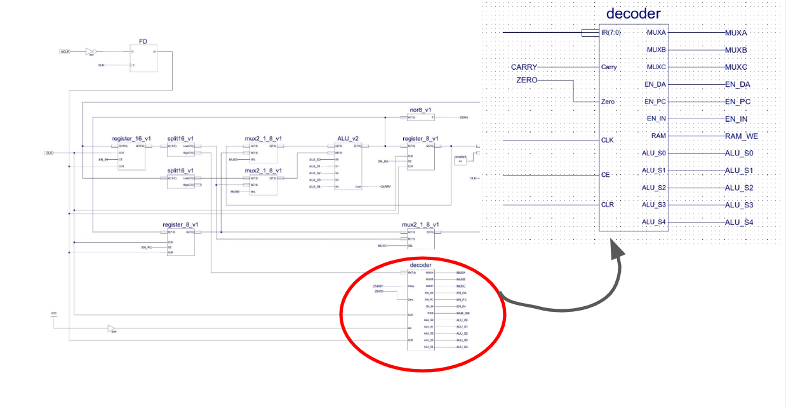
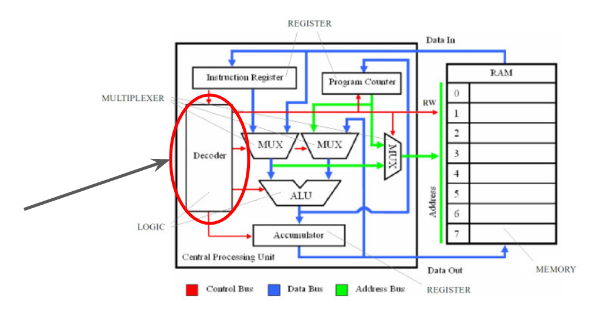
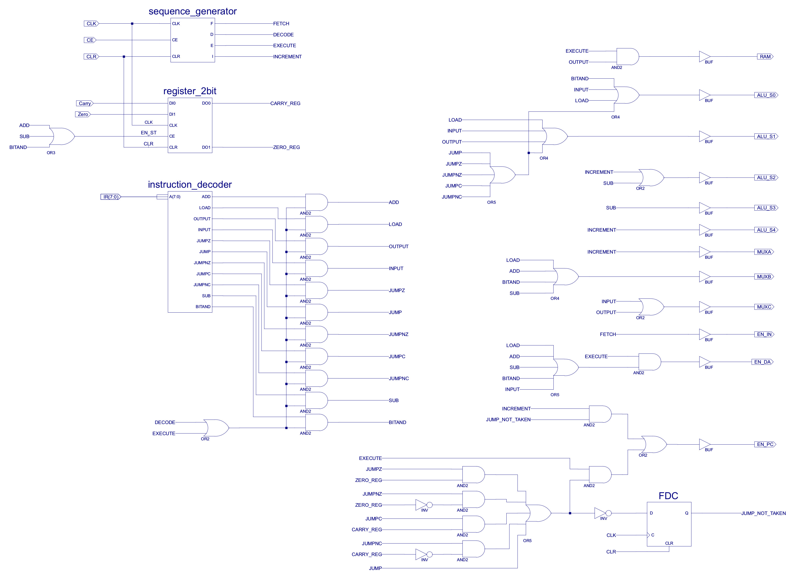
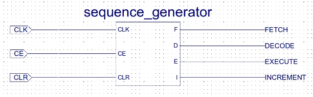
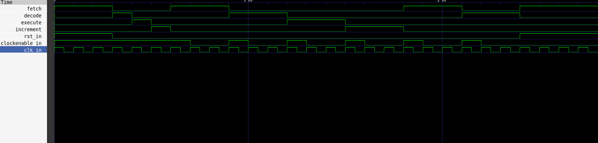
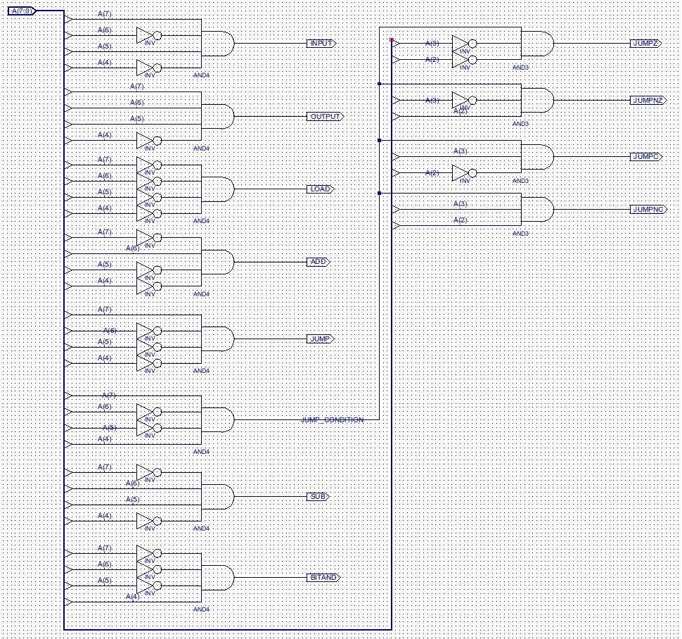
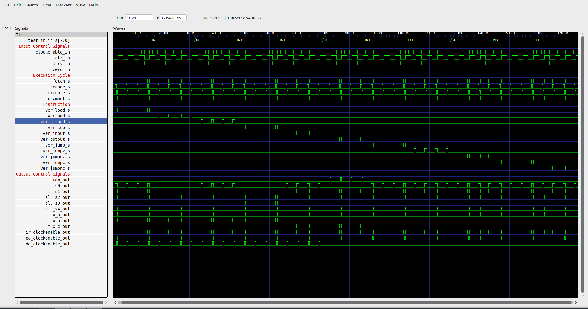
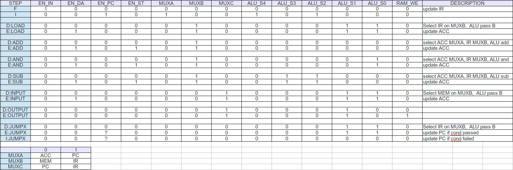
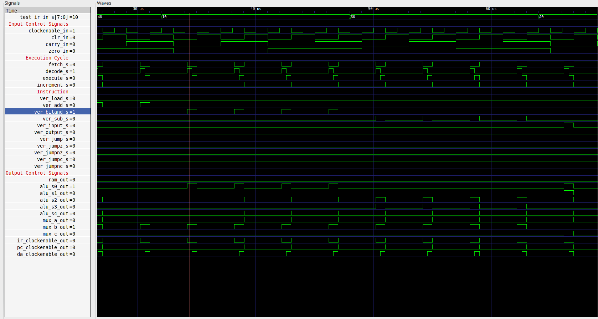

# Decodificador

* [Volver atras](../../README.md)

[[_TOC_]]

## Descripción General

El decoder o decodificador es un circuito que en su mayor parte es combinacional, sin embargo dentro de sí mismo tiene un contador en anillo que se encarga de generar la secuencia de ejecución fetch, decode, execute. El resto es completamente combinacional ya que se encarga de analizar la trama de bits que le llega a su entrada y en función de ella activar o desactivar las líneas de control de los circuitos del CPU, es decir, las líneas **s0 a s4** de la ALU, los enable de todos los registros, las líneas selectoras de los multiplexores y la habilitación de lectura de la memoria RAM.

Veamos donde se encuentra dentro del esquema circuital del Simple CPU y en el diagrama en bloques:





Podemos apreciar como absolutamente todos los circuitos que tengan algún tipo de habilitación están afectados por alguna de las salidas del decoder.

Sabemos que dentro del decoder tenemos varios circuitos que se encargan de generar estas "condiciones" en función de la instrucción recibida, como estamos tomando un enfoque más bien estructural, vamos a "Abrir" el decoder para observar y codificar todo lo que hay dentro de él, de acuerdo con la bibliografía.



Vemos que dentro del circuito, las salidas del decoder están dadas por una serie de compuertas lógicas cuyas entradas provienen de otros 3 componentes "Enlatados".

- [Sequence_generator](../../VHDL/sequence_generator.vhd): Es un un contador en anillo que se encarga de generar las etapas de fetch, decode, execute e increment.
- [Register_2bit](../../VHDL/register_PIPO.vhd): Es un registro de dos bits.
- [Instruction_decoder](../../VHDL/instruction_decoder.vhd): Es la parte combinacional que analiza efectivamente qué operación se quiere realizar y genera salidas en consecuencia.

## Generador de Secuencia

Veamos al generador de secuencia, este fue codificado con un enfoque conductual, por lo cual no necesitamos ver su circuito, solo que se comporta como un contador en anillo habilitando con un 1 cada un pulso de clock, una de sus 4 salidas.



El cual una vez simulado genera una respuesta así:



Veamos el código que genera este proceso de shifting.

<details>
  <summary>
    <b> <mark>Hacer click aquí para ver el codigo
    </b> </mark>
  </summary>

```vhdl
architecture sequence_generator_arch of sequence_generator is
  --Seccion declarativa de señales internas al sequence generator
  --señal que contenera el bit que sera desplazado de modo similar a un contador en anillo
  signal vector_estados_s : std_logic_vector(3 downto 0) := "1000" ;

begin
  -- inicio del proceso secuencial de desplazamiento
  sequence_process : process(clk_in, rst_in, clockenable_in)
  begin
    if rst_in = '1' then
      vector_estados_s <= "1000" ;
    elsif clockEnable_in = '1' then
      if rising_edge(clk_in) then
        vector_estados_s (3 downto 0) <= vector_estados_s(0) & vector_estados_s (3 downto 1);
      end if;
    else

    end if;
  end process;
  -- asignacion de las salidas de fetch decode execute e increment a cada posicion del vector
  fetch     <= vector_estados_s (3);
  decode    <= vector_estados_s (2);
  execute   <= vector_estados_s (1);
  increment <= vector_estados_s (0);
end architecture;
```

</details>

[El testbench puede encontrarse aca](VHDL/sequence_generator_tb) Donde lo único que se hace es dejar correr el clock y cambiar las líneas de reset y enable.

Pasamos ahora a observar el *instruction decoder*:

## Instruction Decoder



Vemos que es netamente combinacional, su implementación resultara entonces bastante directa, ya que es sencillamente plasmar en código los resultados de las operaciones de las compuertas.

### Entidad

```vhdl
--Entidad.
entity instruction_decoder is
  generic( N_BITS : integer := 8 );
  port (
  a_in        : in  std_logic_vector(N_BITS-1 downto 0);
  add         : out std_logic ;
  load        : out std_logic ;
  output_out  : out std_logic ;
  input_out   : out std_logic ;
  jumpz       : out std_logic ;
  jump        : out std_logic ;
  jumpnz      : out std_logic ;
  jumpc       : out std_logic ;
  jumpnc      : out std_logic ;
  sub         : out std_logic ;
  bitand      : out std_logic
  );
end entity;

```

### Arquitectura

El siguiente código describe como sera la asignación de las salidas, codificado de forma tal que represente fielmente las operaciones combinacionales representadas en la imagen del instruction decoder, veremos que serán solamente asignaciones lógicas.

<details>
  <summary>
    <b> <mark>Hacer click aquí para ver el codigo
    </b> </mark>
  </summary>

```vhdl
--Arquitectura.
architecture instruction_decoder_arch of instruction_decoder is
--Seccion declarativa de señales internas al instruction decoder
--señal para las operaciones AND de la generacion de condiciones de salto
  signal jump_condition : std_logic ;

begin
  -- Proceso combinacional referido a las instrucciones del Simple CPU v1.
  -- operación INPUT.
  input_out  <=  a_in(7) and (not a_in(6)) and a_in(5) and (not a_in(4));
  -- operación OUTPUT.
  output_out <=  a_in(7) and a_in(6) and a_in(5) and (not a_in(4));
  -- operación LOAD.
  load <= (not a_in(7)) and (not a_in(6)) and (not a_in(5)) and (not a_in(4));
  -- operación ADD.
  add <= (not a_in(7)) and  a_in(6) and (not a_in(5)) and (not a_in(4));
  -- operación de salto incondicional.
  jump <=  a_in(7) and (not a_in(6)) and (not a_in(5)) and (not a_in(4));
  -- generacion de la señal para las condiciones de salto.
  jump_condition <=  a_in(7) and (not a_in(6)) and (not a_in(5)) and a_in(4);
  -- operación de sustracción.
  sub <= (not a_in(7)) and  a_in(6) and a_in(5) and (not a_in(4));
  -- operación AND a nivel bit.
  bitand <= (not a_in(7)) and (not a_in(6)) and (not a_in(5)) and a_in(4);
  -- operación de salto si se genero un cero a la salida de la ALU.
  jumpz <= jump_condition and (not a_in (3)) and (not a_in(2)) ;
  -- operación de salto si NO se genero un cero a la salida de la ALU.
  jumpnz <= jump_condition and (not a_in (3)) and  a_in(2) ;
  -- operación de salto si se genero carry de la ultima operacion de la ALU.
  jumpc  <= jump_condition and a_in (3) and (not a_in(2));
  -- operación de salto si NO se genero carry de la ultima operacion de la ALU.
  jumpnc <= jump_condition and  a_in (3) and a_in(2) ;

end architecture;
```

</details>

## Decoder Toplevel

Ahora si estamos en condiciones de definir el toplevel para el decodificador, ya sabemos que las entradas seran el clock para el generador de secuencia, las lineas de condicion de cero y de carry, la trama que contiene la instruccion, una habilitacion y un reset/clear.

### Entidad 

```vhdl
--Entidad.
entity decoder_toplevel is
  ---El nombre HALF_IR_LENGTH hace referencia a que al decoder entran los 8
  ---bits mas significativos del instruction register
  generic (HALF_IR_LENGTH : integer := 8 );
  port (
  clk_in   : in std_logic ;
  clockEnable_in : in std_logic ;
  clr_in     : in std_logic ;
  carry_in   : in std_logic ;
  zero_in    : in std_logic ;
  ir_in      : in std_logic_vector(HALF_IR_LENGTH-1 downto 0);
  ram_out    : out std_logic;
  alu_s0_out : out std_logic;
  alu_s1_out : out std_logic;
  alu_s2_out : out std_logic;
  alu_s3_out : out std_logic;
  alu_s4_out : out std_logic;
  mux_a_out  : out std_logic;
  mux_b_out  : out std_logic;
  mux_c_out  : out std_logic;
  ir_clockEnable_out : out std_logic;
  pc_clockEnable_out : out std_logic;
  da_clockEnable_out : out std_logic
  );

end entity decoder_toplevel;
```
En el código anterior describimos las entradas y salidas del decoder, estas son las que directamente entran desde los registros y otras lineas del CPU y salen directamente hacia las líneas de control del resto de los componentes ya mencionados, **clockEnable_in** habilita al clock del circuito(**clk_in**), las entradas de **carry_in y zero_in** corresponden a las condiciones carry y cero en el resultado de la última operación de la ALU y el resto son todas las lineas de control del sistema, vemos que se generan las lineas de control de la ALU(**alu_sx_out**), de los multiplexores a, b y c (**mux_x_out**) y los clock enable (**xx_clockEnable_out**) de cada uno de los registros ademas de la habilitación de la escritura en la RAM(**ram_out**) por último tenemos la entrada de datos **ir_in** la cual representa la tira de 8 bits con las instrucciones.

### Componentes 

<details>
  <summary>
    <b> <mark>Hacer click aquí para ver el codigo 
    </b> </mark>
  </summary>

```vhdl
  --declaracion de los componentes

  component sequence_generator is
    port (
    clk_in         : in  std_logic ;
    clockEnable_in : in  std_logic ;
    rst_in         : in  std_logic ;
    fetch     : out std_logic ;
    decode    : out std_logic ;
    execute   : out std_logic ;
    increment : out std_logic
    );
  end component sequence_generator ;

  component register_PIPO is
    generic (
            N_BITS          : integer := 2    ;
            risingEdgeClock : BOOLEAN := TRUE);
    port (
    clk_in : in std_logic ;
    clockEnable_in : in std_logic ;
    rst_in : in  std_logic ;
    d_in   : in  std_logic_vector(N_BITS-1 downto 0);
    d_out  : out std_logic_vector(N_BITS-1 downto 0)
    );
  end component register_PIPO;

  component ffd is
    generic (risingEdgeClock : BOOLEAN := TRUE);
    port (
    clk_in : in std_logic ;
    rst_in : in std_logic ;
    clk_ena: in std_logic ;
    d_in   : in std_logic ;
    d_out  : out std_logic
    );
  end component ffd;

  component instruction_decoder is
    generic( N_BITS : integer := 8 );
    port (
        a_in        : in  std_logic_vector(N_BITS-1 downto 0);
        add         : out std_logic ;
        load        : out std_logic ;
        output_out  : out std_logic ;
        input_out   : out std_logic ;
        jumpz       : out std_logic ;
        jump        : out std_logic ;
        jumpnz      : out std_logic ;
        jumpc       : out std_logic ;
        jumpnc      : out std_logic ;
        sub         : out std_logic ;
        bitand      : out std_logic
    );
  end component instruction_decoder;
```

</details>

Arriba declaramos cada uno de los componentes que vamos a utilizar para el generar el decoder.

### Constantes y Señales


<details>
  <summary>
    <b> <mark>Hacer click aquí para ver las señales del decoder 
    </b> </mark>
  </summary>

```vhdl
--Seccion declarativa de señales internas al decoder
  --constantes para legibilidad del codigo
  constant REG_LEN : integer := 2 ;
  constant NUM_BITS : integer := 8 ;

  --señales para las salidas del instruction decoder antes de la and
  --de verificacion de decode o execute
  signal add_s    : std_logic ;
  signal load_s   : std_logic ;
  signal output_s : std_logic ;
  signal input_s  : std_logic ;
  signal jump_s   : std_logic ;
  signal jumpz_s  : std_logic ;
  signal jumpnz_s : std_logic ;
  signal jumpc_s  : std_logic ;
  signal jumpnc_s : std_logic ;
  signal sub_s    : std_logic ;
  signal bitand_s : std_logic ;

  --señales para las salidas del instruction decoder despues de la and
  --de verificacion de decode o execute por eso el prefijo ver_
  signal ver_add_s    : std_logic ;
  signal ver_load_s   : std_logic ;
  signal ver_output_s : std_logic ;
  signal ver_input_s  : std_logic ;
  signal ver_jump_s   : std_logic ;
  signal ver_jumpz_s  : std_logic ;
  signal ver_jumpnz_s : std_logic ;
  signal ver_jumpc_s  : std_logic ;
  signal ver_jumpnc_s : std_logic ;
  signal ver_sub_s    : std_logic ;
  signal ver_bitand_s : std_logic ;

  --señales para las salidas del generador de secuencia
  signal fetch_s     : std_logic ;
  signal decode_s    : std_logic ;
  signal execute_s   : std_logic ;
  signal increment_s : std_logic ;

  --señales para el registro de almacenamiento del carry la condicion de cero
  -- zero_carry_reg_s (0) almacena la condicion de carry
  -- zero_carry_reg_s (1) almacena la condicion de cero
  signal zero_carry_reg_s : std_logic_vector (REG_LEN-1 downto 0) ;
  signal register_ena_s: std_logic  ;

  --señales para el flip flop de generacion de la condicion de salto no dado
  signal jump_not_taken_s : std_logic ;
  signal jump_not_taken_in_s : std_logic ;
  signal jump_not_taken_in_s_n : std_logic ;
  signal ffd_ena_s : std_logic ;

  --señales internas del decoder
  signal clk_s : std_logic ;
  signal clr_s : std_logic ;
  signal clk_ena_s : std_logic ;
  signal zero_carry_s : std_logic_vector (REG_LEN-1 downto 0) ;
  signal ir_in_s : std_logic_vector (NUM_BITS-1 downto 0) ;
```

</details>

En el código de arriba se declaran las señales que vamos a utilizar internamente en el decoder, y las constantes que se utilizan para proporcionarle legibilidad al conexionado y evitar el hardcoding a la hora de declarar longitudes de palabra, en este caso **REG_LEN** recibe el valor de 2 bits debido a que es para la longitud del registro que guarda la información del carry y el cero, por otro lado **NUM_BITS** es 8 y es la cantidad de bits de largo que tiene el bus de la entrada del IR.
Luego, las señales que tienen como prefijo **ver_** quiere decir, verificadas, esto solo esta presente en las salidas del instruction_register, ya que estas pasan por una verificación para asegurarse de que solo tomen valores en los ciclos de decode y execute y no en fetch o increment, esto se ve representado por compuertas **AND** cuyas entradas son las propias salidas del instruction register y una **OR** entre **decode_s** y **execute_s**.

### Arquitectura

#### Mappeo de los componentes

<details>
  <summary>
    <b> <mark>Hacer click aquí para ver el codigo correspondiente al conexionado de los componentes del decoder  
    </b> </mark>
  </summary>

```vhdl
-- generador de secuencia
  sequence_generator_0 : sequence_generator
                         port map (clk_in => clk_s,
                                   clockEnable_in => clk_ena_s,
                                   rst_in    => clr_s,
                                   fetch     => fetch_s,
                                   decode    => decode_s,
                                   execute   => execute_s,
                                   increment => increment_s);

  -- registro de dos bit para el cero y el carry
  register_2bit_0 : register_PIPO
                    generic map (N_BITS => REG_LEN ,
                                 risingEdgeClock => TRUE)
                    port map    (clk_in => clk_s,
                                 clockEnable_in => register_ena_s,
                                 rst_in => clr_s,
                                 d_in   => zero_carry_s,
                                 d_out  => zero_carry_reg_s
                                 );

  -- instruction decoder
  instruction_decoder_0 : instruction_decoder
                        generic map (N_BITS => NUM_BITS)
                        port    map (a_in   => ir_in_s,
                                     add    => add_s  ,
                                     load   => load_s ,
                                     output_out => output_s,
                                     input_out  => input_s ,
                                     jump   => jump_s  ,
                                     jumpz  => jumpz_s ,
                                     jumpnz => jumpnz_s,
                                     jumpc  => jumpc_s ,
                                     jumpnc => jumpnc_s,
                                     sub    => sub_s   ,
                                     bitand => bitand_s);

  --flip flop D  de la genracion de jump not taken
  fdc : ffd
        generic map (risingEdgeClock => TRUE)
        port map    (clk_in => clk_s,
                     rst_in => clr_s,
                     clk_ena => ffd_ena_s,
                     d_in   => jump_not_taken_in_s,
                     d_out  => jump_not_taken_s) ;

```

</details>

En el código de arriba se genera el conexionado de los componentes que utilizaremos en para nuestra descripción del decoder, ademas se les da a cada uno los parámetros necesarios para su funcionamiento a través del generic map donde en el caso del registro de 2 bits se le da una longitud de registro de 2 bits y lo setteamos en activo por flanco de subida, al flip flop lo setteamos también como activo por flanco de subida y al instruction decoder le damos la longitud de palabra.

#### Descripción combinacional de las salidas

Ya con todas las señales internas con totalmente determinadas debido al conexionado previo, pasamos a hacer la descripción combinacional que da lugar las salidas del decoder.

```vhdl
 -- proceso combinacional de determinacion de la condicion de no salto
  jump_not_taken_in_s_n <= (jumpz_s  and zero_carry_reg_s(1))        or
                           (jumpnz_s and (not zero_carry_reg_s (1))) or
                           (jumpc_s  and zero_carry_reg_s(0))        or
                           (jumpnc_s and (not zero_carry_reg_s (0))) or
                           jump_s;

  jump_not_taken_in_s <= not  jump_not_taken_in_s_n ;

  --procesos combinacionales de determinacion de la salidas de control

  --salida de habilitacion de escritura de la RAM
  ram_out <= execute_s and ver_output_s ;

  --lineas de control de la ALU
  alu_s0_out <= ver_bitand_s or ver_input_s or ver_load_s   or
                ver_jump_s   or ver_jumpz_s or ver_jumpnz_s or
                ver_jumpc_s  or ver_jumpnc_s ;

  alu_s1_out <= ver_load_s   or ver_input_s or ver_output_s or
                ver_jump_s   or ver_jumpz_s or ver_jumpnz_s or
                ver_jumpc_s  or ver_jumpnc_s ;

  alu_s2_out <= increment_s or sub_s ;
  alu_s3_out <= sub_s ;
  alu_s4_out <= increment_s ;

  --lineas de control de los esquemas de multiplexacion del Simple CPU V1.
  mux_a_out <= increment_s ;
  mux_b_out <= ver_load_s or ver_add_s or ver_bitand_s or ver_sub_s ;
  mux_c_out <= ver_input_s or ver_output_s ;

  --habilitaciones de los distintos registros del Simple CPU V1.
  ir_clockEnable_out <= fetch_s ; --Instruction Register
  da_clockEnable_out <= (ver_load_s or ver_add_s or ver_bitand_s or ver_sub_s
                         or ver_input_s) and execute_s ; --acumulador
  pc_clockEnable_out <= ((increment_s and jump_not_taken_s) or
                        (jump_not_taken_in_s_n and execute_s)) and clockEnable_in;--program counter

```

[Codigo completo del decoder](../../VHDL/decoder_toplevel.vhd)

## Testbench

Para probar el decoder, se le generan a la entrada todas las instrucciones que puede hacer y se verifican los valores observando el grafico.

Para lograr una verificación completa generamos dos vectores de estímulos para las señales de control de entrada del decodificador, es decir, el **clockEnable**, el **clear** y las condiciones de **carry** y **zero**, luego aplicaremos por medio de estos vectores todos los valores de interés para las señales. En el caso del vector de estímulos para las señales de control, este tomara todos los valores posibles de sus entradas para cada una de las instrucciones posibles declaradas dentro de un vector de instrucciones. Veamos como:

```vhdl  
  constant N_INST   : integer := 11;
  constant CANT_VAR : integer := 4 ;
  --declaracion de los array utilizados para la generacion de estimulos
  type STIM_VEC is array (0 to (N_INST-1)) of std_logic_vector(N_BITS-1    downto 0);
  signal test_stim_vec_s : STIM_VEC := (
    x"00", -- load 
    x"40", -- add
    x"10", -- and 
    x"60", -- sub
    x"a0", -- input
    x"e0", -- output
    x"80", -- jump U 
    x"90", -- jump Z
    x"94", -- jump NZ
    x"98", -- jump C
    x"9C"  -- jump NC
	);
  signal test_ctr_vec_s : std_logic_vector(CANT_VAR-1 downto 0);
```
La constante **N_INST** refiere al numero de instrucciones posibles y **CANT_VAR** al numero de variables de control de entrada disponibles obviando al clock. 

Primero generamos el clock

```vhdl
 clockGeneration : process
  begin
      test_clk_in_s <= '0';
      wait for PERIOD/2;
      test_clk_in_s <= '1';
      wait for PERIOD/2;
      if (stopSimulation_s = TRUE) then
          wait;
      end if;
  end process clockGeneration;

```

Y ahora aplicamos los estimulos.

<details>
  <summary>
    <b> <mark>Hacer click aquí para ver el codigo de la aplicacion de estimulos. 
    </b> </mark>
  </summary> 


```vhdl
  --aplicacion de estimulos para verificar que todas las salidas
  --respondan como deberian.
  test_process : process

  begin
	test_clockEnable_in_s <= '0';
	test_clr_in_s <= '0';
	test_carry_in_s <= '0';
	test_zero_in_s <= '0';
	wait for 25 ns;
	instLoop : for j in 0 to N_INST-1 loop
		test_ir_in_s <= test_stim_vec_s(j);
		  testLoop : for i in 0 to (2**CANT_VAR)-1 loop
			test_ctr_vec_s <= std_logic_vector(to_unsigned(i,CANT_VAR));
			test_clockEnable_in_s <= test_ctr_vec_s(0);
			test_clr_in_s   <= test_ctr_vec_s(1);
			test_carry_in_s <= test_ctr_vec_s(2);
			test_zero_in_s  <= test_ctr_vec_s(3);
			wait for 1000 ns;
        end loop ; -- instLoop
    end loop ; -- testLoop
    stopSimulation_s <= TRUE;
    wait;
  end process;
```

Cuando aplicamos los estímulos, lo hacemos haciendo que por cada instrucción posible, las variables de control tomen todos los valores distintos que puedan, de esta manera asegurándonos que se contemplan todas las situaciones que pueden llegar a generarse.

Veamos esto en el GTKWave.

</details>

[Codigo completo del testbench](../../VHDL/decoder_toplevel_tb.vhd)

Resultados:

Se recomienda abrir la imagen para poder verla en toda su resolucion.



Toda la logica de asignacion de señales de control esta basada en el cuadro que presentamos previamente para referirnos al ISA del procesador y la logica de activacion de circuitos que es la que efectivamente sale del decoder puede ser resumida de la siguiente forma.



De aqui podemos verificar que efectivamente las salidas que se activan son las que deberian hacerlo, sencillamente debemos revisar cuando la señal que representa la activacion de la instruccion se pone en *1* chequear que se cumpla lo que se enuncia en el cuadro anterior, por ejemplo, con la instruccion *and*:

Vemos que en el cuadro dice que durante la fase D (decode), deben activarse las señales MUXB y ALU_S0, entonces revisamos en el apartado de señales de control de salida (que son las que van al softcore) que esto sea lo que sucede.



Vemos en el apartado "signals" ya que tenemos el cursor puesto, nos dice los valores del resto de las señales que necesitamos saber y estos son efectivamente los que dice en la fase de decodificacion de la instruccion *AND*.


* [Volver atras](../../README.md)
