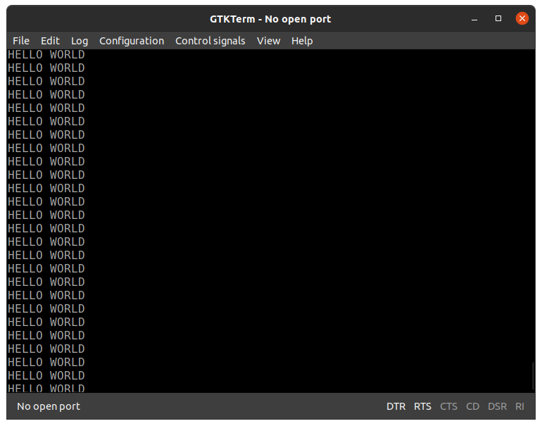
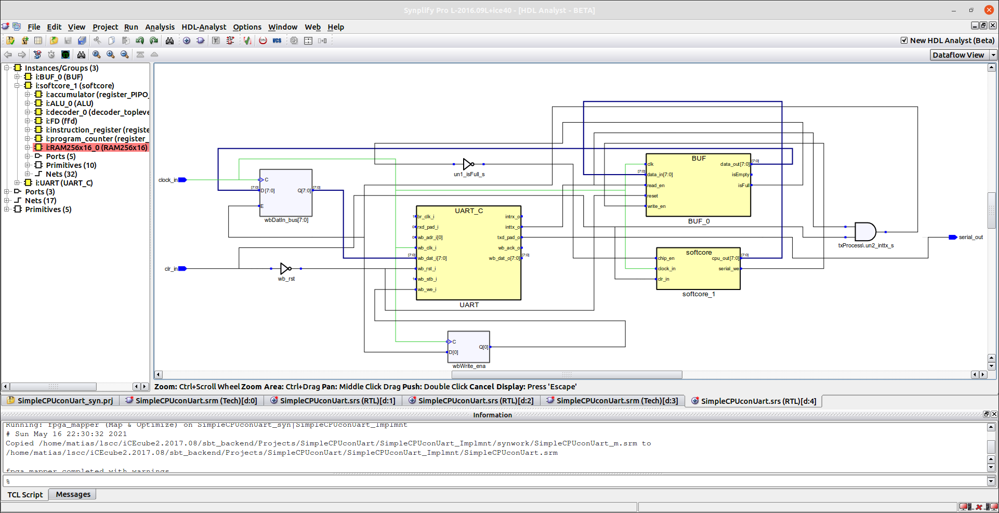
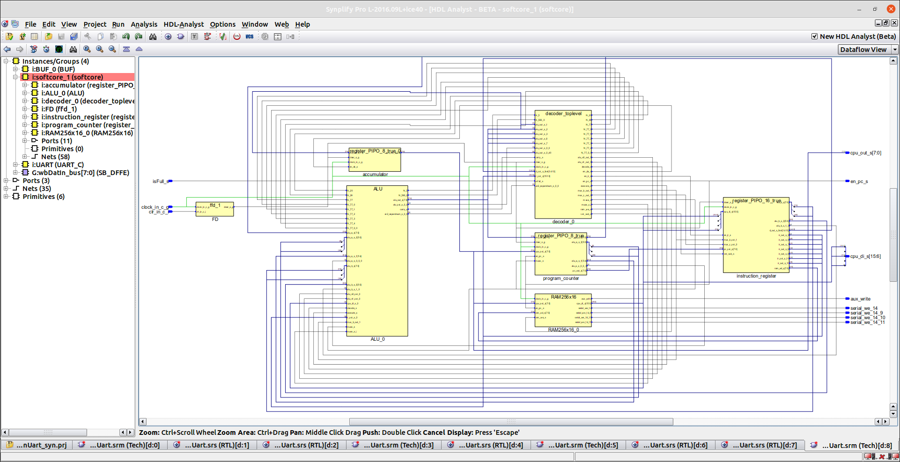
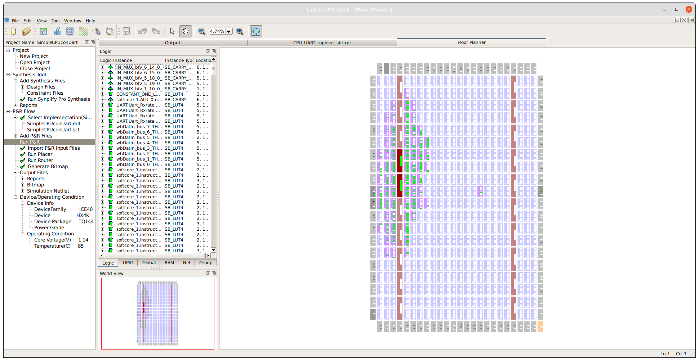

# Implementacion con UART

* [Volver atras](../../README.md)

Ahora que el procesador esta armado, vamos a sumarle una UART para poder realizar la transmision de datos serial, contrario al diseño original vamos a quitar el flip flop D que se utiliza para guardar el bit que se quiere enviar, la razon de esto es generar un diseño con un codigo de maquina mas simple que en la arquitectura original, si uno revisa la bibliografia en el ejemplo donde el autor envia un "Hello World" debe realizar todo el codigo de maquina que describe el protocolo RS232, con la incorporacion de la UART nos liberamos de esa carga, la UART utilizada es la misma que se usa en los [ejemplos anteriores a este](https://gitlab.com/fslche/ejemplos/-/tree/master/Ejemplos_Base/20-NCO_LUT_UART), sin embargo, debido a que el pin de busy de esta UART no es accesible desde el codigo que escribimos en la RAM, debemos utilizar otros metodos para sincronizar las transmisiones, un buffer, que almacenara los datos enviados desde el CPU para que la UART los lea a su ritmo, dicho buffer se puede encontrar [aqui](https://gitlab.com/RamadrianG/wiki---fpga-para-todos/-/wikis/Colas).


## Entidad:

```vhdl 
entity CPU_UART_toplevel is
  generic (
     brDivisor : positive := 313 --Divisor para elegir baudrate 313 ~= 12MHz/(4*9600)
  );
  port (
      clock_in   : in  std_logic ;
      clr_in     : in  std_logic ;
      serial_out : out std_logic
  );
end entity CPU_UART_toplevel;
```

Arriba vemos la estructura final de este proyecto, se elige la tasa de baudios fijada a 9600 y se definen las entradas y salidas, las cuales son bastante directas, un clock (**clock_in**), un reset (**clr_in**) y la salida serial del CPU (**serial_out**)


## Arquitectura

### Componentes

#### UART 

<details>
  <summary>
    <b> <mark>Hacer click aquí para ver el codigo de la declaracion de todos los componentes del toplevel con la UART incluida
    </b> </mark>
  </summary> 

```vhdl
  -- Declaracion de la UART
  component UART_C is
    generic(
       BRDIVISOR : positive:=1); -- Baud rate divisor
    port (
       -- Wishbone signals
       wb_clk_i  : in  std_logic;  -- clock
       wb_rst_i  : in  std_logic;  -- Reset input
       wb_adr_i  : in  std_logic_vector(0 downto 0); -- Adress bus
       wb_dat_i  : in  std_logic_vector(7 downto 0); -- DataIn Bus
       wb_dat_o  : out std_logic_vector(7 downto 0); -- DataOut Bus
       wb_we_i   : in  std_logic;  -- Write Enable
       wb_stb_i  : in  std_logic;  -- Strobe
       wb_ack_o  : out std_logic;  -- Acknowledge
       -- Process signals
       inttx_o   : out std_logic;  -- Transmit interrupt: indicate waiting for Byte
       intrx_o   : out std_logic;  -- Receive interrupt: indicate Byte received
       br_clk_i  : in  std_logic;  -- Clock used for Transmit/Receive
       txd_pad_o : out std_logic;  -- Tx RS232 Line
       rxd_pad_i : in  std_logic); -- Rx RS232 Line
  end component UART_C;
```
#### CPU 
```vhdl
  component softcore is
    generic(
      cpu_data_word_length : integer := 8
    );
    port (
    clock_in   : in  std_logic ;
    clr_in     : in  std_logic ;
    cpu_out    : out std_logic_vector(cpu_data_word_length-1 downto 0);
    chip_en    : in  std_logic ;
    serial_we  : out std_logic
    );
  end component softcore;
```
#### BUFFER
```vhdl
  component BUF is

    generic (
        WORD_LENGTH : integer := 8;	        --Bits de cada palabra
        ADDR_LENGTH : integer := 8);        --Bits de direcciones
    port (
        clk      : in std_logic;				--Clock
        write_en : in std_logic;			        --Write enable
        read_en  : in std_logic;                            --Read enable
        reset    : in std_logic;                            --Reset

        data_in  : in  std_logic_vector(WORD_LENGTH-1 downto 0);	--Dato de entrada
        data_out : out std_logic_vector(WORD_LENGTH-1 downto 0);	--Dato de salida

        isFull   : out std_logic  ;                        --Buffer lleno
        isEmpty  : out std_logic );                        --Buffer vacio
  end component BUF;
```

</details>


### Señales
Declaramos ahora las señales que se utilizan en la logica de control que rige la comunicacion serial.

<details>
  <summary>
    <b> <mark>Hacer click aquí para ver el codigo de la declaracion de señales y constantes
    </b> </mark>
  </summary> 

```vhdl
  -- Constantes:
  constant NUM_BITS   : integer := 8;
  constant BUF_LEN    : integer := 8;


  --Señales de UART_C
  signal wb_rst : std_logic;  -- Reset input
  signal wbAdr_bus : std_logic_vector(0 downto 0); -- Adress bus
  signal wbDatIn_bus : std_logic_vector(7 downto 0); -- DataIn Bus
  signal wbDatOut_bus : std_logic_vector(7 downto 0); -- DataOut Bus
  signal wbWrite_ena  : std_logic;  -- Write Enable
  signal wbStb_s : std_logic;  -- Strobe
  signal wbAck_s : std_logic;  -- Acknowledge
  signal inttx_s  : std_logic;  -- Transmit interrupt: indicate waiting for Byte
  signal intrx_s  : std_logic;  -- Receive interrupt: indicate Byte received
  signal br_clk : std_logic;  -- Clock used for Transmit/Receive
  signal txd_s : std_logic;  -- Tx RS232 Line
  signal rxd_s : std_logic; -- Rx RS232 Line

  --Señales de Softcore
  signal clock_s     : std_logic;
  signal clear_s     : std_logic;
  signal chip_en_s   : std_logic;
  signal cpu_out_s   : std_logic_vector(NUM_BITS-1 downto 0);

  --Señales del Buffer
  signal isFull_s       : std_logic;
  signal isEmpty_s      : std_logic;
  signal buffer_out_s   : std_logic_vector(NUM_BITS-1 downto 0);
  signal read_en_s      : std_logic;
  signal write_en_s     : std_logic;
```

</details>

### Mappeo de los componentes y asignacion de las señales

```vhdl
  clear_s <= clr_in ;
  clock_s <= clock_in;
  wb_rst <=  not clear_s;
  wbAdr_bus <= "0";
  br_clk <= '1';
  wbStb_s <= '1';
  rxd_s <= '0';
  serial_out <= txd_s ;
  chip_en_s <=  '1' when isFull_s = '0' else '0';
  read_en_s <= inttx_s;
```
Arriba vemos como asignamos las señales necesarias para tanto el funcionamiento de la UART, que en este ejemplo es solo capaz de enviar datos, la asginacion de los clear reset y la salida serial, particularmente aca vemos como la habilitacion de lectura del buffer (**read_en_s**) esta conectada a la interrupcion de transmision de la UART, la cual cuando se pone en 0, significa que se encuentra transmitiendo, de esta forma la UART lee los datos almacenados en el buffer solo cuando esta disponible para transmitir independizando al sistema de un polling constante, por otro lado la habilitacion de escritura (**write_en_s**) veremos despues esta dada por el procesador, revisando el codigo mas arriba podemos ver que esta habilitacion, para respetar un poco el diseño original se activa solo cuando se da la operacion x"E0FF".
Tambien vemos que el chip_en del CPU se desactiva si el buffer esta lleno, para evitar la sobreescritura de datos.

<details>
  <summary>
    <b> <mark>Hacer click aquí para ver el mappeo de los componentes. 
    </b> </mark>
  </summary> 

```vhdl
  BUF_0 : BUF
        generic map (
            WORD_LENGTH => NUM_BITS,
            ADDR_LENGTH => BUF_LEN )
        port map(
            clk      =>  clock_s,
            write_en =>  write_en_s,
            read_en  =>  read_en_s,
            reset    =>  wb_rst,
            data_in  =>  cpu_out_s,
            data_out =>  buffer_out_s,
            isFull   =>  isFull_s,
            isEmpty  =>  isEmpty_s
        );
  UART: entity work.UART_C
      generic map(BRDIVISOR => brDivisor)
      port map(
            wb_clk_i => clock_s,
            wb_rst_i => wb_rst,
            wb_adr_i => wbAdr_bus,
            wb_dat_i => wbDatIn_bus,
            wb_dat_o => wbDatOut_bus,
            wb_we_i => wbWrite_ena,
            wb_stb_i => wbStb_s,
            wb_ack_o => wbAck_s,
            inttx_o => inttx_s,
            intrx_o => intrx_s,
            br_clk_i => br_clk,
            txd_pad_o => txd_s,
            rxd_pad_i => rxd_s);
  softcore_1 : softcore
      generic map (
        cpu_data_word_length => NUM_BITS
    )
    port map
      (
          clock_in => clock_s  ,
          clr_in  => clear_s   ,
          cpu_out => cpu_out_s ,
          chip_en => chip_en_s ,
          serial_we => write_en_s
      );
```

</details>

Finalmente observamos el proceso que genera la logica de asignacion de entradas a la UART.

```vhdl
  txProcess : process(clock_s)
    begin
      if rising_edge(clock_s) then
        if wb_rst = '1' then
            wbWrite_ena <= '0';
        elsif inttx_s = '1' then
            wbDatIn_bus <= buffer_out_s;
            wbWrite_ena <= '1';
        else
            wbWrite_ena <= '0';
        end if ;
      end if ;
  end process;
```

## Simulacion y sintesis

Como simulacion vamos a escribir un programa en la RAM para que este softcore envie por el su puerto serie el mensaje "Hello World"
el codigo de maquina necesario para eso se muestra a continuacion.

```vhdl
  signal mem_s : MEMORY := (
        x"0048",  -- H
        x"E0FF",
        x"0045",  -- E
        x"E0FF",
        x"004C",  -- L
        x"E0FF",
        x"004C",  -- L
        x"E0FF",
        x"004F",  -- O
        x"E0FF",
        x"0020",  -- SPACE
        x"E0FF",
        x"0057",  -- W
        x"E0FF",
        x"004F",  -- O
        x"E0FF",
        x"0052",  -- R
        x"E0FF",
        x"004C",  -- L
        x"E0FF",
        x"0044",  -- D
        x"E0FF",
        x"000A",  -- NewLine
        x"E0FF",
        x"8000",
      others => (others => '0')
    );
```
Como queremos verificar la correcta lectura y posterior envio de los datos para el testbench vamos a dejar correr el clock solamente.


Vemos como en el buffer los datos que se almacenan son los correctos, estos despues son leidos por la UART, sin embargo para verlo bien
sintetizamos el proyecto dentro de la EDU-FPGA y abrimos el puerto serie con el software GTKTerm.



Veamos tambien el resultado de la sintesis en ICEcube2 tanto del toplevel como del softcore.






Veamos ahora el informe de consumo y el floor planner que nos permite identificar si efectivamente las memorias que utilizamos fueron sintetizadas en blockRams.

```
Final Design Statistics
    Number of LUTs      	:	358
    Number of DFFs      	:	124
    Number of DFFs packed to IO	:	0
    Number of Carrys    	:	24
    Number of RAMs      	:	2
    Number of ROMs      	:	0
    Number of IOs       	:	2
    Number of GBIOs     	:	1
    Number of GBs       	:	3
    Number of WarmBoot  	:	0
    Number of PLLs      	:	0
Device Utilization Summary
    LogicCells                  :	359/3520
    PLBs                        :	70/440
    BRAMs                       :	2/20
    IOs and GBIOs               :	3/107
    PLLs                        :	0/2
```
Observamos como consumimos 358 de las 7040 LUTs de la FPGA y como efectivamente fueron reconocidas las 2 ram codificadas. (la RAM donde escribimos los programas y la RAM que se encuentra dentro del buffer)

Por ultimo veamos esto con el Floor Planner del Place and Route.


* [Volver atras](../../README.md)
