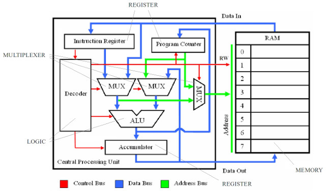
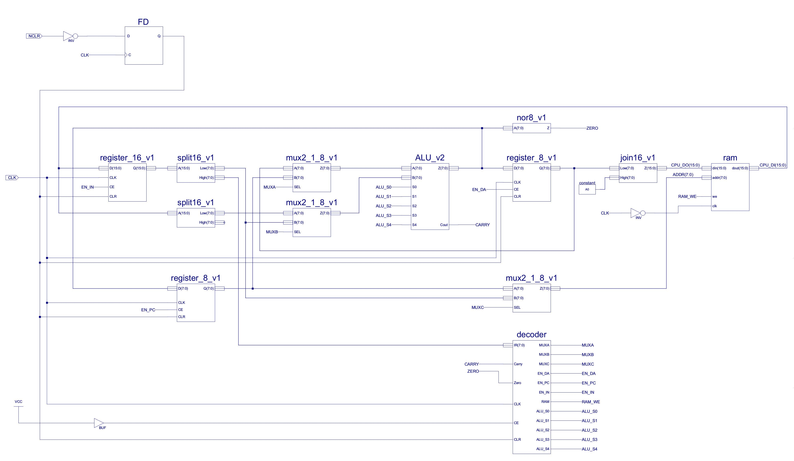
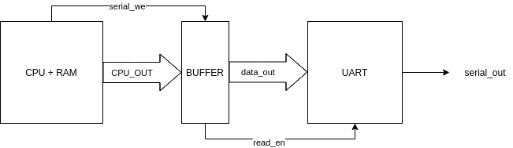

# SOFTCORE SIMPLE CPU V1

[[_TOC_]]

## Introduccion

En este ejemplo veremos la implementación  de un softcore con arquitectura Von Neumann basado en la [bibliografía de libre acceso de su autor original](http://www.simplecpudesign.com/simple_cpu_v1/).
Como su nombre lo supone posee una descripcion muy simple diseñada para observar como los procesadores son en realidad maquinas sencillas de entender, para citar al autor de la bibliografía original:

> _en su corazon los procesadores no cambiaron mucho desde los años 40 y siguen siendo maquinas que siguen la misma logica de leer instrucciones y procesarlas    segun su ciclo de Fetch-Decode-Execute_.

El objetivo principal es descomponer el procesador hasta sus bloques fundamentales de construcción como lo son las compuertas lógica para luego combinarlas en Flip Flops que luego se convertirán en registros, contadores, etc para la parte secuencial del procesador y sumadores, multiplexores, etc para su parte combinacional.
Observemos el diagrama que describe circuitalmente a este softcore.

Del diagrama distinguimos 8 partes dentro del procesador y la memoria RAM donde se almacenaran las instrucciones y los datos que sean requeridos por el programa que sé este usando, de estas, la ALU (unidad aritmético lógica) que realiza operaciones entre dos operandos determinados por las instrucciones cargadas y el Decoder que se encarga de generar las lineas de control para todos los dispositivos que están dentro del procesador son los únicos bloques que debemos "abrir" para observar su funcionamiento debido a que el resto no son más que registros y multiplexores, sin embargo describiremos también la razón de ser del resto de los componentes.
Veamos como describiremos circuitalmente al softcore:

Si observamos dentro de la bibliografia original, vemos que existe el autor tambien coloco un Flip-Flop para generar una salida serial, ese tipo de implementacion genera programas muy complicados a la hora de querer utilizar este puerto, por lo tanto ese bloque sera reemplazado por una UART.

## Funcionamiento

El softcore Simple CPU V1 contiene un conjunto de instrucciones o ISA (Instruction Set Architecture) propio de 11 instrucciones de 16 bits cada una las cuales son:

|Instruccion|      Formato          |                               Significado                                               |
|-----------|-----------------------|-----------------------------------------------------------------------------------------|
|Load       |0000 xxxx KKKKKKKK     |Carga al acumulador la constante de 8 bits KKKKKKKK                                      |
|Add        |0100 xxxx KKKKKKKK     |Suma la constante KKKKKKKK al contenido del acumulador                                   |
|And        |0001 xxxx KKKKKKKK     |Operacion And a nivel bit entre la constante KKKKKKKK y el contenido del acumulador      |
|Sub        |0110 xxxx KKKKKKKK     |Resta la constante KKKKKKKK al contenido del acumulador                                  |
|Input      |1010 xxxx PPPPPPPP     |Carga al acumulador el contenido de la direccion PPPPPPPP de la RAM                      |
|Output     |1110 xxxx PPPPPPPP     |Guarda lo que haya en el acumulador en la direccion PPPPPPPP de la RAM                   |
|Jump U     |1000 xxxx AAAAAAAA     |Carga en el program counter lo que haya en la direccion AAAAAAAA de la RAM (salto)       |
|Jump Z     |1001 00xx AAAAAAAA     |se da la condicion de salto si el resultado de la ultima operacion de ALU dio 0          |
|Jump C     |1001 10xx AAAAAAAA     |se da la condicion de salto si el resultado de la ultima operacion de ALU genero carry   |
|Jump NZ    |1001 01xx AAAAAAAA     |se da la condicion de salto si el resultado de la ultima operacion de ALU NO dio 0       |
|Jump NC    |1001 11xx AAAAAAAA     |se da la condicion de salto si el resultado de la ultima operacion de ALU NO genero carry|

Estas instrucciones ingresan al CPU por el bus que en el diagrama figura como data in y se almacenan en el Instruction Register, el cual es un registro PIPO con **16 bits de longitud**, cabe aclarar que aunque las instrucciones que se almacenan en la RAM tienen 16 bits de longitud, **el procesador es de 8 bits** ya que de la tira de bits que ingresa al IR, se usan por separado su parte más significativa, que según el cuadro anterior determina la instrucción que debe seguir el procesador mientras que la parte menos significativa representa de una u otra forma el dato con el que se desea operar, ya sea en forma de dirección en la que este se encuentra o como efectivamente el dato. Una vez ingresados al IR los datos serán divididos en dos como previamente se comentó, la parte más significativa al ser la que contiene la instrucción ira al decoder y asi este ultimo habilitara o deshabilitara los registros, setteara los multiplexores y determinara las lineas de control de la ALU, más tarde volveremos sobre esto en más profundidad.

En el caso de querer escribir datos en la memoria, como con el operador Output, debemos escribir sobre el procesador, sin embargo la tira de bits que sale del acumulador tiene 8 bits mientras que el bus de la RAM es para 16, para esto se rellena la tira con ceros generando una tira cuya parte mas significativa deba ser 0x00 y la menos significativa sea el dato que escribimos sobre la memoria, esto es así para que luego el dato pueda ser leído sin problemas ya que la lectura con input siguiendo la lógica hasta ahora presentada, toma a la parte menos significativa de la memoria como dato.

En el caso de hacer And, Add o Sub, la operación el resultado de la operación se carga en el acumulador y la condición de cero se genera con una compuerta NOR conectada a la salida de la ALU.

Las condiciones de salto son determinadas ademas de por la propia instrucción, por dos lineas de control extra las cuales corresponden a la existencia de resultado nulo y a la generación de carry, la condición de generación de carry se procesa internamente en el decoder a diferencia de la condición de cero.

Finalmente y como ya habíamos anticipado, el _Simple CPU_ cuenta con una salida serial implementada a través de una UART y un buffer

Como nota adicional este procesador posee una fase mas añadida al ciclo Fetch-Decode-Execute, para ahorrar un sumador se agrega la fase Increment al ciclo, durante la cual se incrementa el contenido del registro de Program Counter, el cual se encarga de indicar en que lugar de la secuencia de instrucciones se encuentra el procesador, basado en el contenido de este podemos saber que operacion se encuentra realizando el CPU .

## Componentes

- [ALU](.documentaciones/ALU/ALU_DOC.md)
- [Decodificador](.documentaciones/Decodificador/Decoder_DOC.md)
- [Softcore](.documentaciones/Softcore/Softcore_DOC.md)
- [Toplevel con UART](.documentaciones/softcore_uart/softcore_uart_DOC.md)
